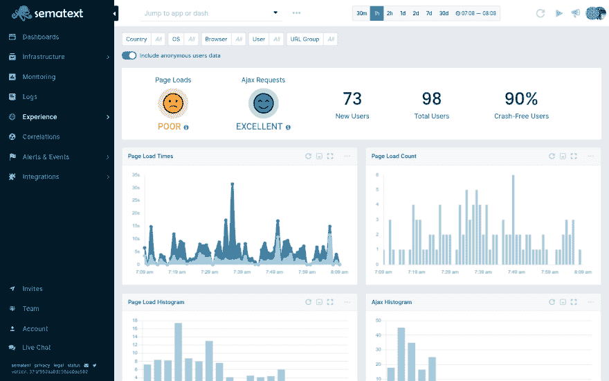
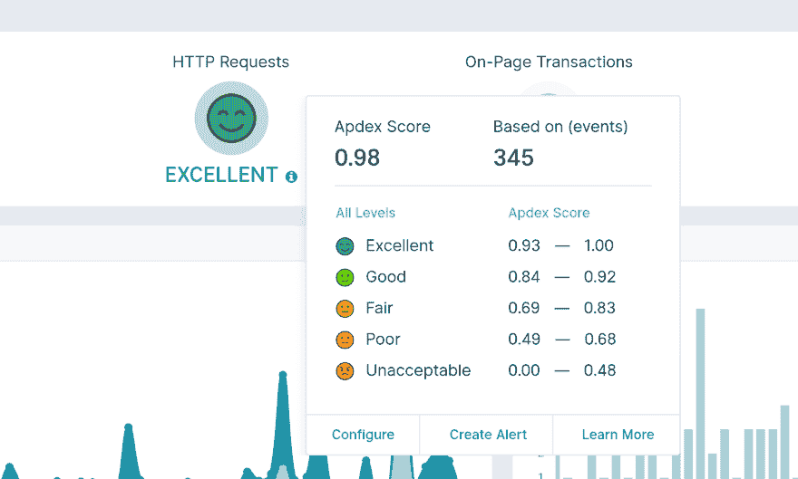
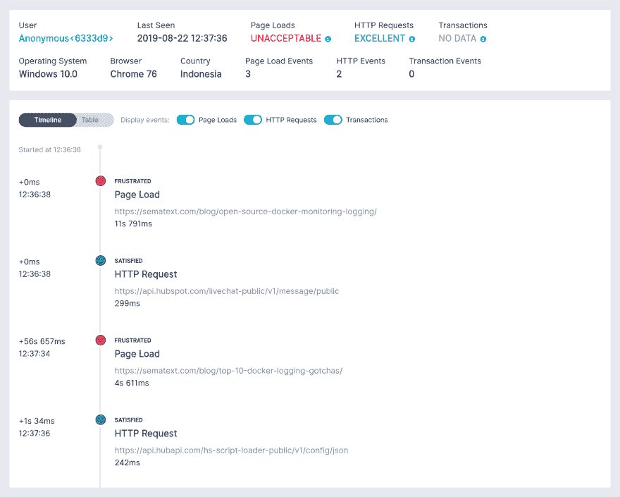
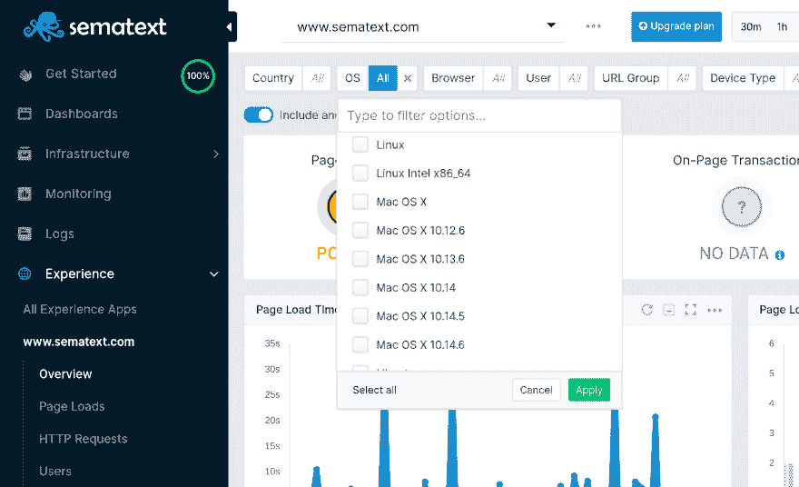

# 语义体验在这里

> 原文：<https://dev.to/sematext/sematext-experience-is-here-2lm6>

你是否听说过这样一句话*“一张图片胜过千言万语”*，我们希望你有一张千言万语的图片，你的客户想告诉你，但通常不会。

在 Sematext，随着时间的推移，我们认识到，我们不能指望网站上的客户或访问者告诉我们他们在使用我们的产品或访问我们的网页时遇到的问题。我们将看到潜在客户放弃注册和/或入职流程，而不是获得支持票或关于潜在客户可能遇到的问题的实时聊天查询。

事实是，这些潜在客户遇到了我们甚至不知道的问题，或者对他们中的一些人来说，web 应用程序太慢了。这在基于软件的业务中是很常见的。

幸运的是，有一个解决方案。这就是为什么我们很高兴宣布 [Sematext Experience](https://hubs.ly/H0ksxYY0) ，**我们新的真实用户监控解决方案**，它帮助我们改善了我们的 web 应用和网站性能，进而改善了我们客户的整体数字体验——现在您也可以这样做了！

Sematext Experience 是一个易于使用的真实用户监控解决方案，添加到 Sematext 云可观察性工具带上，它包含[日志管理](https://hubs.ly/H0ksxZ90)、[基础设施监控](https://hubs.ly/H0ksyDS0)、[跟踪](https://hubs.ly/H0ksyF50)以及现在的[、**真实用户监控**、](https://hubs.ly/H0ksxYY0)。Sematext 允许您检测异常，并在用户体验受到网站性能影响时接收警报。您还可以跟踪页面加载请求、HTTP 请求、Apdex 分数等等。

Sematext Experience 在与我们的日志、跟踪和监控产品结合使用时，非常适合故障排除，因为您可以将您的网站或 web 应用程序性能与您的基础架构指标和日志相关联。

<figure>

<figcaption>[Real User Monitoring Dashboard, Sematext Experience](https://hubs.ly/H0ksxYY0)</figcaption>

</figure>

让我们进入语义体验提供的内容。

[https://www.youtube.com/embed/cB6eTV-5zfg](https://www.youtube.com/embed/cB6eTV-5zfg)

## 语义体验能力概述

*   检查单个会话并深入页面级细节
*   跟踪页面负载、HTTP 请求、资源、UI 交互等等
*   当错误影响网站或 web 应用程序性能时，获得实时警报
*   减少与性能相关的问题
*   使用 URL 模式对页面加载和 HTTP 请求进行分组

## 什么是真实用户监控？

[Real User Monitoring](https://hubs.ly/H0ksyFf0) 或 RUM 是一种针对数字业务的监控技术，它通过查看在线访问者与网站或应用程序的确切交互方式来分析客户的数字体验，分析从页面加载事件到 HTTP 请求再到前端应用程序崩溃的一切。

## 语义体验的好处&功能概述

### 当性能影响 UX 时获得警报

您可以根据页面负载、HTTP 请求或页面事务 Apdex 分数设置实时警报。当你的分数从优秀变得很差时，你希望你的开发者注意到这一点。

### 单页面应用支持

我们支持所有主要的单页面应用程序框架，只需最少的配置，例如:

*   [反应](https://hubs.ly/H0ksxZT0)
*   [Ember.js](https://hubs.ly/H0ksx-20)
*   [角度](https://hubs.ly/H0ksyG80)
*   vista . js

### 单分统治一切

我们使用 Apdex 评分快速向网站所有者传达访问者对网站性能的看法。

Apdex 分数是根据满足的、容忍的和失败的请求的数量来计算的。默认情况下，如果页面加载或 HTTP 请求在 2 秒内完成，我们认为访问者会感到满意。如果慢于 8 秒，我们认为它慢得令人沮丧(1:4 的比例)。如果您认为这不是一个适合您网站的默认设置，您可以通过上面显示的配置来配置*“满意”*阈值。

Sematext Experience 还允许您对满意度得分最低或最高的页面或交易进行排序。[进一步了解](https://hubs.ly/H0kszJF0)监控您的 Apdex 分数如何帮助您衡量和改善客户体验。

### 记录任何 UI 与页面上事务的交互

我们自动收集页面负载、HTTP 请求和图像、CSS 文件、JS 文件等资源的指标。对于页面上的事务，您可以跟踪任何其他内容。是否要跟踪应用程序加载初始数据所需的时间？你能做到的。你的 UI 中有一个关键部分需要在 200 毫秒内完成？您可以通过实时警报跟踪并确保在速度变慢时及时做出反应。

### 检查单个会话

Sematext Experience 允许您检查单个会话，并查看页面加载事件、页面上事务和会话期间发出的 HTTP 请求的时间线。该会话还包括用户信息和元数据，如浏览器信息、地理位置等。

### 从高级概述到单个请求检查性能数据

Sematext Experience 记录每个页面的加载和 HTTP 请求，并将其显示在图表上，让您深入了解在后端和浏览器上花费的时间。您可以按 URL、浏览器类型、版本、操作系统和国家/地区进行过滤。例如，如果您想在一个地方查看所有博客帖子的页面加载事件指标，也可以按 URL 模式分组。当您需要更多细节时，您可以查看每个页面负载、用户会话或 HTTP 请求的细节。

## 即将到来

Sematext 将在 2019 年底为撞车报告添加一个杀手级功能。此功能将允许您获得访问者与您的网站或 web 应用程序交互时发生的每个错误的详细信息。

要开始体验 Sematext 体验[，如果你好奇，注册](https://hubs.ly/H0kszmF0)或[了解更多](https://hubs.ly/H0ksxYY0)。