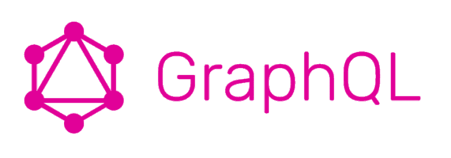
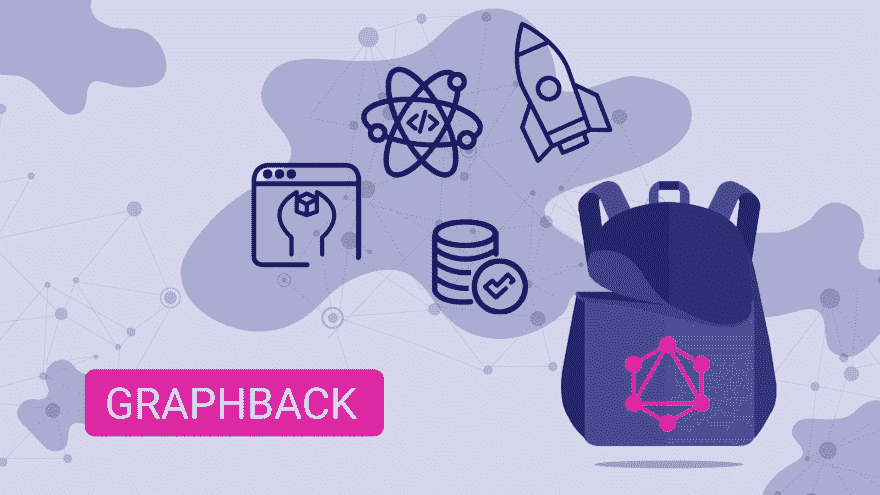
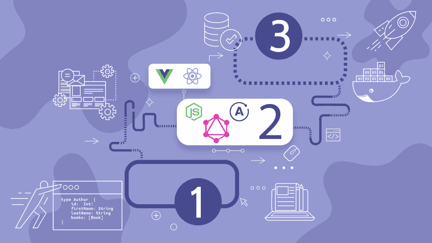
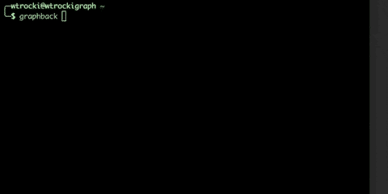

# graph back——graph QL 生态系统的演变

> 原文：<https://dev.to/aerogear/graphback-the-evolution-of-the-graphql-ecosystem-1dbp>

GraphQL 是大约 7 年前在脸书创建的，用于解决脸书移动平台的具体问题。作为查询语言，GraphQL 提供了服务器和客户端之间的传输层和数据交换层，将许多实现细节留给了开发人员。与 REST 相比，GraphQL 技术有一个陡峭的学习曲线和许多陷阱等着寻求拥抱它的初学者开发人员。

## 2019 年 GraphQL 生态系统

多年来，生态系统蓬勃发展，并朝着更适合生产的用例发展。GraphQL stack 变得越来越成熟，越来越多的开发人员开始使用这种技术创建他们的应用程序。

GraphQL 的发展得益于大型社区和许多支持库。在众多选项中选择正确的方法不仅会让人不知所措，还会导致构建出不符合我们的领域和业务需求的解决方案。

编写一个安全且高性能的 GraphQL 应用程序仍然是一项具有挑战性的任务，涉及到许多需要应用的技术决策和架构模式。

## 基于示例应用构建的挑战

GraphQL 社区提供了许多示例应用程序和方法，可以作为您项目的起点。这些产品的质量可能不同，而且经常会过时。由于应用程序的复杂性，很少有示例应用程序能够涵盖生产就绪的用例。

覆盖复杂的用例通常需要编写大量的业务逻辑，这些逻辑需要开发人员在以后手动删除，这些开发人员希望重用示例应用程序来满足他们的需求。

## 处理业务逻辑的示例应用程序

如果您曾经使用过简单的示例应用程序，您可能会想起将这些应用程序调整到真实的业务案例是多么困难。

作为示例应用程序的替代方案，开发人员可以依赖提供高度抽象的框架。提供快速应用程序开发的技术通常以维护和灵活性为代价，这会严重限制应用服务器的可扩展性。

多年来，我们的团队专注于开发基于 GraphQL 的可伸缩服务器和客户端，我们经常问自己:

> 我们能否构建一个应用程序模板，既能提供生产就绪功能，又简单易用，无需大量学习？
> 
> 我们能否将我们的数据模型作为输入提供给 GraphQL 引擎，并使自动生成的数据访问方法受益？

这些问题的答案引导我们创建了新的基于 GraphQL 的生态系统，称为 Graphback。

## 介绍 Graphback

Graphback 的目标是通过利用应用程序模板和代码生成，使示例应用程序与您的业务逻辑一起工作。开发人员可以提供 GraphQL 模式作为输入，命令行客户端将在所选的堆栈(称为模板)和我们支持的数据库之上生成数据访问方法。

Graphback 生成节点。JS 应用程序具有可编辑的完整代码库，以后可以部署到您自己的服务器或云提供商。默认情况下，Graphback 将遵循最佳模式，并包含由充满活力的 GraphQL 社区提供的经过验证的开源库。当使用关系数据库时，Graphback 将允许用户管理数据库模式。Graphback 的真正强大之处在于它的代码生成引擎，可以针对不同的需求进行扩展。

## Graphback 解决 GraphQL 社区中的重大问题

Graphback 帮助开发人员提升他们对 GraphQL 的入门体验。Graphback CLI 提供了不同的工作流，支持从数据库和 REST 端点检索数据。模板允许不同风格的 GraphQL 框架，如 Relay、Apollo 和 Prisma，用于数据库访问。由于有了模板，开发人员可以利用一套功能齐全的库，这些库可以产生商业价值，并且可以很好地协同工作。社区可以提供他们自己的模板，为整个 GraphQL 生态系统的成功做出贡献。

Graphback 生成的应用程序源代码将始终处于您的完全控制之下——没有隐藏的依赖关系或 Graphback 运行时包含的任何附加限制。Graphback 将生成 CRUD 数据访问方法，这些方法可以随时扩展成更加定制的数据访问函数。

开发人员可以引入定制的查询和变异来生成数据访问存根。由于一流的类型脚本支持，生成的项目提供了类型安全。

## 模板生态系统

Graphback 为开发人员构建了一个生态系统，开发人员可以将示例应用程序构建为模板，并可以通过附加功能和业务逻辑进行扩展。Graphback 模板遵循规范的实现，允许开发人员以传统的方式继续开发，并调整应用程序的各个方面。

## 不只是一个 GraphQL 服务器

除了功能齐全的后端服务器，开发人员还可以选择为客户端应用程序生成 GraphQL 查询。客户端代码可以利用像 [https://uniforms.tools](https://uniforms.tools) 这样的表单生成器，为开发人员提供依赖于他们的模式的端到端前端和后端解决方案。

## 支持

我们的项目是由致力于不变的爱和维护的志愿者维持的。你可以通过成为 GitHub 上的 Graphback stargazer 来支持我们，或者在社交媒体上分享它。

我们的 GitHub:
[https://github.com/aerogear/graphback/](https://github.com/aerogear/graphback/)

我们的网址:
[http://graphback.dev](http://graphback.dev)