# 使用 Tableau 和 DynamoDB:如何在 NoSQL 数据上构建实时 SQL 仪表板

> 原文：<https://dev.to/rocksetcloud/using-tableau-with-dynamodb-how-to-build-a-real-time-sql-dashboard-on-nosql-data-52nk>

在这篇博客中，我们将研究 DynamoDB 的报告和分析，考虑到缺少 SQL 和在 DynamoDB 中运行分析查询的困难，这可能是一个挑战。我们将通过一系列简单的步骤，演示如何使用 Tableau 构建一个交互式仪表板，对来自 DynamoDB 的数据使用 SQL，不涉及 ETL。

DynamoDB 是一个非常流行的事务性主数据存储。它旨在处理非结构化数据模型和大规模数据。DynamoDB 通常用于组织最关键的业务数据，因此能够可视化和深入挖掘这些数据是有价值的。

Tableau 也很受欢迎，它是一个构建实时、交互式图表和仪表盘的工具。在这篇博文中，我们将介绍一个使用 Tableau 在 DynamoDB 中可视化数据的例子。

DynamoDB 对于通过主键的简单查找开箱即用地工作得很好。对于不同属性的查找，DynamoDB 允许创建本地或全局二级索引。然而，对于更复杂的访问模式，如嵌套或多个字段的过滤、排序和聚合——通常用于仪表板的查询类型——单靠 DynamoDB 是不够的。[这篇博文](https://rockset.com/blog/tableau-operational-dashboards-reporting-dynamodb-redshift-athena/)评估了几种弥合这种差距的方法。

在本帖中，我们将基于 DynamoDB 中的数据在 Tableau 中创建一个示例业务仪表板，使用 Rockset 作为中间的 SQL 智能层，并使用 JDBC 连接 Tableau 和 Rockset。

## 数据

对于这个例子，我结合了来自 Airbnb 的[样本数据和来自 Mockaroo](https://www.kaggle.com/airbnb/seattle) 的[模拟数据，为一个假想的房屋租赁市场生成真实的用户列表、预订和评论记录。(所有名字和邮件都是假的。)模拟数据和脚本在 Github](https://mockaroo.com/) 上[可用。](https://github.com/rockset/recipes/tree/master/mock-rental-data)

该数据模型是 DynamoDB 用例的典型——下面是一个示例:

```
{
    "user_id": "28c38f9e-463d-4eae-b53d-16cdad48f150",
    "first_name": "Kimberlyn",
    "last_name": "Maudlin",
    "email": "kmaudlin24@bandcamp.com",
    "listings": [
        {
            "listing_id": "8472954",
            "title": "Private bedroom in adorable home",
            "description": "The spare bedroom in our adorable 2 bedroom home ... ",
            "city": "Bomomani",
            "country": "Indonesia",
            "listed_date": "2015-09-30",
            "cancellation_policy": "flexible",
            "price_usd": "51.00",
            "bathrooms": "2",
            "bedrooms": "2",
            "beds": "2",
            "bookings": [
                {
                    "user": {
                        "user_id": "530cd0c7-b79b-4f94-9e0f-969fc7f9855b",
                        "first_name": "Nahum",
                        "last_name": "Yaus",
                        "email": "nyaus9@angelfire.com"
                    },
                    "start_date": "2015-12-07",
                    "length_days": "5",
                    "review": {
                        "text": "Great convenient location, clean, and ... ",
                        "rating": "3"
                    },
                    "cost_usd": "230.84"
                }
            ]
        }
    ]
} 
```

<svg width="20px" height="20px" viewBox="0 0 24 24" class="highlight-action crayons-icon highlight-action--fullscreen-on"><title>Enter fullscreen mode</title></svg> <svg width="20px" height="20px" viewBox="0 0 24 24" class="highlight-action crayons-icon highlight-action--fullscreen-off"><title>Exit fullscreen mode</title></svg>

需要注意一些事情:

*   在我们的数据中，有时会缺少`review`字段(如果用户没有留下评论)。
*   `bookings`和`listings`数组可以是空的，也可以是任意长的！
*   `user`字段在预订中被反规范化和复制，但也作为它自己的项目单独存在。

我们从一个名为`rental_data`的 DynamoDB 表开始，它装载了 21，964 条这样的记录:

[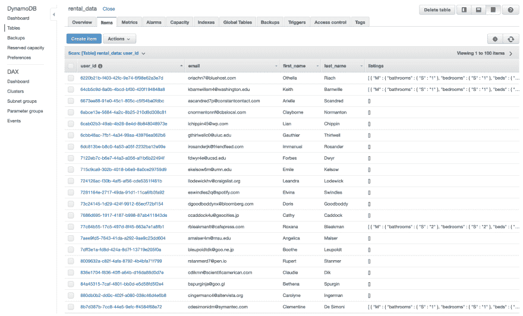](https://res.cloudinary.com/practicaldev/image/fetch/s--TIzjnMRk--/c_limit%2Cf_auto%2Cfl_progressive%2Cq_auto%2Cw_880/https://images.ctfassets.net/1d31s1aajogl/17d04KOUD3gjwJ8yh1qTyr/ea3acb90226d23fa7ad50c2d1ae3296c/dynamodb-table.png)

## 将 Tableau 连接到 DynamoDB

让我们把这些数据做成 Tableau 吧！

我们需要 Tableau Desktop 和 Rockset 的账户。我还假设我们已经[设置了凭证](https://docs.rockset.com/amazon-dynamodb/#create-a-dynamodb-integration)来访问我们的 DynamoDB 表。

首先，我们需要从 [Maven](https://oss.sonatype.org/#nexus-search;quick~rockset) 下载 Rockset JDBC 驱动程序，并将其放在 Mac 的`~/Library/Tableau/Drivers`或 Windows 的`C:\Program Files\Tableau\Drivers`中。

接下来，让我们在 Rockset 中创建一个 API 键，Tableau 将使用它来验证请求:

[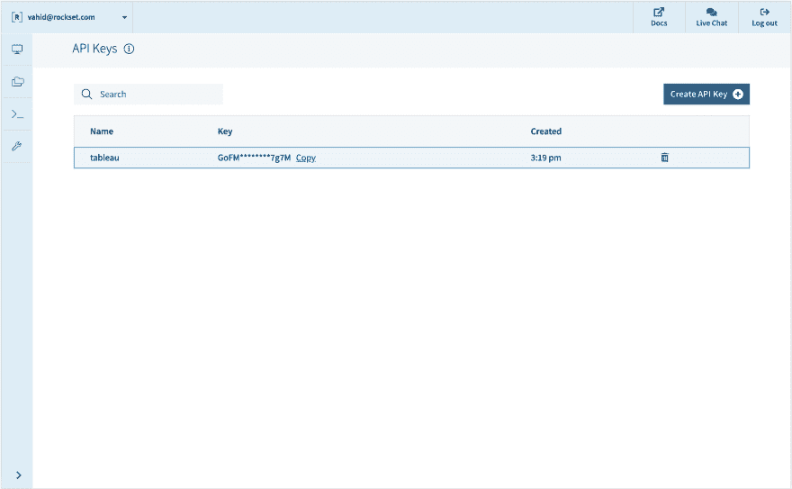](https://res.cloudinary.com/practicaldev/image/fetch/s--ip-8S3-4--/c_limit%2Cf_auto%2Cfl_progressive%2Cq_auto%2Cw_880/https://images.ctfassets.net/1d31s1aajogl/5sJX30S5iSZQuyJuNzPvP/e3f07fe192e351adf01bea1bbef2b4d2/rockset-apikey.png)

在 Tableau 中，我们通过选择“其他数据库(JDBC)”连接到 Rockset，并填写字段，使用我们的 API 密钥作为密码:

[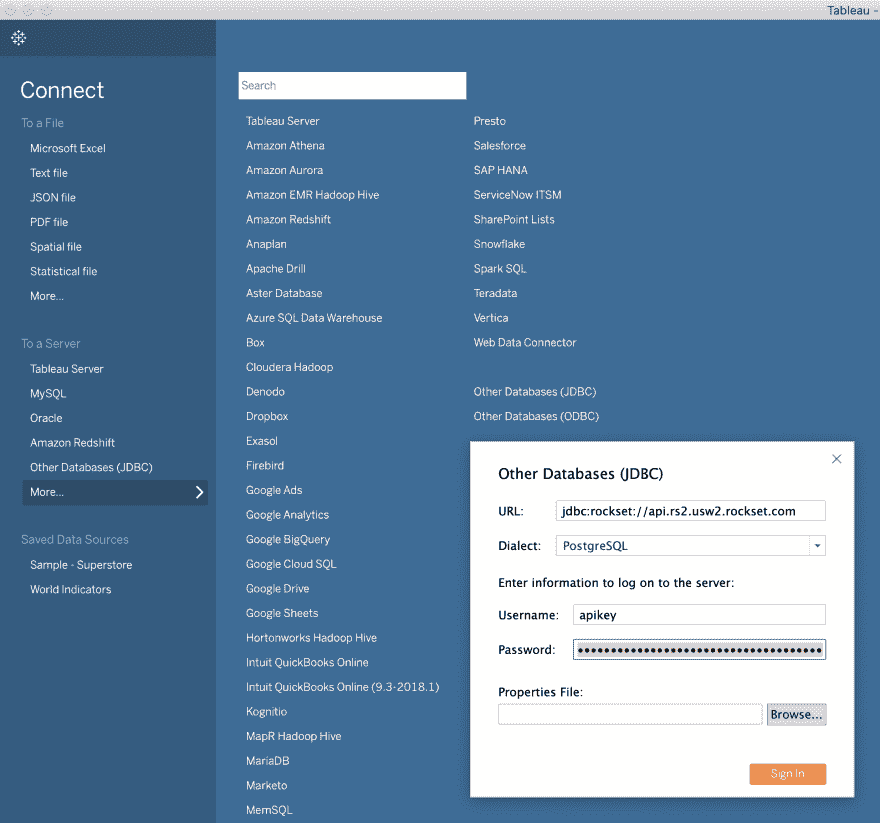](https://res.cloudinary.com/practicaldev/image/fetch/s--OrY6Ya6D--/c_limit%2Cf_auto%2Cfl_progressive%2Cq_auto%2Cw_880/https://images.ctfassets.net/1d31s1aajogl/5qoil33PxGw0a0ToULBfzp/0d7729c407899add9a4a1da2b88353c3/tableau-connect.png)

最后，回到 Rockset，我们直接从 DynamoDB 表创建一个新集合:

[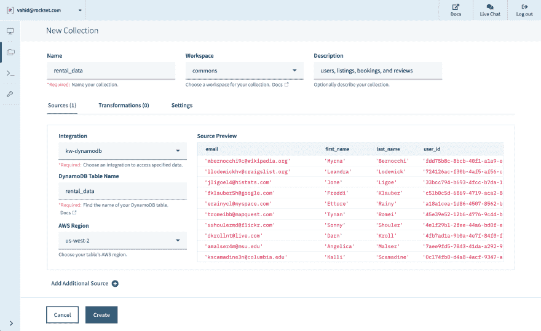](https://res.cloudinary.com/practicaldev/image/fetch/s--Poo1Fy8h--/c_limit%2Cf_auto%2Cfl_progressive%2Cq_auto%2Cw_880/https://images.ctfassets.net/1d31s1aajogl/34dLf7TjnDXj2bUyVmUWKJ/171d4d09263b30b16e7890c4f69a8f64/rockset-collection.png)

我们看到新系列在 Tableau 中表现为一张桌子:

[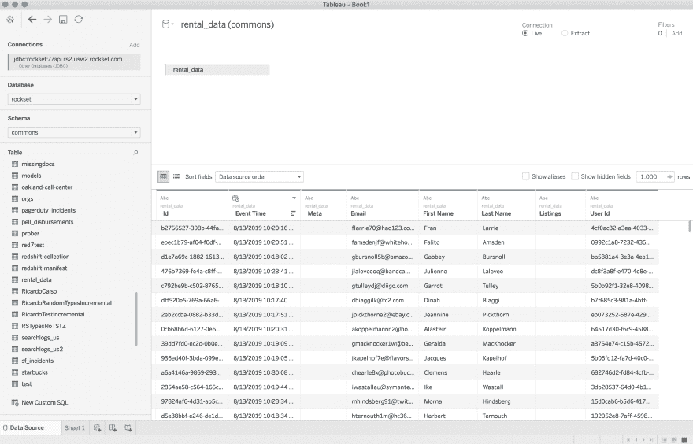](https://res.cloudinary.com/practicaldev/image/fetch/s--rQbMfLMv--/c_limit%2Cf_auto%2Cfl_progressive%2Cq_auto%2Cw_880/https://images.ctfassets.net/1d31s1aajogl/z2vplSDXoLANYyB0BeoBj/afead77d11db3250734b594d2aa9c898/tableau-table.png)

## 用户表

我们的 DynamoDB 表有一些 Map 和 List 类型的字段，而 Tableau 期望一个可以在平面表上进行连接的关系模型。为了解决这个问题，我们将在 Rockset 控制台中编写 SQL 查询，根据需要对数据进行整形，并将这些查询作为自定义 SQL 数据源添加到 Tableau 中。

首先，让我们获得租赁平台上所有用户的列表:

[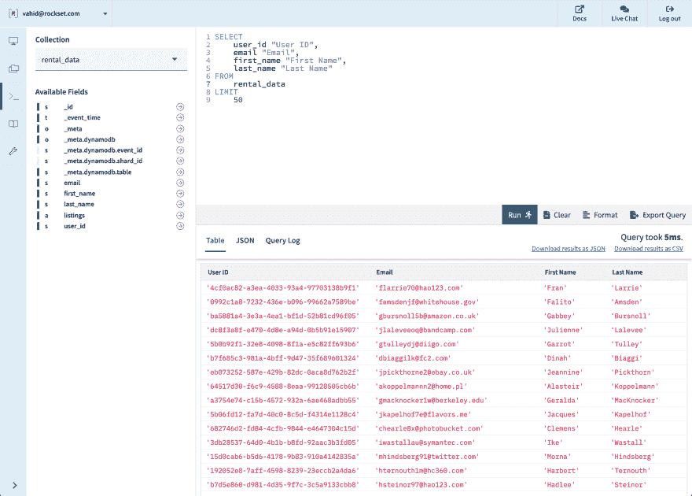](https://res.cloudinary.com/practicaldev/image/fetch/s--P62xGgob--/c_limit%2Cf_auto%2Cfl_progressive%2Cq_auto%2Cw_880/https://images.ctfassets.net/1d31s1aajogl/3qfm2hTVmOQR3IhPH9ptA0/d7f7a9c87f0731090ddaefb4a4b0f326/rockset-query.png)

在 Tableau 中，我们将“New Custom SQL”拖到顶部，粘贴该查询(没有 LIMIT 子句)，并将结果重命名为 Users:

[](https://res.cloudinary.com/practicaldev/image/fetch/s--GOjbKiLX--/c_limit%2Cf_auto%2Cfl_progressive%2Cq_66%2Cw_880/https://images.ctfassets.net/1d31s1aajogl/5nPbTuPhSbRSxcj4nbW9eV/f982ccd42e677454ae437c521da556bc/tableau-custom-sql.gif)

看起来不错！现在，让我们重复这个过程，将列表和预订提取到它们自己的表中。

## 清单表

注意，在原始表中，每一行(用户)都有一个列表项数组。我们希望取出这些数组，并将它们连接起来，这样每一项本身就成为一行。为此，我们可以使用 [UNNEST 函数](https://docs.rockset.com/commands/#unnest):

[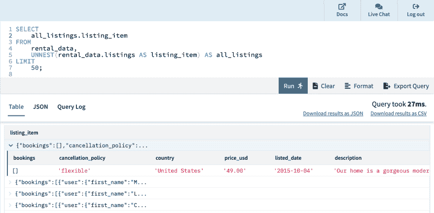](https://res.cloudinary.com/practicaldev/image/fetch/s--WS3Z3TQc--/c_limit%2Cf_auto%2Cfl_progressive%2Cq_auto%2Cw_880/https://images.ctfassets.net/1d31s1aajogl/2kPV5eXKIr1n8nh2cA65Ev/394a4d5c9ac27dd47f9940cf824ea944/rockset-query-2.png)

现在，让我们选择我们想要在列表中包含的字段:

[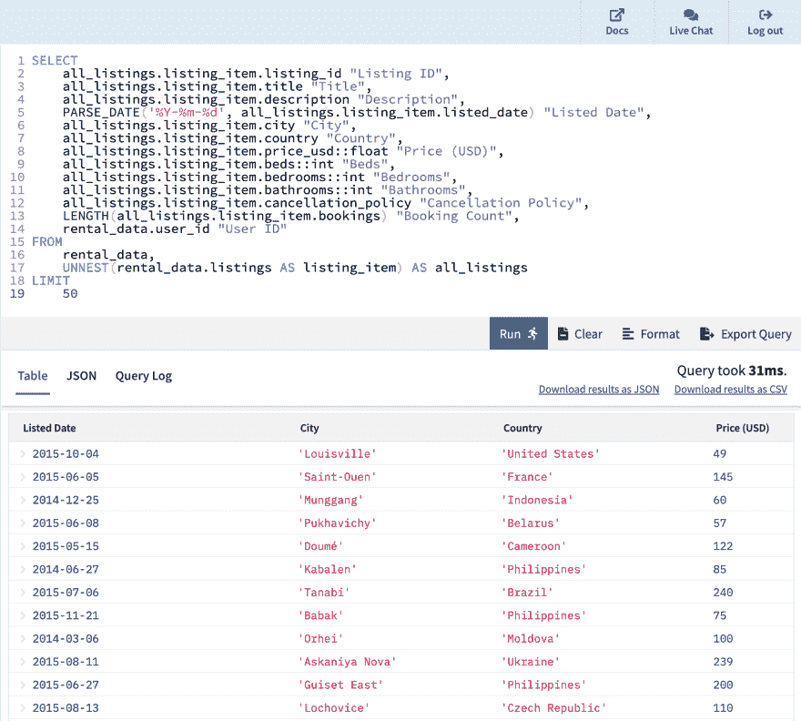](https://res.cloudinary.com/practicaldev/image/fetch/s--yV-lWQ0F--/c_limit%2Cf_auto%2Cfl_progressive%2Cq_auto%2Cw_880/https://images.ctfassets.net/1d31s1aajogl/5DS0plvM4lG3XZiL3MfJiK/fc7d7825f74b7d21623e0facfb840927/rockset-query-3.png)

我们将它作为自定义 SQL 粘贴到 Tableau 中，以获得我们的清单表:

[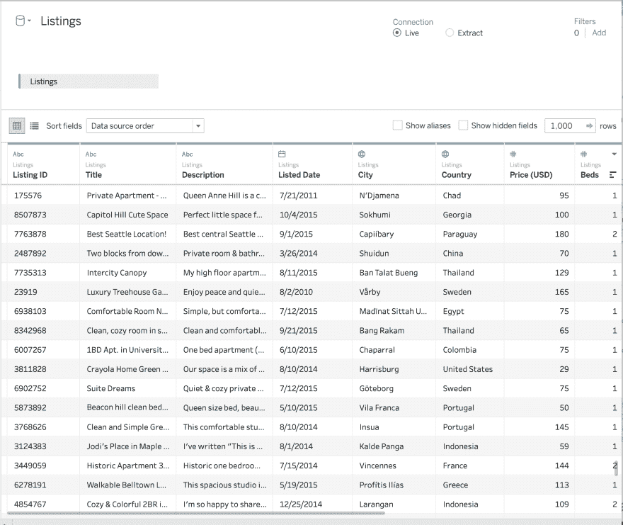](https://res.cloudinary.com/practicaldev/image/fetch/s--qs1iGN8o--/c_limit%2Cf_auto%2Cfl_progressive%2Cq_auto%2Cw_880/https://images.ctfassets.net/1d31s1aajogl/5rJO4RnLUiY6R1aFk7GrsU/083367de8bf0e8fa7e3f07730765f5e5/tableau-data-source.png)

## 预订表

让我们用另一个 UNNEST 查询为我们的 Bookings 表再创建一个数据源:

[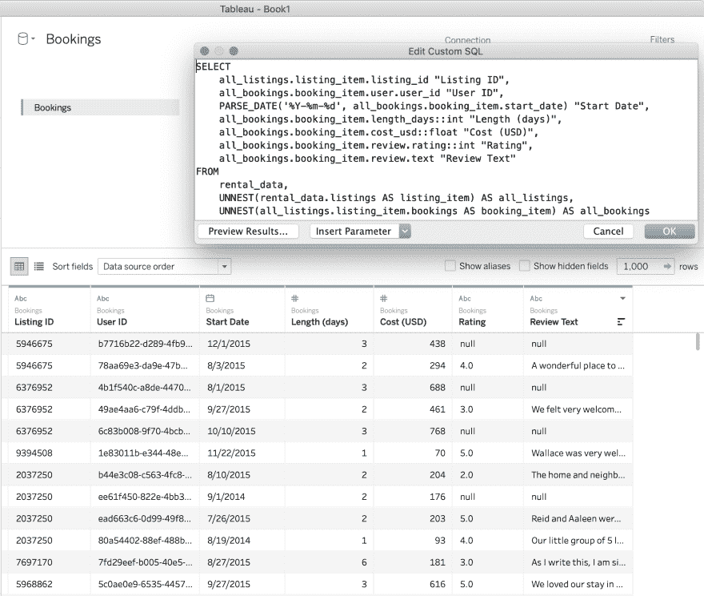](https://res.cloudinary.com/practicaldev/image/fetch/s--_IH-u7wD--/c_limit%2Cf_auto%2Cfl_progressive%2Cq_auto%2Cw_880/https://images.ctfassets.net/1d31s1aajogl/3Kv3M9TX6PM2h1QKOdEeqM/e965ffa88a5ab8f76a3971eb715e4adc/tableau-custom-sql-query.png)

## 图表 1:列表概述

让我们在我们的平台上获得世界各地房源的高层次视图。通过几次拖放，我们使用城市/国家将列表放在地图上，根据预订数量确定大小，并根据取消政策进行着色。

[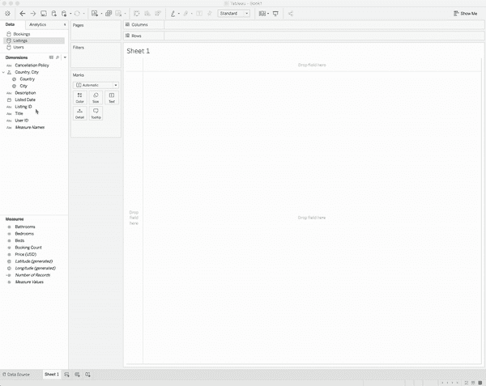](https://res.cloudinary.com/practicaldev/image/fetch/s--R4N-BsGR--/c_limit%2Cf_auto%2Cfl_progressive%2Cq_66%2Cw_880/https://images.ctfassets.net/1d31s1aajogl/1NYbNXRFjSpSZc6SLkwfYY/f3728449f44e94f9cbe274976d0b7aa3/tableau-sheet-overview.gif)

看起来我们在欧洲、南美和东亚有很多列表。

## 图表 2:清单排行榜

让我们试着找出更多收入最高的列表。我们将使用以下信息创建排行榜:

*   由主持人的**列表 ID** 和**电子邮件标记**
*   **总收入**为所有预订的总成本(从最高到最低排序)
*   按**年**着色上市
*   悬停上显示的**标题**、**描述**和**床位数**的详细信息

请注意，为了完成这一点，我们必须组合所有三个表中的信息，但是我们可以直接在 Tableau 中这样做。

[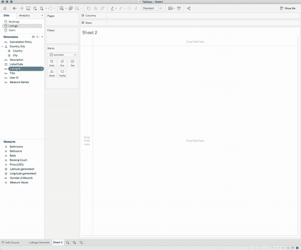](https://res.cloudinary.com/practicaldev/image/fetch/s--i-cLa4vh--/c_limit%2Cf_auto%2Cfl_progressive%2Cq_66%2Cw_880/https://images.ctfassets.net/1d31s1aajogl/5RCJQ0SuAZp29wFclXJPav/dfb02a7c292421fbc61e28483ddb5629/tableau-sheet-leaderboard.gif)

## 图表 3:按长度评级

接下来，假设我们想知道我们的平台最讨好什么样的用户。让我们来看看不同预订时长的平均评分。

[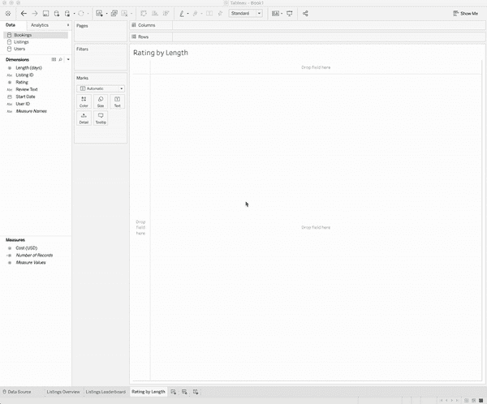](https://res.cloudinary.com/practicaldev/image/fetch/s--2FnrEcPL--/c_limit%2Cf_auto%2Cfl_progressive%2Cq_66%2Cw_880/https://images.ctfassets.net/1d31s1aajogl/1sNyIg1hzdk0MteBwZwKjv/58325b685e3cd21653611222cf684861/tableau-sheet-analysis.gif)

## 用户仪表盘上的实时数据

让我们把这些图表放在一个仪表板上:

[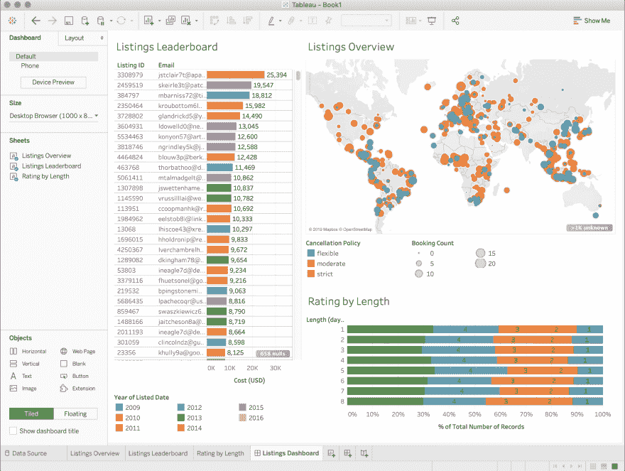](https://res.cloudinary.com/practicaldev/image/fetch/s--mPnbkmFp--/c_limit%2Cf_auto%2Cfl_progressive%2Cq_auto%2Cw_880/https://images.ctfassets.net/1d31s1aajogl/1H0joHsReZ9ejz2D7ZKcqV/8bb5effa0b0456a134b7e9ee4e75e1c3/tableau-dashboard.png)

您可能会注意到，不同停留时间长度的评分大致相同，这是因为模拟数据是从相同的评分分布中为每个时间长度生成的！

为了说明这个仪表板在实时 DynamoDB 源上实时更新，我们将添加一条记录来尝试明显扭曲一些图表。

比方说，我决定注册这个平台，列出我自己在旧金山的卧室，每晚 44 美元。然后，我给自己的房间订了 444 次，每次都给了 4 分。这个 Python 代码片段生成该记录，并将其添加到 DynamoDB:

```
import boto3

booking = {
        "user": {
            "first_name": "Vahid",
            "last_name": "Fazel-Rezai",
            "email": "vahid@rockset.com",
            "user_id": "fc8ca81a-d1fa-4156-b983-dc2b07c1443c"
        },
        "start_date": "2019-04-04",
        "length_days": "4",
        "review": {
            "rating": "4",
            "text": "Worked 4 me!"
        },
        "cost_usd": "44.00"
    }
item = {
        "first_name": "Vahid",
        "last_name": "Fazel-Rezai",
        "email": "vahid@rockset.com",
        "user_id": "fc8ca81a-d1fa-4156-b983-dc2b07c1443c",
        "listings": [{
            "listing_id": "444444",
            "title": "Bedroom for rent",
            "description": "A place to stay, simple but sufficient.",
            "city": "San Francisco",
            "country": "United States",
            "listed_date": "2019-04-04",
            "price_usd": "11.00",
            "cancellation_policy": "flexible",
            "bathrooms": "1",
            "bedrooms": "1",
            "beds": "1",
            "bookings": 444 * [booking]
        }]
    }

dynamodb = boto3.resource("dynamodb")
table = dynamodb.Table("rental_data")
table.put_item(Item = item) 
```

<svg width="20px" height="20px" viewBox="0 0 24 24" class="highlight-action crayons-icon highlight-action--fullscreen-on"><title>Enter fullscreen mode</title></svg> <svg width="20px" height="20px" viewBox="0 0 24 24" class="highlight-action crayons-icon highlight-action--fullscreen-off"><title>Exit fullscreen mode</title></svg>

果然，我们只需在 Tableau 中刷新我们的仪表板，就可以立即看到不同之处！

[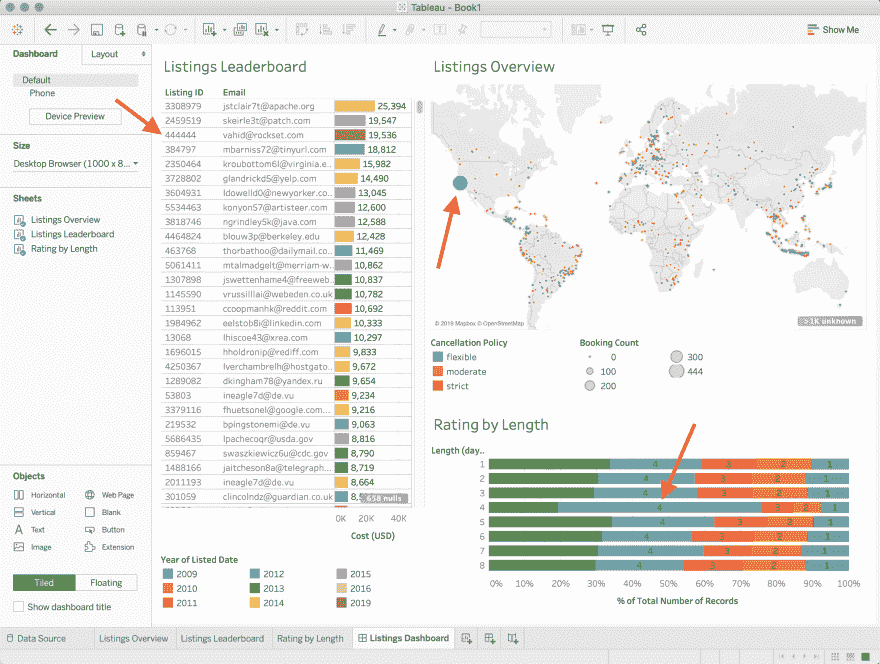](https://res.cloudinary.com/practicaldev/image/fetch/s--QyI7akUp--/c_limit%2Cf_auto%2Cfl_progressive%2Cq_auto%2Cw_880/https://images.ctfassets.net/1d31s1aajogl/37qlQnZkFqILeb6gYBqncx/4f94f7d2e16a0fcd9c2033482f945590/tableau-real-time-dashboard.png)

## 总结

在这篇博文中，我们演示了如何在 Tableau 中创建一个交互式仪表盘，用来监控存储在 DynamoDB 中的核心业务数据。我们使用 Rockset 作为 DynamoDB 和 Tableau 之间的 SQL 智能层。我们遵循的步骤是:

*   从 DynamoDB 表中的数据开始。
*   使用 DynamoDB 表作为源，在 Rockset 中创建一个集合。
*   编写一个或多个返回 Tableau 中所需数据的 SQL 查询。
*   使用自定义 SQL 在 Tableau 中创建数据源。
*   使用 Tableau 界面创建图表和仪表板。