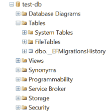
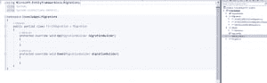
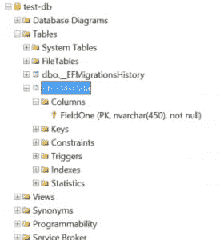

# 为控制台应用程序设置实体框架核心-一次一个错误

> 原文：<https://dev.to/pcmichaels/setting-up-entity-framework-core-for-a-console-application-one-error-at-a-time-1pn5>

实体框架可能很难开始:尤其是如果你来自一个直接访问数据库的背景，它可能看起来像是有无穷无尽的无意义的错误出现。在这篇文章中，我尝试使用. Net 核心控制台应用程序来设置 EF 核心。为了更好地理解错误，我们将在每个步骤中只做最少的工作；被错误所引导。

第一步是创建一个. Net 核心控制台应用程序。

# NuGet 包

要使用实体框架，首先需要安装 NuGet 包；要阅读这篇文章，你需要这两个(最初)[注意]所有前缀为`PM>`的代码都应该输入到包管理器控制台中。[/注意]:

```
PM> Install-Package Microsoft.EntityFrameworkCore
PM> Install-Package Microsoft.EntityFrameworkCore.Tools 
```

# 模型/实体

Entity Framework 背后的思想是用内存对象来表示数据库实体，或者以前所知的表。所以第一步是创建一个模型:

```
namespace ConsoleApp1.Model
{
    public class MyData
    {
        public string FieldOne { get; set; }
    }
} 
```

我们已经创建了模型，所以接下来要创建数据库:

```
PM> Update-Database 
```

在软件包管理器控制台中。

# 第一个错误- DbContext

您得到的第一个错误是:

> 在程序集“ConsoleApp1”中找不到 DbContext。确保您使用的是正确的程序集，并且该类型既不是抽象的也不是泛型的。

好的，让我们创建一个 DbContext。推荐的模式(如这里的[所述](https://docs.microsoft.com/en-us/ef/core/miscellaneous/configuring-dbcontext))是从 DbContext 继承:

```
namespace ConsoleApp1
{
    public class MyDbContext : DbContext
    {
    }
} 
```

好了，我们已经创建了一个 DbContext -让我们再来一次:

```
PM> Update-Database 
```

# 第二个错误-数据库提供程序

下一个错误是:

> 系统。InvalidOperationException:没有为此 DbContext 配置数据库提供程序。可以通过重写 DbContext 来配置提供程序。OnConfiguring 方法或通过在应用程序服务提供者上使用 AddDbContext。

所以我们向前看了一点。我们需要做的下一件事是配置一个提供者。因为在本例中，我使用的是 SQL Server，所以我需要另一个 NuGet 包:

```
PM> Install-Package Microsoft.EntityFrameworkCore.SqlServer 
```

然后配置 DbContext 以使用它:

```
public class MyDbContext : DbContext
{
    protected override void OnConfiguring(DbContextOptionsBuilder optionsBuilder)
    {
        string cn = @"Server=.\SQLEXPRESS;Database=test-db;User Id= . . .";
        optionsBuilder.UseSqlServer(cn);

        base.OnConfiguring(optionsBuilder);
    }
} 
```

再说一遍:

```
PM> Update-Database 
```

# 第三个错误-没有迁移

严格地说，这不是一个实际的错误。这更像是什么都没发生的迹象:

> 没有应用迁移。数据库已经是最新的。完成了。

快速浏览一下 SSMS 就可以发现，虽然它创建了 DB，但它没有创建表:

[](http://pmichaels.net/wp-content/uploads/2018/02/EF-1.png)

所以我们需要添加一个迁移？如果我们在这里调用`Add-Migration`,我们会得到这个:

> 如果你尝试过这个:删除-迁移将恢复它。

[](http://pmichaels.net/wp-content/uploads/2018/02/EF-2.png)

那是因为我们需要告诉 EF 我们关心什么数据。因此，在 DbContext 中，我们可以让它知道我们对一个名为 MyData 的数据集(或者，如果您愿意，也可以是表)感兴趣:

```
public class MyDbContext : DbContext
{
    public DbSet<MyData> MyData { get; set; } 
```

现在我们可以打电话给:

```
PM> Add-Migration FirstMigration 
```

# 第四个错误-主键

下一个错误更多的是关于 EF 的内部运作。：

> 系统。InvalidOperationException:实体类型“MyData”需要定义主键。

绝对进步。现在我们被抱怨了，因为 EF 想知道表的主键是什么，我们没有告诉它(实体框架，不像 SQL Server [坚持主键](https://stackoverflow.com/questions/15381233/can-we-have-table-without-primary-key-in-entity-framework))。这需要对模型做一点小小的改变:

```
using System.ComponentModel.DataAnnotations;

namespace ConsoleApp1.Model
{
    public class MyData
    {
        [Key]
        public string FieldOne { get; set; }

    }
} 
```

这一次，

```
PM> Add-Migration FirstMigration 
```

产生这个:

```
public partial class FirstMigration : Migration
{
    protected override void Up(MigrationBuilder migrationBuilder)
    {
        migrationBuilder.CreateTable(
            name: "MyData",
            columns: table => new
            {
                FieldOne = table.Column<string>(nullable: false)
            },
            constraints: table =>
            {
                table.PrimaryKey("PK_MyData", x => x.FieldOne);
            });
    }

    protected override void Down(MigrationBuilder migrationBuilder)
    {
        migrationBuilder.DropTable(
            name: "MyData");
    }
} 
```

这看起来更像是我们会得到一张桌子，让我们试试:

```
PM> update-database
Applying migration '20180224075857_FirstMigration'.
Done.
PM> 
```

# 成功

它确实创造了一张桌子！

[](http://pmichaels.net/wp-content/uploads/2018/02/EF-3.png)

# 参考

[https://docs . Microsoft . com/en-us/ef/core/miscellaneous/CLI/powershell](https://docs.microsoft.com/en-us/ef/core/miscellaneous/cli/powershell)

[https://docs . Microsoft . com/en-us/ef/core/miscellaneous/configuring-db context](https://docs.microsoft.com/en-us/ef/core/miscellaneous/configuring-dbcontext)

[https://www . learnentityframeworkcore . com/walk throughs/console-application](https://www.learnentityframeworkcore.com/walkthroughs/console-application)

原贴[此处](https://www.pmichaels.net/2018/02/24/setting-entity-framework-core-console-application-one-error-time/)。