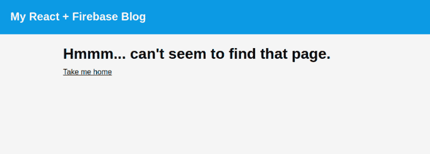
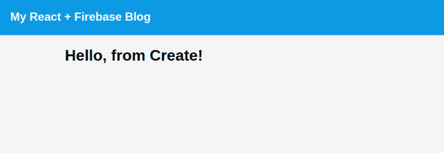
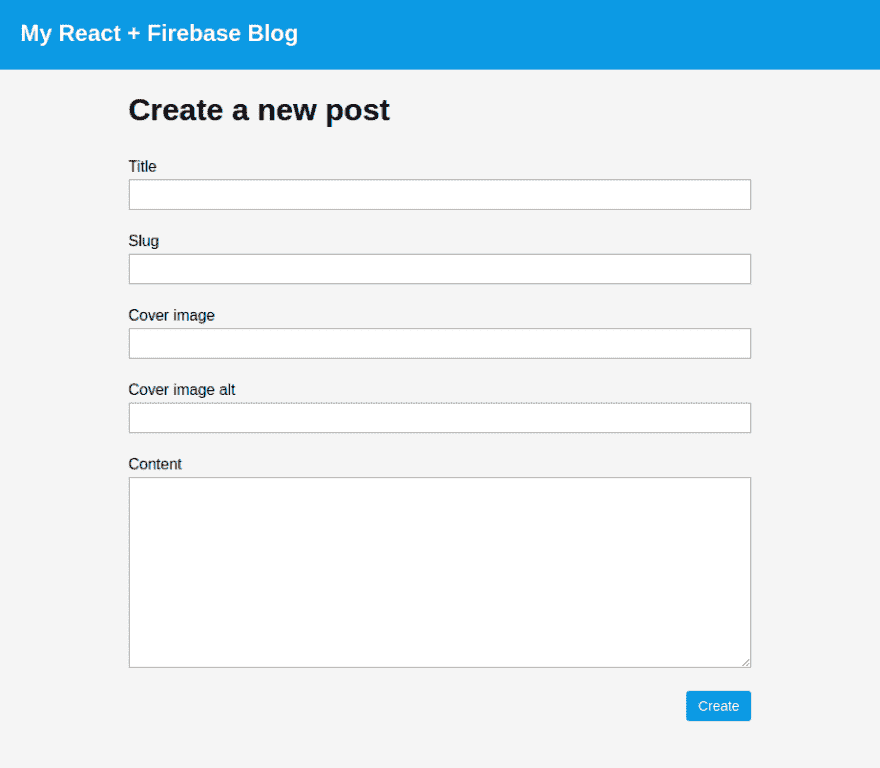
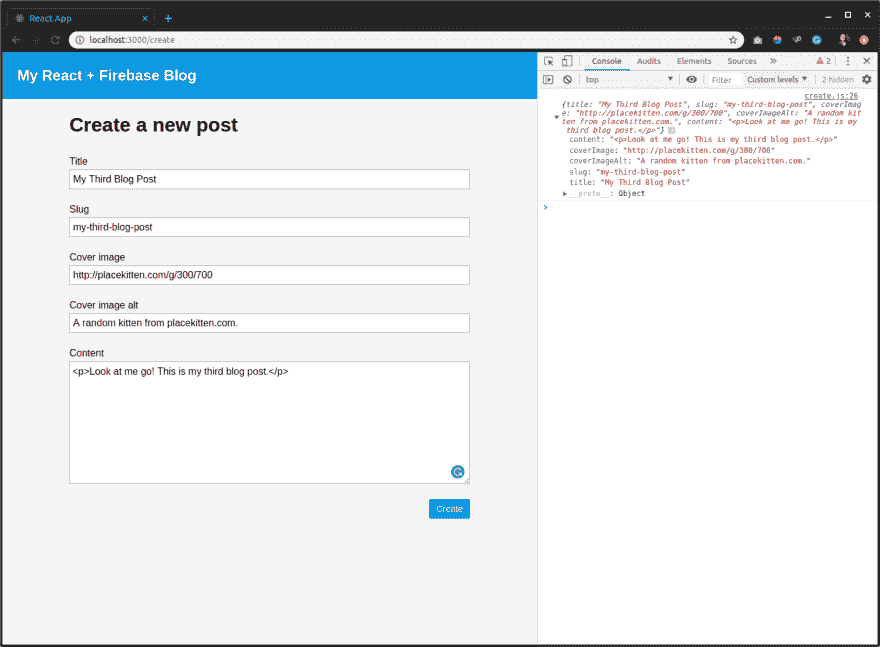
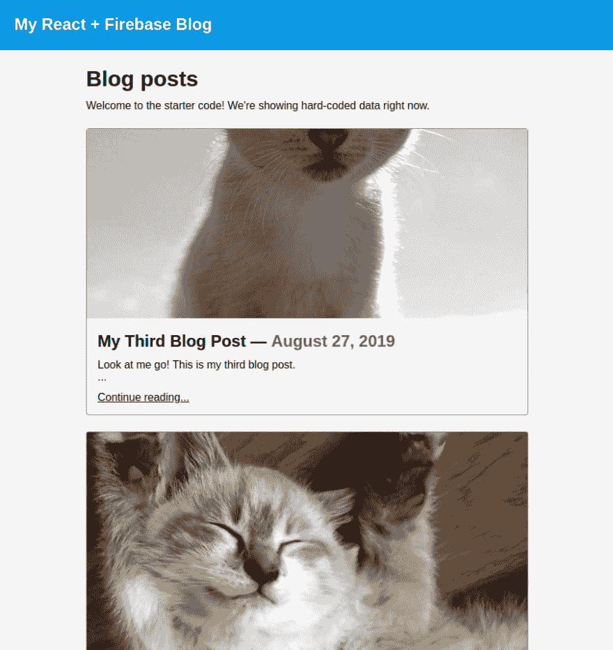

# 构建 React & Firebase 博客站点:第 2 部分

> 原文：<https://dev.to/ashleemboyer/build-a-react-firebase-blog-site-part-2-2inm>

*这篇文章最初发表于[我的个人博客网站](https://ashleemboyer.com/react-firebase-blog-02)。*

欢迎回来！这是教你如何使用 React 和 Firebase 建立博客网站的系列文章中的第二篇。如果你还没有看过这个系列的第一篇文章，我鼓励你去看看。我在这篇文章中加入了起始代码，但是你还需要完成上一篇文章中的以下步骤才能使用它:

*   第一步:注册 Firebase(如果你还没有账户的话)
*   步骤 2:创建项目
*   步骤 5:向数据库添加数据

一个合理的警告:因为这篇文章是建立在第 1 部分的基础上的，所以假设你已经阅读了这篇文章。

## 目录

1.  克隆(第 2 部分)起始代码[可选]
2.  添加用于创建帖子的页面
3.  输入描述文章的内容
4.  编写一个创建函数

* * *

## 1。克隆(第 2 部分)起始代码[可选]

如果您已经成功完成了第 1 部分，请跳过这一步。否则，您可以通过在终端中运行以下命令来开始克隆代码:

```
git clone https://github.com/ashleemboyer/react-firebase-blog-starter-part-2.git 
```

Enter fullscreen mode Exit fullscreen mode

在继续之前，您需要更改一个文件:`src/firebase.js`。如果你打开它，你会看到下面的`config`常量:

```
const config = {
  apiKey: "<YOUR-API-KEY>",
  authDomain: "<YOUR-AUTH-DOMAIN>",
  databaseURL: "<YOUR-DATABASE-URL>",
  projectId: "<YOUR-PROJECT-ID>",
  storageBucket: "<YOUR-STORAGE-BUCKET>",
  messagingSenderId: "<YOUR-MESSAGE-SENDER-ID>",
  appId: "<YOUR-APP-ID>"
}; 
```

Enter fullscreen mode Exit fullscreen mode

常量中的属性用于将您的应用程序连接到 Firebase 项目。要找到这些值，通过 [Firebase 控制台](https://console.firebase.google.com)左侧栏中的齿轮图标进入你的项目设置。向下滚动到“你的应用”下的“Firebase SDK 片段”,从他们调用的`firebaseConfig`中复制属性。用这些值替换您的`config`常量中的属性。

现在你可以运行`npm install`然后`npm run start`在浏览器中查看你的项目。

## 2。添加用于创建帖子的页面

你不必先做这一步。我只是按照首字母缩写的顺序来写这些步骤。

要开始实现“创建文章”功能，让我们首先创建一个用于创建文章的页面。在`src/pages`中添加一个`create.js`文件。我们现在要保持简单，以确保一切都还在工作。

> 当您采取渐进的步骤并在过程中检查您的工作时，开发代码是最容易的。

我们的`Create`组件将给出一个友好的“你好”，现在。

```
import React from "react";

const Create = () => {
  return <h1>Hello, from Create!</h1>; };

export default Create; 
```

Enter fullscreen mode Exit fullscreen mode

尝试导航到`/create`页面。呃，哦...找不到页面？

[](https://res.cloudinary.com/practicaldev/image/fetch/s--DCyvTTDI--/c_limit%2Cf_auto%2Cfl_progressive%2Cq_auto%2Cw_880/https://firebasestorage.googleapis.com/v0/b/ashleemboyer-2018.appspot.com/o/images%252Freact-firebase-blog%252Fpart-02%252F404.png%3Falt%3Dmedia%26token%3D4665d673-fc43-4f64-ab14-4d5b8bf7ec9e)

别担心！我们只需要在`src/App.js`中为我们的新页面添加一个`Route`。首先为`Create`组件添加一个导入:

```
import Create from "./pages/create"; 
```

Enter fullscreen mode Exit fullscreen mode

然后，在`/`路径的下面添加下面的`Route`:

```
<Route path="/create" component={Create} /> 
```

Enter fullscreen mode Exit fullscreen mode

新的创建页面现在应该可以工作了！

[](https://res.cloudinary.com/practicaldev/image/fetch/s--eboRHoHE--/c_limit%2Cf_auto%2Cfl_progressive%2Cq_auto%2Cw_880/https://firebasestorage.googleapis.com/v0/b/ashleemboyer-2018.appspot.com/o/images%252Freact-firebase-blog%252Fpart-02%252Fcreate-hello.png%3Falt%3Dmedia%26token%3Da4a5a0ac-005e-448c-8493-450a60f1f5e6)

## 3。输入描述文章的内容

现在，让我们考虑一下实时数据库中的数据结构。以下是我们用来描述博客文章的属性:

*   标题
*   鼻涕虫
*   日期
*   封面图像
*   coverImageAlt
*   内容

考虑这两个问题:我们需要为这些属性中的哪一个创建一个`<input>`？哪些可以用一些额外的代码自动生成？嗯，...

如果我为客户制作这个博客站点，我会自动生成`slug`和`date`。日期并不难自动生成，但鼻涕虫可能是因为穿孔。我们不会在这里处理它，但是你可以自己尝试一下！此外，我可能会为`coverImage`提供一个文件上传输入，但这也比我想写的这篇文章要复杂一些。

所以，`date`是我们唯一要自动生成的东西。除了得到一个`<textarea>`的`content`之外，我们将拥有所有的输入。让我们将所有这些添加到我们的组件中，并用`useState`处理它们的值。您的`src/pages/create.js`文件应该是这样的:

如果对你来说这看起来像是许多多余的代码，那很好！(还有对不起。😅)我们将在“更进一步”的帖子中解决这个问题。

```
import React, { useState } from "react";

const labelStyles = {
  display: "block",
  marginBottom: 4
};

const inputStyles = {
  width: "100%",
  height: "2rem",
  lineHeight: "2rem",
  verticalAlign: "middle",
  fontSize: "1rem",
  marginBottom: "1.5rem",
  padding: "0 0.25rem"
};

const Create = () => {
  const [title, setTitle] = useState("");
  const [slug, setSlug] = useState("");
  const [coverImage, setCoverImage] = useState("");
  const [coverImageAlt, setCoverImageAlt] = useState("");
  const [content, setContent] = useState("");

  const createPost = () => {
    console.log({ title, slug, coverImage, coverImageAlt, content });
  };

  return (
    <>
      <h1>Create a new post</h1>
      <section style={{ margin: "2rem 0" }}>
        <label style={labelStyles} htmlFor="title-field">
          Title
        </label>
        <input
          style={inputStyles}
          id="title-field"
          type="text"
          value={title}
          onChange={({ target: { value } }) => {
            setTitle(value);
          }}
        /> 
        <label style={labelStyles} htmlFor="slug-field">
          Slug
        </label>
        <input
          style={inputStyles}
          id="slug-field"
          type="text"
          value={slug}
          onChange={({ target: { value } }) => {
            setSlug(value);
          }}
        /> 
        <label style={labelStyles} htmlFor="cover-image-field">
          Cover image
        </label>
        <input
          style={inputStyles}
          id="cover-image-field"
          type="text"
          value={coverImage}
          onChange={({ target: { value } }) => {
            setCoverImage(value);
          }}
        /> 
        <label style={labelStyles} htmlFor="cover-image-alt-field">
          Cover image alt
        </label>
        <input
          style={inputStyles}
          id="cover-image-alt-field"
          type="text"
          value={coverImageAlt}
          onChange={({ target: { value } }) => {
            setCoverImageAlt(value);
          }}
        /> 
        <label style={labelStyles} htmlFor="content-field">
          Content
        </label>
        <textarea
          style={{ ...inputStyles, height: 200, verticalAlign: "top" }}
          id="content"
          type="text"
          value={content}
          onChange={({ target: { value } }) => {
            setContent(value);
          }}
        />
        <div style={{ textAlign: "right" }}>
          <button
            style={{
              border: "none",
              color: "#fff",
              backgroundColor: "#039be5",
              borderRadius: "4px",
              padding: "8px 12px",
              fontSize: "0.9rem"
            }}
            onClick={createPost}
          >
            Create
          </button>
        </div>
      </section>
    </>
  );
};

export default Create; 
```

Enter fullscreen mode Exit fullscreen mode

您的页面现在应该是这样的:

[](https://res.cloudinary.com/practicaldev/image/fetch/s--IividQBF--/c_limit%2Cf_auto%2Cfl_progressive%2Cq_auto%2Cw_880/https://firebasestorage.googleapis.com/v0/b/ashleemboyer-2018.appspot.com/o/images%252Freact-firebase-blog%252Fpart-02%252Fcreate-screen.png%3Falt%3Dmedia%26token%3D24abdd3c-da90-4438-a488-7c6fb95112d1)

简单地填写所有这些字段，看看当您单击“创建”按钮时会发生什么！你的控制台开着吗？然后，您应该会看到一个打印了所有输入值的对象。下面是我的样子(*点击展开*):

[](https://firebasestorage.googleapis.com/v0/b/ashleemboyer-2018.appspot.com/o/images%2Freact-firebase-blog%2Fpart-02%2Fcreate-values-logged.png?alt=media&token=2de7263e-f573-4a4c-85a4-050ab479fee1)

## 4。编写一个创建函数

整洁！这也是我所说的代码增量变更的含义。一步一步来。让我们开始激动人心的部分吧！我们要把一些东西送回数据库。首先，我们需要从`src/firebase.js`导入我们的`getFirebase`函数。

```
import { getFirebase } from "../firebase"; 
```

Enter fullscreen mode Exit fullscreen mode

现在，添加`generateDate()`函数，更新`createPost`函数，并从`Create`组件参数:
中析构`history`道具

```
const generateDate = () => {
  const now = new Date();
  const options = { month: "long", day: "numeric", year: "numeric" };

  const year = now.getFullYear();
  let month = now.getMonth() + 1;
  if (month < 10) {
    month = `0${month}`; // prepend with a 0
  }

  const day = now.getDate();
  if (day < 10) {
    day = `0${day}`; // prepend with a 0
  }

  return {
    formatted: `${year}-${month}-${day}`,             // used for sorting
    pretty: now.toLocaleDateString("en-US", options)  // used for displaying
  };
}; 
```

Enter fullscreen mode Exit fullscreen mode

```
const createPost = () => {
  const date = generateDate();
  const newPost = {
    title,
    dateFormatted: date.formatted,
    datePretty: date.pretty,
    slug,
    coverImage,
    coverImageAlt,
    content
  };
  getFirebase()
    .database()
    .ref()
    .child(`posts/${slug}`)
    .set(newPost)
    .then(() => history.push(`/`));
}; 
```

Enter fullscreen mode Exit fullscreen mode

```
const Create = ({ history }) => {
  ...
} 
```

Enter fullscreen mode Exit fullscreen mode

像我们几分钟前做的那样填写您的输入，单击“创建帖子”，您应该会被带到主页，您的新帖子在最上方！

[](https://res.cloudinary.com/practicaldev/image/fetch/s--1nQPE8WE--/c_limit%2Cf_auto%2Cfl_progressive%2Cq_auto%2Cw_880/https://firebasestorage.googleapis.com/v0/b/ashleemboyer-2018.appspot.com/o/images%252Freact-firebase-blog%252Fpart-02%252Fnew-post.png%3Falt%3Dmedia%26token%3D85aa1f65-6be1-430f-badc-9490b5e6c66d)

## 5。包扎

咻！我以为我们可以在一篇文章中讨论所有的 4 个 CRUD 函数，但是那太多了。在下一篇文章中，我们将继续这个关于认证的冒险。目前为止干得不错。💪

如果遇到任何问题，[给我发电子邮件](//mailto:hello@ashleemboyer.com)或[在 Twitter 上给我发消息](https://twitter.com/ashleemboyer)！回头见！😊

* * *

你知道我有时事通讯吗？📬

如果你想在我发布新的博客帖子或宣布重大项目时得到通知，请联系 https://ashleemboyer.com/newsletter。