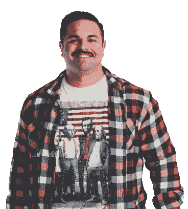

# 我做到了，我写了我的第一篇博客

> 原文：<https://dev.to/fvaldes33/i-did-it-i-wrote-my-first-blog-post-4lhc>

我不是作家。

我**不得不**以此开始，因为这是事实。我已经开始这个“我需要写博客”的过程大约 5 次了，总是觉得我写的东西毫无意义，没有人会读我的文字。

我是一名网络开发人员，像其他人一样自学成才。我经常讲这个故事，特别是对那些努力寻找出路的新开发者。2011 年左右，愤怒的小鸟在苹果应用商店卖出了第 100 万个游戏。这是一个如此简单的游戏，当我喝了几杯酒后，我最好的朋友和我打赌说我不能开发一个 iPhone 游戏。

让我们倒回一句话。我是一名终身棒球运动员，在弗吉尼亚大学打大学棒球，在各种组织的小联盟中打球。我也做了很多膝盖手术，可能不会再继续下去了。2011 年我辞职了。

现在回到开发人员的故事…

在我的生活中，现在没有棒球，我有了更多的额外时间。在 iTunesU 上找了一个 iPhone 101 大学课，6 周就上完了。注册了一个 adobe 账户，进入 Photoshop 做一些设计，创建了我的苹果开发者账户，我已经准备好了。大约 6 个月后，我在 App Store 上发布了 [Rockslide](https://apps.apple.com/us/app/rockslide-free/id446935408) 。

不用说，我赢了，但这不是这篇文章的重点。我也获得了新的发展激情。当然，这是客观的 C，大量的复制粘贴和无数小时的构建错误，但这引发了我现在的职业生涯。

现在是 2019 年，我是夏洛特一家名为 [Union](https://union.co) 的机构的技术主管。在过去的 5-6 年里，我学习了 HTML、css、sass、javascript、php、python 等等。这个行业是一个永无止境的学习曲线，我喜欢每天学习新的东西。

这些年来，我也为自己开发了一些很酷的应用。这是我学习新事物的方式。 [Appvents](http://www.appvents.com/) ，一款用 [Ionic v1](https://ionicframework.com/) 、 [Angular](https://angular.io) 和 [Laravel](https://laravel.com/) 后端打造的会议管理 app。 [Gym Journal](https://www.gymjournalapp.com/) ，一个由 Ionic v2、Angular 和 [Firebase](https://firebase.google.com/) 构建的锻炼跟踪器和教练平台。正在开发一款名为 Cra11y 的无障碍 Mac 应用，它由[电子](https://electronjs.org/)和[反应](https://reactjs.org/)组成。

哇，你坚持到最后了。很高兴你留下来，希望你能读一些我未来的帖子。我计划更深入地写一些我的项目，包括个人的和我在 Union 的工作，我对技术及其快速发展的展望，甚至可能是一些关于如何做一些酷东西的技术文章。哦，对了，看看我的小投资组合网站。

回头见。

