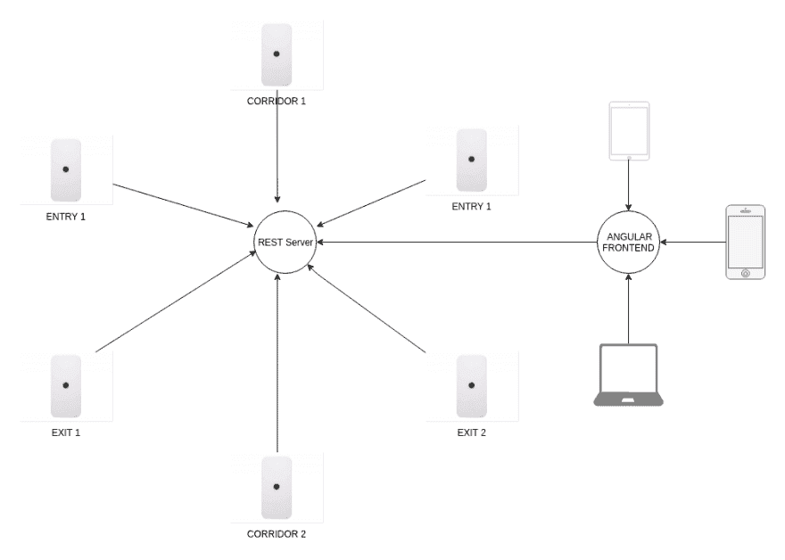
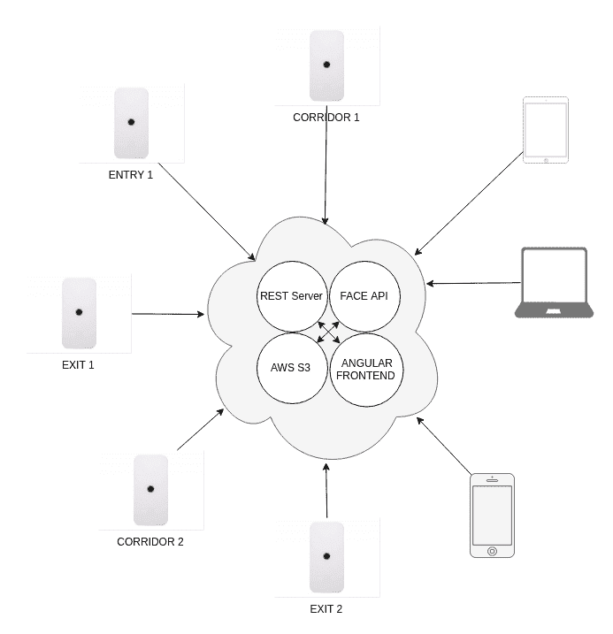
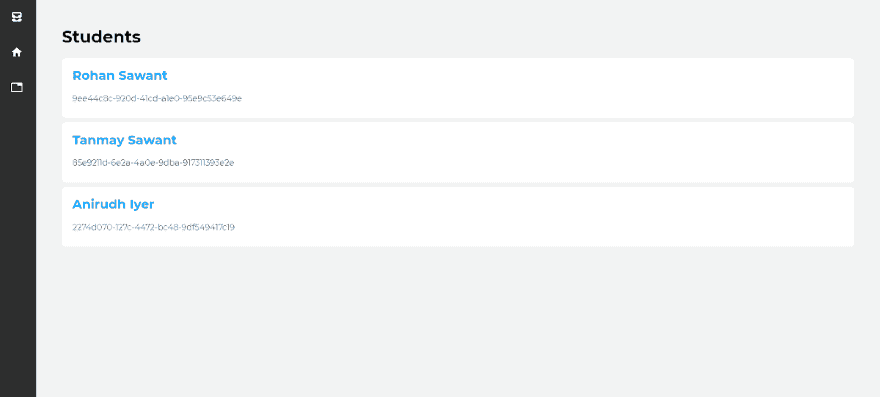
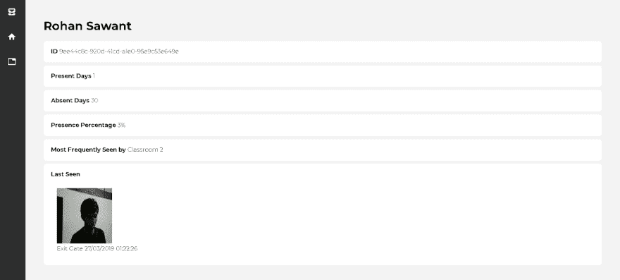
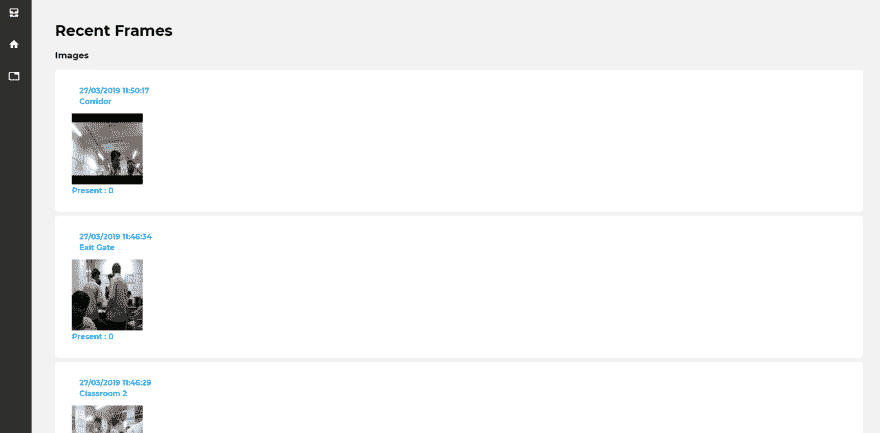
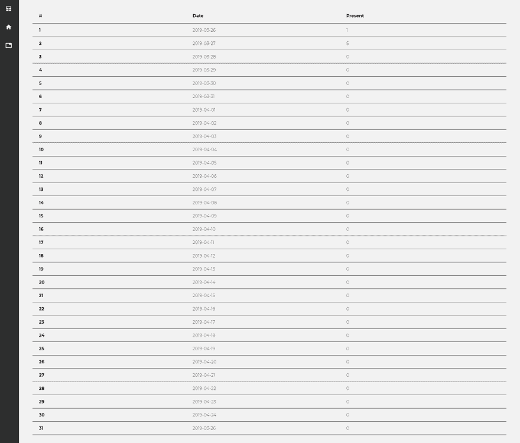
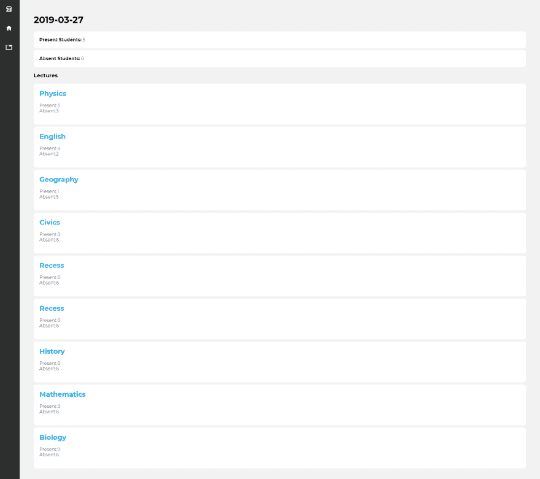
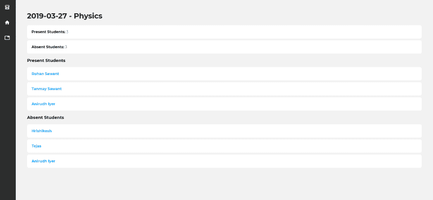
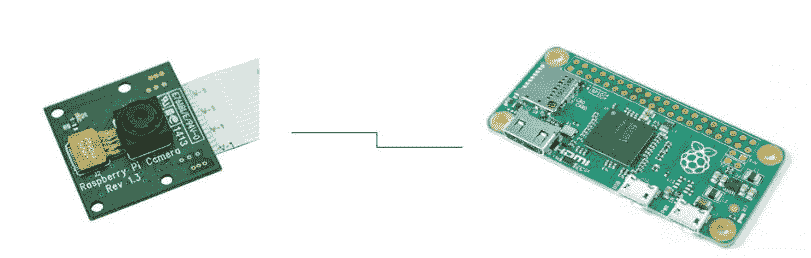
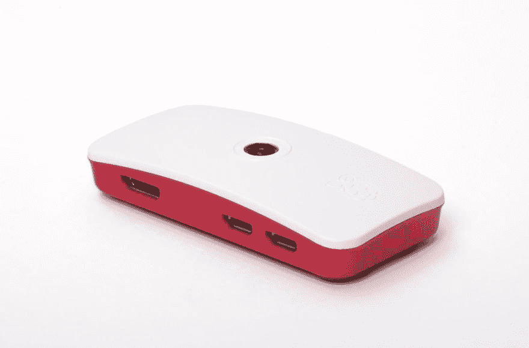

# 我用树莓 Pi Zeros 构建了一个(几乎)去中心化的面部识别系统！FRAS

> 原文：<https://dev.to/rohansawant/how-to-use-facial-recognition-and-rpi-zeros-to-turn-your-school-into-a-surveillance-state-4d78>

### [T1】F . r . a . s！](#fras)

[面部识别考勤系统使用深度学习配合微软 FaceAPI，Django，树莓 Pi-es！](https://github.com/CT83/Facial-Recognition-Attendance-System)

在 Github 上查看这个!【T2

除了嘴上说说；
*允许**数十个面部识别摄像头客户端**又名 tiny *Raspberry Pi-es* 部署在一所大学、
或一个工业园区，然后记录他们看到谁以及他们何时看到，然后存储到一个中央数据库。*

 *整个系统使用[微软 Face API](https://azure.microsoft.com/en-us/services/cognitive-services/face) 、 [Heroku](https://fras-1.herokuapp.com) 和 [AWS S3](https://aws.amazon.com/s3) 并使用多个[树莓 Pi Zeros](https://www.raspberrypi.org/products/raspberry-pi-zero) 在云上运行非常便宜，大约花费 **15** - **17 美元**

## 它是如何工作的？

#### 反乌托邦基于节点的面部识别 5 个简单步骤。

1.  一个 [Django REST 服务器](https://github.com/CT83/Facial-Recognition-Attendance-System/tree/master/django-server)，带着一个 **Postgres 数据库**运行在 [Heroku](https://fras-1.herokuapp.com) 上。
2.  一个 **15$** [树莓派 Zero](https://www.raspberrypi.org/products/raspberry-pi-zero) 带[摄像头模块](https://www.raspberrypi.org/products/camera-module-v2)和互联网连接被放置在任何位置——入口、出口、走廊
3.  **树莓派** - *相机客户端*每隔一段时间拍摄一张图片，并将其发送给[微软 Face API](https://azure.microsoft.com/en-us/services/cognitive-services/face) ，后者告诉<u>谁是图片中的</u>。
4.  *摄像头客户端*随后将识别出的人的名字发送到 **REST 服务器**进行存储，捕获的图像发送到 [AWS S3](https://aws.amazon.com/s3) 进行存储。
5.  [角度前端](https://fras-ui.herokuapp.com)允许用户查看存储的数据。

> 这是我高中最后一个学期的项目，我几乎没有花 48 小时来完成。REST 服务器和
> Angular 被证明是一项艰巨的任务！但是，教授似乎对我建造的东西感到惊喜，所以一切都很好。:)

## 建筑概述

### 基础架构

每个相机客户端负责自己识别所有的人脸，并与**微软人脸 API** 进行通信，以及将图像保存到 S3，连接到 Angular 客户端的用户也需要查看上传的图像，所以一切看起来都是这样的。

### 用户界面

#### 主页面

主页面显示了所有已注册人员的列表，在初始设置期间，会向 **Face API** 发送大约 20 张每个人的图像。

#### 人员详细信息

选择其中一个人可以让您看到他们最后一次出现在哪里，他们出现了多少天，等等

#### 最近的图像

显示最近从所有相机客户端捕获的图像

#### 考勤表

显示所有日期和出席人数的列表，选择其中一个会进入下一页。

#### 工作日详情

展示了所有在学校有帮助的讲座，以及有多少人出席了这些讲座。

#### 讲座详情

显示有多少学生出席了那次特定的讲座。

## 硬件

### 树莓派零摄像头模块

#### 加一个 5$的 Case 和 Viola！

## 我怎么跑？呃

这是对你能做的事情的高度描述，但是如果你对启动和运行这样的东西感兴趣，请随时联系我在[rohansawantct83@gmail.com](mailto:rohansawantct83@gmail.com)的住处。

1.  [设置 Microsoft Face API](https://docs.microsoft.com/en-us/azure/cognitive-services/Face/Tutorials/FaceAPIinPythonTutorial)
2.  [在 Raspberry Pi Zero 上构建 OpenCV](https://www.pyimagesearch.com/2015/12/14/installing-opencv-on-your-raspberry-pi-zero)
3.  [在 Heroku 上设置 Django 服务器](https://devcenter.heroku.com/articles/deploying-python)
4.  [在 Heroku 上设置角度前端](https://medium.com/@hellotunmbi/how-to-deploy-angular-application-to-heroku-1d56e09c5147)
5.  [设置自动气象站 S3](https://www.whizlabs.com/blog/aws-s3/)

## 我开始着手解决的问题

在七月的一个雨天，我沮丧地摇摇头，看着沮丧的教授，他盯着我，想知道班上的一半人在哪里？我无奈地耸耸肩，继续做我那天早些时候看的黑镜那集的白日梦。学校尝试了各种方法，上课时点名两次，让每个人在班上传阅的一张纸上签名，寻找那些仍然缺席的人……凡是你能想到的。根据学校中层管理人员的说法，所有这些似乎都是解决问题的万无一失的方法？我有疑虑。

上课不出勤…嗯，也许 AI 可以帮我解决这个问题，并且帮助我解决了这个问题，至少在理论上是这样的。

是啊！我们可以将大学校园变成一个全面监控的状态，监控每个人，存储每个人的面孔，跟踪他们的一举一动，并利用这些来产生**有用的见解**以使世界变得更美好。🙃

一切就是这样开始的，还有很多功能我没有探索， *Face API* 也提供了对情感识别的支持…

为什么？所以我们知道快乐的学生和悲伤的学生？

也许我可以添加活动识别？这将有助于老师挑选最困倦的学生。

:下兔子洞:🐇

#### 继续前进…

## 远景

在我最糟糕的噩梦中，我想象这种高度复杂的版本在嵌入式设备上运行，如 [Nvidia Nano](https://www.nvidia.com/en-us/autonomous-machines/embedded-systems/jetson-nano/) -在每个街角，每个商店和每个红绿灯，数据可以连续存储在区块链上，没有中心故障点，因为我们努力尝试并希望我们的[时髦眼镜](https://www.theverge.com/2016/11/3/13507542/facial-recognition-glasses-trick-impersonate-fool)足以骗过尖端的 ML 模型。*