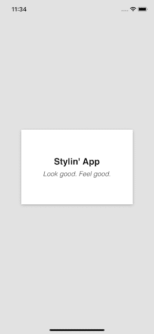
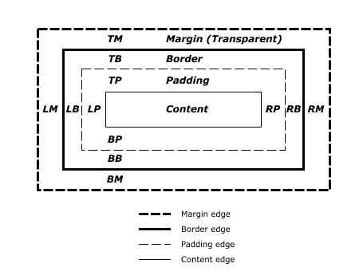

# 反应-自然风格

> 原文：<https://dev.to/thefinnomenon/react-native-styling-il7>

没有人喜欢难看的应用程序，这就是风格的由来！有两种方法来设计你的 React-Native 应用程序；样式表和 CSS-In-JS。每个都有优点和缺点，但最终这主要是一个偏好的选择。这篇文章将涵盖这两个方面，并为每个方面重新创建了以下设计。

[](https://res.cloudinary.com/practicaldev/image/fetch/s--ul-iwagr--/c_limit%2Cf_auto%2Cfl_progressive%2Cq_auto%2Cw_880/https://thefinnternet.com/static/b6249848aa77e2a59ffffd786db27d16/135ae/stylin.png)

# 造型基础

在研究这两种不同的方法之前，概括地介绍一下造型的基础是很重要的。React-Native 基本上使用 Flexbox 来处理布局，使用 CSS 的子集来满足其余的样式需求。

## Flexbox

Flexbox 是一种用于在不同屏幕尺寸上提供一致布局的算法。React-Native 文档对 Flexbox 有很好的描述，所以不要只是在这里复制，你应该在这里通读一下。

## 视图

React-Native 视图上常见的 CSS 样式，

*   高度:数字
*   宽度:数字
*   backgroundColor: color
*   边框:大小颜色样式
*   填充:数字
*   边距:数字

[](https://res.cloudinary.com/practicaldev/image/fetch/s--y2stzNDQ--/c_limit%2Cf_auto%2Cfl_progressive%2Cq_auto%2Cw_880/https://thefinnternet.com/static/6a1d19c64879b62408ec49467cb9ea2e/ef956/padding_and_margin_model.jpg)

## 文本

React-Native 视图上常见的 CSS 样式，

*   颜色:彩色
*   fontFamily:字符串
*   fontSize:数字
*   fontStyle:('正常'，'斜体')
*   fontWeight:('正常'，'粗体'，' 100 '，' 200 '，…，' 900 ')
*   textAlign: ('auto '，' left '，' right '，' center '，' justify ')
*   textAlignVertical: enum('auto '，' top '，' bottom '，' center ')
*   textDecorationLine: ('none '，' underline '，' line-through '，' underline line-through ')
*   textTransform:('无'，'大写'，'小写'，'大写')

# 造型方法

## 样式表

使用 StyleSheet，可以创建一个 javascript 对象来定义元素的样式，并通过元素的`style`属性将其分配给元素。

```
const styles = StyleSheet.create({
  container: {
    flex: 1,
  },
})

;<View style={styles.container}>...</View> 
```

### 演示代码

```
import React from "react"
import { StyleSheet, Text, View } from "react-native"

export default function App() {
  return (
    <View style={styles.container}>
      <View style={styles.box}>
        <Text style={styles.title}>Stylin' App</Text>
        <Text style={styles.subtitle}>Look good. Feel good.</Text>
      </View>
    </View>
  )
}

const styles = StyleSheet.create({
  container: {
    flex: 1,
    backgroundColor: "#e2e2e2",
    alignItems: "center",
    justifyContent: "center",
  },
  box: {
    height: 200,
    width: 300,
    backgroundColor: "#fff",
    alignItems: "center",
    justifyContent: "center",
    shadowColor: "#000",
    shadowOffset: {
      width: 0,
      height: 2,
    },
    shadowOpacity: 0.25,
    shadowRadius: 3.84,
    elevation: 5,
  },
  title: {
    fontFamily: "Helvetica",
    fontWeight: "bold",
    fontSize: 24,
    paddingBottom: 8,
  },
  subtitle: {
    fontFamily: "Helvetica",
    fontStyle: "italic",
    fontWeight: "100",
    fontSize: 18,
  },
}) 
```

## CSS-In-JS

CSS-In-JS 是 React 中相当流行的样式选项，允许开发人员用 javascript 编写普通的 CSS。在 React-Native 中，这并不是开创性的，因为样式表基本上已经是作为 JavaScript 对象的 CSS，但是使用 CSS-In-JS 库仍然有它的优势。有许多 CSS-In-JS 库，但我更喜欢**样式组件**。

使用样式化组件，您可以在模板字符串中编写普通的 css 来创建样式化元素。

```
const Container = styled.View`
  flex: 1;
  background: #e2e2e2;
  align-items: center;
  justify-content: center;
` 
```

### 样式化组件相对于样式表的优势

#### 全面支持 CSS

StyledSheet 只支持 CSS 的一个子集，并且还要求属性名是骆驼大小写的，而 styled-components 在 React-Native 平台上支持尽可能多的 CSS。

这种差异的一个很好的例子是应用一个方框阴影，

```
// StyledSheet

box: {
  shadowColor: "#000",
  shadowOffset: {
    width: 0,
    height: 2
  },
  shadowOpacity: 0.25,
  shadowRadius: 3.84,
  elevation: 5
},

// styled-components

const Box = styled.View`
  box-shadow: 0px 2px 3.84px #000;
  shadow-opacity: 0.25;
  elevation: 5;
` 
```

#### 动态造型

styled-components 通过在样式代码中正确使用样式，简化了动态样式和主题。

```
const Item = styled.View`
  background-color:${props=>props.primary ? "blue" : "green"};
`

// Green background
<Item />

// Blue background
<Item primary /> 
```

#### 增加可读性

我发现样式化组件可以更好地组织和阅读代码，因为你的 JSX 树包含了你创建的定制元素的描述性名称，而不是一堆视图、文本等标签。

```
// StyleSheet

<View style={styles.container}>
  <View style={styles.box}>
    <Text style={styles.title}>Stylin' App</Text>
    <Text style={styles.subtitle}>Look good. Feel good.</Text>
  </View>
</View>

// styled-components

<Container>
  <Box>
    Stylin' App
    <Subtitle>Look good. Feel good.</Subtitle>
  </Box>
</Container> 
```

#### 跨平台

虽然用样式化组件编写的样式不能在 React 和 React-Native 之间直接转换，但是概念和一般流程可以，如果您在多个平台上开发，这是一个很大的优势。

```
// React
import styled from "styled-components"
const Container = styled.div`
  background: red;
  padding: 10px;
`

// React-Native
import styled from "styled-components"
const Container = styled.View`
  background: red;
  padding: 10px;
` 
```

### 演示代码

> `yarn add styled-components`

```
import React from "react"
import styled from "styled-components"

export default function App() {
  return (
    <Container>
      <Box>
        Stylin' App
        <Subtitle>Look good. Feel good.</Subtitle>
      </Box>
    </Container>
  )
}

const Container = styled.View`
  flex: 1;
  background: #e2e2e2;
  align-items: center;
  justify-content: center;
`

const Box = styled.View`
  height: 200;
  width: 300;
  background: #fff;
  align-items: center;
  justify-content: center;
  box-shadow: 0px 2px 3.84px rgba(0, 0, 0, 0.25);
  elevation: 5;
`

const Title = styled.Text`
  font-family: Helvetica;
  font-weight: bold;
  font-size: 24;
  padding-bottom: 8;
`

const Subtitle = styled.Text`
  font-family: Helvetica;
  font-style: italic;
  font-weight: 100;
  font-size: 18;
` 
```

# 结论

[在 Github 上查看该项目的代码](https://github.com/thefinnomenon/react-native-styling)