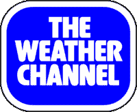
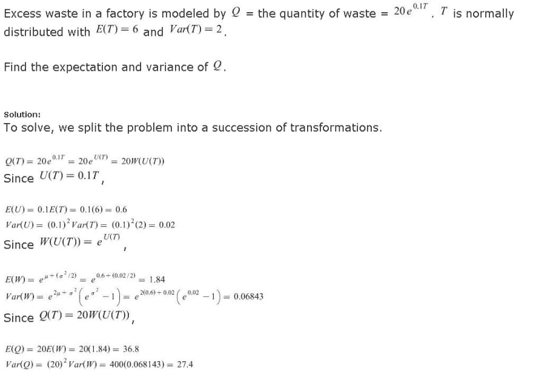
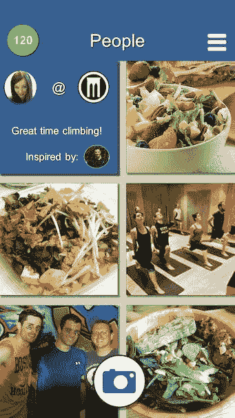
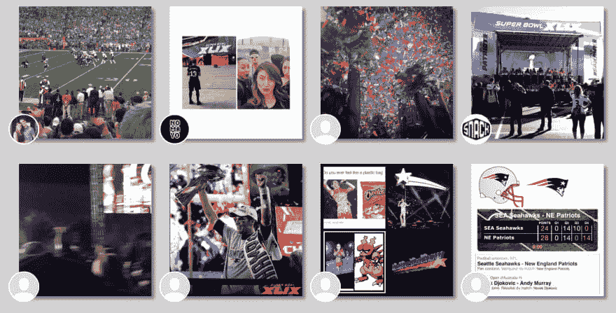

# 活到老学到老:我通往软件工程职业生涯的曲折道路

> 原文：<https://dev.to/mattdionis/never-too-late-to-learn-my-meandering-path-to-a-career-in-software-engineering-1p97>

如果你曾经考虑过从事软件工程的职业，但是认为你太老了，或者你的教育和职业道路不适合你，请三思！我在软件工程领域的职业道路在下面有详细描述，我们只能说这不是一条直线，但是非常值得！

## 天气极客

从我记事起，我就对天气着迷。我小时候最美好的回忆是，当一场大雷雨来临的时候，我凝视着窗外，或者早上醒来时，外面正下着暴风雪。我最喜欢的数字过去是，现在仍然是 56，因为天气频道在我们的有线电视节目中是 56。

 
*老派天气频道 logo。哦，回忆！*

在我十几岁的时候，我是波士顿 ABC 电视台的当地气象观察员。我会打电话询问当地的情况和暴风雨期间的降雪量，并且会在广播中偶尔提到。我知道我未来的职业是气象学，没人能告诉我有什么不同。

我整个童年都是一名优秀的学生，我决定只申请一所学校，宾夕法尼亚州立大学。宾州州立大学有全国最好的气象项目之一，如果不是最好的话，那就是最好的 T2 气象项目。高三万圣节前收到录取通知书。对于这位未来的气象学家来说，一切都在朝着正确的方向发展……至少我是这样认为的。

**18 岁前编写的代码总行数:0**

***最终对我的工程职业有帮助的技能:热爱(气象学)并主动学习某个领域的更多知识***

## 一场国家悲剧和一次变故

在大学的第一个月，我和我的同学们被告知，我们中没有人有很大的可能获得气象学学位。我记得我们都笑出声来。自从我们会走路以来，我们都是天气极客。我们不可能转专业。

到了大学二年级开始，我开始对我的气象学课程感到厌倦。我喜欢龙卷风、飓风、暴风雪，但这些极端天气事件并不经常发生。我记得我无意中听到同学们在争论那天晚上的低温是 37 还是 38，而我所关心的是那天晚上我要去哪里聚会。很明显，我需要做出改变，但当你从五岁起就被称为“未来气象学家”时，很难告诉你所爱的人这个梦想已经结束了。

我的第一门计算机科学课程安排在 2001 年秋季，但是仅仅上了一节课我就放弃了。我决定计算机科学不适合我，我的时间最好花在不同的课程上。哦，傻傻的 20 岁的我；)

我的二年级开始于 2001 年的秋天，在 9 月 11 日，我可能还保留着的任何童年的纯真都消失了。当我开始寻找一个专业和未来的职业，在那里我可以有更大的影响时，气象学突然觉得对我来说更不重要了。

大约在同一时间，我参加了在大学公园校园的一个免费演讲系列活动。因《公敌》出名的查克·D 是那天晚上的演讲者。直到今天，我仍然记得他看着观众，敦促我们，学生们，不要“浪费我们的时间在一所伟大的大学追求别人的梦想”。这就是我需要的推动力，就在第二天，我开始填写文件，准备转专业。

从宾夕法尼亚州立大学毕业后，我搬到了华盛顿特区，不到一年，我就在一份移民和海关执法局(ICE)的合同中担任数据分析师。

**22 岁前编写的代码总行数:0**

***最终对我的工程职业有帮助的技能:时间管理、高等数学、改进的逻辑思维***

## 疲惫不堪，焦躁不安

我带着“保护国家免受恐怖分子袭击”的愿景开始了我的国土安全职业生涯。这是**不是**我在现实中经历的。我很快意识到，我的工作主要是繁忙的工作，我为之工作的承包商对获得更多的联邦合同更感兴趣，尽管看起来是“打击恐怖主义”，而不是实际打击恐怖主义。在我两年半的工作中，我可以诚实地承认，我的工作促成了零恐怖分子的恐惧。

 
*健身造型摄影约 2007 年*

在这一点上我相当沮丧，但谢天谢地，健身房是一个出口。每天下班后，我会花整整两个小时举重。然后我会回家为第二天的晚餐准备鸡蛋、燕麦片、鸡肉和红薯。这种生活方式最终带来了一些当地的摄影作品，以及和一位经理一起工作的机会，以进一步发展这个副业。我为安德玛和辛普森赛车队做了一些工作，很快就想去西部的好莱坞看看我能从这个机会中得到什么。

**25 岁前编写的代码总行数:0**

最终对我的工程职业有帮助的技能:更强的自我激励技能，专注于手头任务并排除杂念的能力

## 好莱坞梦

当我的父母在海外度假时，我辞去了稳定的工作，并在他们回来的那天打电话告诉了他们这个消息。对于这样的突发新闻，我不推荐这种策略。至少可以说，事情进展得并不顺利。

 
*我生命中有趣的 15 个月*

到达洛杉矶后，我在日落大道的一家酒店找到了一份夜班前台代理的工作。我的计划是晚上工作，早上去健身房，下午去试演角色。这个计划被证明是非常幼稚的。我总共面试了零个角色，因为我没有把睡眠考虑在内。我从来没有真正习惯夜班，大部分时间感觉自己像个僵尸。

2008 年末，正当经济崩溃的时候，我决定搬回老家。

**26 岁前编写的代码总行数:0**

 *## 返回东海岸

2008 年底，当经济跌至谷底时，我搬回了东海岸。我花了几乎整整一年的时间才找到另一份工作。事后看来，我希望我已经在这一点上开始学习编码，但我从来没有想过。

我以临时合同的形式做了一年多一点的数据分析师。我没有福利:没有医疗保险，没有假期，没有晋升的机会。谢天谢地，我的妻子鼓励我从事精算科学的职业。我有坚实的数学背景，精算职业报酬丰厚，所以我开始学习！

**29 岁前编写的代码总行数:0**

***最终对我的工程职业有帮助的技能:分析技能***

## 规避风险

我自己通过了前两次精算考试，这给了我一个在当地保险公司工作的机会。这比我之前的临时职位进步了一大步。这个职位是我开始以某种方式涉猎一些“编程”的地方。我的大部分时间都花在更新和改进宏的大量 Microsoft Excel 文件上。我发现我真的很喜欢这份工作，尽管它仍然感觉相当乏味。

 
*一道精算考试的样题。我不怀念那些日子！*

我在第三次精算考试中苦苦挣扎，最终脱离了考试轨道，成为了一名精算技术员。这个角色给了我开始使用 SQL Server 的机会。我从第一天开始就喜欢上了这个，并从学习 SQL 中获得了很多乐趣。

**32 岁前写的代码总行数:0(除非算上 Excel 宏和 SQL)**

***获得的技能最终会对我的工程生涯有所帮助:“编程”Excel 宏、SQL***

## 拥抱风险

大约在同一时间，我高中时的一个好朋友和我决定创办一家健康和健身公司。基本的想法是将社交媒体上分享的数百万张健康和健身相关的照片(膳食、补充、锻炼等)联系起来。)到健康健身公司。你可以把它想象成一个健康生活奖励平台。我们称之为[征服者](http://outliermagazine.co/matt-dionis-conquerfit-interview/)。

 
*征服者 app 的早期原型*

我们将 ConquerFit 应用程序的开发外包给了一个本地开发团队，他们交付的正是我们想要的 MVP。然而，我们很快意识到，我们的朋友和家人的资金已经花光了，我们有许多功能需要在应用程序准备好公开发布之前添加到应用程序中。

我决定自学编码，以构建我们应用程序的“v2”版本。

我一头扎进去，从 [Codecademy](https://www.codecademy.com/) 开始，我发现这是一个极好的第一资源。在 Codecademy 上完成了所有的 JavaScript、HTML、CSS 和 SQL 材料后，我继续前往[树屋](https://teamtreehouse.com/)。

在这一点上，我感到很有信心，并开始着手一些小的示例项目。在你的学习旅程中，尽早开始一个实际的项目是多么重要，我怎么强调都不为过。学习教程是一回事，开发应用是另一回事。你会很快熟悉 [git](https://git-scm.com/) 和 [GitHub](https://github.com/) 、 [npm](https://www.npmjs.com/) 、[浏览器开发工具](https://developers.google.com/web/tools/chrome-devtools/)等等。

我花了大部分时间进行的示例项目是我称为“MobSeen”的项目。该应用程序专注于体育赛事，并允许用户近乎实时地查看在体育赛事中和体育赛事周围共享的 Instagram 照片。为了构建这个应用程序，我需要更深入地了解 Node。JS、AngularJS 以及建立和管理数据库。这是一次很棒的学习经历！

*MobSeen 应用程序显示超级碗 XLIX 的照片！*

我**喜欢**学习的过程，建立，磕磕绊绊，学习更多，一遍又一遍地重复。我发现我做了**而不是**爱是经营一家初创公司，思考筹资、营销、会计等问题。征服者会逐渐消失，但我对网络开发的新热情会推动我的事业向前发展。

32 岁时写的代码总行数:很多😁

***最终对我的工程生涯有帮助的技能:HTML、CSS、JavaScript、git、GitHub、npm、浏览器开发工具、调试***

## 给了一次机会

起初，我对申请软件工程工作非常犹豫，因为我从来没有感到“准备好了”。值得庆幸的是，我的妻子敦促我去做，我听从了她的建议。我是 2015 年春天才得以上[聘](https://hired.com/)平台的。我最初只对马萨诸塞州中部的工作感兴趣，因为我想避免通勤。然而，我的招聘人员说服我将搜索范围扩大到波士顿，我非常感谢我这样做了。在收到并接受来自[圈子](https://www.circle.com/)的邀请之前，我面试了六家公司。

我在这个领域的第一个角色是 Circle 内部工具团队的软件工程师。我曾经非常感激 Circle 的团队给了我一个机会，现在依然如此。我有一个很棒的经理，从第一天起，我就被一个聪明、勤奋、协作的团队包围着。在这个行业的最初几周、几个月和几年里，他们让我感觉多么舒服，我学到了多少，我说不尽。

34 岁时编写的生产代码的总行数:很多😁

## 回馈

在过去的 18 个月里，我一直担任技术主管/工程经理的职位，这让我进一步提高了我的沟通、优先级、规划和管理技能。在这一点上，我专注于通过博客、在会议上发言、建立视频课程和导师来回馈更多的初级开发人员和转行者。

相信我的话:你还没有到开始编程的年龄，从长远来看，你看似不相关的职业道路**将帮助你成为一名更好的工程师。开始学习，开始建设，永远不要停止提问！事实上，如果有任何问题，请随时联系我 [@mattdionis](https://twitter.com/MattDionis) 或[mattdionis@gmail.com](//mailto:mattdionis@gmail.com)。**

## 对我有帮助(也可能对你有帮助)的资源

### 学习平台

*   [Codecademy](https://www.codecademy.com/) (适合初学者)
*   [树屋【Codecademy 之后伟大的下一步)](https://teamtreehouse.com/)
*   [Pluralsight](https://www.pluralsight.com/) (更高级，深入框架/库)
*   [Egghead.io](https://egghead.io/) (超赞的 JavaScript 内容)

### 导师/博主

*   [萨梅尔布纳](https://medium.com/@samerbuna)(特别爱他的节点。JS 材料)
*   丹·阿布拉莫夫(令人难以置信的深入反应)
*   Apollo GraphQL 博客(对于初学者和有经验的 GraphQL 开发人员来说都很棒)

### 推特接踵而至

*   莎拉·德拉斯纳(动画、视频等等)
*   [吴雪莉](https://twitter.com/sxywu)(数据可视化牛逼)
*   纳迪亚·布雷默 (⬆️同上)
*   王自如 (JAMstack！)
*   [约翰爸爸](https://twitter.com/John_Papa)(棱角分明！)

### 播客

*   [React 播客](https://reactpodcast.simplecast.fm/)
*   [反应围捕](https://devchat.tv/react-round-up/)
*   [未定义](https://undefined.fm/)
*   [全栈健康](https://fullstack.health/)

***好运！！！*T3】👨‍💻***