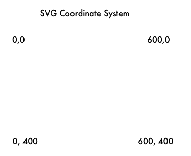
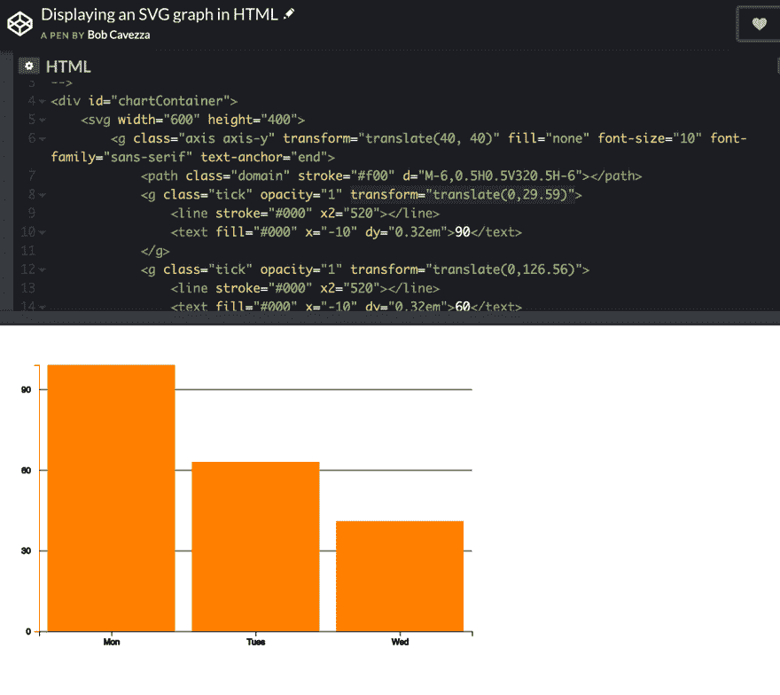
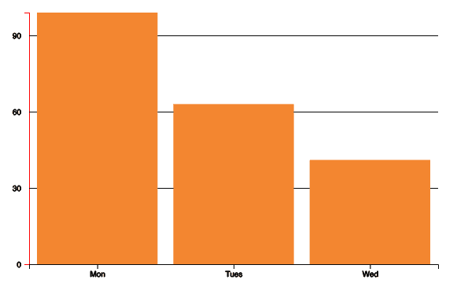

# HTML SVGs 简单指南

> 原文：<https://dev.to/cavezza/the-simple-guide-to-html-svgs-461j>

你想使用 D3，但是你不明白 SVG 是如何在浏览器中渲染的。这使得理解 D3 输出的 HTML 代码变得非常困难。让我们来解决其中的一些问题。

我们今天要看的代码是由 D3 生成的。然而，在这个例子中，我们没有看到 D3。我们只看 HTML 格式的 SVG 代码。

这非常重要，因为当使用 D3 时，通常会创建 SVG。如果您不熟悉 SVG 的外观和行为，调试 D3 代码将会非常困难。

在开始之前，我希望您在查看这段代码时记住一件事。SVG 代码最简单的形式是在画布上放置形状。在下面的例子中，我们将绘制一个 SVG 画布，并在画布上放置形状和文本。这就是我们正在做的。不要让这个代码阻止你。只不过是在画布上画画，然后在画布上画出形状。可能有你从未见过的语法，但是学习是有趣的！

[https://codepen.io/cavezza/embed/xxKdbGM?height=600&default-tab=result&embed-version=2](https://codepen.io/cavezza/embed/xxKdbGM?height=600&default-tab=result&embed-version=2)

在 [CodePen](https://codepen.io) 上看到 Bob Cavezza ( [@cavezza](https://codepen.io/cavezza) )用 HTML 显示 SVG 图的笔[。](https://codepen.io/cavezza/pen/xxKdbGM/)

别忘了 CodePen 是交互式的！您应该与代码笔进行交互，并摆弄这些值。改变一些值，看看会发生什么。移除一个元素，看看它如何改变图形在屏幕上的显示方式。

让我们开始看代码。

首先，我们有一个`<svg>`标签，它创建了一个区域，我们可以在这里绘制我们看到的元素。本质上，这个标签正在绘制我们的画布。这将创建一个 600 像素宽、400 像素高的画布。现在我们已经准备好画布，是时候开始在画布上放置形状了。

现在，要在画布上放置项目，我们必须告诉画布每个项目的 x 和 y 坐标。在 SVG 画布上，坐标从左上角开始。如果我们想要`0,0`，那将是最左上方。如果我们想要`600,400`，那就给我们最下面的权利。下图比文字更能解释这一点。

[](https://res.cloudinary.com/practicaldev/image/fetch/s--kMRxCAj4--/c_limit%2Cf_auto%2Cfl_progressive%2Cq_auto%2Cw_880/https://ibuildmvps.com/wp-content/uploads/2019/08/Screen-Shot-2019-08-27-at-4.51.55-PM.png)

让我们继续看代码。下一行代码是:

```
<g class="axis axis-y" transform="translate(40, 40)" fill="none" font-size="10" font-family="sans-serif" text-anchor="end"> 
```

`<g>`是`<svg>`的一个有趣的子元素。这是除了`<svg>`本身之外唯一没有画出形状的元素。`<g>`用于将其他 SVG 元素分组的容器。“需要知道的一个`<g>`元素的重要方面是，应用于`<g>`元素的转换是在它的子元素上执行的，它的属性由它的子元素继承”([来自 Mozilla mdn](https://developer.mozilla.org/en-US/docs/Web/SVG/Element/g%20) )。您可以在 CodePen 中测试这一点，方法是转换一个分组元素，将其从 g 元素中移除，并将其放在它的每个后代上。

[](https://res.cloudinary.com/practicaldev/image/fetch/s--yBm3Nll4--/c_limit%2Cf_auto%2Cfl_progressive%2Cq_66%2Cw_880/https://ibuildmvps.com/wp-content/uploads/2019/08/Screen-Recording-2019-08-26-at-11.47-PM.gif)

需要注意的是`transform`属性的作用。Transform 定义了一个应用于它及其子对象的定义列表。你经常看到的最常见的就是`translate(x, y)`。这样做是将项目及其子项目向右移动 x 个像素，向下移动 y 个像素。

还有其他更复杂的转换选项。当你很好地学习了变换，并把它们和 D3 的动画结合起来，你将能够做一些非常酷的动画。

在下一行中，我们遇到了`<path>`元素。

`<path class="domain" stroke="#f00" d="M-6,0.5H0.5V320.5H-6"></path>`

Path 是一个有趣的元素，也是我认为 SVG 领域中最复杂的元素。在`<path>`元素中，魔法发生在`d=`区域。我仍然不能解释在路径元素中的`d`属性中的具体值是什么。当您绘制更复杂的线图时，该值可能会增长到数百或数千个字符。路径所做的是在画布上绘制。它用于绘制比简单形状更复杂的对象。

在我们的例子中,`<path>`是唯一一个不是简单线条或简单形状的。这个特殊的`<path>`对象画了一条两端伸出的线。它们看起来不像是看起来像|(一条线)的典型线条，而像是](一条两端各伸出两条线的线)。这可能是你见过的最简单的`<path>`元素，因为它们变得极其复杂。

这里有一个改变路径颜色的截图，这样你就能完全理解我的意思了。

<figure>[](https://res.cloudinary.com/practicaldev/image/fetch/s--6wpt-bfA--/c_limit%2Cf_auto%2Cfl_progressive%2Cq_auto%2Cw_880/https://ibuildmvps.com/wp-content/uploads/2019/08/Screen-Shot-2019-08-27-at-2.44.14-PM.png) 

<figcaption>在这个截图中，y 轴的填充颜色被改变了，所以你可以看到路径对象正在绘制的确切形状。</figcaption>

</figure>

虽然我们在这里没有看到它，但是 D3 真正开始发光的地方是。由于`d`属性中的值非常复杂，所以像 D3 这样的工具非常重要，它能够编写其他开发人员在构建这些复杂的路径对象时能够理解的代码。

在下一行，我们再次遇到了`<g>`元素。`<g class="tick" opacity="1">`

由于我们之前讨论了`<g>`元素，我们现在知道这会将`tick`类添加到它的所有后代中，并且还会将 1 的`opacity`传递给它的所有后代(两个元素——一个`<line>`元素和一个`<text>`元素)。

接下来，我们看到了`<line>`元素。您可能已经猜到，line 元素绘制了一条简单的线:`<line stroke="#000" x2="520" transform="translate(0,29.59)"></line>`

笔画是线条的颜色。`x2`是线条结束处的 x 坐标。`x1`的默认值为 0。由于没有`x1`、`y1`或`y2`的值，我们知道它们都默认为 0。由于继承的转换，这个特定元素自己的“网格系统”从转换开始的地方开始。

接下来，我们遇到了`<text>`元素。这个 SVG 元素完全按照您的期望工作，它在 SVG 画布上呈现文本。我们在 SVG 元素中有一个`<text>`元素的原因是你可以通过给它 x 和 y 坐标把它放在画布上。

属性告诉你这个元素应该放在坐标平面上的什么地方。`dy`属性有点不同。这告诉你这个元素相对于前一个元素应该放在 y 轴的什么位置。在本例中，我们将它放置在距离它之前的线元素 0.32 ems 的位置。如果您不熟悉`em`，它与元素的计算字体大小相同。使用的替代物(而不是`em`)是`pixel` s 或`rem` s。您也可以在`dy`属性中使用百分比。

我们刚刚看到的第一个图案是绘制 y 轴和沿 y 轴的水平线。然后，它在 90 旁边的网格上画一条水平线，并将文本 90 放在网格上。

现在，当其余的水平线和文本字段编号被放置在网格上时，您将看到这种模式重复几次。完成后，您将看到一组几乎相同的元素，它们向 x 轴添加值。下面是绘制画布所有线条的完整代码(不包括图形矩形本身)。现在，您应该能够理解整个代码块，因为我们已经完成了上面的所有构建模块。

```
<g class="axis axis-y" transform="translate(40, 40)" fill="none" font-size="10" font-family="sans-serif" text-anchor="end">
    <path class="domain" stroke="#f00" d="M-6,0.5H0.5V320.5H-6"></path>
    <g class="tick" opacity="1">
        <line stroke="#000" x2="520" transform="translate(0,29.59)"></line>
        <text fill="#000" x="-10" dy="0.32em" transform="translate(0,29.59)">90</text>
    </g>
    <g class="tick" opacity="1" transform="translate(0,126.56)">
        <line stroke="#000" x2="520"></line>
        <text fill="#000" x="-10" dy="0.32em">60</text>
    </g>
    <g class="tick" opacity="1" transform="translate(0,223.53)">
        <line stroke="#000" x2="520"></line>
        <text fill="#000" x="-10" dy="0.32em">30</text>
    </g>
    <g class="tick" opacity="1" transform="translate(0,320.5)">
        <line stroke="#000" x2="520"></line>
        <text fill="#000" x="-10" dy="0.32em">0</text>
    </g>
</g>
<g class="axis axis-x" transform="translate(40, 360)" fill="none" font-size="10" font-family="sans-serif" text-anchor="middle">
    <path class="domain" stroke="#000" d="M0.5,6V0.5H520.5V6"></path>
    <g class="tick" opacity="1" transform="translate(87.16,0)">
        <line stroke="#000" y2="6"></line>
        <text fill="#000" y="9" dy="0.71em">Mon</text>
    </g>
    <g class="tick" opacity="1" transform="translate(260.5,0)">
        <line stroke="#000" y2="6"></line>
        <text fill="#000" y="9" dy="0.71em">Tues</text>
    </g>
    <g class="tick" opacity="1" transform="translate(433.83,0)">
        <line stroke="#000" y2="6"></line>
        <text fill="#000" y="9" dy="0.71em">Wed</text>
    </g>
</g> 
```

剩下的就是图形元素本身的绘制。在这一点上，我不确定当你知道这三个图形元素只不过是矩形时，你是否会感到惊讶或期待。

下面是在我们的图上构建三个矩形的完整代码:

```
<rect class="bar-line" transform="translate(40, 40)" height="320" width="153.33" x="10" y="0"></rect>
<rect class="bar-line" transform="translate(40, 40)" height="203.63" width="153.33" x="183.33" y="116.36"></rect>
<rect class="bar-line" transform="translate(40, 40)" height="132.52" width="153.33" x="356.66" y="187.47"></rect> 
```

s 是更简单的 SVG 元素之一。应用高度和宽度，然后应用起始 x 和 y 坐标。

这就是这次可视化的全部内容！

至此，您已经了解了足够多的 SVG 代码，能够创建出在工作中可能会用到的图形。恭喜你！大多数人并不完全理解 SVG，以便向其他工程师解释它。

今天，你达到了那个里程碑！

此时，您可能还没有完全理解 CodePen 中的一两个元素。如果是这种情况，您应该去更改一些 CodePen 值，看看当这些值被更改时，可视化会发生什么。玩代码是确保你理解它的最简单的方法。

**定期收到我的电子邮件，里面有最好的在线资源和链接**
[https://tinyletter.com/rcavezza](https://tinyletter.com/rcavezza)

**在我的博客上阅读更多内容**

[http://ibuildmvps.com](http://ibuildmvps.com)

**联系我**

[http://twitter.com/cavezza](http://twitter.com/cavezza)

[http://linkedin.com/in/cavezza](http://linkedin.com/in/cavezza)