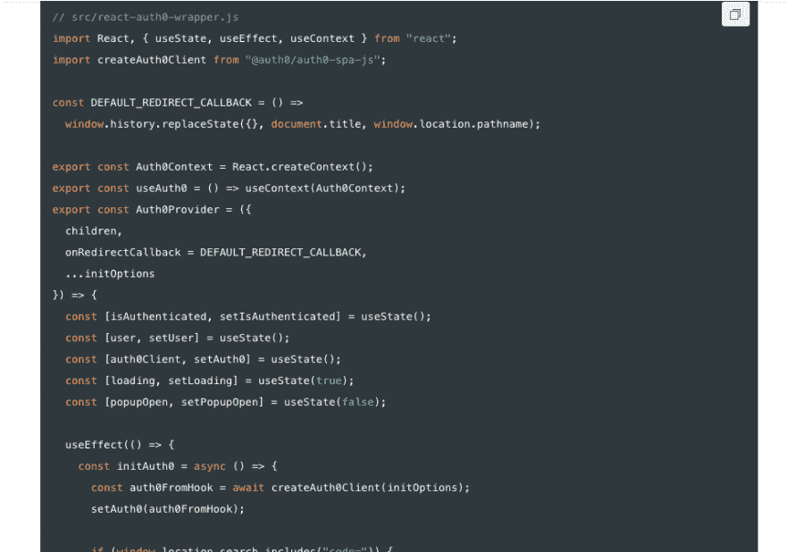
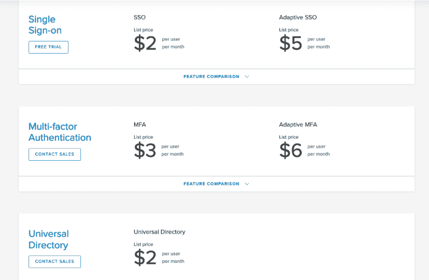
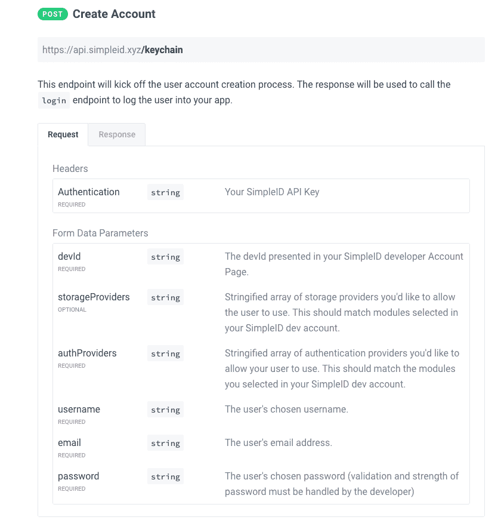

# 为开发人员比较身份验证工具

> 原文：<https://dev.to/polluterofminds/comparing-authentication-tools-for-developers-47a2>

<figure>[](https://res.cloudinary.com/practicaldev/image/fetch/s--sVVKbNIy--/c_limit%2Cf_auto%2Cfl_progressive%2Cq_auto%2Cw_880/https://cdn-images-1.medium.com/max/1000/0%2A-QuFyXsfcquzjwUd) 

<figcaption>[迈卡·威廉姆斯摄](https://unsplash.com/photos/lmFJOx7hPc4)</figcaption>

</figure>

当我第一次开始学习编码时，我经历了数不清的教程。我开发了如此多的[待办事项列表应用](https://dev.to/polluterofminds/adding-authentication-to-your-app-the-easy-way-8ag)，以至于我在使用待办事项列表时都不禁会想，是不是有人把它作为教程来开发，然后把它变成了一个产品。我学了 CRUD(创建、读取、更新、删除)。我学了框架(React，Angular，Vue)。我学了这么多，但是在每一个教程里，都少了点什么。一些重要的事情。

*认证。*

一个应用程序当然可以在没有数据持久性的情况下运行。一个应用程序甚至可以在没有身份验证的情况下保持数据的持久性。但是这些应用程序中有多少是日常有用的呢？他们往往是玩具和例子，这很好。但是，无论您是刚刚学习编码，还是经验丰富的专家，总会有需要将特定数据附加到特定用户的时候。这需要认证。因此，我想看看为开发人员构建的一些可用的身份验证工具——包括免费和付费产品——看看它们的比较情况。让我们开始吧！

### Auth0

Auth0 是一款高级工具，不仅仅支持身份验证。它们支持身份监控、用户管理和机器之间的认证通信，这只是其中的几个特性。我们将重点关注身份验证方面。

在自由计划中，Auth0 允许以下内容:

*   7，000 名免费活跃用户
*   无密码登录(社交认证)
*   最多 2 个社交认证提供商

他们的高级服务起价为 13 美元/月，面向 1，000 名活跃用户，此外还增加了以下功能:

*   日志保留 2 天
*   无限的社交授权提供商
*   帐户链接

这里要记住的一点是，如果你使用免费计划，并且已经有 5000 个活跃用户，升级到下一层并不意味着每月支付 13 美元，因为你已经超过了 1000 个用户。这意味着支付基于你当前活跃用户数的任何现行费率。这是一个公平的定价策略，但如果你不密切关注，它很容易被混淆。

开发者体验呢？

Auth0 拥有一些可用的最佳文档。他们有大量的 SDK 和 API。所有这些加起来就是选择你自己的风格类型的实现。下面是 React 实现的快照:

[](https://res.cloudinary.com/practicaldev/image/fetch/s--j2oIbIH---/c_limit%2Cf_auto%2Cfl_progressive%2Cq_auto%2Cw_880/https://cdn-images-1.medium.com/max/955/1%2Af8wsj1vZac3HlAqrKWQD1w.png)

对于大型项目的开发人员来说，Auth0 是一个可靠的选择。Auth0 有一个很大的免费层，可以随着应用的扩展而扩展。

### 护照

对于希望构建自己的解决方案的开发人员来说， [Passport](http://www.passportjs.org/) 是他们可能会使用的开源工具。Passport 完全免费，开源，维护良好。虽然 password 有用户名/密码认证解决方案，但他们的主要业务是社交认证。他们有所谓的策略，即主要基于 OAuth 2.0 规范构建的身份验证解决方案。

Passport 只对 Node.js 可用，所以如果你正在构建一个非 JavaScript 的应用，你就没那么幸运了。但是随着完全(或大部分)用 JavaScript 构建的应用程序的增加，这可能不再是一个问题。

体验如何？

Passport 文档丰富，支持如此广泛的选项，开发人员很难找到适合他们的解决方案。这里有一个脸书认证策略的例子:

```
passport.use(new FacebookStrategy({
    clientID: FACEBOOK\_APP\_ID,
    clientSecret: FACEBOOK\_APP\_SECRET,
    callbackURL: "http://localhost:3000/auth/facebook/callback"
  },
  function(accessToken, refreshToken, profile, cb) {
    User.findOrCreate({ facebookId: profile.id }, function (err, user) {
      return cb(err, user);
    });
  }
)); 
```

Enter fullscreen mode Exit fullscreen mode

这很简单。Auth0 需要他们提供的 API 密钥和配置信息，而 Passport 只需要身份验证策略的配置信息(clientID、clientSecret 等)。

如果您正在构建一个基于节点的应用程序，并且只需要快速、免费的身份验证，没有花哨的功能，Passport 是一个很好的选择。

### 秋田

Okta 更像是一个企业解决方案，但是没有任何东西(除了价格)阻止开发者把它放到非企业应用中。Okta 提供员工身份(考虑公司内部账户)和客户身份解决方案。

定价有点难以解析，但在大多数情况下，每个用户每月的服务起价是 2 美元。

[](https://res.cloudinary.com/practicaldev/image/fetch/s--b1Et4YNA--/c_limit%2Cf_auto%2Cfl_progressive%2Cq_auto%2Cw_880/https://cdn-images-1.medium.com/max/1024/1%2A-w91SO1MwxFpCqiIW3_2Fg.png)

如果价格还没把你吓跑，那我们就来看看开发者体验是什么样的吧。他们在这里粉碎它。他们不仅有大量的文档，而且有简单易用的小部件，您可以轻松地将它们添加到您的应用程序中。这里有一个例子:

```
// Uses okta-signin-widget version 2.13.0

var widget = new OktaSignIn({
  baseUrl: "{{yourOktaDomain}}",
  logo: "/sites/all/themes/developer/owb/alliance.png",
  i18n: {
    // Overriding English properties
    en: {
      "primaryauth.title": "Alliance Authentication",
      "primaryauth.submit": "Sign In"
    },
  },

});

widget.renderEl({
  el: "#widget-container"
}); 
```

Enter fullscreen mode Exit fullscreen mode

Okta 可能只适用于较大的组织，但是如果你是一个有预算的开发人员，想要一些简单易用的东西，Okta 可以满足你。

### 开标

OpenID 与其说是一个认证解决方案，不如说是一个网络标准。OpenID 是 OAuth 2.0 之上的一个身份层。他们致力于提供的标准不仅仅是认证。它们提供声明、验证、加密等等。这是一个强大的解决方案，来自一个致力于推进网络标准的基金会。

但是开发者的体验是怎样的呢？如果你在找文档，你可能要找一段时间。有文档，但是很难导航，也很难理解。然而，一旦你弄明白了，你会发现 OpenID 为多种编程语言提供了一个类似护照的解决方案。

如果您想构建一个基于标准的解决方案(这总是一个好的决定)，您应该看看 OpenID。给自己一点额外的时间浏览网站。

### 的简洁性

SimpleID(我的产品)是从 Web 3.0 领域发展而来的解决方案。分散技术有一个加入和认证问题，SimpleID 着手解决这个问题。在这个过程中，SimpleID 创建了一个身份验证解决方案，使开发人员能够快速访问加密工具，为最终用户提供隐私，并消除开发人员的大部分(如果不是全部)责任。

SimpleID 是一个高级解决方案，但附带一个免费计划，提供以下功能:

*   通过以太坊、块堆栈、纺织品进行身份验证
*   通过块堆栈和 IPFS 进行数据存储
*   一个开发者项目
*   最多创建 500 个账户

因为 SimpleID 帐户可以跨多个应用程序使用，所以用户总数仅适用于由开发人员的应用程序创建的帐户。如果开发者准备扩大规模，那么对于多达 10，000 个用户来说，成本仅为每月 9 美元。

但是开发者体验如何？SimpleID 是为了解决分散式 web 空间中的一般 web 和一般 JavaScript 焦点而构建的。虽然 SimpleID 拥有非常易于使用的 JavaScript SDK，但它也提供了可以在任何编程语言中使用的简单 API 端点:

[](https://res.cloudinary.com/practicaldev/image/fetch/s--8emJ7VSS--/c_limit%2Cf_auto%2Cfl_progressive%2Cq_auto%2Cw_880/https://cdn-images-1.medium.com/max/840/1%2A2FK4rbz6TnqdzJGVA0KqOA.png)

如果您正在开发一个分散的应用程序，您绝对应该看看 SimpleID。但即使你不是，SimpleID 也能给你其他服务不能给你的数据保护。

### 结论

无论您选择什么解决方案，只要知道身份验证工具的存在可以帮助您到达您需要去的地方。下一次，当你完成一个编码教程，并意识到你已经建立了一个不需要登录的应用程序时，回到这篇文章，选择一个你可以快速进入的解决方案。

* * *