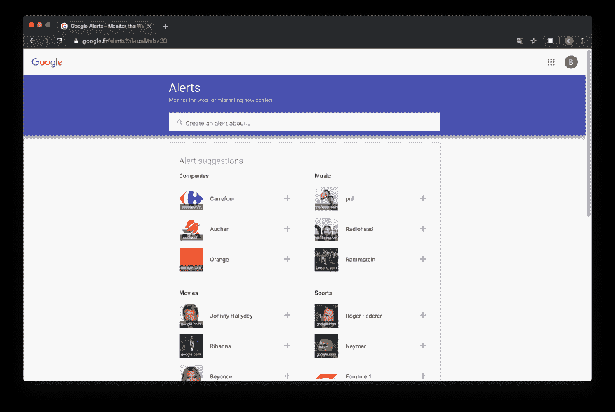
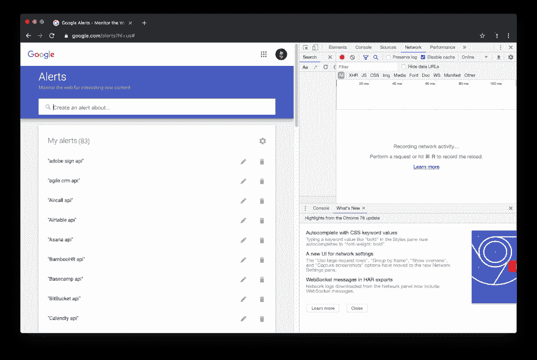
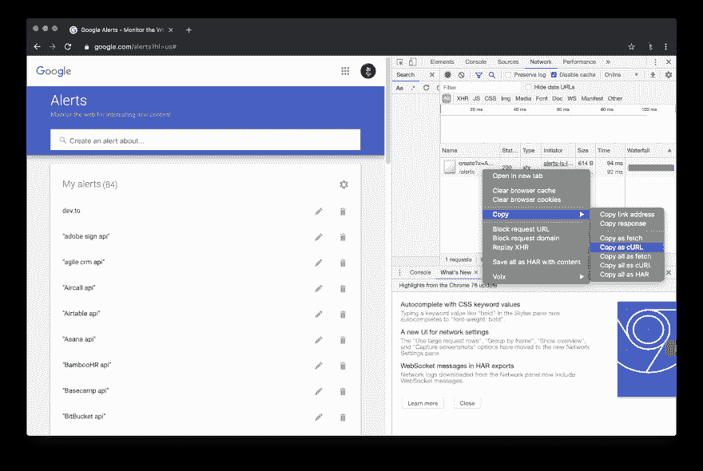

# 如何在 3 分钟内创建一堆谷歌提醒？

> 原文：<https://dev.to/mailmeteor/how-to-create-a-bunch-of-google-alerts-in-3-minutes-54n>

Google Alerts 是一个非常方便和强大的服务，可以随时了解特定领域发生的事情。

我是这项服务的超级粉丝，我每周都会创建几十个新的提醒。最近，我想添加 100 多个 Google Alerts 来获得关于我们正在与 [Bearer](https://www.bearer.sh) 合作的 API 的通知。

不幸的是，Google Alerts 没有提供 API。我也不愿意把我的谷歌证书(电子邮件+密码)分享给[图书馆](https://pypi.org/project/google-alerts/)。

## 我们需要什么？

首先，我们要添加警报的关键字列表:

```
// Here's my list of keywords to add Google Alerts on;
// Change it with whatever you want to be informed of.
const keywords = ["GitHub API", "Google Alerts API", "Dev.to API"] 
```

<svg width="20px" height="20px" viewBox="0 0 24 24" class="highlight-action crayons-icon highlight-action--fullscreen-on"><title>Enter fullscreen mode</title></svg> <svg width="20px" height="20px" viewBox="0 0 24 24" class="highlight-action crayons-icon highlight-action--fullscreen-off"><title>Exit fullscreen mode</title></svg>

然后，前往 [Google Alerts](https://www.google.com/alerts) ，我们将了解它在幕后是如何工作的:

[](https://res.cloudinary.com/practicaldev/image/fetch/s--MyXrRqOb--/c_limit%2Cf_auto%2Cfl_progressive%2Cq_auto%2Cw_880/https://pix.watch/DO6exB/BZ2pVW.png)

我用的是谷歌浏览器，但用 Safari 或 Firefox 应该也可以。

## 用 JS 创建 Google Alert

在 Google Alerts 首页，打开开发者工具`Alt`+`Command`+`J`(Mac 上)或者`Ctrl`+`Shit`+`J`(Windows 上)，然后打开`Network`标签页。您应该会看到类似这样的内容:

[](https://res.cloudinary.com/practicaldev/image/fetch/s--qk088Q9l--/c_limit%2Cf_auto%2Cfl_progressive%2Cq_auto%2Cw_880/https://pix.watch/Qt8-II/_LTCvL.png)

现在使用关键字`dev.to`创建一个示例警报。网络选项卡将显示对`/create`端点的请求。使用`Copy as fetch`来查看请求的内容:

[](https://res.cloudinary.com/practicaldev/image/fetch/s--8ncNXht7--/c_limit%2Cf_auto%2Cfl_progressive%2Cq_auto%2Cw_880/https://pix.watch/noiPEk/xR3iqw.png)

我们差不多完成了🙌如果您将它粘贴到控制台中，您将看到类似于:
的内容

```
// Code has been prettified
fetch(
  "https://www.google.com/alerts/create?x=ABJHsmWAbcU-xxxxxxxxxxxxxxxxxxxxx&hl=us",
  {
    "credentials": "include",
    "headers": {
    "accept": "*/*",
    "accept-language": "fr-FR,fr;q=0.9,en-US;q=0.8,en;q=0.7",
    "cache-control": "no-cache",
    "content-type": "application/x-www-form-urlencoded;charset=UTF-8",
    "pragma": "no-cache",
    "sec-fetch-mode": "cors",
    "sec-fetch-site": "same-origin",
    "x-client-data": "xxxxxxxxxxxxxxxxxxxxx"
    },
    "referrer": "https://www.google.com/alerts?hl=us",
    "referrerPolicy": "no-referrer-when-downgrade",
    // The dev.to keyword is passed ==================== right here ∨∨∨
    "body": "params=%5Bnull%2C%5Bnull%2Cnull%2Cnull%2C%5Bnull%2C%22dev.to%22%2C%22com%22%2C%5Bnull%2C%22en%22%2C%22US%22%5D%2Cnull%2Cnull%2Cnull%2C0%2C1%5D%2Cnull%2C3%2C%5B%5Bnull%2C1%2C%22corentin%40bearer.sh%22%2C%5Bnull%2Cnull%2C10%5D%2C2%2C%22en-US%22%2Cnull%2Cnull%2Cnull%2Cnull%2Cnull%2C%220%22%2Cnull%2Cnull%2C%22AB2xxxxxxxxxxx%22%5D%5D%5D%5D",
    "method": "POST",
    "mode": "cors"
  }
); 
```

<svg width="20px" height="20px" viewBox="0 0 24 24" class="highlight-action crayons-icon highlight-action--fullscreen-on"><title>Enter fullscreen mode</title></svg> <svg width="20px" height="20px" viewBox="0 0 24 24" class="highlight-action crayons-icon highlight-action--fullscreen-off"><title>Exit fullscreen mode</title></svg>

正如您可能看到的，`dev.to`关键字被传递到主体中。将其更改为其他内容，将让我们自动添加一个新的谷歌提醒🥳

## 批量创建 Google Alerts 的脚本

```
// Replace with your keywords list
var keywords = ["GitHub API", "Google Alerts API", "Dev.to API"]

function addAlert(i) {
  // Retrieve the keyword to work with
  const keyword = encodeURIComponent(keywords[i])

  // Stop the script if there's no keyword
  if (!keywords[i] || !keyword) { return; }

  console.log(`Adding ${keyword}`)

  // 1\. Replace the line below with your own fetch (see Copy as fetch above)
  // 2\. Replace `dev.to` with `${keyword}`
  fetch(/*...*/)

  // Exponentially delay the next request,
  // to avoid rate limit on Google.
  .then(() => { setTimeout(function() {addAlert(i+1)}, (Math.min(i || 2, 30) * 1000)) })
}

addAlert(0) 
```

<svg width="20px" height="20px" viewBox="0 0 24 24" class="highlight-action crayons-icon highlight-action--fullscreen-on"><title>Enter fullscreen mode</title></svg> <svg width="20px" height="20px" viewBox="0 0 24 24" class="highlight-action crayons-icon highlight-action--fullscreen-off"><title>Exit fullscreen mode</title></svg>

我建议把它作为一个片段添加到你的谷歌浏览器上([在这里学习如何做](https://developers.google.com/web/tools/chrome-devtools/javascript/snippets))。