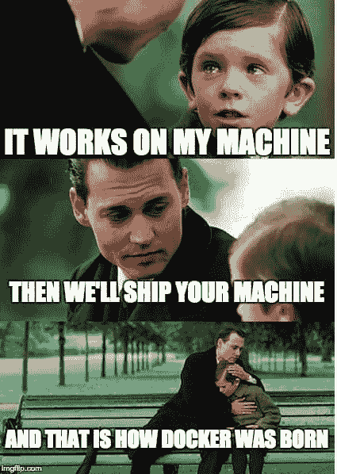
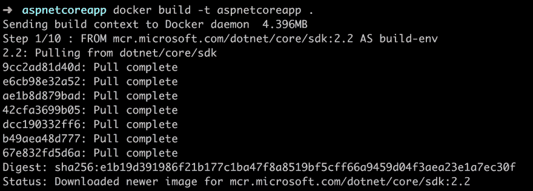
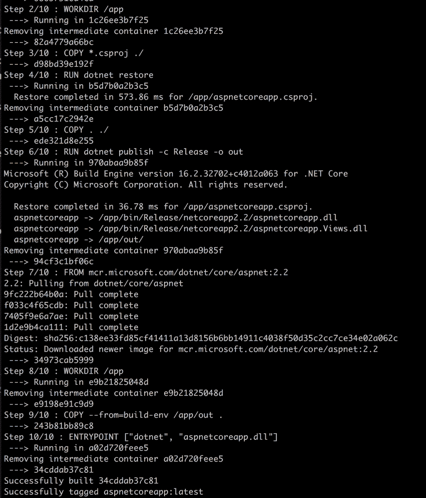
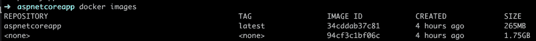
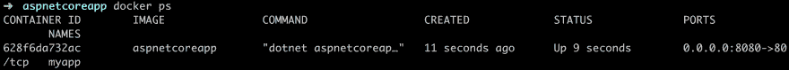

# 如何对. Net 核心应用程序进行 Dockerize

> 原文：<https://dev.to/dotnet/how-you-can-dockerize-a-net-core-app-4h96>

在 [Twitter](https://twitter.com/chris_noring) 上关注我，很乐意接受您对主题或改进的建议/Chris

这是使用 Docker 和容器化系列文章的第一部分。网芯。

在本文中，我们将

*   **讨论** *集装箱化*一般
*   **学习**创建工件需要采取的步骤，如`Dockerfile`、`.dockerignore`和一些基本的 Docker 命令。

## 资源

*   [注册一个免费的 Azure 账户](https://azure.microsoft.com/free/?wt.mc_id=devto-blog-chnoring)要像使用私有注册表一样使用云中的容器，你需要一个免费的 Azure 账户
*   docker 上的 5 部分系列，该系列旨在为您提供一个坚实的 Docker 基础，涵盖基本概念、卷、网络、Docker 编写等更多内容
*   这是一个指南，它将确保你的 Docker 图像尽可能小，但也确保它的性能和你理解为什么你应该使用某些命令。
*   使用这个 VS 代码扩展
    改进你的 Docker 工作流程 VS 代码可以真正地帮助你使用这个扩展，构建、运行、创作、部署许多伟大的命令

*   使用构建微服务。Net Core
    本教程涵盖了如何在。网和 Dockerize 它。

*   [ASP 入门。Net Core](https://docs.microsoft.com/en-us/aspnet/core/getting-started/index?view=aspnetcore-2.2&tabs=macos&wt.mc_id=devto-blog-chnoring)
    这将教你用 ASP 开发 web 应用程序。Net Core 使用。网络核心 CLI

*   这展示了如何对一个控制台应用程序进行 Dockerize

*   [。Net Core 和 Docker](https://docs.docker.com/engine/examples/dotnetcore/?wt.mc_id=devto-blog-chnoring)
    这是 Docker 自己描述如何 Docker 化一个. Net App。

## 为什么

在标题中，我们称我们将要做的事情为“T2”。Docker 之后叫`dockerizing`。它的另一个名字是*集装箱化*，Docker 是一个非常常见的集装箱供应商，这两个概念几乎成了同义词。

肯定还有其他厂商。如果感兴趣，您可以在此阅读更多内容:

> [https://tech beacon . com/enterprise-it/30-essential-container-technology-tools-resources-0](https://techbeacon.com/enterprise-it/30-essential-container-technology-tools-resources-0)

Docker 帮助我们将应用程序放入容器中。那么，为什么我们首先要这样做呢？嗯，想这么做有很多原因。首先，我们来谈谈什么是容器。我们来看看 Docker 是怎么定义的:

> 容器是一个标准的软件单元，它将代码及其所有依赖项打包，以便应用程序能够快速可靠地从一个计算环境运行到另一个计算环境。

好的，所以我们从一个计算机环境到另一个计算机环境获得了速度和可靠性，所以不仅仅在我的机器上工作？

> 是的，正是如此

[](https://res.cloudinary.com/practicaldev/image/fetch/s--M7-yQH9x--/c_limit%2Cf_auto%2Cfl_progressive%2Cq_auto%2Cw_880/https://thepracticaldev.s3.amazonaws.com/i/6wwfeo6j3xcmcow66fkm.jpg)

还有什么？

> Docker 容器映像是一个轻量级的、独立的、可执行的软件包，包括运行应用程序所需的一切:代码、运行时、系统工具、系统库和设置

好了，我把所有东西都带在身边了，不仅是应用程序代码，还有运行时、系统工具等等。那不是虚像吗？

> 不，这是一个轻量级版本。容器使用运行它们的底层主机操作系统来进行系统调用。

哦。我想我明白了。我使用 Docker 来创建一个容器，这意味着我得到了一个小巧轻便的东西，在每个人的环境下看起来都一样。当我想发布我的应用程序时，我会这样做。

> 是的，你得到了它，当然，当你想发布你的应用程序时，当然，如果你想的话，也可以在开发期间发布。今天，云非常受欢迎，成为托管应用程序的默认标准。让您的应用程序采用容器格式意味着，当我们想要管理大量容器或支持微服务架构时，我们可以使用 Kubernetes 等工具轻松扩展应用程序。将容器存储在云中的容器注册表中，在大多数大型云供应商那里也是可能的。

## 演示

好了，我们讨论了*为什么*我们应该将我们的应用程序转变为容器化版本，现在让我们看看我们需要采取的实际步骤:

*   **脚手架**一个. Net Web app，
*   **创建**一个 Dockerfile 文件
*   **创建**一个 Docker 忽略文件
*   **建立**我们的形象
*   **运行**我们的容器

### 搭建一个 Web App

首先，我们需要一个. Net Web 应用程序。我们可以像这样使用 dotnet CLI 来创建它:

```
dotnet new webapp -o aspnetcoreapp 
```

这将创建一个我们命名为`aspnetcoreapp`的 webapp。

现在我们有了 web 应用程序，让我们把重点放在 Docker 部分，这是我们目前缺少的，需要添加的。

### 创建 Dockerfile

在这一部分，我们将创建一个名为`Dockerfile`的文件。它的工作是指定我们需要什么操作系统，我们希望安装什么命令，在哪里可以找到我们的应用程序代码，以及最后如何在容器中启动我们的应用程序。看 Dockerfile 像是菜谱*什么*和*怎么*。那好吧。让我们创建它:

```
touch Dockerfile 
```

**指定图像**

对于内容，我们需要定义的第一件事是我们想要基于的图像。我们还需要设置一个工作目录，我们希望文件在容器中的最终位置。
我们用来自和工作目录的命令来做，就像这样:

```
# Dockerfile
FROM mcr.microsoft.com/dotnet/core/sdk:2.2 AS build-env

WORKDIR /app 
```

我们在这里说的是去抓取一个带有小操作系统映像的映像。网芯。我们也说我们的工作目录是`/app`。

**复制项目文件**

接下来，我们需要复制以`.csproj`结尾的项目文件。此外，我们还需要调用`dotnet restore`，以确保我们安装了所有指定的依赖项，比如:

```
COPY *.csproj ./
RUN dotnet restore 
```

**复制并构建**

接下来，我们需要复制我们的应用程序文件并构建我们的应用程序，就像这样:

```
COPY . ./
RUN dotnet publish -c Release -o out 
```

**构建运行时映像**

这里我们再次指定我们的图像和工作目录，就像这样:

```
FROM mcr.microsoft.com/dotnet/core/aspnet:2.2
WORKDIR /app 
```

但是有一点不同，这一次我们想要将我们构建的文件复制到`app/out` :

```
COPY --from=build-env /app/out . 
```

**启动应用**

最后，我们添加一个命令来启动我们的应用程序。我们用命令 ENTRYPOINT 来做这件事。ENTRYPOINT 接受一个数组，该数组转换为带有参数的命令行调用。我们的命令看起来是这样的:

```
ENTRYPOINT ["dotnet", "aspnetcoreapp.dll"] 
```

这意味着它将在命令行上调用`dotnet aspnetcoreapp.dll`。

`Dockerfile`整体看起来像这样:

```
FROM mcr.microsoft.com/dotnet/core/sdk:2.2 AS build-env
WORKDIR /app

# Copy csproj and restore as distinct layers
COPY *.csproj ./
RUN dotnet restore

# Copy everything else and build
COPY . ./
RUN dotnet publish -c Release -o out

# Build runtime image
FROM mcr.microsoft.com/dotnet/core/aspnet:2.2
WORKDIR /app
COPY --from=build-env /app/out .
ENTRYPOINT ["dotnet", "aspnetcoreapp.dll"] 
```

### 创建一个. dockerignore 文件

在我们开始构建`Dockerfile`中的指令之前，我们需要解决一些问题，即我们不想要的文件/目录。为此，Docker 告诉我们创建一个名为`.dockerignore`的文件。那么我们想要什么呢？我们希望快速构建，为了实现这一点，我们需要确保其中没有像`bin`或`obj`这样的目录。

首先，创建您的`.dockerignore`文件:

```
touch .dockerignore 
```

在我们的`.dockerignore`文件
中输入以下内容

```
# .dockerignore

Dockerfile
[b|B]in
[O|o]bj 
```

注意，`#`用于注释。

### 建立我们的形象&启动容器

在这一点上，我们只有一个我们想要做的配方，即我们的`Dockerfile`。从这里开始，我们需要分两步走:

1.  从我们的 docker 文件创建图像
2.  根据我们的映像创建并运行一个容器。

**创造我们的形象**

为了创建图像，我们可以使用命令`docker build`，比如:

```
docker build -t aspnetcoreapp . 
```

如果我们把它分解一下，我们会发现我们使用了`-t`来给我们的图像命名。`aspnetcoreapp`成为图像名称。我们的最后一个参数是一个标点符号`.`，表示我们可以在哪里找到`Dockerfile`，在我们的例子中是当前目录。

运行这个命令首先会导致。Net 核心映像被摘下来，记住我们的 FROM 命令:

[](https://res.cloudinary.com/practicaldev/image/fetch/s--ZrslOxV---/c_limit%2Cf_auto%2Cfl_progressive%2Cq_auto%2Cw_880/https://thepracticaldev.s3.amazonaws.com/i/hhhycj6o9sft7vxjg510.png)

此后，它处理 docker 文件中所有剩余的命令:

[](https://res.cloudinary.com/practicaldev/image/fetch/s--qDLMUKb---/c_limit%2Cf_auto%2Cfl_progressive%2Cq_auto%2Cw_880/https://thepracticaldev.s3.amazonaws.com/i/5jfew3q5sy4q48bfq0pq.png)

上面我们可以看到它`successfully tagged aspnetcoreapp:latest`。这意味着一切都很好，我们有一个形象。那么我们如何检查呢？

嗯，我们可以键入命令`docker images`，就像这样:

[](https://res.cloudinary.com/practicaldev/image/fetch/s--GzJVpIMI--/c_limit%2Cf_auto%2Cfl_progressive%2Cq_auto%2Cw_880/https://thepracticaldev.s3.amazonaws.com/i/qb6vmjnamlpf6lerk4rp.png)

**创建并运行我们的容器**

在这一点上，我们有一个图像。太好了。它包含我们的应用程序代码、命令实用程序、操作系统和我们告诉它包含的所有其他东西。我们需要启动它。要做到这一点，我们需要把它变成一个容器。我们这样做，我们的命令`docker run`，就像这样:

```
docker run -d -p 8080:80 --name myapp aspnetcoreapp 
```

让我们分解命令:

*   这仅仅意味着我们在后台运行容器。
*   这意味着我们将把一个外部港口与一个内部集装箱港口相匹配。对于某些`Dockerfile`规范，您需要显式地公开一个内部端口，这在我们的例子中是不需要的，因为它运行在端口`80`上。但是让我们明确一下语法`external port: internal port`。这意味着我们将我们的机器端口`8080`连接到内部集装箱端口`80`。
*   `--name`，这是我们给出我们的集装箱名称，`myapp`。如果我们不指定名称，就会为我们生成一个。有了名字以后就更容易引用了。

我们最后一个参数是图像名称`aspnetcoreapp`。

让我们用命令`docker ps`检查我们的容器是否已经创建并正在运行:

[](https://res.cloudinary.com/practicaldev/image/fetch/s--PGydhRYz--/c_limit%2Cf_auto%2Cfl_progressive%2Cq_auto%2Cw_880/https://thepracticaldev.s3.amazonaws.com/i/ce849fhq70h1lfdaowkp.png)

最后，让我们通过转到`http://localhost:8080`来检查我们的容器是否启动并运行:

[](https://res.cloudinary.com/practicaldev/image/fetch/s--ohBoWak8--/c_limit%2Cf_auto%2Cfl_progressive%2Cq_auto%2Cw_880/https://thepracticaldev.s3.amazonaws.com/i/8hcj976syi6z7b2aepsi.png)

## 清理干净

现在，我们已经创建了一个启动并运行的映像和容器。随着时间的推移，您将拥有大量的图像和容器。这需要空间，所以让我们学习一些 Docker 命令来控制这种情况。

要停止您的容器，请键入`docker stop [docker name]`。所以在我们的例子中，那将是:

```
docker stop myapp 
```

使用
移除容器

```
docker rm myapp 
```

您可以使用容器的名称或 id(至少前 3 个字符)来停止/删除它。你可以通过输入例如`docker ps`找到它的名字。

现在我们剩下两个图像，一个是我们构建的`aspnetcoreapp`，另一个是我们基于其构建的`mcr.microsoft.com/dotnet/core/runtime:2.2`。为了彻底清理，我们可以使用命令`docker rmi`，又名*删除图像*，就像这样:

```
docker rmi myimage:latest
docker rmi mcr.microsoft.com/dotnet/core/runtime:2.2 
```

## 总结

有了 Docker 我们已经迈出了第一步。网芯。在这样做的时候，我们讨论了为什么容器和 Docker。

我们还学习了如何指定一个`Dockerfile`文件的内容来指定我们想要在图像中放入什么。此外，我们学会了创建`.dockerignore`文件来指定什么不应该进入我们的映像，以确保我们小而快速地构建。

此外，我们构建并启动了我们的容器。

在下一部分中，我们将研究如何构建微服务并将其部署到云中。

### 鸣谢

您应该关注 Java 冠军、DevOps 专家布鲁诺