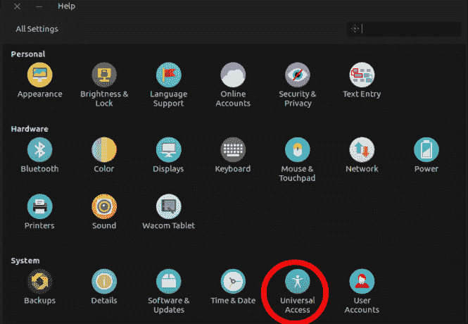
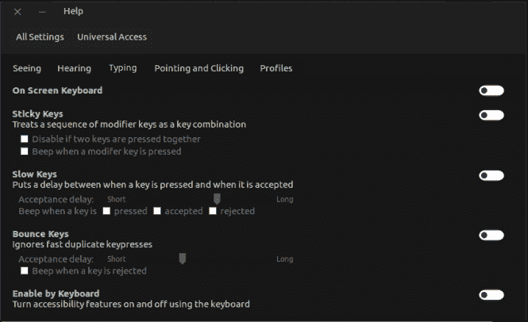
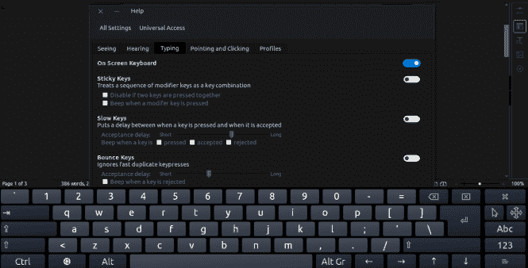
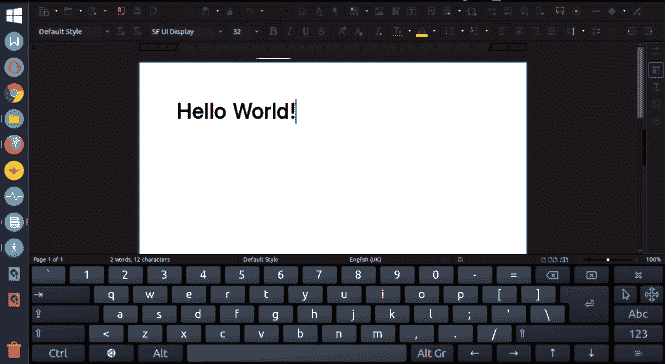

# 如何在 Linux 中启用和使用屏幕(虚拟)PC 键盘？

> 原文：<https://dev.to/xeroxism/how-to-enable-and-use-on-screen-virtual-pc-keyboard-in-linux-3dci>

[](https://res.cloudinary.com/practicaldev/image/fetch/s--JeA4vslX--/c_limit%2Cf_auto%2Cfl_progressive%2Cq_auto%2Cw_880/https://i2.wp.com/fossnaija.com/wp-content/uploads/2019/08/linux-on-screen-keyboard-banner.jpg%3Fresize%3D665%252C373%26ssl%3D1)

如果出于某种原因，你的键盘出了故障，或者此刻你的计算机上没有键盘，那么当你需要输入文本时，虚拟键盘可能会派上用场。

在这篇文章中，我将向你展示在 [ubuntu](http://ubuntu.com) [Linux](https://fossnaija.com/linux-installation-dual-booting-with-windows-7/) 中激活虚拟键盘的三种非常简单的方法。

**方法 1:使用辅助功能设置。**

使用此方法启用屏幕键盘。遵循下面概述的步骤。

**第一步:**进入“设置”。

**第二步:**点击设置窗口底部的“通用访问”。

<figure>[](https://res.cloudinary.com/practicaldev/image/fetch/s--JAN8t0IG--/c_limit%2Cf_auto%2Cfl_progressive%2Cq_auto%2Cw_880/https://i1.wp.com/fossnaija.com/wp-content/uploads/2019/08/settings-ubuntu.png%3Fw%3D665%26ssl%3D1) 

<figcaption>通用权限设置。</figcaption>

</figure>

**步骤 3:** 选择“打字”选项卡，点击“屏幕键盘”启用切换按钮。

<figure>[](https://res.cloudinary.com/practicaldev/image/fetch/s--0sFUtsXI--/c_limit%2Cf_auto%2Cfl_progressive%2Cq_auto%2Cw_880/https://i1.wp.com/fossnaija.com/wp-content/uploads/2019/08/universal-access-settings.png%3Fw%3D665%26ssl%3D1) 

<figcaption>屏幕键盘设置。</figcaption>

</figure>

然后菜单栏上突然出现一个辅助功能图标；显示屏幕键盘现在处于活动状态(即使暂时没有显示)。

**方法 2:使用板载图标**

这是一种更简单的激活键盘的方式。

**第一步:**按 super (Windows)键打开“dash”。

**第二步:**在仪表盘中输入“onboard”并点击出现的 onboard 图标。

<figure>[](https://res.cloudinary.com/practicaldev/image/fetch/s--QekR2USZ--/c_limit%2Cf_auto%2Cfl_progressive%2Cq_auto%2Cw_880/https://i1.wp.com/fossnaija.com/wp-content/uploads/2019/08/on-screen-keyboard.png%3Fresize%3D665%252C338%26ssl%3D1) 

<figcaption>屏幕键盘</figcaption>

</figure>

然后虚拟键盘就会出现。

**方法 3:使用命令行(终端)。**

这是另一个简单的方法，和上面的方法一样，你可以用一个[命令行](https://fossnaija.com/the-anatomy-of-the-linux-command-line/)来激活屏幕键盘。

为此，只需打开您的[终端](https://dev.to/xeroxism/6-commands-you-must-know-to-be-productive-on-the-terminal-h9a)并键入以下命令:

```
onboard 
```

然后任何时候你想打字；屏幕键盘会在屏幕底部自动打开。当你重启电脑时，屏幕键盘会出现在桌面上。

<figure>[](https://res.cloudinary.com/practicaldev/image/fetch/s--0hXyjOXE--/c_limit%2Cf_auto%2Cfl_progressive%2Cq_auto%2Cw_880/https://i1.wp.com/fossnaija.com/wp-content/uploads/2019/08/onborad-writing-test.png%3Fresize%3D665%252C364%26ssl%3D1)

<figcaption>libre office 的屏幕键盘。</figcaption>

</figure>

键盘有一个直观的界面，这是常见的 PC 键盘熟悉的。

要暂时隐藏，您可以选中键盘右上角的“X”按钮。它会再次出现，在需要你和一些打字(即写作)的时候。

当您使用完屏幕键盘后，您可以按照上面列举的相同步骤永久禁用它。这一次，单击切换按钮将其禁用。

虽然屏幕键盘不是一个长期(永久)的解决方案，但在一些绝望的情况下，它可以非常有用，以挽救局面。

现在你知道了，如何在 Linux (Ubuntu)上启用屏幕键盘。

快乐的 Linux！

帖子[如何在 Linux 中启用和使用屏幕(虚拟)PC 键盘。](https://fossnaija.com/onscreen-virtual-keyboard-linux/)最早出现在[福斯奈亚](https://fossnaija.com)上。