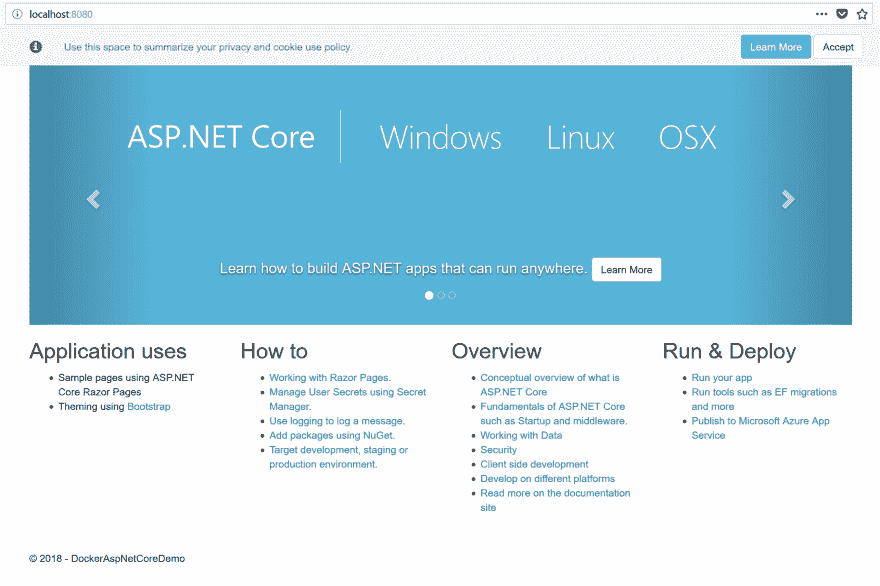

# Docker for 初学者- Docker 文件，docker 构建，docker 运行，docker 编写，这都意味着什么？

> 原文：<https://dev.to/ch_lee/docker-for-beginners-docker-file-docker-build-docker-run-docker-compose-what-does-it-all-mean-22oj>

在我的[上一篇文章](https://dev.to/ch_lee99/getting-started-with-docker-for-c-developers-45hc)中，我谈到了我在 Visual studio 中入门 Docker 的心得，并简要介绍了 Docker 生态系统。

Visual Studio 可以让您快速启动并运行 Docker，而无需创建 Docker 文件和使用 Docker 命令行。然而，我将尝试解释什么是 Docker 文件、Docker 构建、Docker 运行、Docker 合成以及它们是如何结合在一起的。

**Tl；博士:**

*   Docker 文件描述了如何构建 Docker 映像。
*   Docker build 命令基于 Docker 文件构建映像
*   Docker run 命令启动 Docker 映像
*   Docker 合成文件将 docker 构建和运行组合在一个文件中。

## 如此...什么是 Docker 文件？

Docker 文件是 YAML 文件的形式，它包含一组指令，这些指令描述了应用程序需要什么来构建它。如果你刚到 YAML，[这里有一个不错的介绍](https://docs.ansible.com/ansible/latest/reference_appendices/YAMLSyntax.html)。

以 Visual Studio 生成的样本中的样本 docker 文件为例，它可以分为 4 个阶段。

让我们试着打破它。

#### 阶段 1:指定运行时

```
FROM microsoft/dotnet:2.1-aspnetcore-runtime AS base
WORKDIR /app
EXPOSE 80 
```

<svg width="20px" height="20px" viewBox="0 0 24 24" class="highlight-action crayons-icon highlight-action--fullscreen-on"><title>Enter fullscreen mode</title></svg> <svg width="20px" height="20px" viewBox="0 0 24 24" class="highlight-action crayons-icon highlight-action--fullscreen-off"><title>Exit fullscreen mode</title></svg>

第一行使用来自的[语法来定义要使用的基本 docker 图像。在这种情况下，它指定了 dotnet 2.1 运行时。](https://docs.docker.com/engine/reference/builder/#from)

下一行使用 [`WORKDIR`](https://docs.docker.com/engine/reference/builder/#workdir) 命令来设置工作目录。

第一步的最后一行使用了 [`EXPOSE`](https://docs.docker.com/engine/reference/builder/#expose) 特性，该特性公开了端口 80。

#### 第二阶段:建筑

下一阶段更复杂。

```
FROM microsoft/dotnet:2.1-sdk AS build
WORKDIR /src
COPY DockerAspNetCoreDemo/DockerAspNetCoreDemo.csproj DockerAspNetCoreDemo/
RUN dotnet restore DockerAspNetCoreDemo/DockerAspNetCoreDemo.csproj
COPY . .
WORKDIR /src/DockerAspNetCoreDemo
RUN dotnet build DockerAspNetCoreDemo.csproj -c Release -o /app 
```

<svg width="20px" height="20px" viewBox="0 0 24 24" class="highlight-action crayons-icon highlight-action--fullscreen-on"><title>Enter fullscreen mode</title></svg> <svg width="20px" height="20px" viewBox="0 0 24 24" class="highlight-action crayons-icon highlight-action--fullscreen-off"><title>Exit fullscreen mode</title></svg>

与第一阶段类似，它再次使用`FROM`语法来定义图像。注意这次它指定了 dotnet 2.1 sdk 而不是运行时。这是为了让它可以建立应用程序。

下一行将工作目录设置为`src`。然后，它使用 [copy](https://docs.docker.com/engine/reference/builder/#copy) 语法将 csproj 文件复制到 docker 中一个名为`DockerAspNetCoreDemo`的新文件夹中。

它使用复制的 proj 文件运行`dotnet restore`。然后，它将当前源文件夹中的所有内容复制到`src`的 docker 文件夹中。最后，它使用 release 参数运行`dotnet build`,并将文件输出到在阶段 1 中创建的`app`目录中。

#### 第三阶段:发布

下面倒数第二个步骤执行`dotnet publish`命令，并有一个参数指定输出到`app`文件夹。

```
FROM build AS publish
RUN dotnet publish DockerAspNetCoreDemo.csproj -c Release -o /app 
```

<svg width="20px" height="20px" viewBox="0 0 24 24" class="highlight-action crayons-icon highlight-action--fullscreen-on"><title>Enter fullscreen mode</title></svg> <svg width="20px" height="20px" viewBox="0 0 24 24" class="highlight-action crayons-icon highlight-action--fullscreen-off"><title>Exit fullscreen mode</title></svg>

#### 第四阶段:设置切入点

最后，这些步骤指示 Docker 如何启动应用程序的入口点。我想它相当于`dotnet-run`命令。

```
FROM base AS final
WORKDIR /app
COPY --from=publish /app .
ENTRYPOINT ["dotnet", "DockerAspNetCoreDemo.dll"] 
```

<svg width="20px" height="20px" viewBox="0 0 24 24" class="highlight-action crayons-icon highlight-action--fullscreen-on"><title>Enter fullscreen mode</title></svg> <svg width="20px" height="20px" viewBox="0 0 24 24" class="highlight-action crayons-icon highlight-action--fullscreen-off"><title>Exit fullscreen mode</title></svg>

## Docker build

现在我们有了一个 docker 文件，可以运行`docker build`命令来构建 Docker 映像。

现在，如果导航到演示应用程序的根目录并运行:

```
docker build DockerAspNetCoreDemo -f DockerAspNetCoreDemo/Dockerfile -t aspnetdemo 
```

<svg width="20px" height="20px" viewBox="0 0 24 24" class="highlight-action crayons-icon highlight-action--fullscreen-on"><title>Enter fullscreen mode</title></svg> <svg width="20px" height="20px" viewBox="0 0 24 24" class="highlight-action crayons-icon highlight-action--fullscreen-off"><title>Exit fullscreen mode</title></svg>

您可能会得到这样的错误:

```
C:\Users\chlee\Documents\Github\DockerAspNetCoreDemo>docker build DockerAspNetCoreDemo -f DockerAspNetCoreDemo/Dockerfile -t aspnetdemo
Sending build context to Docker daemon  4.209MB
Step 1/16 : FROM microsoft/dotnet:2.1-aspnetcore-runtime AS base
 ---> f8297fe48f0c
Step 2/16 : WORKDIR /app
 ---> Using cache
 ---> c16c3d21ce14
Step 3/16 : EXPOSE 80
 ---> Using cache
 ---> 6fd93b472bcc
Step 4/16 : FROM microsoft/dotnet:2.1-sdk AS build
 ---> f4bc69f831aa
Step 5/16 : WORKDIR /src
 ---> Using cache
 ---> 782546a1fbc5
Step 6/16 : COPY DockerAspNetCoreDemo/DockerAspNetCoreDemo.csproj DockerAspNetCoreDemo/
COPY failed: GetFileAttributesEx \\?\C:\WINDOWS\TEMP\docker-builder185318480\DockerAspNetCoreDemo\DockerAspNetCoreDemo.csproj: The system cannot find the path specified. 
```

<svg width="20px" height="20px" viewBox="0 0 24 24" class="highlight-action crayons-icon highlight-action--fullscreen-on"><title>Enter fullscreen mode</title></svg> <svg width="20px" height="20px" viewBox="0 0 24 24" class="highlight-action crayons-icon highlight-action--fullscreen-off"><title>Exit fullscreen mode</title></svg>

不太好。为什么？在一些研究和发现这个 [git 问题注释](https://github.com/moby/moby/issues/34893#issuecomment-330930534)之后，事实证明这是 Visual Studio 生成 docker 文件的方式。但是，在 Visual Studio 中运行它不会有任何问题。

### 一个更简单的 Docker 文件

上面的 docker 文件特定于 Visual Studio，下面是一个更简单的版本。这是从 [docker 站点](https://docs.docker.com/engine/examples/dotnetcore/)
获取并修改的

```
FROM microsoft/dotnet:2.1-sdk AS build-env
WORKDIR /app
EXPOSE 80

# Copy csproj and restore as distinct layers
COPY *.csproj ./
RUN dotnet restore

# Copy everything else and build
COPY . ./
RUN dotnet publish -c Release -o out

# Build runtime image
FROM microsoft/dotnet:2.1-aspnetcore-runtime
WORKDIR /app
COPY --from=build-env /app/out .
ENTRYPOINT ["dotnet", "DockerAspNetCoreDemo.dll"] 
```

<svg width="20px" height="20px" viewBox="0 0 24 24" class="highlight-action crayons-icon highlight-action--fullscreen-on"><title>Enter fullscreen mode</title></svg> <svg width="20px" height="20px" viewBox="0 0 24 24" class="highlight-action crayons-icon highlight-action--fullscreen-off"><title>Exit fullscreen mode</title></svg>

现在如果你跑:

```
docker build DockerAspNetCoreDemo -f DockerAspNetCoreDemo/Dockerfile-alternative -t aspnetdemo 
```

<svg width="20px" height="20px" viewBox="0 0 24 24" class="highlight-action crayons-icon highlight-action--fullscreen-on"><title>Enter fullscreen mode</title></svg> <svg width="20px" height="20px" viewBox="0 0 24 24" class="highlight-action crayons-icon highlight-action--fullscreen-off"><title>Exit fullscreen mode</title></svg>

*   `-f`是新的更简单的 docker 文件的文件名。
*   `-t`为图像指定一个标签，在我们的例子中是它的`aspnetdemo`。

那么输出将是:

```
C:\Users\chlee\Documents\Github\DockerAspNetCoreDemo>docker build DockerAspNetCoreDemo -f DockerAspNetCoreDemo/Dockerfile-alternative -t aspnetdemo
Sending build context to Docker daemon  4.209MB
Step 1/11 : FROM microsoft/dotnet:2.1-sdk AS build-env
 ---> f4bc69f831aa
Step 2/11 : WORKDIR /app
 ---> Using cache
 ---> 9025461ed217
Step 3/11 : EXPOSE 80
 ---> Using cache
 ---> 0e3c072cc161
Step 4/11 : COPY *.csproj ./
 ---> Using cache
 ---> 3eadd1126142
Step 5/11 : RUN dotnet restore
 ---> Using cache
 ---> 481f505ae094
Step 6/11 : COPY . ./
 ---> Using cache
 ---> 570fb6690fb4
Step 7/11 : RUN dotnet publish -c Release -o out
 ---> Using cache
 ---> 382bad5ea05e
Step 8/11 : FROM microsoft/dotnet:2.1-aspnetcore-runtime
 ---> f8297fe48f0c
Step 9/11 : WORKDIR /app
 ---> Using cache
 ---> c16c3d21ce14
Step 10/11 : COPY --from=build-env /app/out .
 ---> Using cache
 ---> 07c15508103a
Step 11/11 : ENTRYPOINT dotnet DockerAspNetCoreDemo.dll
 ---> Using cache
 ---> 0eeff78b4f71
Successfully built 0eeff78b4f71
Successfully tagged aspnetdemo:latest 
```

<svg width="20px" height="20px" viewBox="0 0 24 24" class="highlight-action crayons-icon highlight-action--fullscreen-on"><title>Enter fullscreen mode</title></svg> <svg width="20px" height="20px" viewBox="0 0 24 24" class="highlight-action crayons-icon highlight-action--fullscreen-off"><title>Exit fullscreen mode</title></svg>

这应该已经创建了一个 docker 图像，为了确认这一点，您可以运行`docker images`来列出所有的图像。

您应该会得到这样的结果:

```
REPOSITORY          TAG                      IMAGE ID            CREATED             SIZE
aspnetdemo          latest                   0eeff78b4f71        18 minutes ago      506MB
microsoft/dotnet    2.1-aspnetcore-runtime   f8297fe48f0c        45 hours ago        503MB 
```

<svg width="20px" height="20px" viewBox="0 0 24 24" class="highlight-action crayons-icon highlight-action--fullscreen-on"><title>Enter fullscreen mode</title></svg> <svg width="20px" height="20px" viewBox="0 0 24 24" class="highlight-action crayons-icon highlight-action--fullscreen-off"><title>Exit fullscreen mode</title></svg>

## Docker 运行

现在我们有了一个图像，我们可以运行`docker run`命令来启动图像并将其加载到一个容器中。

```
docker run -d -p 8080:80 --name aspnetapp aspnetdemo 
```

<svg width="20px" height="20px" viewBox="0 0 24 24" class="highlight-action crayons-icon highlight-action--fullscreen-on"><title>Enter fullscreen mode</title></svg> <svg width="20px" height="20px" viewBox="0 0 24 24" class="highlight-action crayons-icon highlight-action--fullscreen-off"><title>Exit fullscreen mode</title></svg>

所使用的 docker 运行参数可描述如下:

*   指定它处于分离模式，这意味着它将在后台运行。
*   `-p`指定图像的外部端口 8080 和内部端口 80
*   `--name`指定容器的名称
*   最后一个参数，`aspnetdemo`是我们想要运行的图像名称。

运行命令`docker ps`以验证它正在运行。您应该会看到这样的内容:

```
CONTAINER ID        IMAGE               COMMAND                  CREATED             STATUS              PORTS                  NAMES
5a04e20efb39        aspnetdemo          "dotnet DockerAspN..."   38 seconds ago      Up 34 seconds       0.0.0.0:8080->80/tcp   aspnetapp 
```

<svg width="20px" height="20px" viewBox="0 0 24 24" class="highlight-action crayons-icon highlight-action--fullscreen-on"><title>Enter fullscreen mode</title></svg> <svg width="20px" height="20px" viewBox="0 0 24 24" class="highlight-action crayons-icon highlight-action--fullscreen-off"><title>Exit fullscreen mode</title></svg>

最后，如果您在浏览器`https://localhost:8080`中加载，您应该会看到类似这样的内容:

[](https://res.cloudinary.com/practicaldev/image/fetch/s--9CeDDX1---/c_limit%2Cf_auto%2Cfl_progressive%2Cq_auto%2Cw_880/https://thepracticaldev.s3.amazonaws.com/i/t02hd8of48rheuv5mr2a.png)

## Docker 作曲是什么？

Docker compose 是另一个可以与 Docker 文件结合使用的命令。Docker 编写文件倾向于包含如何启动应用程序的说明。一般来说，它只会引用 docker 文件或现有的 Docker 映像，还包括任何特定于应用程序的参数。例如，在 web 应用程序中，我们可以指定端口和任何环境变量。

下面是一个 docker-compose 文件的例子:

```
version: '3.4'

services:
  dockeraspnetcoredemo:
    build:
      context: .
      dockerfile: DockerAspNetCoreDemo/Dockerfile
    ports:
        - "8080:80" 
```

<svg width="20px" height="20px" viewBox="0 0 24 24" class="highlight-action crayons-icon highlight-action--fullscreen-on"><title>Enter fullscreen mode</title></svg> <svg width="20px" height="20px" viewBox="0 0 24 24" class="highlight-action crayons-icon highlight-action--fullscreen-off"><title>Exit fullscreen mode</title></svg>

注意，它指定了 docker 文件`DockerAspNetCoreDemo/Dockerfile`。如果我们想要指定一个图像，合成文件将看起来像这样:

```
version: '3.4'

services:
  dockeraspnetcoredemo:
    image: aspnetdemo
    ports:
        - "8080:80" 
```

<svg width="20px" height="20px" viewBox="0 0 24 24" class="highlight-action crayons-icon highlight-action--fullscreen-on"><title>Enter fullscreen mode</title></svg> <svg width="20px" height="20px" viewBox="0 0 24 24" class="highlight-action crayons-icon highlight-action--fullscreen-off"><title>Exit fullscreen mode</title></svg>

现在，如果我们运行:

```
docker-compose -f docker-compose.yml up -d 
```

<svg width="20px" height="20px" viewBox="0 0 24 24" class="highlight-action crayons-icon highlight-action--fullscreen-on"><title>Enter fullscreen mode</title></svg> <svg width="20px" height="20px" viewBox="0 0 24 24" class="highlight-action crayons-icon highlight-action--fullscreen-off"><title>Exit fullscreen mode</title></svg>

*   `-f`指定文件名
*   `up`是“启动”图像的命令
*   `-d`是在后台运行的分离模式

如果您导航到`https://localhost:8080`，您应该会再次看到演示网站

## 总结

我谈到了什么是 docker 文件，如何从 docker 文件构建 Docker 映像。然后，我介绍了如何通过 docker run 命令或 docker compose 文件启动 docker 映像。

我希望这对你有所帮助，并对 Docker 世界有所了解。

你可以从[https://github.com/ch-lee/DockerAspNetCoreDemo](https://github.com/ch-lee/DockerAspNetCoreDemo)那里拿到代码