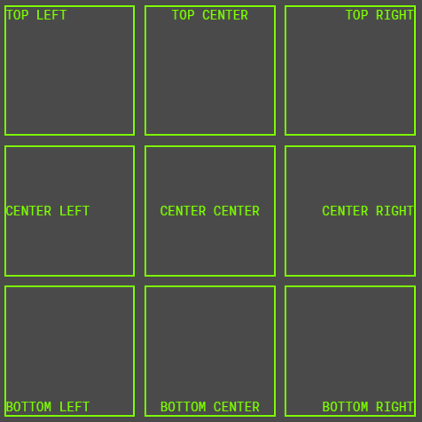

# 统治一切的混合——flexbox 驱动的布局混合

> 原文：<https://dev.to/nicolalc/a-mixin-to-rule-them-all-flexbox-driven-layout-mixin-1h43>

有时使用 **flexbox 布局**可能会生成**吨 css 属性**，最终结果可能会由于生成的属性**不可读**。

我做了一个简单的 **scss mixin** 来处理一般的 flexbox 布局，因为我工作在复杂的 web 应用程序上，我必须做很多不同的布局。

这个 mixin 处理一些(*而不是所有的* ) flexbox 属性，并且覆盖了 flexbox 布局的主要情况:

```
/**
* FLEXBOX
* A mixin to rule complex flexbox layout
* @author nicolacastellanidev@gmail.com
*/
@mixin flexbox(
  $display: flex,
  $direction: row,
  $placeContent: null,
  $placeItems: null,
  $wrap: nowrap,
  $shrink: 0,
  $grow: 0,
  $alignContent: null,
  $justifyContent: null,
  $alignItems: null,
  $justifyItems: null) {

    display: $display;
    flex-direction: $direction;

    @if $placeContent == null {
      @if $alignContent   { align-content: $alignContent; }
      @if $justifyContent { justify-content: $justifyContent; }
    } @else {
      place-content: $placeContent;
    }

    @if $placeItems == null {
      @if $alignItems   { align-items: $alignItems; }
      @if $justifyItems { justify-items: $justifyItems; }
    } @else {
      place-items: $placeItems;
    }

    flex-wrap: $wrap;
    flex-shrink: $shrink;
    flex-grow: $grow;
} 
```

这个 mixin 将帮助你定义一个 flexbox 驱动的元素，例如:

```
/* now we can add flexbox layout with a single line of code */
.anchor-top {
  @include flexbox($placeItems: flex-start);
}

.anchor-bottom {
  @include flexbox($placeItems: flex-end);
}

.anchor-center {
  @include flexbox($placeItems: center);
}

.anchor-left {
  @include flexbox($placeContent: flex-start);
}

.anchor-right {
  @include flexbox($placeContent: flex-end);
}

.anchor-center-hor {
  @include flexbox($placeContent: center);
} 
```

这些类可以用来处理 html 布局，比如:

```
<div class="container">
  <div class="box anchor-top anchor-left">
    TOP LEFT
  </div>
  <div class="box anchor-top anchor-center-hor">
    TOP CENTER
  </div>
  <div class="box anchor-top anchor-right">
    TOP RIGHT
  </div>
  <div class="box anchor-center anchor-left">
    CENTER LEFT
  </div>
  <div class="box anchor-center anchor-center-hor">
    CENTER CENTER
  </div>
  <div class="box anchor-center anchor-right">
    CENTER RIGHT
  </div>
  <div class="box anchor-bottom anchor-left">
    BOTTOM LEFT
  </div>
  <div class="box anchor-bottom anchor-center-hor">
    BOTTOM CENTER
  </div>
  <div class="box anchor-bottom anchor-right">
    BOTTOM RIGHT
  </div>
</div> 
```

最终结果将是:

[](https://res.cloudinary.com/practicaldev/image/fetch/s--52jkj_er--/c_limit%2Cf_auto%2Cfl_progressive%2Cq_auto%2Cw_880/https://thepracticaldev.s3.amazonaws.com/i/vjgxkjqoz0nnq3axof09.PNG)

看看这支笔的真实例子:

[https://codepen.io/NicolaCastellaniDev/embed/wvwdWMV?height=600&default-tab=result&embed-version=2](https://codepen.io/NicolaCastellaniDev/embed/wvwdWMV?height=600&default-tab=result&embed-version=2)

我希望这篇文章能帮助你< 3 爱你所有人