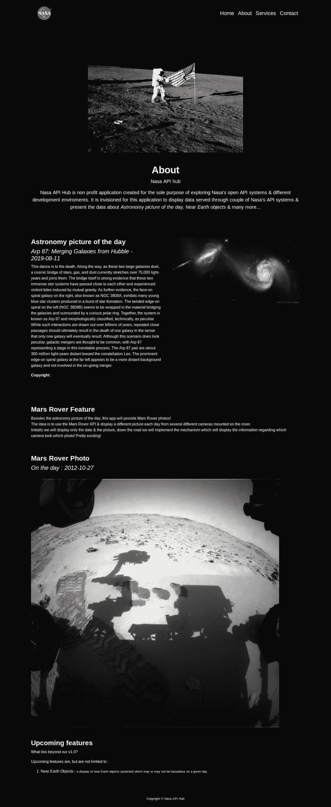
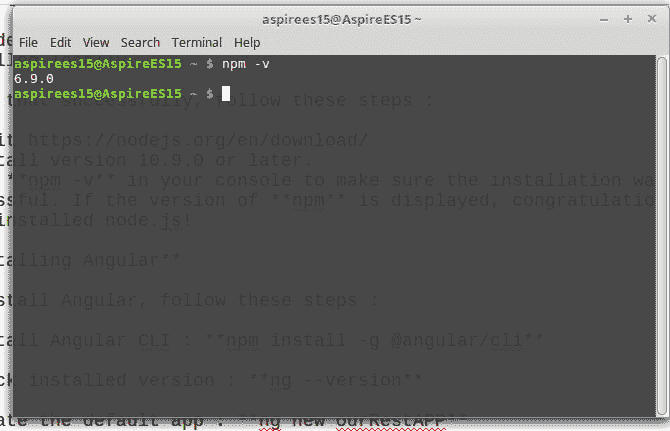
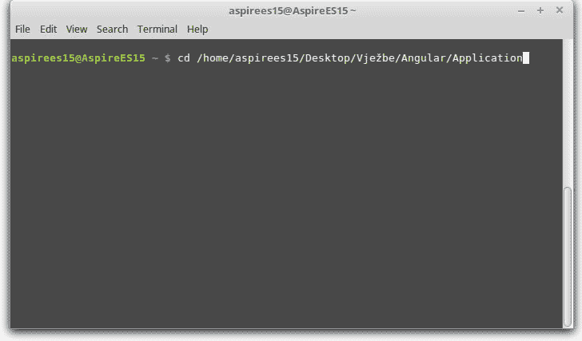
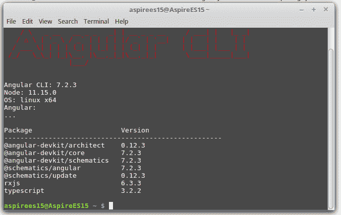
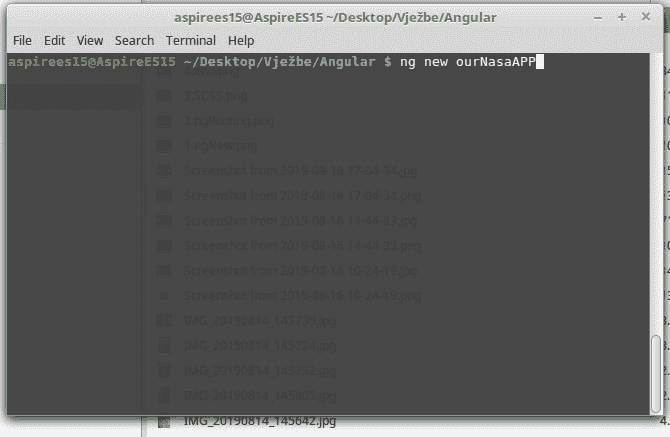
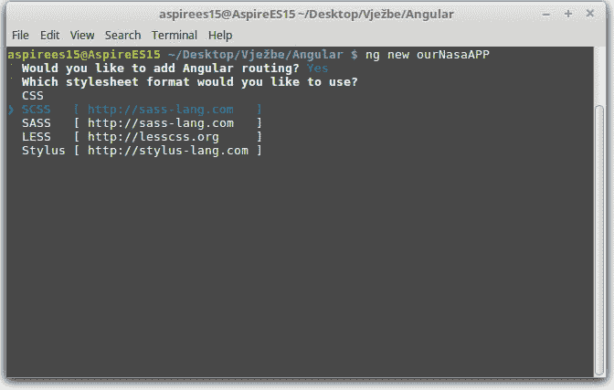
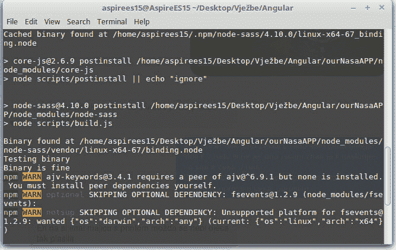
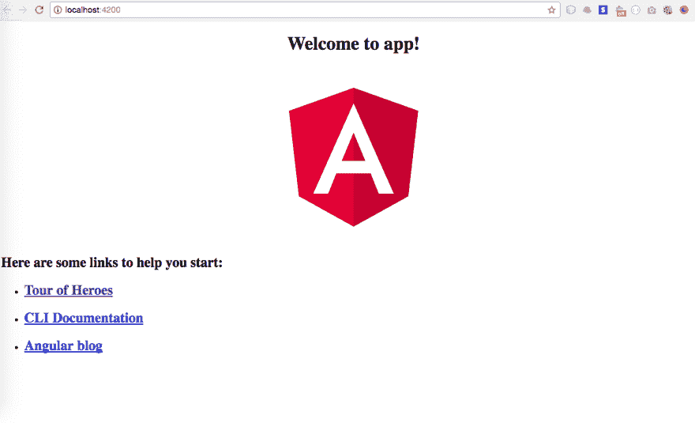

# Angular -让我们一起构建一个应用程序|第 1 部分

> 原文：<https://dev.to/kristijanfistrek/angular-let-s-build-an-app-together-part-1-13o4>

嗨，又来了 Dev.to 的朋友们！

欢迎来到本系列的第一部分， ***让我们一起构建一个应用程序***’‘在这里，我将尽我所能带您完成构建 REST API Angular 应用程序的过程。

谈到棱角分明，我不是专家，所以请随意在下面纠正我。

事不宜迟，我们开始吧！

### **目录**

1.  我们将会建造什么
2.  设置环境
3.  你好世界
4.  设置项目
5.  设计
6.  建模您的 JSON 数据和显示
7.  其他提示和技巧

### **1。我们将建造什么**

简而言之，我们将构建一个应用程序，使用 NASA 的开放 API 接收数据。我们将使用 API 提供的一些很酷的特性，并在屏幕上显示一些数据。

很酷的东西！

看一看最终产品:

[](https://res.cloudinary.com/practicaldev/image/fetch/s--eQ0Zf7Tj--/c_limit%2Cf_auto%2Cfl_progressive%2Cq_auto%2Cw_880/https://thepracticaldev.s3.amazonaws.com/i/7969rlmcrgdgzkw6eja5.png)

请记住，我不是一个伟大的设计师，我主要想专注于逻辑和处理数据的最合适的方式，你可以自由地以任何你想的方式设计你的 UI。

### **2。设置环境**

重要的事情先来。

为了创建 Angular 应用程序，您需要在本地安装 Node.js。

要成功做到这一点，请遵循以下步骤:

*   参观[https://nodejs.org/en/download/](https://nodejs.org/en/download/)
*   安装版本 10.9.0 或更高版本。

我们为什么要这么做？

根据 Angular Wiki 和其他在线文章，Node.js 和 Angular 2 组合的原因如下:

*   **Node.js** 包括 **NPM** ，我们需要 **NPM** 因为大部分 **Angular 2** 包或者库都是作为不同的 NPM 包分发的。
*   **Angular 2** 大多用 Typescript。浏览器不能理解打字稿的语法，因此我们需要 **NPM** 结合 **Angular CLI** 将打字稿编译成普通的老式 JavaScript。
*   我们将使用 **Angular CLI** 来自动化所有的编译、构建和最小化，这就是某些 **NPM** 命令派上用场的地方！

您可以在以下网址了解更多:[https://www . angularjswiki . com/angular/is-node-js-required-for-angular-2-or-angular/](https://www.angularjswiki.com/angular/is-node-js-required-for-angular-2-or-angular/)

为了确保我们已经安装了 **Node.js** ，以及著名的 NPM 环境，请尝试:

*   在您的控制台中运行 **npm -v** 以确保安装成功。您应该会得到与下图类似的结果:

[](https://res.cloudinary.com/practicaldev/image/fetch/s--qW8wCXzF--/c_limit%2Cf_auto%2Cfl_progressive%2Cq_auto%2Cw_880/https://thepracticaldev.s3.amazonaws.com/i/horun46cr8r0kuw9o339.jpg)

如果显示的是 **npm** 的版本，那么恭喜你，你刚刚安装了 node.js！

又及-是的。我是那些 Linux 书呆子之一。

### **3。你好世界**

女士们先生们，让我们再一次打开我们的控制台/终端/命令提示符！

*   打开您的终端并输入**CD *所需位置** *，其中**所需位置**是您将在其中创建新角度应用的文件夹。

例如:

[](https://res.cloudinary.com/practicaldev/image/fetch/s--GpXEUhiE--/c_limit%2Cf_auto%2Cfl_progressive%2Cq_auto%2Cw_880/https://thepracticaldev.s3.amazonaws.com/i/chpaalkz65jjm6h4kmiq.jpg)

让我们安装我们的 **Angular CLI** ，在我们的终端键入以下命令:

```
npm install -g @angular/cli 
```

通过键入以下命令检查您的 **Angular CLI** 的版本:

```
ng --version 
```

您应该得到这样的结果:

[](https://res.cloudinary.com/practicaldev/image/fetch/s--fKw1IRlo--/c_limit%2Cf_auto%2Cfl_progressive%2Cq_auto%2Cw_880/https://thepracticaldev.s3.amazonaws.com/i/3265n0dm49aq917e45vb.jpg)

如果您得到这样的输出，我们就已经完成了项目的一半了！

**2)** 我们可以使用下面的命令轻松地创建应用程序的默认实例:

```
ng new ourNasaAPP 
```

让我们简单回顾一下这个命令。

**ng** 基本上是一个内置指令，简而言之代表， *Angular* ' '。
**new** 是另一个内置的指令，它会告诉我们的 Angular CLI 我们想要为我们的应用程序创建一个新的默认实例。这只是我们给这个应用程序起的一个名字。

在我们键入 **ng new ourNasaAPP** 之后，我们将不得不经历一个成功定义默认应用的简短过程。

这个过程应该是这样的:

*   使用 **ng new** 创建应用程序的默认实例

[](https://res.cloudinary.com/practicaldev/image/fetch/s--rXUHkbzy--/c_limit%2Cf_auto%2Cfl_progressive%2Cq_auto%2Cw_880/https://thepracticaldev.s3.amazonaws.com/i/ipn8kucx7h2wox2qohzc.jpg)

*   当询问路由时，通过键入 **y** 并按回车键选择 yes。

[](https://res.cloudinary.com/practicaldev/image/fetch/s--NQZ7DAVL--/c_limit%2Cf_auto%2Cfl_progressive%2Cq_auto%2Cw_880/https://thepracticaldev.s3.amazonaws.com/i/o8diolwxa8mfevffheo2.jpg)

*   让我们选择 **SCSS**

[](https://res.cloudinary.com/practicaldev/image/fetch/s--qHbBDPGR--/c_limit%2Cf_auto%2Cfl_progressive%2Cq_auto%2Cw_880/https://thepracticaldev.s3.amazonaws.com/i/d9ahjpbujjzaecc81jff.jpg)

*   通过选择 SCSS，Angular CLI 将开始构建您的默认 Angular 项目，完成后您应该会看到类似以下内容:

[](https://res.cloudinary.com/practicaldev/image/fetch/s--wS19KF9u--/c_limit%2Cf_auto%2Cfl_progressive%2Cq_auto%2Cw_880/https://thepracticaldev.s3.amazonaws.com/i/nugrot5zou5cpoeuqevt.jpg)

默认情况下，您可能会得到一些警告，某些 npm 包可能不喜欢某些东西，但本质上，如果您没有得到关键错误或您的应用程序实例化，您应该没事。

我们可以通过键入下面的命令来检查我们的项目是否被正确实例化，这将启动您的应用程序并在您的默认浏览器中打开它:

```
ng serve --open 
```

您应该会看到类似这样的内容:

[](https://res.cloudinary.com/practicaldev/image/fetch/s--yBIBPuti--/c_limit%2Cf_auto%2Cfl_progressive%2Cq_auto%2Cw_880/https://thepracticaldev.s3.amazonaws.com/i/z7812i0c83th7gl3ux2g.png)

如果你看到这个画面，恭喜你！
您刚刚创建了第一个角度应用程序！

### 结束语

我想以此结束这个系列的第一部分。

深入了解更多的功能开辟了一个全新的开发领域，我希望在接下来的部分中继续关注这个领域。

我当然希望你已经发现这是有帮助的和有用的。

接下来会有很多有趣的事情发生！

### **接下来是什么？**

*   设置项目

在这一节中，我们将探索我们需要什么来正确地处理 API 响应，也就是说在应用程序中建模我们的数据。
我们将进一步了解模型、组件和服务。

*   设计

我们将根据收到的数据来看看最合适的设计。我们将深入探讨如何设置 NGX-Bootstrap 并使用它的一些令人敬畏的特性！

*   为您的数据和显示建模

我们可能会在**让我们一起构建一个应用程序第 2 部分**中触及到数据建模的主题。
如果没有，肯定会被收录到系列的 **part 3** 。
本节旨在进一步解释我们将如何构建我们的模型、服务和组件。我们将讨论 API 数据建模的最佳实践，我将向您展示我是如何做的。

加入我的第 2 部分——即将推出！