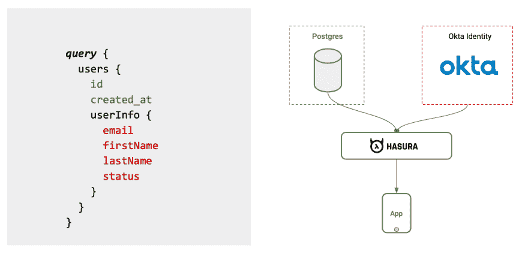
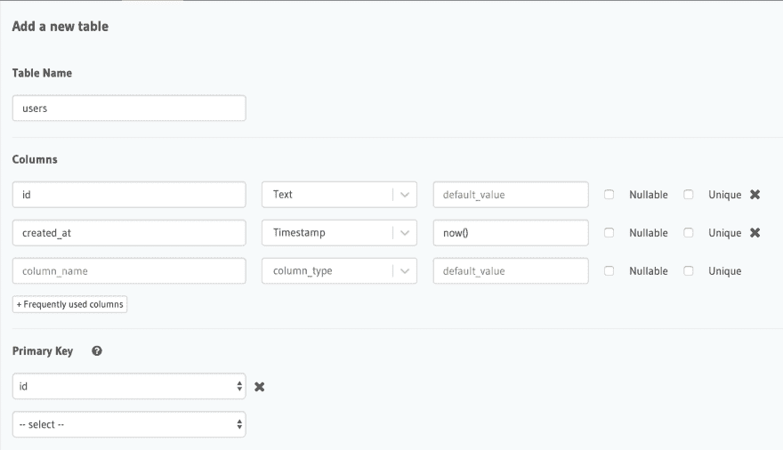
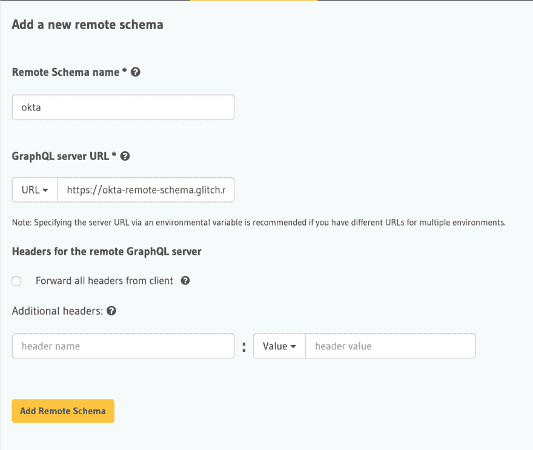
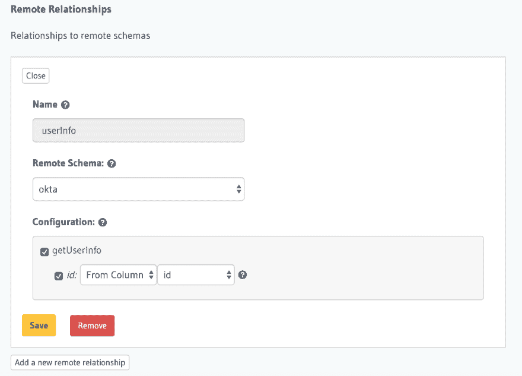

# 使用 Hasura 远程连接将 Okta 中的身份数据与 Postgres 连接起来

> 原文：<https://dev.to/hasurahq/join-identity-data-from-okta-with-postgres-using-hasura-remote-joins-3agj>

## TL；速度三角形定位法(dead reckoning)

使用 Hasura 远程连接将 Postgres 数据库中的数据与 Okta 中的用户数据连接起来。

这篇文章是我们的[远程连接](https://blog.hasura.io/remote-joins-a-graphql-api-to-join-database-and-other-data-sources/)(在预览版中可用)系列的一部分。Hasura 中的远程连接允许您跨表和远程数据源连接数据。如果你想在我们发布时得到通知，你可以在这里注册[。前往](https://hasura.io/remote-joins)[公关](https://github.com/hasura/graphql-engine/pull/2395)查看更多细节，阅读预览文件，并尝试一个你可以旋转的测试 Hasura 图像。跳到我们的[不和谐](https://discord.gg/hasura)或者评论 [github](https://github.com/hasura/graphql-engine) ，让我们知道你的想法！

[](https://res.cloudinary.com/practicaldev/image/fetch/s--91kEF6cm--/c_limit%2Cf_auto%2Cfl_progressive%2Cq_auto%2Cw_880/https://blog.hasura.io/conteimg/2019/08/okta-remote-joins.png)

[Okta](https://www.okta.com) 是一个完整的访问管理平台，通过单点登录、多因素身份验证、生命周期管理(供应)等提供安全的身份管理。在一个典型的应用程序中，Okta 是通过 API 连接应用程序、设备和用户的网关。

在这个例子中，我们将利用 [Okta 的 API](https://developer.okta.com/docs/reference/api/users/) 来获取用户的数据，并将它与 Postgres 中的用户 id 进行映射。

让我们在 Hasura 中创建一个名为`users`的新表，只有`id`和`created_at`列:

[](https://res.cloudinary.com/practicaldev/image/fetch/s--Uoz2Omje--/c_limit%2Cf_auto%2Cfl_progressive%2Cq_auto%2Cw_880/https://blog.hasura.io/conteimg/2019/08/create-table-users.png)

## 添加 Okta API 作为远程模式

为了能够通过 Hasura 查询 Okta 数据，需要使用 Hasura 控制台将其添加为`Remote Schema`。

### 部署自定义解析器

[](http://glitch.com/edit/#!/import/github/praveenweb/okta-remote-schema)

在 glitch 的`.env`文件中添加以下环境变量。

```
OKTA_API_KEY=xxx
OKTA_DOMAIN=xxx
PORT=3000 
```

*   通过访问[创建 API 令牌文档](https://developer.okta.com/docs/guides/create-an-api-token/overview/)获得 Okta API 密钥
*   将 API 键设置为`OKTA_API_KEY`环境变量。
*   通过访问以下[找到您的域名文档](https://developer.okta.com/docs/guides/find-your-domain/overview/)获得 Okta 域名
*   我们需要输入 Okta 域作为`OKTA_DOMAIN`环境变量。
*   这个自定义解析器用于接受用户的 id 作为参数，并将返回与该用户相关的数据。

从 Glitch 获取 GraphQL API 端点，并将其添加为远程模式。

[](https://res.cloudinary.com/practicaldev/image/fetch/s--UUz_qinG--/c_limit%2Cf_auto%2Cfl_progressive%2Cq_auto%2Cw_880/https://blog.hasura.io/conteimg/2019/08/okta-add-remote-schema.png)

现在让我们添加名为`userInfo`的远程关系

[](https://res.cloudinary.com/practicaldev/image/fetch/s--eETILTV7--/c_limit%2Cf_auto%2Cfl_progressive%2Cq_auto%2Cw_880/https://blog.hasura.io/conteimg/2019/08/okta-remote-relationship.png)

现在让我们在 Okta 上创建一个用户。为了简单起见，我们直接使用 API，而不是构建客户端应用程序。注意，您必须用上面生成的值替换 OKTA_API_KEY 和 OKTA_DOMAIN。此外，您必须在请求正文中添加个人资料详细信息。

```
curl -X POST \
  'https://hasura.okta.com/api/v1/users?activate=true' \
  -H 'Authorization: SSWS OKTA_API_KEY’ \
  -H 'Content-Type: application/json' \
  -H 'Host: OKTA_DOMAIN’ \
  -d '{
  "profile": {
    "firstName": "",
    "lastName": "",
    "email": "",
    "login": ""
  },
  "credentials": {
    "password" : { "value": "" }
  }
}' 
```

一旦在 Okta 上创建了一个用户，让我们将用户 id 添加到 Hasura 的`users`表中。

现在，在单个 API 调用中获取这些数据的 GraphQL 查询如下所示:

```
query {
  users {
    id
    created_at
    userInfo {
      email
      firstName
      lastName
      status
    }
  }
} 
```

注意，嵌套查询`userInfo`来自 Okta API，它将应用 users.id = userInfo.id 过滤器，从而只给出 Okta 中当前用户的数据。

查看我们在[远程加入系列](https://blog.hasura.io/tagged/remote-joins/)中的其他帖子。

远程连接打开了许多令人兴奋的用例，这些样板是探索可能性的简单例子。您可以派生原始示例来扩展应用程序需求的功能。