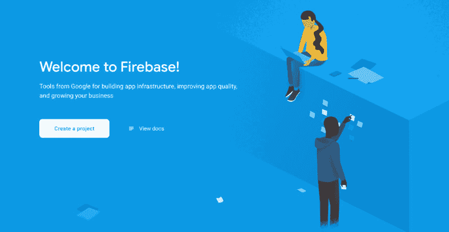
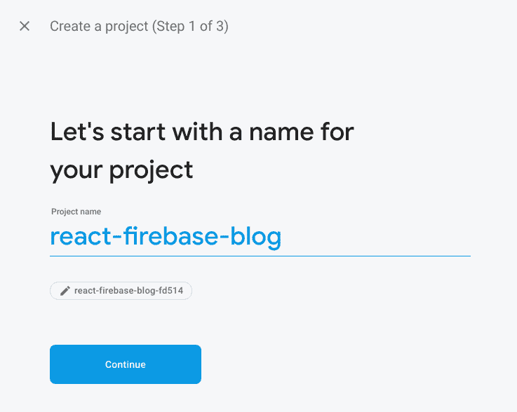
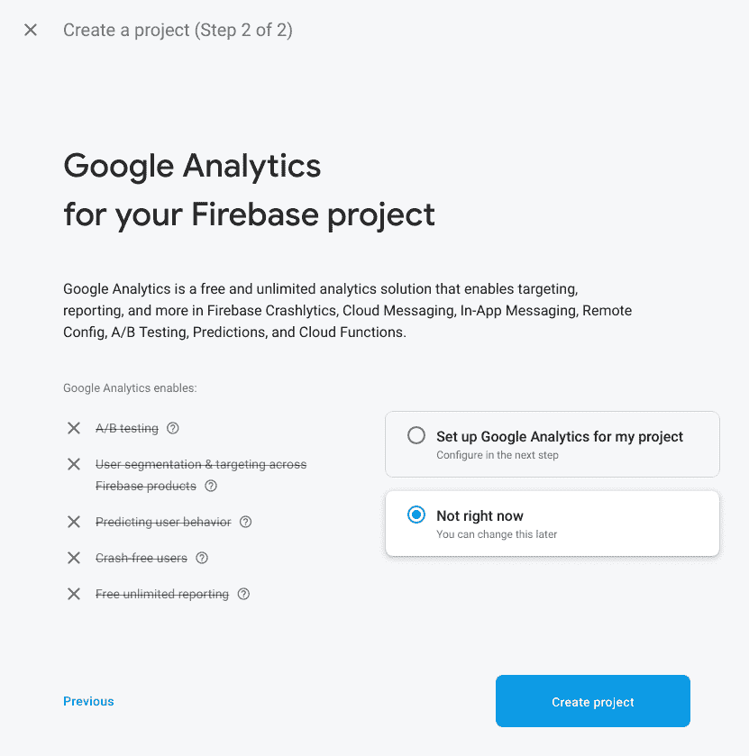
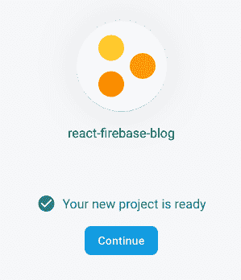
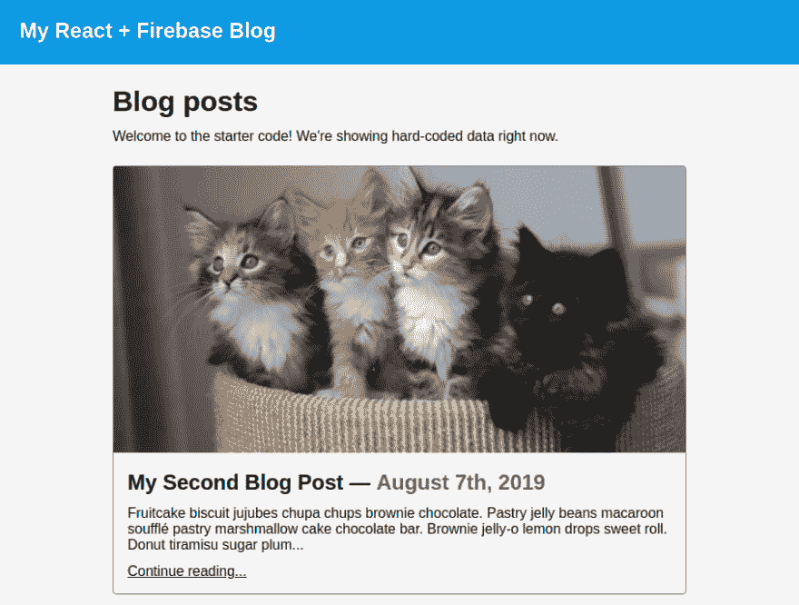
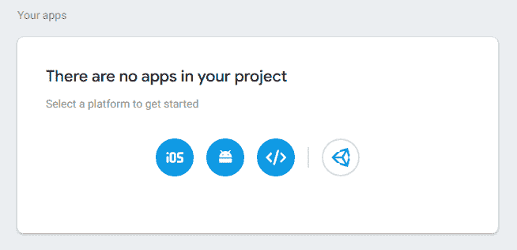
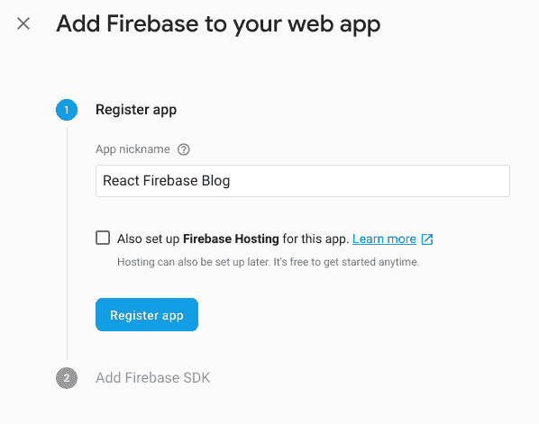
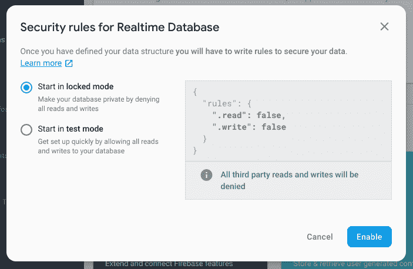
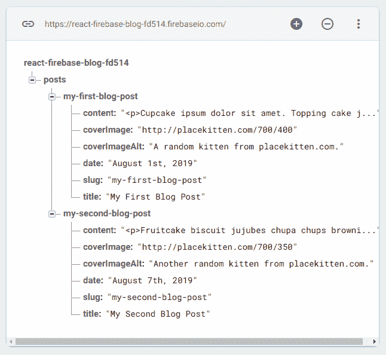

# 构建 React & Firebase 博客站点:第 1 部分

> 原文：<https://dev.to/ashleemboyer/build-a-react-firebase-blog-site-part-1-4gn0>

*这篇文章最初发表于[我的个人博客网站](https://ashleemboyer.com/react-firebase-blog-01)。*

欢迎光临！这是教你如何使用 React 和 Firebase 建立博客网站的系列文章中的第一篇。这一个可能是最长的，因为几乎没有什么事情要做来设置一切。

在这篇文章的最后，你将学会如何将你的应用程序连接到 Firebase，并从 Firebase 的实时数据库中提取一些数据。下一次，我们将开始用“创建 Post”特性来设置我们的 CRUD 函数。在那之后，我们将看看我们能做些什么来在前端创建一个接口，使得调用我们的 CRUD 函数和创建更有趣的函数变得容易。

准备好开始了吗？:)

## 目录

1.  注册 Firebase
2.  创建项目
3.  克隆启动代码
4.  将 Firebase 连接到应用程序
5.  向数据库添加数据
6.  从数据库中读取
7.  包扎

* * *

## 1。注册 Firebase

这个很简单！前往 [Firebase 的网站](https://firebase.google.com/)，点击“开始”按钮。页面看起来像这样:

[](https://res.cloudinary.com/practicaldev/image/fetch/s--zs_18Sy1--/c_limit%2Cf_auto%2Cfl_progressive%2Cq_auto%2Cw_880/https://firebasestorage.googleapis.com/v0/b/ashleemboyer-2018.appspot.com/o/images%252Freact-firebase-blog%252Fpart-01%252Ffirebase-home.png%3Falt%3Dmedia%26token%3D44402b1f-339f-4343-817d-952bc6c3bbe4)

如果您尚未登录，系统会提示您选择一个 Google 帐户。登录后，您可以创建项目。如果您是 Firebase 的新手，这个页面看起来会是这样的:

[](https://res.cloudinary.com/practicaldev/image/fetch/s--Bc4OfShE--/c_limit%2Cf_auto%2Cfl_progressive%2Cq_auto%2Cw_880/https://firebasestorage.googleapis.com/v0/b/ashleemboyer-2018.appspot.com/o/images%252Freact-firebase-blog%252Fpart-01%252Ffirebase-welcome.png%3Falt%3Dmedia%26token%3D8433b1fc-49ff-42a3-8bb1-21e52cb966be)

## 2。创建项目

单击“创建项目”按钮开始三步流程。首先，系统会提示您输入项目名称。我将我的项目命名为`react-firebase-blog`。如果你愿意，你可以改变你的项目 ID，但是使用自动生成的也可以。

[](https://res.cloudinary.com/practicaldev/image/fetch/s--rVjWYkXE--/c_limit%2Cf_auto%2Cfl_progressive%2Cq_auto%2Cw_880/https://firebasestorage.googleapis.com/v0/b/ashleemboyer-2018.appspot.com/o/images%252Freact-firebase-blog%252Fpart-01%252Fcreate-project-01.png%3Falt%3Dmedia%26token%3Dc238d4b6-3580-4f3d-9a92-4651cd01662d)

第 2 步询问我们是否要为该项目设置谷歌分析。我选择了“现在不行”。如果您选择此选项，流程将在此结束。否则，还有另一个步骤

[](https://res.cloudinary.com/practicaldev/image/fetch/s--gO7lfyyA--/c_limit%2Cf_auto%2Cfl_progressive%2Cq_auto%2Cw_880/https://firebasestorage.googleapis.com/v0/b/ashleemboyer-2018.appspot.com/o/images%252Freact-firebase-blog%252Fpart-01%252Fcreate-project-02.png%3Falt%3Dmedia%26token%3Dfb748ae2-44fb-4626-ada7-f2b31e73a510)

点击“创建项目”，你会被带到一个加载屏幕。当它说，“你的新项目准备好了，”点击“继续”按钮。

[](https://res.cloudinary.com/practicaldev/image/fetch/s--VYlfxMZF--/c_limit%2Cf_auto%2Cfl_progressive%2Cq_auto%2Cw_880/https://firebasestorage.googleapis.com/v0/b/ashleemboyer-2018.appspot.com/o/images%252Freact-firebase-blog%252Fpart-01%252Fcreate-project-ready.png%3Falt%3Dmedia%26token%3D3f419470-28e2-4a07-8b36-92b32f8a5b3a)

## 3。克隆启动代码

您可以通过在终端中运行以下命令来克隆启动代码:

```
git clone https://github.com/ashleemboyer/react-firebase-blog-starter.git 
```

<svg width="20px" height="20px" viewBox="0 0 24 24" class="highlight-action crayons-icon highlight-action--fullscreen-on"><title>Enter fullscreen mode</title></svg> <svg width="20px" height="20px" viewBox="0 0 24 24" class="highlight-action crayons-icon highlight-action--fullscreen-off"><title>Exit fullscreen mode</title></svg>

让我们看看我们有什么！进入`react-firebase-blog-starter`目录，运行`npm install`，然后运行`npm run start`，让项目开始运行。以下是您应该看到的内容:

[](https://res.cloudinary.com/practicaldev/image/fetch/s--LOz0a96J--/c_limit%2Cf_auto%2Cfl_progressive%2Cq_auto%2Cw_880/https://firebasestorage.googleapis.com/v0/b/ashleemboyer-2018.appspot.com/o/images%252Freact-firebase-blog%252Fpart-01%252Fstarter-site.png%3Falt%3Dmedia%26token%3Da0e21d1e-a951-4871-a98f-a9c42f588697)

万岁！继续探索这个项目。我将重点介绍几个领域供您开始。

### `src/App.js`

我们有 4 个`Routes`:主页、404 和另一个用于处理博客文章的 slugs(又名 URL)。您可能想知道为什么没有一种方法来处理不匹配的路径。接得好！我们实际上在`Post`组件(`src/pages/post.js`)中处理它。让我们继续看那一个。

### `src/pages/post.js`

因为我们在`src/App.js`(来自`react-router-dom`)中使用路由器，我们在`Route`元素中命名的组件将有一个 [`match`](https://reacttraining.com/react-router/web/api/match) 传递到它们的道具中。我们可以从带有`match.params.slug`的 URL 栏中获取帖子的 slug，然后将其与我们在网站上支持的 slug 列表进行比较。现在这些都被硬编码到一个`postSlugs`变量中。如果 slug 不存在，我们返回一个`Redirect`到我们的 404 页面。否则，我们将显示正确的帖子。

### `src/pages/home.js`

首先，您将调用`blogPosts`变量。我们正在对我们的帖子进行硬编码，直到我们将应用程序连接到 Firebase。这个页面所做的就是在`blogPosts`数组中为每篇博客文章返回一个`section`元素。在这个系列中，您不需要在`return`语句之后做任何修改。

## 4。将 Firebase 连接到应用程序

首先，通过运行项目根目录下的`npm install firebase`来安装 [`firebase`](https://www.npmjs.com/package/firebase) 包。

现在，在项目的`src`目录中创建一个 JavaScript 文件，并将其命名为`firebase.js`。这是我们定义 Firebase 配置和初始化 Firebase 对象的地方。

在我们向这个文件添加一些代码之前，让我们先获取 Firebase 项目所需的配置数据。通过点击左侧工具条中的设置齿轮并从菜单中选择“项目设置”,进入 Firebase 项目设置。向下滚动到页面的“您的应用”部分。大概在底部。它应该说，“你的项目中没有应用程序。”

[](https://res.cloudinary.com/practicaldev/image/fetch/s--2B1buRM---/c_limit%2Cf_auto%2Cfl_progressive%2Cq_auto%2Cw_880/https://firebasestorage.googleapis.com/v0/b/ashleemboyer-2018.appspot.com/o/images%252Freact-firebase-blog%252Fpart-01%252Fproject-settings.png%3Falt%3Dmedia%26token%3D63cb601f-0eb7-49eb-a7c9-dbb5f6bf53ac)

点击类似`</>`的圆圈，将 Firebase 添加到 web 应用程序中。系统会提示您输入应用程序的昵称。我叫我的`React Firebase Blog`。

[](https://res.cloudinary.com/practicaldev/image/fetch/s--d9DtK04p--/c_limit%2Cf_auto%2Cfl_progressive%2Cq_auto%2Cw_880/https://firebasestorage.googleapis.com/v0/b/ashleemboyer-2018.appspot.com/o/images%252Freact-firebase-blog%252Fpart-01%252Fapp-nickname.png%3Falt%3Dmedia%26token%3D513f98b4-37ef-42aa-b45f-f793e5e37c6c)

点击“Register app”按钮，页面加载完成后，您会看到一些 HTML 代码，其中有一个名为`firebaseConfig`的变量。从该变量中复制 JSON 属性，并保存在我们的`firebase.json`文件中。单击“继续到控制台”按钮返回到您的项目设置。如果您丢失了之前复制的 JSON 属性，您可以在这里找到它们，在“您的应用程序”部分，现在已经列出了我们的应用程序。

让我们回到我们的`firebase.js`。准备好您的配置数据，并将其插入以下代码:

```
import firebase from "firebase/app";
import database from "firebase/database";

const config = {
  apiKey: "<YOUR-API-KEY>",
  authDomain: "<YOUR-AUTH-DOMAIN>",
  databaseURL: "<YOUR-DATABASE-URL>",
  projectId: "<YOUR-PROJECT-ID>",
  storageBucket: "<YOUR-STORAGE-BUCKET>",
  messagingSenderId: "<YOUR-MESSAGE-SENDER-ID>",
  appId: "<YOUR-APP-ID>",
};

let firebaseCache;

export const getFirebase = () => {
  if (firebaseCache) {
    return firebaseCache;
  }

  firebase.initializeApp(config);
  firebaseCache = firebase;
  return firebase;
}; 
```

<svg width="20px" height="20px" viewBox="0 0 24 24" class="highlight-action crayons-icon highlight-action--fullscreen-on"><title>Enter fullscreen mode</title></svg> <svg width="20px" height="20px" viewBox="0 0 24 24" class="highlight-action crayons-icon highlight-action--fullscreen-off"><title>Exit fullscreen mode</title></svg>

`getFirebase()`函数将确保我们只调用`initializeApp`一次。

## 5。向数据库添加数据

我们不能从我们的数据库中读取任何数据，直到我们实际添加到它！回到你的 Firebase 项目，点击侧边栏“开发”标题下的“数据库”选项。你必须向下滚动页面一点，直到你找到“实时数据库”部分。

[](https://res.cloudinary.com/practicaldev/image/fetch/s--Y9N3yvAG--/c_limit%2Cf_auto%2Cfl_progressive%2Cq_auto%2Cw_880/https://firebasestorage.googleapis.com/v0/b/ashleemboyer-2018.appspot.com/o/images%252Freact-firebase-blog%252Fpart-01%252Frealtime-database.png%3Falt%3Dmedia%26token%3D2bc78aa3-e902-46fd-a775-95042cd5cc0e)

单击此部分中的“创建数据库”按钮。您将看到一个模式出现，询问您数据库的安全规则。

[](https://res.cloudinary.com/practicaldev/image/fetch/s--PK63MAZd--/c_limit%2Cf_auto%2Cfl_progressive%2Cq_auto%2Cw_880/https://firebasestorage.googleapis.com/v0/b/ashleemboyer-2018.appspot.com/o/images%252Freact-firebase-blog%252Fpart-01%252Fsecurity-rules.png%3Falt%3Dmedia%26token%3Dfbd9e6fc-63ac-41d3-b8c9-779a9224c598)

选择“在**测试模式**下启动”并点击“启用”按钮。你的数据库将是空的，读起来像:

```
<YOUR-PROJECT-ID>: null 
```

<svg width="20px" height="20px" viewBox="0 0 24 24" class="highlight-action crayons-icon highlight-action--fullscreen-on"><title>Enter fullscreen mode</title></svg> <svg width="20px" height="20px" viewBox="0 0 24 24" class="highlight-action crayons-icon highlight-action--fullscreen-off"><title>Exit fullscreen mode</title></svg>

如果您还不知道，实时数据库只是一个 JSON 对象。你可以在这里阅读更多关于那个[的内容。](https://firebase.google.com/docs/database)

最快的入门方法是使用 JSON 文件导入数据。我也为你提供这个，以防你正在密切关注，并希望有和我这里一样的东西展示。您可以在起始项目的根目录中找到该文件。点击三点菜单并选择“导入 JSON”来上传文件。浏览您的文件，然后单击“导入”按钮。

现在您应该有一些可以扩展和探索的数据属性了！

[](https://res.cloudinary.com/practicaldev/image/fetch/s--WhXqSPyp--/c_limit%2Cf_auto%2Cfl_progressive%2Cq_auto%2Cw_880/https://firebasestorage.googleapis.com/v0/b/ashleemboyer-2018.appspot.com/o/images%252Freact-firebase-blog%252Fpart-01%252Fdata.png%3Falt%3Dmedia%26token%3D70461f67-df46-41b4-b15a-c53fc343d3b4)

## 6。从数据库中读取

终于！我们期待已久的时刻。让我们去`src/home.js`看看我们是否能从数据库中得到一些东西！

首先，在文件的顶部添加一些导入:

```
// You only need to add the `{ useState }` portion here.
import React, { useState } from "react";

// This is new.
import { getFirebase } from "../firebase"; 
```

<svg width="20px" height="20px" viewBox="0 0 24 24" class="highlight-action crayons-icon highlight-action--fullscreen-on"><title>Enter fullscreen mode</title></svg> <svg width="20px" height="20px" viewBox="0 0 24 24" class="highlight-action crayons-icon highlight-action--fullscreen-off"><title>Exit fullscreen mode</title></svg>

现在，让我们让`blogPosts`进入一种状态，并尝试从数据库中读取它们。你可以在这里阅读更多关于`useState`钩住[的内容。我们还将添加一个`loading`州，这样我们可以轻松地做两件事:](https://reactjs.org/docs/hooks-state.html)

1.  确保我们只调用`getFirebase`一次
2.  当我们等待数据时，向用户显示加载屏幕

用以下代码替换`blogPosts`常量:

```
const [loading, setLoading] = useState(true);
const [blogPosts, setBlogPosts] = useState([]);

if (loading && !blogPosts.length) {
  getFirebase()
    .database()
    .ref("/posts")
    .orderByChild("date")
    .once("value")
    .then(snapshot => {
      let posts = [];
      const snapshotVal = snapshot.val();
      for (let slug in snapshotVal) {
        posts.push(snapshotVal[slug]);
      }

      const newestFirst = posts.reverse();
      setBlogPosts(newestFirst);
      setLoading(false);
    });
}

if (loading) {
  return <h1>Loading...</h1>; } 
```

<svg width="20px" height="20px" viewBox="0 0 24 24" class="highlight-action crayons-icon highlight-action--fullscreen-on"><title>Enter fullscreen mode</title></svg> <svg width="20px" height="20px" viewBox="0 0 24 24" class="highlight-action crayons-icon highlight-action--fullscreen-off"><title>Exit fullscreen mode</title></svg>

Tada！你应该看看我们之前看到的一样的东西。🎉

## 7。包扎

这里有很多东西。如果您有任何问题或担心，请[给我发电子邮件](//mailto:hello@ashleemboyer.com)或[在 Twitter 上给我发消息](https://twitter.com/ashleemboyer)！如果你感到困难或不知所措，我会尽力帮助你。请继续关注明天的帖子，在那里我们将介绍如何为我们新的、别致的博客网站编写 CRUD 函数！如果你觉得奇怪，想在那之前尝试一下，我鼓励你看看 [Firebase 文档](https://firebase.google.com/docs/database/web/start)。

* * *

你知道我有时事通讯吗？📬

如果你想在我发布新的博客帖子或宣布重大项目时得到通知，请联系 https://ashleemboyer.com/newsletter。