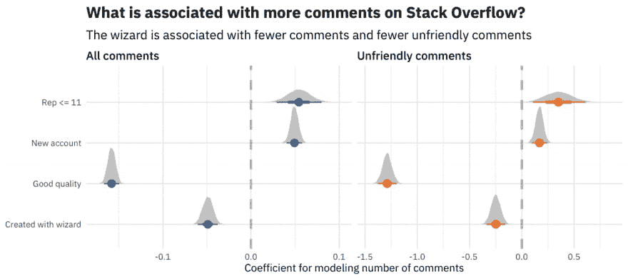

# 堆栈溢出正在进行的工作:改善所有用户的反馈

> 原文：<https://dev.to/stackoverflow/what-s-in-the-works-at-stack-overflow-improving-feedback-for-all-users-2ik3>

大家好，我是负责开发 Stack Overflow 旗舰产品 public Q&A 的产品经理。上周，我[在我们的博客](%5Bhttps://stackoverflow.blog/2019/08/20/upcoming-on-stack-overflow/%5D(https://stackoverflow.blog/2019/08/20/upcoming-on-stack-overflow/))上分享了我们正在进行的工作及其原因。

以更好地满足越来越多开发人员需求的方式构建 Stack Overflow 对我和我的团队来说很重要。我在这里交叉发布一个缩写版本，因为我想听听你对我们的反馈。

## 我们今天在哪里

去年，我们启动了一项计划[让堆栈溢出更受欢迎](https://stackoverflow.blog/2018/04/26/stack-overflow-isnt-very-welcoming-its-time-for-that-to-change/)。在推出新的[行为准则](https://stackoverflow.com/conduct)、改进的[提问体验](https://meta.stackoverflow.com/questions/381671/the-ask-question-wizard-is-live)和其他几项变化后，我们与许多 Stack Overflow 用户交谈，听取他们使用该网站的更多个人体验。通过这些对话，我们了解到质量保证体系的局限性继续创造着我们想要阻止的环境。当他们的问题被关闭或否决时，需要帮助解决编码问题的人会感到受到攻击，而那些监管网站内容的人会因为做了系统要求他们做的事情而感到受到责备。

当作为每个人互动基础的软件不能促进这一点时，我们仅仅要求人们友好或改变他们的行为是不够的。这就是为什么我们正在寻找方法来振兴核心问答系统的工作方式。

## 我们现在正在做的事情

今天，[我的团队的](https://stackoverflow.blog/2019/08/20/meet-the-public-qa-team/)重点是这些计划:

1.  系统如何传递反馈
2.  用我们的评论系统解决问题
3.  让一个简单的提问经验对每个人都有用

### 改善反馈

正如我们的公共问答主管 Sara 在她最近的博客文章中提到的[，当反馈堆积如山时，很难不针对个人，不管它有多有建设性。不幸的是，这种势不可挡的堆积正是提出不完美问题的用户所面临的。](https://stackoverflow.blog/2019/07/18/building-community-inclusivity-stack-overflow/)

我们改善用户反馈循环的第一个方法是重新设计贴子。如果你遇到了一个重复的问题或封闭的问题，你可能已经看到了张贴通知。这些是浅黄色的信息横幅，有时会出现在问题上。对于今天提问的人来说，如果你的问题是封闭的，那么私下针对你的反馈将会与任何查看你的问题的人公开分享。

以下是我们对所有张贴通知的整体重新设计将优先考虑的内容:

*   向帖子作者提供改进的私人反馈
*   不要让用户在现场管理内容
*   为大多数公众观众提供可操作的、可理解的信息

在致力于更新帖子通知的同时，我们还在探索如何让我们的问题关闭工作流和审核队列更好地为经验丰富的版主、技术专家和新提问者提供反馈和内容管理。

### “他们告诉我不要看评论……”

对于栈溢出的注释部分并不总是服务于它最初的目的(促进澄清问题以提高问题质量)，没有人会感到惊讶。评论可能会分散注意力，[完全有害的](https://stackoverflow.blog/2018/07/10/welcome-wagon-classifying-comments-on-stack-overflow/)，纯粹的垃圾邮件，以及介于两者之间的一切。

我们鼓励人们标记不属于的内容，我们的版主做了令人难以置信的工作来审查一切。但有很多机会可以减轻版主和用户的负担，他们可以通过让每个人都更喜欢使用堆栈溢出的方式来标记不适当的内容。

例如，我们现在正在探索的一些事情:

*   更好地区分“回答”和“评论”动作(因为大量有用的“不回答”标志表明界面有问题)。
*   减少无用评论数量的方法，这些评论可能会在第一时间被删除。

### 为大家改进了提问指导

几个月前，我们[推出了堆栈溢出的提问向导](https://meta.stackoverflow.com/questions/381671/the-ask-question-wizard-is-live)。新的体验默认为低信誉用户使用引导模式来表达他们的问题。到目前为止，[我们对它如何帮助用户提出更好的问题感到满意](https://stackoverflow.blog/2019/08/22/impact-of-ask-question-wizard/)，并因此在网站上有更好的体验。事实上，我们很高兴我们的下一次迭代集中于将引导模式的各个方面结合到每个人的提问形式中。

我们仍处于早期阶段，但目前我们正在进行的一些更改包括:

*   对第一次提问者的前期指导
*   为提问后发生的事情设定预期
*   改进了起草问题时的“如何提问”指南
*   通过将几十条验证消息整合到一个“审阅”界面中，更容易提高问题质量

我们很高兴开始着手这些改变，因为这给了我们一个为每个人创造更好的用户体验的机会。我们越来越希望寻找方法来简化我们的平台，以无缝、直观地满足所有来到 Stack Overflow 寻找和分享知识的用户的需求。

## 你怎么看？

每个月都有成千上万的用户来到 Stack Overflow，并以如此多独特的方式依赖和贡献于这个网站和社区。如果没有像您这样的开发人员的贡献，堆栈溢出就不会是现在这个样子。

你觉得这个方向怎么样？什么会让你更容易使用和参与堆栈溢出？你今天最大的挫折是什么？