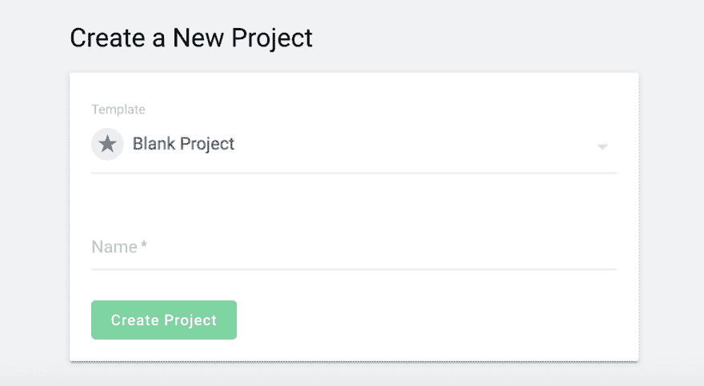
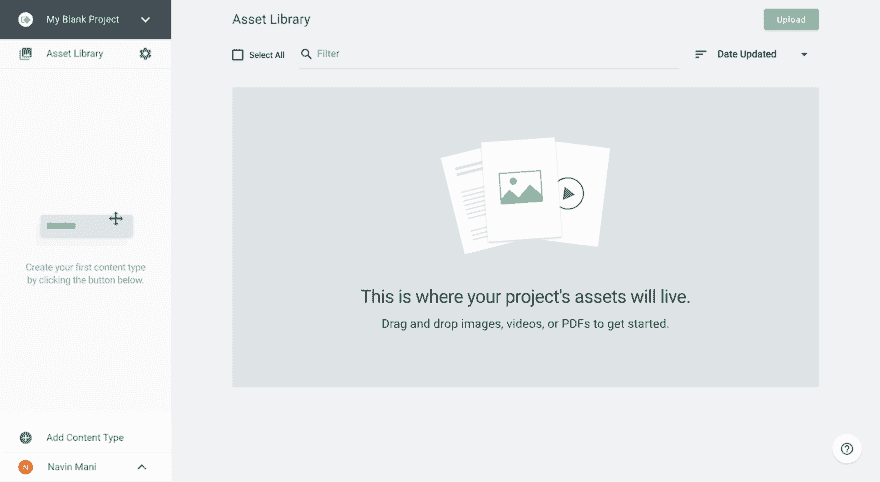
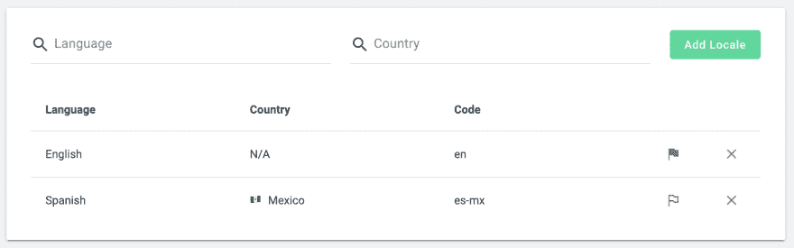
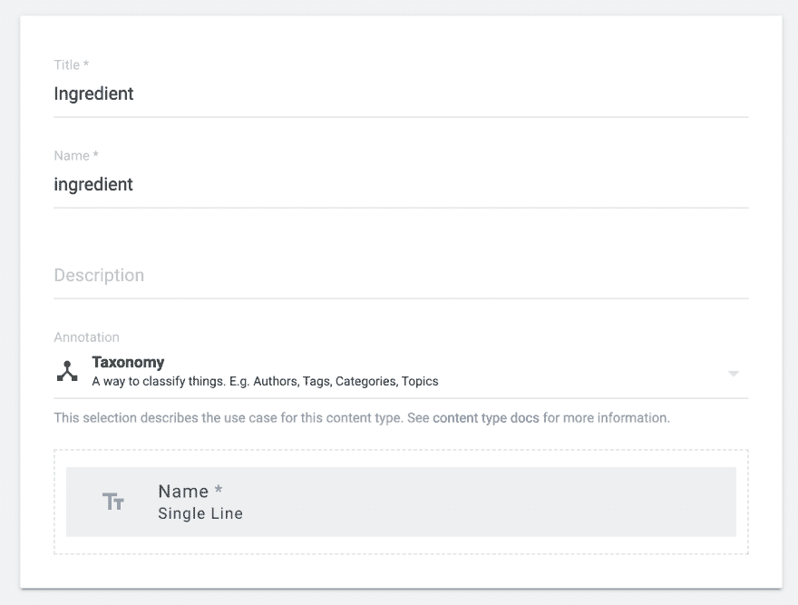
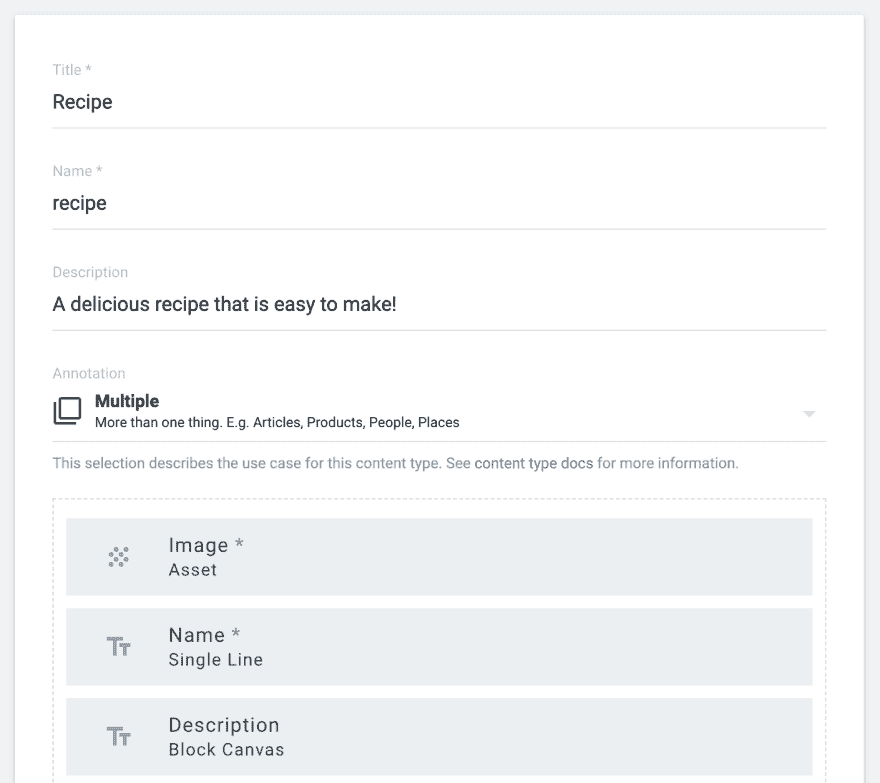
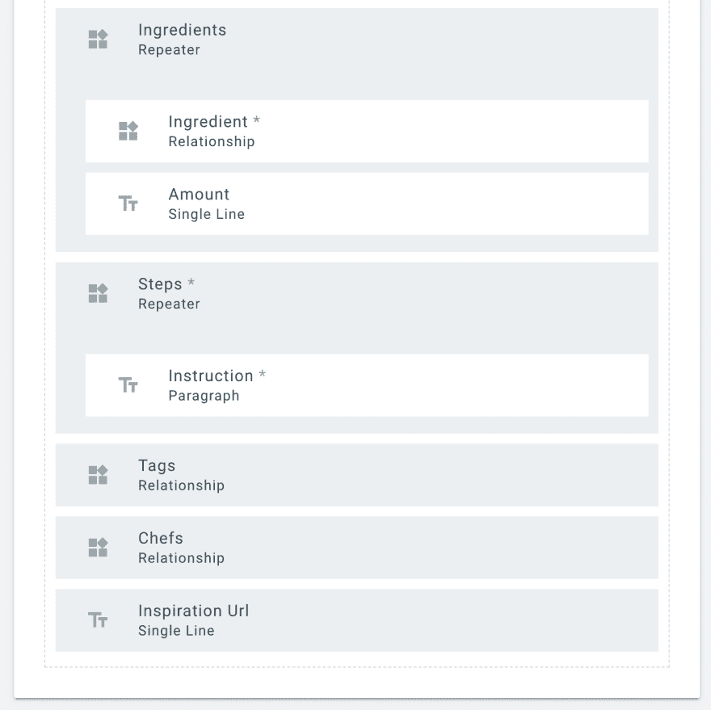
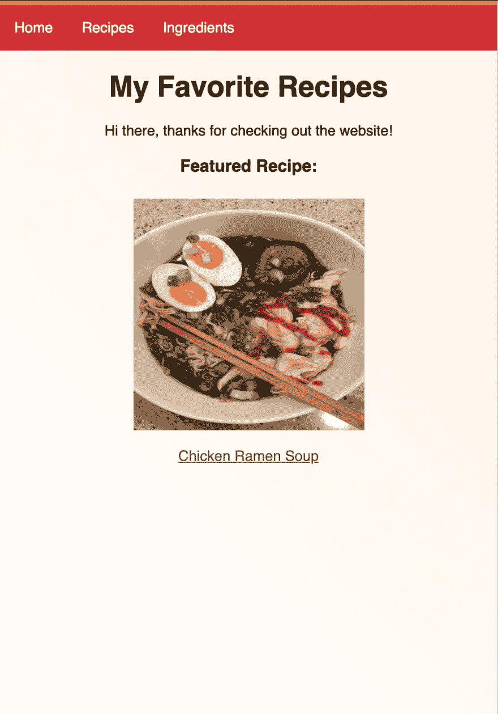
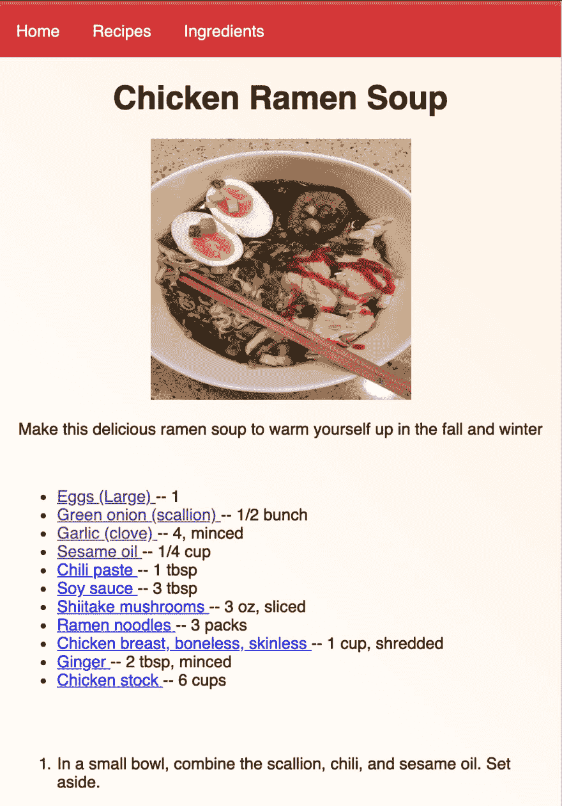
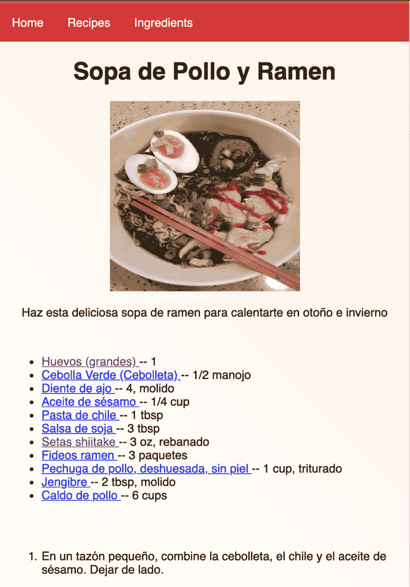

# 用一个食谱网站来增加它的味道

> 原文：<https://dev.to/takeshape/spicing-it-up-with-a-recipes-site-20m3>

制作自己的网站对新手和专业网站开发者来说都是一项令人生畏的任务。使用 TakeShape 的示例项目来开始使这个过程变得快速而简单。我的项目想法很简单:我想要一个网站，在那里我可以展示所有我喜欢的食谱。

(声明一下，我其实没什么厨艺；以下食谱来自网络！让我们开始做饭吧！

## take shape 项目

在
[【app.takeshape.io/signup】](http://app.takeshape.io/signup)注册账户。通过 TakeShape 的 G-Suite 集成，这一过程只需点击两次鼠标即可完成。

我们将使用空白项目模板。

[](https://res.cloudinary.com/practicaldev/image/fetch/s--jfAqdkMm--/c_limit%2Cf_auto%2Cfl_progressive%2Cq_auto%2Cw_880/https://thepracticaldev.s3.amazonaws.com/i/dzv9yafazgaoh8aacx2i.png)

### 资产📸

我们可以通过点击导航栏顶部的“资源库”来浏览图片、视频和其他资源(目前为空白)。我们可以通过简单地从桌面拖动或点击右上角的“上传”来上传更多资产。
[T3】](https://res.cloudinary.com/practicaldev/image/fetch/s--3jWXWidI--/c_limit%2Cf_auto%2Cfl_progressive%2Cq_auto%2Cw_880/https://thepracticaldev.s3.amazonaws.com/i/h5w5wugyq6iha5jsh9w0.png)

### 本地化🌍✈️

通过 TakeShape 的本地化，支持不同的语言很容易。导航到项目设置并滚动到本地化部分。我添加了西班牙语— 🇲🇽Mexico，看起来是这样的:
[](https://res.cloudinary.com/practicaldev/image/fetch/s--2-HNJwK6--/c_limit%2Cf_auto%2Cfl_progressive%2Cq_auto%2Cw_880/https://thepracticaldev.s3.amazonaws.com/i/rqcjas943rogyb2jc6fi.png)

### 设计我们的内容类型📄👨‍🔬

在项目屏幕的左下方，单击“添加内容类型”
通常最好想象一下我们的内容类型之间的关系。例如，一个食谱有一个名字，一个描述，配料和步骤。
一种配料只有一个名字，可能还有一个图像。

> 当创建内容类型时，从最简单的内容开始，逐步增加到最复杂的内容。

**配料**
[](https://res.cloudinary.com/practicaldev/image/fetch/s--80NaCtFa--/c_limit%2Cf_auto%2Cfl_progressive%2Cq_auto%2Cw_880/https://thepracticaldev.s3.amazonaws.com/i/ucwx97yvit7hs1qikibd.png)

我已经将我的配料设置为一个简单的分类。我们需要的关于每种成分的唯一信息是它的名称。每种成分的用量以及如何处理都是具体到每种食谱的！我还勾选了食谱名称的“启用本地化”。这将允许我们为不同的本地化指定替代文本。
在创建了一堆配料之后，我的列表现在看起来是这样的:
[](https://res.cloudinary.com/practicaldev/image/fetch/s--6g7rA9N7--/c_limit%2Cf_auto%2Cfl_progressive%2Cq_auto%2Cw_880/https://thepracticaldev.s3.amazonaws.com/i/sbj5sqqyj3g1azyr48du.png)

食谱
拥有食谱内容类型是我们食谱网站的核心。
[](https://res.cloudinary.com/practicaldev/image/fetch/s--C1OctIhy--/c_limit%2Cf_auto%2Cfl_progressive%2Cq_auto%2Cw_880/https://thepracticaldev.s3.amazonaws.com/i/m76f92pbxszqlml08ab9.png)
[T10】](https://res.cloudinary.com/practicaldev/image/fetch/s--vhby52OZ--/c_limit%2Cf_auto%2Cfl_progressive%2Cq_auto%2Cw_880/https://thepracticaldev.s3.amazonaws.com/i/6vvlpcg7qyqzkmk7eu1h.png)

内容关系形式非常强大。你马上就会看到我们是如何使用成分关系的。

## 我们的开发环境💻✨

只需几个步骤，我们就会有一个准备好的项目！

**克隆并复制 TakeShape 空白样本项目**
`git clone https://github.com/takeshape/takeshape-samples.git takeshape-samples`
`mkdir my-recipes-project && cd my-recipes-project`
`cp -r ../takeshape-samples/blank-project/ .`

**安装依赖项**
`npm install`

**链接 TakeShape 项目**
`npx tsg init`
按照提示使用您的 TakeShape 用户名和密码登录。

**生成并查看您的站点**
`npm run start`
在浏览器中导航到 [localhost:5000](http://localhost:5000/) 应该会显示您的站点！

现在你会看到我们有一个来自 TakeShape 的基本的空白项目。我已经取出了大部分的样本代码，只留下了样板文件。
我推荐使用 [VSCode](https://code.visualstudio.com/) 作为你的编辑器。我特别喜欢在其中从事 GraphQL 项目，因为它支持扩展。要利用 GraphQL 语法突出显示，请安装“GraphQL 语言支持”扩展，方法是转到 VSCode 中的代码→首选项→扩展，然后搜索“graphql”。TakeShape 项目支持使用 [graphqlconfig](https://github.com/prisma/graphql-config) 的任何编辑器或插件突出显示 GraphQL 语法。

### tsg.yml 配置

如果你以前从未使用过 tsg.yml，看看一些示例和[文档](https://www.takeshape.io/docs/tsg-yml/)。
这里是我的 tsg.yml 的食谱路线的预览。查看完整文件[此处](https://github.com/panzer/takeshape-recipes/blob/master/tsg.yml)T5】

```
recipe:
    path: /recipe/:name/
    template: pages/recipes/individual.html
    paginate:
      pageSize: 4
      path: /recipe/page-:num/
      firstPage: /recipe/
      template: pages/recipes/landing.html
      data: data/recipes.graphql
      itemName: recipe 
```

### 地区支持

只需几行代码，我们就有了地区支持:

```
locales: 
    en:
        pathPrefix: ''
        dates:
            tz: America/New_York
            format: LLL

    es-mx:
        pathPrefix: 'es'
        dates:
            tz: America/Mexico_City
            format: LLL 
```

### GraphQL 数据文件🔗

建立我们的。在我们的代码编辑器中，或者通过使用 TakeShape 项目中的 API Explorer，graphql 文件非常容易自动完成。确保包含我们将路由到的类型的 _id。下面是我们的模板/数据/菜谱. graphql 的样子:

```
query {
  getRecipeList {
    items {
      name
      descriptionHtml
      image {
        path
      }
      ingredients {
        amount
        ingredient {
          _id
          name
        }
      }
      steps {
        instruction
      }
      inspirationUrl
      chefs {
        _id
        name
      }
    }
  }
} 
```

## 提示和窍门

如果您决定在开发过程中更改您的内容模型(添加、编辑或删除字段)，您将需要刷新您的开发环境来了解它们。这不仅有助于自动完成 GraphQL，静态站点生成器还需要知道您的内容类型！
只需运行 npx tsg 模式，从您的项目中获取最新的[模式](https://graphql.org/learn/schema/)。您可能需要重新打开 VSCode 以使自动完成功能再次正常工作。

## 演示时间！

[](https://res.cloudinary.com/practicaldev/image/fetch/s--aPEyvDxF--/c_limit%2Cf_auto%2Cfl_progressive%2Cq_auto%2Cw_880/https://thepracticaldev.s3.amazonaws.com/i/67ughqkj7ay2qf0bna3g.png)
[T6】](https://res.cloudinary.com/practicaldev/image/fetch/s--qpqXuc6m--/c_limit%2Cf_auto%2Cfl_progressive%2Cq_auto%2Cw_880/https://thepracticaldev.s3.amazonaws.com/i/2nv5nraleo0kud6089j1.png)

和简单的区域设置支持！
[T3】](https://res.cloudinary.com/practicaldev/image/fetch/s--X_dnTXkS--/c_limit%2Cf_auto%2Cfl_progressive%2Cq_auto%2Cw_880/https://thepracticaldev.s3.amazonaws.com/i/pi2xy8i2g0splv7xe6c0.png)

在这么短的时间内，我为我的食谱建了一个漂亮的网站，并开始运行。从这里开始，可能性是无穷的。我们很想看看你们用这个模板创建的网站！

## 看看吧，在 GitHub 上投稿

自己看看代码，改变一些东西，让它变得更好！如果你愿意，提交一个拉取请求！github.com/panzer/takeshape-recipes
T2