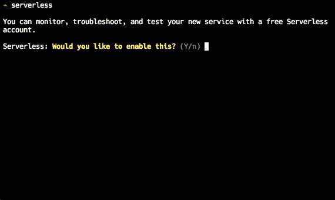

# 在 2 分钟内设置对现有无服务器项目的监控

> 原文：<https://dev.to/serverlessarticles/setup-monitoring-for-existing-serverless-projects-in-2-minutes-4ldc>

使用无服务器框架和 lambda 的挑战之一是如何监控你的软件。有各种各样的解决方案，但是几乎所有的都需要时间和工作来测试你的代码库。今天，我将向您展示如何在 2 分钟内，通过零测试，将监控添加到您现有的无服务器项目中。

首先，确保在包含无服务器项目的目录中打开终端。然后不带任何参数运行`serverless`命令。然后，您将看到一组交互式提示来配置您的服务进行监控！创建一个帐户，它会为你处理其余的。

然后运行`serverless deploy`在启用监控的情况下重新部署您的项目。之后，您可以通过运行`serverless dashboard`打开服务的监控仪表板。