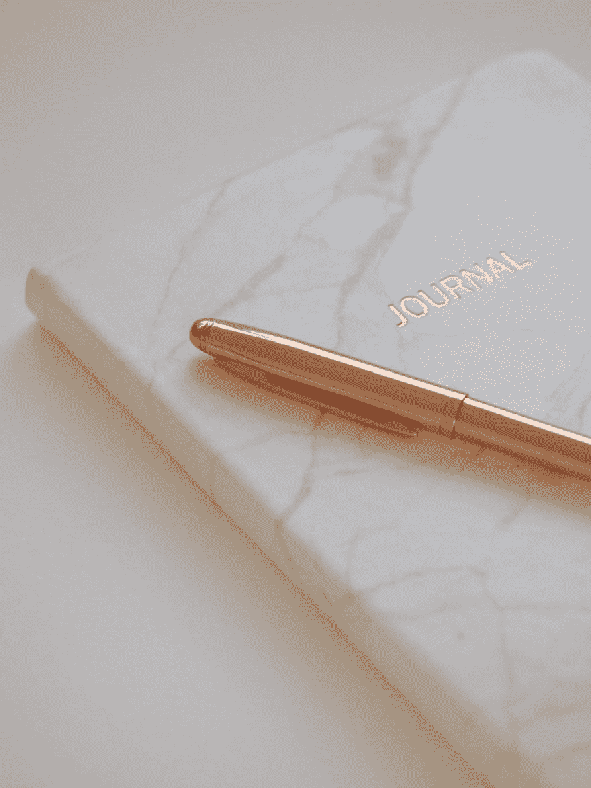
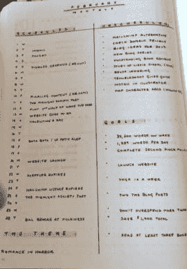
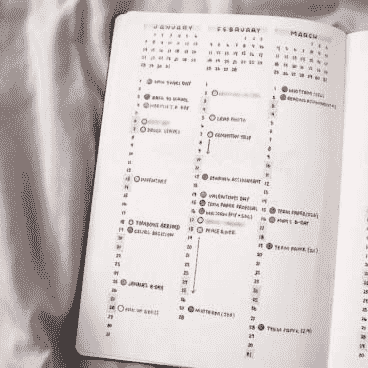

# 开始写子弹日记

> 原文：<https://dev.to/jmspace/start-a-bullet-journal-145o>

### **什么是子弹杂志？**

> 虽然子弹日记确实需要一个笔记本，但它实际上是一种方法论。最好将其描述为伪装成生产力系统的正念练习。它旨在帮助你组织你的**，同时你仍然意识到你的* ***为什么*** *。子弹杂志的目标是帮助其从业者(子弹记者)过有目的的生活，富有成效和有意义的生活。**
> 
>  **—赖德·卡罗尔**

 *换句话说，它是一个完整保存你大脑的笔记本。你不再需要记住你想记住的东西。只记得记得写下来。它帮助你将任务纳入一个有组织的管理系统。

#### **是给谁的？**

任何人都可以启动和使用这个系统。作家、学生、工程师、企业主、有目标的人等等。这是使用数字工具进行规划的一个很好的替代方法。它给了你一个远离电话或电脑，真正计划好一个月或一天的理由。

<figure> 

<figcaption>照片由[毛绒设计工作室](https://unsplash.com/@plushdesignstudio?utm_source=unsplash&utm_medium=referral&utm_content=creditCopyText)上 [Unsplash](https://unsplash.com/search/photos/bullet-journal?utm_source=unsplash&utm_medium=referral&utm_content=creditCopyText)</figcaption>

</figure>

### 如何开始一个子弹日记？

开始写子弹日记可能会令人生畏。你看到所有的复杂和创造性都展现在那里，然后说，“我不能这么做。”但没那么复杂。比你想象的简单。只是一支笔，一个笔记本，还有你的任务和事件。

#### **钢笔和笔记本**

如果你家里有笔记本，那就用它吧。如果你有钱，去买一个新的笔记本，那就去买吧。见鬼，开始的时候用纸就行了。(这个可能不适合你。)一支笔，加油，每个人家里都有一支笔。用你找到的或者经常用的就行了。

大多数子弹日记笔记本是网格点纸。这有助于扩展，帮助页面感觉有限的线条纸。它为制作图表或图形提供了更多的空间。它还允许你把信息放在页面上的任何地方，而不觉得有义务把它放在一行。

一旦你知道子弹日志是一个你想保留的系统，你可以投资一个更昂贵的日志或不。沃尔玛和迈克尔斯出售质量好、价格在 10 美元以下的点阵、空白和划线笔记本。

#### **历法**

日历有助于你创建子弹日记。当你做每月日志和每年日志时，你需要知道当月有多少天，以及它们是星期几。你可以使用纸质日历，也可以使用手机上的日历。

#### **打开第一页**

做个索引。我很确定你不会用它，但是如果你用了，你就有了。我甚至懒得做一个。翻到第三或第四页。这是它开始的地方。我从来没有真正翻过其他页面寻找资料。

小贴士:如果你不想用索引，可以用胶带、便利贴或回形针来标记重要的页面。

#### **未来日志**

未来日志是你列出所有已知的日期，事件，未来需要做的事情的地方。这是今年的概览。

**如何制作未来日志**

这是你将两页或一页分成 12 个部分的地方。如果你有很多事情要做，两页纸对你来说是最好的。如果没有，一页就可以了。现在，这是你决定做最少或走创造性路线的地方。有些人实际上为每个月制作了一个日历视图(为了可视化)，有些人只是在每个部分列出月份。

注意:如果你从年中开始，只需将页面分成一年中剩下的几个月。

#### **月度日志**

这是创造力可以流动或不流动的地方。你可以走简单的路线，根据月份在第 1-30 或 31 页上编号，然后在日期旁边添加你需要的事件。你也可以自己做一个日历。或者你可以从网上把日历打印出来，贴在你的日记上。这将确保准确性并节省时间。但是如果你是一个有创造力的人，那就去 Pinterest 寻找灵感吧。外面有一些有创造力的人。你可以找到一个适合你的布局。有极简主义的传播只是增加一两行，使它看起来更美观。

你也可以增加这个月的其他部分，比如待办事项或者习惯追踪。这不是必需的，但这是需要考虑的事情。

提示:如果任务可以按周分解，那么就把页面分成几个部分，这样你就可以看到在某一周内你要完成多少任务。您也可以按类别分解任务。

#### **每日日志**

现在，你可以做每日日志。每日日志是当天的任务和事件。这是你写下所有你需要做的事情的地方。将任务和事件分解为子任务。记录当天的情况。

如果你觉得你没有写任何日常方面的东西，那也没关系。如果你没有时间，你可以跳过几天。这就像你开始的任何新习惯一样，一天一次。每日日志是日常使用的。不要超越你自己。你可能一整周或几天都不会记录任何东西。如果有需要提前注意的事情，用你的月日志或者列一个当天的待办事项清单。

### **收藏**

集合是一个主题下的任务或项目的列表。可以是一个项目，计划一次旅行，或者是你想读或者已经读过的书。

对于 bujo 来说，收藏并不是必需的，但在计划活动或项目时，收藏会有所帮助。它将一个想法整合在一起，而不必回头看多页。

这里有一个收藏列表:

*   早上/晚上的例行公事
*   计划图编制
*   每周时间表
*   习惯跟踪器
*   旅行计划
*   购物单
*   派对策划
*   清洁清单
*   膳食计划者
*   遗愿清单

### 多余的

项目符号日志的要点是能够快速记录日志。快速记录是用项目符号和要点注释列出细节。但是有时候看你 bujo 里的页面会有点无聊和陈旧。对某些人来说，这很好。它切中要害，完成任务。

对于其他人来说，更进一步可以促使他们更多地使用这个系统。所以在你的 bujo 里做额外的事情是没问题的。只是不要让创意和额外的东西偏离了 bujo 的实际目的。

#### **如何成为多余的人？**

要成为额外的人，你需要一点点的创造力或者复制别人创造力的能力。那里有一些非常小和非常复杂的 bujo 传播。但是不要一开始就投入所有额外的东西。这是很多人出错的地方，也是为什么人们不使用或尝试这个系统的原因。我建议用基本系统进行 2 到 3 个月，然后再进行额外的训练。慢慢开始，从小处着手。

#### **事情补充**

*   颜色
*   头球
*   不同的字体和大小
*   边框和线条将页面分成几个部分。

从给你的 bujo 添加颜色开始。您可以对页面/收藏集的页眉或标题使用不同的颜色。用荧光笔写标题和重要的笔记。

我试着用其他的想法来给我的 bujo 带来更多的生命，但是我认为极简就可以了。你可以从美元树或沃尔玛买一套彩色笔、记号笔和一把尺子。这不超过 5 美元的购买。如果你想拥有大多数知名子弹记者的品牌，那就想尽一切办法去争取吧。但你应该等待，并确保这个系统为你工作，然后再花那笔钱。

对我来说，花 10 多美元买一台笔记本简直是疯了。老实说，笔记本超过 5 美元是疯狂的。我目前在用我的第二本笔记本，它的价格是 8 美元。我想要一个点阵，这就是我得到的。我带来了一美元的制造商。我带了三块钱的彩笔。

做你认为合理的事。不要为了做一个完美的笔记本而过度劳累。它不存在。错误是会发生的，所以去犯错误吧。划掉拼错单词或重新给月份编号。

子弹日记是一个把任务和事件从你头脑中清除的系统。它让你意识到你每天、每月、每年都在做的事情。让它为你工作。

### **资源和链接**

子弹杂志官方网站和 YouTube 频道

[Bullet Journal:入门](https://bulletjournal.com/pages/learn)

[子弹日志](https://bulletjournal.com/)

* * **