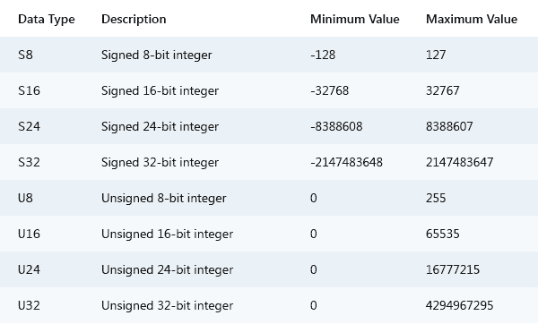

# 在浏览器中操作文件

> 原文：<https://dev.to/kitanga_nday/manipulating-files-in-the-browser-2l22>

我已经想写一个教程有一段时间了，所以我想有什么比写一个几乎让我长出白发的话题更好的方式来发帖。

现在，这不仅仅是一个教程，也是一个个人实验，看看我是否能完成这个简单的任务，并希望教你一些我在尝试这个过程中遇到的问题。

无论如何，为了让您学习如何读取、写入和解析自定义文件格式，我们将创建一个 pack 文件:一个包含不同文件的文件(想想没有压缩步骤的 ZIP 文件)。这在 web 上非常有用，因为您希望向服务器发出尽可能少的请求。不过，如果我没记错的话，HTTP/2 应该已经解决了这个问题(剧透:是的，它解决了。[现在可以异步请求文件了](https://medium.com/@factoryhr/http-2-the-difference-between-http-1-1-benefits-and-how-to-use-it-38094fa0e95b)。

我们的包文件包含**图像** (PNG)和**音频** (OGG)文件，并将它们连接成一个文件。你也可以选择使用你喜欢的任何其他文件类型(例如，用 MP3 替换 OGG)。

## 对着张风

现在对于这个演示，我将使用 [Codepen](https://codepen.io/pen) 。但是，你可以使用任何你觉得舒服的环境，只要你能跟上。如果你迷路了，你可以看看我的笔[这里](https://codepen.io/kitanga/pen/LYPNXEG)来跟上。

### HTML/CSS

为了简洁起见，我们将添加一个接受多个文件的文件输入元素，但仅限于 PNG 和 OGG 文件，一个用于将所选文件添加到临时“存储”中的添加按钮，以及一个用于启动整个打包过程的下载按钮。

```
<div id="wrapper">
    <input type="file" accept=".png, .ogg" multiple>
    <div><button id="download">Download</button></div>
    <button type="button" id="add">Add</button>
</div> 
```

<svg width="20px" height="20px" viewBox="0 0 24 24" class="highlight-action crayons-icon highlight-action--fullscreen-on"><title>Enter fullscreen mode</title></svg> <svg width="20px" height="20px" viewBox="0 0 24 24" class="highlight-action crayons-icon highlight-action--fullscreen-off"><title>Exit fullscreen mode</title></svg>

除了基本的设置风格，我们的 CSS 将主要使用 flexbox 水平居中输入元素。

```
* {
   box-sizing: border-box;
}

html, body, #wrapper {
   width: 100%;
   height: 100%;
   margin: 0;
   padding: 0;
   overflow: hidden;
}

#wrapper {
   padding-top: 1%;
   padding-left: 10%;
   padding-right: 10%;
   display: flex;
   justify-content: center;
   flex-wrap: wrap;
}

#wrapper>* {
   flex-grow: 1;
} 
```

<svg width="20px" height="20px" viewBox="0 0 24 24" class="highlight-action crayons-icon highlight-action--fullscreen-on"><title>Enter fullscreen mode</title></svg> <svg width="20px" height="20px" viewBox="0 0 24 24" class="highlight-action crayons-icon highlight-action--fullscreen-off"><title>Exit fullscreen mode</title></svg>

### 现在为一些 JavaScript

首先，我们将为 add 按钮创建一个`onclick`事件监听器，将文件名及其大小添加到页面中。它还将它们添加到我们的“store”变量中，现在我们称之为`files`。

```
const VERSION = 1;

// Get ref to the input and the files display elements.
const input = document.querySelector('input');
const filesContainer = document.querySelector('.files');
const addBtn = document.getElementById('add');
const download = document.getElementById("download");
// We'll use this to download the file
const anchor = document.createElement('a');

// We'll store files here
let files = [];

addBtn.onclick = () => {
   // Disable the file uploader and add button
   input.disabled = true;
   addBtn.innerText = "...";
   addBtn.disabled = true;

   // Convert files list to an array
   const selectedFiles = Array.prototype.slice.call(input.files);

   if (selectedFiles.length) {
      // Clear the files list on screen
      filesContainer.innerHTML = "";

      // We'll run this each time a file is done processing
      let count = selectedFiles.length;
      const callback = () => {
         // If our count is zero then we are done
         if (!--count) {
            // Enable the file uploader and add button
            input.disabled = false;
            addBtn.innerText = "Add";
            addBtn.disabled = false;
         }
      };

      // Add into files array
      selectedFiles.forEach(_file => {
         // We need to get the byte array of the file first
         _file.arrayBuffer().then(buffer => {
            let file = {
               name: _file.name,
               size: _file.size,
               type: _file.type,
               buffer
            };
            files.push(file);

            // Add files to the page
            filesContainer.innerHTML += `<div>${file.name}  ${Math.round(
               file.size / 1024
            )}kb</div>`;
            callback();
         });
      });
   }
} 
```

<svg width="20px" height="20px" viewBox="0 0 24 24" class="highlight-action crayons-icon highlight-action--fullscreen-on"><title>Enter fullscreen mode</title></svg> <svg width="20px" height="20px" viewBox="0 0 24 24" class="highlight-action crayons-icon highlight-action--fullscreen-off"><title>Exit fullscreen mode</title></svg>

代码注释非常简单明了，我只要求您密切关注`VERSION`常量和`anchor`元素，因为我们将在后面的`HEADER`创建中以及当我们想要解析文件时使用它们。

我确实认为在内存中保存每个文件的字节数组(也称为 ArrayBuffer)可能不好，但是，嘿，谁会抱怨呢，对吗？

快速提示:我在 Codepen 中使用 Babel 时遇到了一些问题，所以我关闭了它，开始编写更具防御性的代码(即使用更多的 ES5 技术)。我知道你们中的大多数人可能没有打开巴别塔传输，但是对于那些打开的人来说，这只是一个警告。

现在您应该已经在代码中看到了一个`filesContainer`常量。这是对我们将要添加的 HTML 的引用:

```
<div id="wrapper">
    <input type="file" accept=".png, .ogg" multiple>
    <div><button id="download">Download</button></div>
    <button type="button" id="add">Add</button>
    <div class="files"></div>
</div> 
```

<svg width="20px" height="20px" viewBox="0 0 24 24" class="highlight-action crayons-icon highlight-action--fullscreen-on"><title>Enter fullscreen mode</title></svg> <svg width="20px" height="20px" viewBox="0 0 24 24" class="highlight-action crayons-icon highlight-action--fullscreen-off"><title>Exit fullscreen mode</title></svg>

而且是 CSS

```
/* ...previous styles... */

.files {
   width: 100%;
   height: 100%;
   padding-top: 1%;
   text-align: center;
} 
```

<svg width="20px" height="20px" viewBox="0 0 24 24" class="highlight-action crayons-icon highlight-action--fullscreen-on"><title>Enter fullscreen mode</title></svg> <svg width="20px" height="20px" viewBox="0 0 24 24" class="highlight-action crayons-icon highlight-action--fullscreen-off"><title>Exit fullscreen mode</title></svg>

这只是为了在屏幕上显示文件。

### 我们来谈谈文件格式设计

在我们继续创建文件之前，我们需要设计文件的结构。这需要你理解两件事:**原语**和**结构化**数据类型是。

原始数据类型为我们提供了一种*标准*,用于指定一个属性占用多少位(稍后会详细介绍)。既然我们知道计算机是以字节为单位工作的，那么 1 字节(即 8 位)将是我们最小的原语。现在这些字节有两种形式:它们可以是有符号的，也可以是无符号的。有符号意味着我们的字节可以代表一个正数或负数。无符号表示都是正数。但是在我们的例子中，我们将只使用无符号字节，因为我们不需要负数。下面是一些数据类型的列表，可以让你更好地理解我所说的内容:

[](https://res.cloudinary.com/practicaldev/image/fetch/s--x9itcQSm--/c_limit%2Cf_auto%2Cfl_progressive%2Cq_auto%2Cw_880/https://cdn.tutsplus.com/gamedev/uploads/legacy/009_binaryFileFormats/primitive_data_types.png)

请务必记住缩写版本(即 U8 代表无符号 8 位整数)，因为我将在本教程中大量使用它们。

另一方面，结构化数据类型表示我们的二进制文件的块，由设计文档中的属性/特性所表示的原始数据类型组成。

```
// e.g
Structure {
    property   U16
    property2  U8
} 
```

<svg width="20px" height="20px" viewBox="0 0 24 24" class="highlight-action crayons-icon highlight-action--fullscreen-on"><title>Enter fullscreen mode</title></svg> <svg width="20px" height="20px" viewBox="0 0 24 24" class="highlight-action crayons-icon highlight-action--fullscreen-off"><title>Exit fullscreen mode</title></svg>

因此，上述结构总共将占用 24 位(16 + 8)或 3 个字节，前 16 位(2 个字节)将表示属性`property`，而剩余的 8 位(1 个字节)将表示属性`property2`。

好吧！开始设计这个东西。

### 打包文件格式设计

`PACK`文件将有一个`HEADER`和一个`FILE`列表

```
PACK {
    header     HEADER
    files      FILE[HEADER.count]
} 
```

<svg width="20px" height="20px" viewBox="0 0 24 24" class="highlight-action crayons-icon highlight-action--fullscreen-on"><title>Enter fullscreen mode</title></svg> <svg width="20px" height="20px" viewBox="0 0 24 24" class="highlight-action crayons-icon highlight-action--fullscreen-off"><title>Exit fullscreen mode</title></svg>

`HEADER`将保存打包程序的版本号以及包中有多少文件的信息。

```
HEADER {
    version    U8
    count      U8
} 
```

<svg width="20px" height="20px" viewBox="0 0 24 24" class="highlight-action crayons-icon highlight-action--fullscreen-on"><title>Enter fullscreen mode</title></svg> <svg width="20px" height="20px" viewBox="0 0 24 24" class="highlight-action crayons-icon highlight-action--fullscreen-off"><title>Exit fullscreen mode</title></svg>

`FILE`结构将以字节为单位保存文件类型和长度的信息。

```
FILE {
    type       U24
    length     U32
    data       [length]
} 
```

<svg width="20px" height="20px" viewBox="0 0 24 24" class="highlight-action crayons-icon highlight-action--fullscreen-on"><title>Enter fullscreen mode</title></svg> <svg width="20px" height="20px" viewBox="0 0 24 24" class="highlight-action crayons-icon highlight-action--fullscreen-off"><title>Exit fullscreen mode</title></svg>

属性(prop)是一个 3 字符的 ASCII 码字符串，它将通知解析器这是什么文件。目前，类型可以是两种情况之一:“IMG”或“澳大利亚”。另一方面，`length`只是告诉我们文件有多长，以字节为单位。而`data`属性保存文件的字节。

### 打包文件实现

现在我们有了自己的设计，让我们继续实现我们的头文件并添加打包的文件。

但是，在我们做任何其他事情之前，我们必须谈谈类型。我说的“谈论”是指你必须去阅读它，因为我在这里解释它肯定会使这篇文章膨胀起来。遗憾的😉。

完成了吗？好吧，那我们继续。

我们将首先创建我们的文件头，你显然还记得，它有一个版本和一个计数，两者都是由 8 位无符号整数表示的。

```
HEADER {
    version    U8
    count      U8
} 
```

<svg width="20px" height="20px" viewBox="0 0 24 24" class="highlight-action crayons-icon highlight-action--fullscreen-on"><title>Enter fullscreen mode</title></svg> <svg width="20px" height="20px" viewBox="0 0 24 24" class="highlight-action crayons-icon highlight-action--fullscreen-off"><title>Exit fullscreen mode</title></svg>

现在为代码:

```
function pack(VERSION, selectedFiles) {
   // Making sure that we have files selected
   if (!selectedFiles.length) {
      return false;
   }

   // Create the header with a version number and file count
   let header = new Uint8Array([VERSION, selectedFiles.length]);

   // ...
} 
```

<svg width="20px" height="20px" viewBox="0 0 24 24" class="highlight-action crayons-icon highlight-action--fullscreen-on"><title>Enter fullscreen mode</title></svg> <svg width="20px" height="20px" viewBox="0 0 24 24" class="highlight-action crayons-icon highlight-action--fullscreen-off"><title>Exit fullscreen mode</title></svg>

这里，我们创建了一个名为`pack`的函数，它有两个参数:我们的打包程序的版本和我们之前存储的文件对象列表。我们在函数中做的第一件事是检查是否有文件被选中，如果没有，我们就结束这个过程。之后，我们使用一个`Uint8Array`创建了`HEADER`结构，并设置了两个属性值:`version`和`count`。

在创建最终文件之前，我们必须知道最终文件的大小。

```
function pack(VERSION, selectedFiles) {
   // Making sure that we have files selected
   if (!selectedFiles.length) {
      return false;
   }

   // Create the header with a version number and file count
   let header = new Uint8Array([VERSION, selectedFiles.length]);

   // Set our final file's size
   let fileSize = header.byteLength;
   fileSize += selectedFiles
      .map(file => file.size)
      .reduce((acc, currentVal) => acc + (currentVal + 7));

   // ...
} 
```

<svg width="20px" height="20px" viewBox="0 0 24 24" class="highlight-action crayons-icon highlight-action--fullscreen-on"><title>Enter fullscreen mode</title></svg> <svg width="20px" height="20px" viewBox="0 0 24 24" class="highlight-action crayons-icon highlight-action--fullscreen-off"><title>Exit fullscreen mode</title></svg>

在将初始文件大小设置为文件头的字节数后，我们减少我们拥有的文件列表，以便将所有大小加在一起。我们之所以做`currentVal + 7`是因为每个`FILE`都有一个 56 位或 7 字节的头。

之后，我们创建我们的文件，添加文件头，并创建一个偏移量变量，我们将在下一步添加文件时使用:

```
function pack(VERSION, selectedFiles) {
   // ...

   // Our final file
   let finalFile = new Uint8Array(fileSize);

   // First add the header
   finalFile.set(header);

   // Keep count of the last file's offset
   let offset = header.byteLength;

   // ...
} 
```

<svg width="20px" height="20px" viewBox="0 0 24 24" class="highlight-action crayons-icon highlight-action--fullscreen-on"><title>Enter fullscreen mode</title></svg> <svg width="20px" height="20px" viewBox="0 0 24 24" class="highlight-action crayons-icon highlight-action--fullscreen-off"><title>Exit fullscreen mode</title></svg>

接下来我们将是我们的文件连接代码。以防你忘记了`FILE`的样子:

```
FILE {
    type       U24
    length     U32
    data       [length]
} 
```

<svg width="20px" height="20px" viewBox="0 0 24 24" class="highlight-action crayons-icon highlight-action--fullscreen-on"><title>Enter fullscreen mode</title></svg> <svg width="20px" height="20px" viewBox="0 0 24 24" class="highlight-action crayons-icon highlight-action--fullscreen-off"><title>Exit fullscreen mode</title></svg>

现在来实现这个:

```
function pack(VERSION, selectedFiles) {
   // ...

   // Now, take files and concatenate them
   selectedFiles.forEach(file => {
      // The FILE structure
      let outputFile = new Uint8Array(7 + file.size);

      // File's type
      if (file.type.includes("image")) {
         // Fill the ASCII characters IMG
         outputFile.set([73, 77, 71]);
      } else {
         // Fill the ASCII characters AUD
         outputFile.set([65, 85, 68]);
      }

      // Create a 32 bit integer...
      const fileLength32 = new Uint32Array([file.size]);
      // ...add finally add it as the length
      outputFile.set(new Uint8Array(fileLength32.buffer), 3);

      // And now add the file itself
      outputFile.set(new Uint8Array(file.buffer), 7);

      // Concatenate the file to the final file
      finalFile.set(outputFile, offset);

      // Update the offset value
      offset += outputFile.byteLength - 1;
   });

   // ...
} 
```

<svg width="20px" height="20px" viewBox="0 0 24 24" class="highlight-action crayons-icon highlight-action--fullscreen-on"><title>Enter fullscreen mode</title></svg> <svg width="20px" height="20px" viewBox="0 0 24 24" class="highlight-action crayons-icon highlight-action--fullscreen-off"><title>Exit fullscreen mode</title></svg>

简单地说，我在尝试做这个`outputFile.set(new Uint32Array([file.size]), 3)`时遇到了一个有趣的问题，因为实现只添加了第一个字节。为了确保长度正确，你必须创建一个`U32`整数，然后用它的缓冲区创建一个`Uint8Array`。

在这个函数的逻辑的最后，我们返回一个 blob 形式的包文件:

```
function pack(VERSION, selectedFiles) {
   // ...

   return new Blob([finalFile.buffer]);
} 
```

<svg width="20px" height="20px" viewBox="0 0 24 24" class="highlight-action crayons-icon highlight-action--fullscreen-on"><title>Enter fullscreen mode</title></svg> <svg width="20px" height="20px" viewBox="0 0 24 24" class="highlight-action crayons-icon highlight-action--fullscreen-off"><title>Exit fullscreen mode</title></svg>

我们的`pack`函数的最终代码应该是这样的。

```
function pack(VERSION, selectedFiles) {
   // Making sure that we have files selected
   if (!selectedFiles.length) {
      return false;
   }

   // Create the header with a version number and file count
   let header = new Uint8Array([VERSION, selectedFiles.length]);

   // Set our final file's size
   let fileSize = header.byteLength;
   fileSize += selectedFiles
      .map(file => file.size)
      .reduce((acc, currentVal) => acc + (currentVal + 7));

   // Our final file
   let finalFile = new Uint8Array(fileSize);

   // First add the header
   finalFile.set(header);

   // Keep count of the last file's offset
   let offset = header.byteLength + 1;

   // Now, take files and concatenate them
   selectedFiles.forEach(file => {
      // The FILE structure
      let outputFile = new Uint8Array(7 + file.size);

      // File's type
      if (file.type.includes("image")) {
         // Fill the ASCII characters IMG
         outputFile.set([73, 77, 71]);
      } else {
         // Fill the ASCII characters AUD
         outputFile.set([65, 85, 68]);
      }

      // Add the length
      outputFile.set(new Uint32Array([file.size]), 3);

      // And now add the file itself
      outputFile.set(new Uint8Array(file.buffer), 7);

      // Concatenate the file to the final file
      finalFile.set(outputFile, offset);

      // Update the offset value
      offset += outputFile.byteLength - 1;
   });

   return new Blob([finalFile.buffer]);
} 
```

<svg width="20px" height="20px" viewBox="0 0 24 24" class="highlight-action crayons-icon highlight-action--fullscreen-on"><title>Enter fullscreen mode</title></svg> <svg width="20px" height="20px" viewBox="0 0 24 24" class="highlight-action crayons-icon highlight-action--fullscreen-off"><title>Exit fullscreen mode</title></svg>

目前，它并不那么有用。当用户按下下载按钮时，我们必须开始这个过程。然后，在创建我们的文件之后，验证我们有一个文件，并向我们之前创建的`anchor`元素添加正确的属性，以便我们可以下载一个“resource.packed”文件:

```
download.onclick = () => {
   // Disable all the action elements onscreen
   const actionEles = document.querySelectorAll('#wrapper > *');
   actionEles.forEach(ele => (ele.disabled = true));

   // Pack the files
   let packedFile = pack(VERSION, files);

   // If there isn't a file exported then we don't do anything
   if (!packedFile) {
      // Re-enable the action buttons
      actionEles.forEach(ele => (ele.disabled = false));
      return false;
   }

   // Set the download and href values
   anchor.download = "resource.packed";
   anchor.href = window.URL.createObjectURL(packedFile);
   // Prompt user to save file
   anchor.click();

   // Re-enable the action buttons
   actionEles.forEach(ele => (ele.disabled = false));
}; 
```

<svg width="20px" height="20px" viewBox="0 0 24 24" class="highlight-action crayons-icon highlight-action--fullscreen-on"><title>Enter fullscreen mode</title></svg> <svg width="20px" height="20px" viewBox="0 0 24 24" class="highlight-action crayons-icon highlight-action--fullscreen-off"><title>Exit fullscreen mode</title></svg>

这应该可以了。如果你想验证文件是否创建正确，你可以使用十六进制编辑器，如 [HxD](https://filehippo.com/download_hxd-hex-editor/) 来检查你的。打包的文件。

学习使用一个十六进制编辑器被证明是非常有用的，因为我发现很容易发现文件在哪里没有正确构建(顺便说一下，我说的是 pack 文件的头，试图看到下一个文件从哪里开始真的很难)。但是，我认为你也应该考虑使用一个。

(顺便说一下，您也可以创建不同的结构作为`TypedArray`组件，然后将它们放入一个数组中。然后使用这个数组创建一个 blob 文件。我没有尝试过，但是它应该比我在这里实现的要简单)

## 现在...解析器

我们的解析器将提取头部和文件。我们还将编写一些自定义代码，将这些提取的文件发布到页面上。我将把我们所有的结构设计放在这里，以便于记忆结构:

```
PACK {
    header     HEADER
    files      FILE[HEADER.count]
}

HEADER {
    version    U8
    count      U8
}

FILE {
    type       U24
    length     U32
    data       [length]
} 
```

<svg width="20px" height="20px" viewBox="0 0 24 24" class="highlight-action crayons-icon highlight-action--fullscreen-on"><title>Enter fullscreen mode</title></svg> <svg width="20px" height="20px" viewBox="0 0 24 24" class="highlight-action crayons-icon highlight-action--fullscreen-off"><title>Exit fullscreen mode</title></svg>

现在，我们要做的是创建第二个[笔](https://codepen.io/pen),在这里我们可以上传包文件，并在解析后立即看到不同的文件。

如果你迷路了，只要看看我的新笔就可以了。

为了简洁起见，我将发布 HTML/CSS 并直接转到我们的 Javascript。

```
<div id="wrapper">
    <input type="file" accept=".packed">
    <div class="files"></div>
</div> 
```

<svg width="20px" height="20px" viewBox="0 0 24 24" class="highlight-action crayons-icon highlight-action--fullscreen-on"><title>Enter fullscreen mode</title></svg> <svg width="20px" height="20px" viewBox="0 0 24 24" class="highlight-action crayons-icon highlight-action--fullscreen-off"><title>Exit fullscreen mode</title></svg>

```
.file {
   width: 100vw;
}

img {
   width: 43vw;
} 
```

<svg width="20px" height="20px" viewBox="0 0 24 24" class="highlight-action crayons-icon highlight-action--fullscreen-on"><title>Enter fullscreen mode</title></svg> <svg width="20px" height="20px" viewBox="0 0 24 24" class="highlight-action crayons-icon highlight-action--fullscreen-off"><title>Exit fullscreen mode</title></svg>

好了，现在我们创建对这些元素的 DOM 引用，然后向`input`元素添加一个`onchange`事件，这样我们就可以开始解析过程了。

```
const VERSION = 1;

// Get ref to the input and the files display elements.
const input = document.querySelector("input");
const filesContainer = document.querySelector(".files");

input.onchange = () => {
   // First we get our pack file if it was selected
   let file = input.files[0];

   // Make sure that we have our file
   if (file) {
      // We get the buffer
      file.arrayBuffer().then(buffer => {
         // Parse our file
         let unpackedFiles = parse(VERSION, buffer);
         // Display files on screen to make sure everything is OK
         displayFiles(unpackedFiles);
      });
   }
} 
```

<svg width="20px" height="20px" viewBox="0 0 24 24" class="highlight-action crayons-icon highlight-action--fullscreen-on"><title>Enter fullscreen mode</title></svg> <svg width="20px" height="20px" viewBox="0 0 24 24" class="highlight-action crayons-icon highlight-action--fullscreen-off"><title>Exit fullscreen mode</title></svg>

我们将继续使用我们的`parse`函数，它将返回一个 blob 文件数组。但首先，一些设置:

```
function parse(VERSION, buffer) {
   // Check if big/little endian
   const isLittleEndian = new Uint8Array(new Uint32Array([0x12345678]).buffer)[0] === 0x78;

   // Create a view of file's byte data
   let file = new DataView(buffer);

   // ...
} 
```

<svg width="20px" height="20px" viewBox="0 0 24 24" class="highlight-action crayons-icon highlight-action--fullscreen-on"><title>Enter fullscreen mode</title></svg> <svg width="20px" height="20px" viewBox="0 0 24 24" class="highlight-action crayons-icon highlight-action--fullscreen-off"><title>Exit fullscreen mode</title></svg>

字节序。对，就是一个字。显然不同的计算机读取字节是不同的(谁会猜到)。有些从最右边的字节开始，有些从最左边的字节开始。我们的 parse 函数中的第一行检查计算机是否是 little endian(最右边的字节)。使用 DataView 构造函数允许我们编写可以在大端和小端架构上工作的代码。重要的是，因为你不想从错误的一端读取你的文件。

现在这些都完成了，让我们继续阅读我们的头文件并设置文件提取:

```
function parse(VERSION, buffer) {
   // ...

   // If the version number of the parser is the same as the version number of packer then continue
   if (file.getUint8(0, isLittleEndian) === VERSION) {
      // How many files we have to get
      let count = file.getUint8(1 , isLittleEndian);
      // Our offset from the start of the buffer
      let offset = 2;
      // An array of Blob objects
      let unpackedFiles = [];

      // ...
} 
```

<svg width="20px" height="20px" viewBox="0 0 24 24" class="highlight-action crayons-icon highlight-action--fullscreen-on"><title>Enter fullscreen mode</title></svg> <svg width="20px" height="20px" viewBox="0 0 24 24" class="highlight-action crayons-icon highlight-action--fullscreen-off"><title>Exit fullscreen mode</title></svg>

我们可以开始提取我们的文件:

```
function parse(VERSION, buffer) {
   // ...
   // If the version number of the parser is the same as the version number of packer then continue
   if (file.getUint8(0, isLittleEndian) === VERSION) {
      // ...

      // Get the files
      for (let index = 0; index < count; index++) {
         // Get the type first
         let type = "";
         for (let char = 0; char < 3; char++) {
            type += String.fromCharCode(file.getUint8(offset++, isLittleEndian));
         }

         // Get the length of file
         const fileLength = file.getUint32(offset, isLittleEndian);
         offset += 4;

         // Our array of byte values
         let byteArray = [];

         // Get the bytes
         for (let fileIndex = 0; fileIndex < fileLength; fileIndex++) {
            //
            byteArray.push(file.getUint8(offset + fileIndex, isLittleEndian));
         }

         offset += fileLength - 1;

         // Create a temporary store for our bytes
         let fileArray = new Uint8Array(byteArray);

         // Create our options object based on file type
         let options = { type: "" };
         if (type === 'IMG') {
            options.type = 'image/png';
         } else {
            options.type = 'audio/ogg';
         }

         // Add the file to our collection of files
         unpackedFiles.push(new Blob([fileArray.buffer], options));
      }

      return unpackedFiles;
   }
} 
```

<svg width="20px" height="20px" viewBox="0 0 24 24" class="highlight-action crayons-icon highlight-action--fullscreen-on"><title>Enter fullscreen mode</title></svg> <svg width="20px" height="20px" viewBox="0 0 24 24" class="highlight-action crayons-icon highlight-action--fullscreen-off"><title>Exit fullscreen mode</title></svg>

好了，这是很多代码。让我告诉你这里发生的事情的要点:

1.  我们得到的类型可以是两种可能的类型之一:IMG 或澳元。
2.  获取文件的长度
3.  创建一个数组来保存字节，并创建一个循环来添加它们。
4.  创建一个 blob 文件，并将其添加到我们的 blob 文件数组中

然后，该函数以导出解压缩文件的一行结束，这些文件将显示在我们的`displayFiles`函数:
中

```
function displayFiles(unpackedFiles) {
   // Clear the files list
   filesContainer.innerHTML = "";

   unpackedFiles.forEach(file => {
      // Create a div element
      let div = `<div class="file">[FILE]</div>`;

      // Check type
      if (file.type.includes('image')) {
         // It's an image
         div = div.replace('[FILE]', ``);
      } else {
         // It's an audio file
         div = div.replace('[FILE]', `<audio src="${window.URL.createObjectURL(file)}" controls></audio>`);
      }
      // Update DOM
      filesContainer.innerHTML += div;
   })
} 
```

<svg width="20px" height="20px" viewBox="0 0 24 24" class="highlight-action crayons-icon highlight-action--fullscreen-on"><title>Enter fullscreen mode</title></svg> <svg width="20px" height="20px" viewBox="0 0 24 24" class="highlight-action crayons-icon highlight-action--fullscreen-off"><title>Exit fullscreen mode</title></svg>

这只是获取我们的 blob 文件，创建到它们的链接，然后将它们添加到 DOM 中。差不多就是这样。

最后...

## 你。是。太棒了。😎

谢谢你能走到这一步。我写了很多我知道的，只是希望这对某人有所帮助。我知道我学到了很多。

## 运动

我想如果在那之后我能给你留点事做就好了。我们的打包器/解析器缺少了很多东西:添加标识符以便我们知道我们正在处理什么文件，对文件进行分组而不是每次都必须读取类型，通过将 mime 类型添加到`FILE`的头中来支持不同的文件类型，还在头中为`version`属性使用了一个`STRING`结构以便我们可以使用 semver 字符串，并使代码总体上更好。

因此，您的可选练习是尽可能多地将这些特性/优化添加到打包器/解析器代码中。

## 有什么疑问吗？

如果你有任何问题，你也可以在下面留言。我肯定会登记入住的。

我确实有一个问题要问你，这个教程能更好吗？也许它可以更短，我确实觉得我没有很好地解释最初的部分。作为一个系列会更好吗？

我不太了解这个社区，所以如果我的写作风格看起来不怎么样。

## 一些你可能想读的文章

*   [肯定是受到了这篇关于 GameDev Tuts+](https://gamedevelopment.tutsplus.com/tutorials/create-custom-binary-file-formats-for-your-games-data--gamedev-206) 的文章的启发
*   [有趣的阅读让我想到了使用类型化数组来创建上面的例子，但是对于 web 开发人员来说](https://hacks.mozilla.org/2011/12/faster-canvas-pixel-manipulation-with-typed-arrays/)
*   [类型数组](https://developer.mozilla.org/en-US/docs/Web/JavaScript/Typed_arrays)