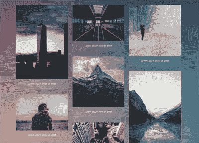
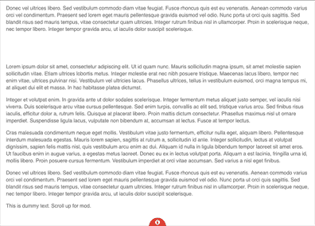
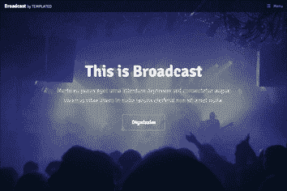
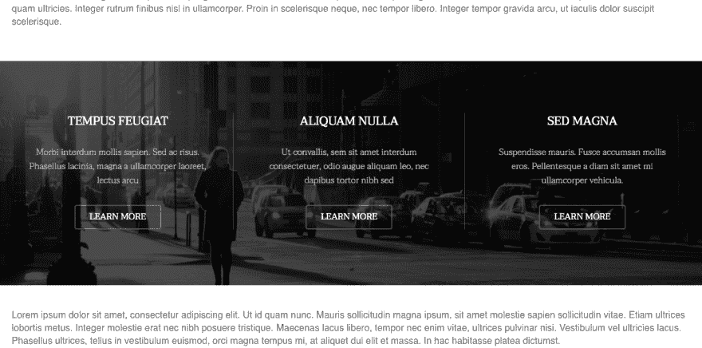
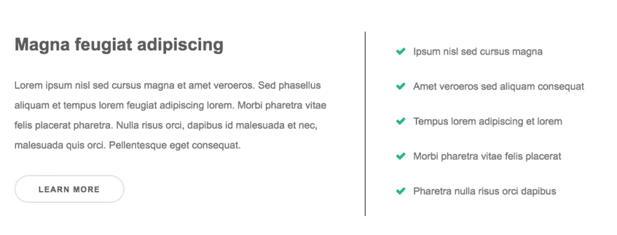

# 马赛克图库，扩展页脚，视频英雄|模块周一 53

> 原文：<https://dev.to/tyrw/mosaic-gallery-expanding-footer-video-hero-module-monday-53-bpl>

## 下面的一切都是开源的

它可以在任何网站、web 应用程序或其他任何地方免费使用。在 AnyMod 上还有数百个这样的构建和共享。

单击一个 mod 来查看它及其源代码。

## 马赛克图库

一行代码就可以添加漂亮的渐变图库。
[查看 mod](https://anymod.com/mod/mosaic-images-mladll?preview=true)
  

## 可扩展页脚

需要时藏在底部。扩展了关于和联系信息。
[查看 mod](https://anymod.com/mod/expandable-footer-with-social-network-links-alrolk?preview=true)
  

## 带导航条的视频英雄

带有侧边导航的醒目介绍部分。
[查看 mod](https://anymod.com/mod/video-hero-with-navbar-nkonmr?preview=true)
  

## 背景列

后面有固定背景的三个内容栏。
[查看 mod](https://anymod.com/mod/background-columns-nkomrr?preview=true&lorem=true)
  

## 功能列表

通过“了解更多”按钮，轻松展示您的功能。
[查看 mod](https://anymod.com/mod/features-list-section-dkdona)
  

* * *

我每周一从社区[这里](https://dev.to/tyrw)贴出新的 mods 我希望你觉得它们有用！

快乐编码✌️