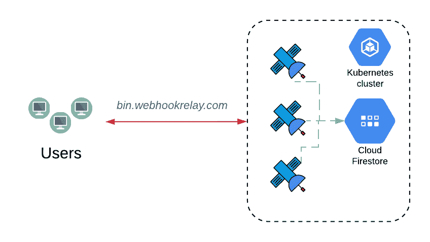

# 为 golang 后端应用程序使用 google firestorm

> 原文：<https://dev.to/webhookrelay/using-google-firestore-for-a-golang-backend-application-1dbm>

[](https://res.cloudinary.com/practicaldev/image/fetch/s--Mm44kK7k--/c_limit%2Cf_auto%2Cfl_progressive%2Cq_auto%2Cw_880/https://thepracticaldev.s3.amazonaws.com/i/wmseu7hax0hsxl7erxpn.png)

通常，当我需要一个数据库时，我只选择 [Postgres](https://www.postgresql.org/) 或嵌入式键值存储，比如优秀的 [boltdb](https://github.com/etcd-io/bbolt) 、来自 dgraph 的 [badger 或](https://github.com/dgraph-io/badger) [Redis](https://redis.io/) (如果我需要一个 KV 存储，但在几个节点之间共享)。灵活性带来了维护负担，有时还会带来额外的成本。在本文中，我们将探索一个简单的 Golang 后端服务，它将使用 Google Firestore 作为存储。

当我开始着手一个名为[bin.webhookrelay.com](https://bin.webhookrelay.com/)的简单项目时，我选择 Badger 作为键值存储，将一个持久磁盘连接到 Kubernetes pod 并启动它。

> bin.webhookrelay.com 是一项免费服务，它允许你捕获 webhook 或 API 请求用于测试目的。它还允许您指定要返回的响应正文和状态代码，并设置可选的响应延迟。

数据模型过去(现在仍然)很简单:

*   **Bin** 具有某种配置，比如返回什么状态码、响应主体、内容类型头和响应延迟。
*   **请求**实际上是捕获带有 bin ID、请求体、头和查询的 webhook 请求。

大多数时候，boltdb 或 badger 等 KV 商店非常适合这类用例。当您想要水平伸缩或使用滚动更新策略时，问题就出现了，这意味着应用程序的许多实例在更新期间必须激增。虽然 Kubernetes 非常适合运行几乎任何工作负载，但如果进行更新，需要分离一个持久磁盘并将其重新连接到一个新的 pod，这可能会导致停机，并且通常会减慢更新速度。我总是试图避免这种情况，然而，webhook bin 服务却深受其害。

这一次，我决定尝试一下[云火商店](https://firebase.google.com/docs/firestore/)。您可能已经听说过 Firestore(以前称为 Firebase ),它在需要为其 Android 和 iOS 应用程序提供数据库的移动应用程序开发人员中非常受欢迎。显然，它还可以为后端应用程序提供一个非常好的开发人员 UX！:)

## 设置

对于身份验证，Golang Firestore 客户端使用依赖于服务帐户的标准机制。基本上，你需要去:

1.  [GCP 控制台](https://console.cloud.google.com)
2.  点击 IAM & admin
3.  转到服务帐户(在左侧导航栏上)
4.  创建一个具有 firestorm 权限的新服务帐户
5.  下载该文件，您现在可以使用它进行身份验证

> 文档可以在谷歌云认证部分找到[。](https://cloud.google.com/docs/authentication/getting-started)

应用程序代码出奇的简单。你得到客户端使用谷歌应用证书，项目 ID，就是这样:

```
func NewFirestoreBinManager(opts *FirestoreBinManagerOpts) (*FirestoreBinManager, error) {
    ctx := context.Background()

    var options []option.ClientOption
    if opts.CredsFile != "" {    
        options = append(options, option.WithCredentialsFile(opts.CredsFile))
    }

  // credentials file option is optional, by default it will use GOOGLE_APPLICATION_CREDENTIALS
  // environment variable, this is a default method to connect to Google services
    client, err := firestore.NewClient(ctx, opts.ProjectID, options...) 
    if err != nil {
        return nil, err
    }

    return &FirestoreBinManager{
        binsCollection: opts.BinsCollection,  // our bins collection name
        reqsCollection: opts.ReqsCollection,  // our requests collection name
        client:         client,
        pubsub:         opts.Pubsub,
        logger:         opts.Logger,
    }, nil
} 
```

Enter fullscreen mode Exit fullscreen mode

## 添加和更新仓位

创建文档时，可以指定文档 ID，只传入整个 golang 结构，而不需要先将它封送到 JSON:

```
func (m *FirestoreBinManager) BinPut(ctx context.Context, b *bin.Bin) (err error) {
    _, err = m.client.Collection(m.binsCollection).Doc(b.GetId()).Set(ctx, b)
    return err
} 
```

Enter fullscreen mode Exit fullscreen mode

注意，我们提供了集合名称:`Collection(m.binsCollection)`，ID: `Doc(b.GetId())`，并设置了结构字段`Set(ctx, b)`。

这样真的很节省时间！KV 商店的另一种选择是:

```
func (m *BinManager) BinPut(ctx context.Context, b *bin.Bin) (err error) {
    b.Requests = nil
    encoded, err := proto.Marshal(b)
    if err != nil {

        return err
    }

    return m.storage.Store(ctx, "bins/"+b.Id, encoded, nil)
}

...
// store package

func (s *Storage) Store(ctx context.Context, id string, data []byte, metadata map[string]string) error {
    err := s.db.Update(func(txn *badger.Txn) error {
        // Your code here…
        return txn.Set([]byte(id), data)
    })
    return err
} 
```

Enter fullscreen mode Exit fullscreen mode

## 删除

在我们的例子中，删除 bin 意味着删除 bin 文档和所有相关联的 webhook 请求:

```
 func (m *FirestoreBinManager) BinDelete(ctx context.Context, binID string) error {

    _, err := m.client.Collection(m.binsCollection).Doc(binID).Delete(ctx)
    if err != nil {
        m.logger.Errorw("failed to delete bin doc by ref",
            "error", err,
        )
    }

    // Now, get all the requests and delete them in a batch request
    iter := m.client.Collection(m.reqsCollection).Where("Bin", "==", binID).Documents(ctx)
    numDeleted := 0
    batch := m.client.Batch()

    for {
        doc, err := iter.Next()
        if err == iterator.Done {
            break
        }
        if err != nil {
            return fmt.Errorf("Failed to iterate: %v", err)
        }
        batch.Delete(doc.Ref)
        numDeleted++

    }
    // If there are no documents to delete,
    // the process is over.
    if numDeleted == 0 {
        return nil
    }
    _, err = batch.Commit(ctx)

    return err
} 
```

Enter fullscreen mode Exit fullscreen mode

## 局限性

虽然存储、检索和修改文档非常容易，但有些人会错过 SQL 类型的查询，这些查询可以在数据库中聚合、计算记录和执行其他有用的操作。例如，为了跟踪文档数量，您必须实现一个类似于这里描述的解决方案的解决方案[。我的建议是，在开始这个旅程之前，花更多的时间规划数据结构，以及您计划使用哪种操作:)](https://cloud.google.com/firestore/docs/solutions/counters)

## 结论

虽然一开始有点怀疑，但我很快就喜欢上了 Firestore。虽然运行托管 Postgres 可以让我更容易地转换云提供商，但它也会使运行成本更高。保持较小的存储接口意味着您可以在几个小时内实现 Postgres(或任何其他数据库)驱动程序，因此最重要的事情是:

*   该解决方案需要多少维护
*   费用
*   表演

有用的资源:

*   [Golang Firestore 快速入门](https://github.com/GoogleCloudPlatform/golang-samples/tree/master/firestore/firestore_quickstart)
*   [Golang Firestore 片段](https://github.com/GoogleCloudPlatform/golang-samples/tree/master/firestore/firestore_snippets)
*   [GCP 认证](https://cloud.google.com/docs/authentication/getting-started)
*   [Firestore 账单](https://firebase.google.com/docs/firestore/pricing)

*本文最初发表在 [Webhook Relay 博客](https://webhookrelay.com/blog/2019/08/26/using-google-firestore-for-go-backend/)上。*