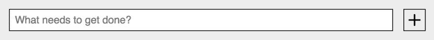
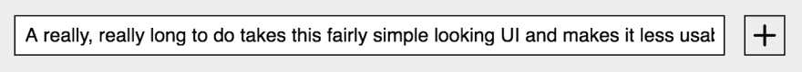
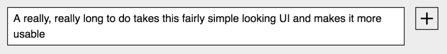

# 不是另一个待办事项应用程序:第 5 部分

> 原文：<https://dev.to/westbrook/not-another-to-do-app-part-5-5d7o>

#### 用 Open Web 组件推荐弄脏你的手和脚...算是吧。

> *这是 2019 年 2 月 26 日来自 [Medium](https://medium.com/@westbrook/not-another-to-do-app-169c14bb7ef9) 的一篇文章的交叉帖子，利用了我最近决定在我的写作中使用语法的优势(因此，在这里和那里做了一些小编辑)，如果你在那里看到它，感谢再次查看🙇🏽‍♂️:如果这是你第一次阅读，欢迎！*

*欢迎来到“不要再做一个应用程序”，这是一篇冗长的综述，讲述了每个开发人员在某个时候都会编写的最小的应用程序之一。如果你是来学习编写应用程序的特定技术的，或者是从以前的安装中走出来的，那么你可能来对地方了，应该继续读下去！如果没有，你可能想[从头开始](https://dev.to/westbrook/not-another-to-do-app-2kj9)，这样你也可以知道[我们所有角色的背景故事...](https://github.com/Westbrook/to-do-app)*

如果你已经做到了这一步，为什么现在就放弃呢？

* * *

# 使其成为一个组件

<figure>

[](https://res.cloudinary.com/practicaldev/image/fetch/s--1AkA4nZl--/c_limit%2Cf_auto%2Cfl_progressive%2Cq_auto%2Cw_880/https://thepracticaldev.s3.amazonaws.com/i/93orct89v3t7npk7tpuz.jpeg)

<figcaption>Photo by [Mark Seletcky](https://unsplash.com/@seletcky) on [Unsplash](https://unsplash.com/)</figcaption>

</figure>

好的，当然，这看起来很容易，我想要基于 web 组件的 UI，我选择了 open-wc 的生成器，因为它选择了`LitElement`作为构建高质量、高性能 web 组件的基类，所以一切都应该是组件，对吗？

*错了！*

即使是在 web 组件中工作，也不是所有的东西都必须是组件，有时只要让它成为一个模板部件就足够了(这一点我们将在下一集的“不是另一个待办事项应用程序”中更彻底地讨论)。更重要的是，即使它是一个组件，也很容易说“它不需要成为一个组件”。重要的是不断地约束自己，以便让未来的你尽可能容易地阅读和理解你的代码。在制作组件时，这意味着尽可能容易地准备代码，以便分解到自己的组件中，分解到父组件中，或者作为外部依赖项完全分解出项目。我发现自己在考虑新的待办事项 UI 的`input`字段时遇到了这个问题。

<figure>

[](https://res.cloudinary.com/practicaldev/image/fetch/s--howVB9ah--/c_limit%2Cf_auto%2Cfl_progressive%2Cq_auto%2Cw_880/https://thepracticaldev.s3.amazonaws.com/i/9e0p7efaho5kxldqc304.png)

<figcaption>Pretty simple at first look... right?</figcaption>

</figure>

乍一看，对大多数人来说，这显然是一个`input`元素紧挨着一个`button`元素，对吗？我也是。直到我在开发中期摆弄我的应用程序(有些人可能称之为 QA[质量保证测试])时遇到了这个问题:

<figure>

[](https://res.cloudinary.com/practicaldev/image/fetch/s--KNRZuvHU--/c_limit%2Cf_auto%2Cfl_progressive%2Cq_auto%2Cw_880/https://thepracticaldev.s3.amazonaws.com/i/sdk9hal1rvk68e5o2vmt.png)

<figcaption>Where’s the rest of my to-do at?</figcaption>

</figure>

当然，*只是*一个待办应用，为什么要担心这个看似很小的 UI 不是 100%的呢？对此，我的回答是，“为什么要担心呢？”但是，实际上，这只是一次谈话，我们只是在谈论可能性。利用我过去在类似用户界面上获得的一些知识，我开始编写代码，我觉得这次经历*纠正了*。将`input`转换成`textarea`，将其放入容器元素中，给一个兄弟元素来镜像其内容，隐藏其背后的兄弟元素，不久你就有了一个不断增长的`textarea`。你还拥有的是一大堆与编写 [`src/to-do-write.js`](https://github.com/Westbrook/to-do-app/blob/master/src/to-do-write.js) 里面的待办生活无关的代码。输入一些自我监控...

这和`<to-do-write></to-do-write>`有直接关系吗？没有。没有它会使`<to-do-write></to-do-write>`的代码流更容易解析吗？是的。我是否在项目的其他地方使用了它？没有。我能想象自己在未来的另一个项目中也需要这个吗？是的。代码中没有确定的答案，只有适合你当时工作环境的，对我来说，当时这些问题的答案是“让它成为一个 web 组件”。所以，我做了。

<figure>

[](https://res.cloudinary.com/practicaldev/image/fetch/s--Up_dECq_--/c_limit%2Cf_auto%2Cfl_progressive%2Cq_auto%2Cw_880/https://thepracticaldev.s3.amazonaws.com/i/ezkleoalp06hghfyuil8.png)

<figcaption>There it is!</figcaption>

</figure>

直接跳到它交付的最终版本，这个新的定制元素的实现从 [`src/to-do-write.js`](https://github.com/Westbrook/to-do-app/blob/master/src/to-do-write.js) 代码开始，在那里我们更新了`render()`方法以包含我的新定制元素，比如:

```
<growing-textarea>
    <textarea
        aria-label="Write the next thing you need to get done."
        id="todo"
        name="todo"
        placeholder="What needs to get done?"
    ></textarea>
</growing-textarea> 
```

<svg width="20px" height="20px" viewBox="0 0 24 24" class="highlight-action crayons-icon highlight-action--fullscreen-on"><title>Enter fullscreen mode</title></svg> <svg width="20px" height="20px" viewBox="0 0 24 24" class="highlight-action crayons-icon highlight-action--fullscreen-off"><title>Exit fullscreen mode</title></svg>

这看起来很像一个非常正常的`textarea`，对吗？`growing-textarea`定制元素使用[装饰模式](https://en.wikipedia.org/wiki/Decorator_pattern)来升级普通的`textarea`以拥有超能力。(插头:[装饰图案加上](https://medium.com/@westbrook/decorator-pattern-plus-816eefc89824)可以给它更多！)

> *但是，怎么会呢？*

让我们潜入 [`src/growing-textarea.js`](https://github.com/Westbrook/to-do-app/blob/master/src/growing-textarea.js) 一探究竟。

```
class GrowingTextarea extends LitElement {
    static get properties() {
        return {
            value: { type: String }
        };
    }
    constructor() {
        super();
        this.value = '';
        this.setValue = this.setValue.bind(this);
    }
    setValue(e) {
        this.value = e.target.value;
    }
    listenOnSlottedTextarea(e) {
        if (this.textarea) {
            this.textarea.removeEventListener(
                'input',
                this.setValue
            );
        }
        const nodes = e.target.assignedNodes();
        const [textarea] = nodes.filter(
            node => node.tagName === 'TEXTAREA'
        );
        if (!textarea) return;
        this.textarea = textarea;
        this.textarea.addEventListener('input', this.setValue);
    }
    static get styles() {
        return [
            styles,
        ];
    }
    render() {
        return html`
            <slot
                @slotchange=${this.listenOnSlottedTextarea} ></slot>
            <span aria-hidden="true">${this.value}</span>
        `;
    }
} 
```

<svg width="20px" height="20px" viewBox="0 0 24 24" class="highlight-action crayons-icon highlight-action--fullscreen-on"><title>Enter fullscreen mode</title></svg> <svg width="20px" height="20px" viewBox="0 0 24 24" class="highlight-action crayons-icon highlight-action--fullscreen-off"><title>Exit fullscreen mode</title></svg>

但是，到底发生了什么？

一切从这个开始:

```
<slot
    @slotchange=${this.listenOnSlottedTextarea}
></slot> 
```

<svg width="20px" height="20px" viewBox="0 0 24 24" class="highlight-action crayons-icon highlight-action--fullscreen-on"><title>Enter fullscreen mode</title></svg> <svg width="20px" height="20px" viewBox="0 0 24 24" class="highlight-action crayons-icon highlight-action--fullscreen-off"><title>Exit fullscreen mode</title></svg>

检查 [`slotchange`](https://developer.mozilla.org/en-US/docs/Web/Events/slotchange) 事件的`slot`元素上基于 [`lit-element`的事件监听](https://lit-element.polymer-project.org/guide/events#handle-fired-event)。这意味着任何时候`growing-textarea`模板中默认`slot`的内容发生变化，或者换句话说:

```
<growing-textarea>
    <!--
        any changes here that don't have 
        a specific [slot="..."] attribute
    -->
</growing-textarea> 
```

<svg width="20px" height="20px" viewBox="0 0 24 24" class="highlight-action crayons-icon highlight-action--fullscreen-on"><title>Enter fullscreen mode</title></svg> <svg width="20px" height="20px" viewBox="0 0 24 24" class="highlight-action crayons-icon highlight-action--fullscreen-off"><title>Exit fullscreen mode</title></svg>

这种变化触发了对`listenOnSlottedTextarea`的调用。一旦进入这个监听器，您就可以访问`event.target.assignedNodes()`，它将为您提供一个分配给相关插槽的节点数组。这里有一点管理工作在进行，但是最终效果是能够在输入时捕获开槽`textarea`的值。然后，该值被应用于一个镜像元素，该元素扩展了`growing-textarea`元素的高度，该元素的高度现在通过 CSS 管理`textarea`的高度，如下所示:

```
:host {
    display: block;
    position: relative;
    min-height: 20px;
    width: 100%;
}
span,
::slotted(textarea) {
    min-height: 20px;
    padding: 2px 6px;
    font-size: 14px;
    line-height: 16px;
    box-sizing: border-box;
}
span {
    border: 1px solid;
    display: block;
    white-space: pre-wrap;
}
::slotted(textarea) {
    position: absolute;
    top: 0;
    width: 100%;
    height: 100%;
    border: 1px solid black;
    resize: none;
    font-family: inherit;
    z-index: 2;
} 
```

<svg width="20px" height="20px" viewBox="0 0 24 24" class="highlight-action crayons-icon highlight-action--fullscreen-on"><title>Enter fullscreen mode</title></svg> <svg width="20px" height="20px" viewBox="0 0 24 24" class="highlight-action crayons-icon highlight-action--fullscreen-off"><title>Exit fullscreen mode</title></svg>

更重要的是，这个元素现在被分解成一种格式，使得将它发布到自己的独立包中变得轻而易举。当你选择这样做的时候，不要忘记 open-wc 的其他建议，当你在你的各种项目、你的团队，或者希望是 JS 社区中分发你的新包时，要使它防弹。完成后，请在下面的评论中告诉我你制作了什么样的定制元素。

*免责声明:不，`assignedNodes`目前不支持 x-browser， [webcomponents.js](https://github.com/webcomponents/webcomponentsjs) 不主动将此事件添加到不支持的浏览器中。因为我们只是用`growing-textarea`自定义元素装饰了`textarea`，这种支持的缺乏实际上不会破坏我们的应用程序，那些浏览器中的用户将只是得到比更现代的浏览器用户稍微不同的 UX。如果你对通过[渐进增强](https://en.wikipedia.org/wiki/Progressive_enhancement)来提供不断增长的文本区域感到不舒服，这可能会对我刚刚概述的整个方法产生负面影响。但是，如果您想在更广泛的浏览器中使用这个特性，您可以在使用 Polymer.js 库提供的 [`FlattenedNodesObserver`](https://github.com/Polymer/polymer/blob/master/lib/utils/flattened-nodes-observer.js) 时应用 x-browser 兼容版本的代码。这次你可以选择自己的冒险。*

*虽然我不打算在这里深入讨论`FlattenedNodesObserver`是如何工作的，但我计划很快写得更详细，所以请继续关注。*

* * *

# 短游戏

正如许多对此类话题有意见的人所投票的那样，一篇 9000 多字的文章是不行的。

> WestbrookJ@ WestbrookJ所以，我在写博文...我注意到，当我不看的时候，它变得相当长，一次完成可能有 7000 个单词。我想说我会很幸运地把它编辑下来，但是一些技巧我还在提高...我该怎么办？2019 年 2 月 20 日 12 点 22 分[](https://twitter.com/intent/tweet?in_reply_to=1098196160613896192)[](https://twitter.com/intent/retweet?tweet_id=1098196160613896192)[](https://twitter.com/intent/like?tweet_id=1098196160613896192)

所以，怀着对你最深的敬意，我亲爱的读者，我把即将到来的对话分成了微不足道的十个部分。恭喜你，你已经接近第一场比赛的尾声了！如果你到目前为止还很享受，或者是那种会给一部新的情景喜剧加几集就能让它大放异彩的人，这里有一份其他人的名单，你可以把它们放在你的网飞名单上:

*   [不是另一个待办应用](https://dev.to/westbrook/not-another-to-do-app-2kj9)
*   [入门](https://dev.to/westbrook/not-another-to-do-app-3jem)
*   [早考，常考](https://dev.to/westbrook/not-another-to-do-app-2m9a)
*   [测量两次，皮棉一次](https://dev.to/westbrook/not-another-to-do-app-part-4-58cd)
*   让它成为一个组件(你在这里)
*   [使其成为可重复使用的零件](https://dev.to/westbrook/not-another-to-do-app-part-6-an)
*   你的组件真的需要知道这些吗？(你呢？)
*   [尽早、经常、只在需要的时候把东西分开](https://dev.to/westbrook/not-another-to-do-app-part-8-3lic)
*   [有些抽象并不(仅仅)适用于你的应用](https://dev.to/westbrook/not-another-to-do-app-part-9-10j3)
*   [可重用和可扩展的数据管理/最终...](https://dev.to/westbrook/not-another-to-do-app-part-10-mp6)
*   [查看运行中的应用](https://gifted-lamport-70b774.netlify.com/)

* * *

特别感谢 [Open Web Components](https://open-wc.org/) 的团队，他们提供了大量的工具和建议，以支持不断增长的工程师和公司社区，将高质量的 Web 组件带入行业。[在 GitHub](https://github.com/open-wc/open-wc) 上访问他们，并创建一个问题，提交一份 PR，或签署一份回购协议来参与行动！