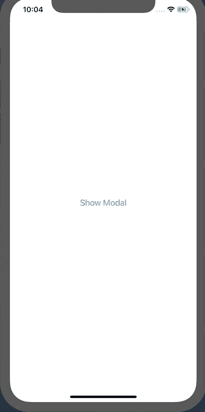
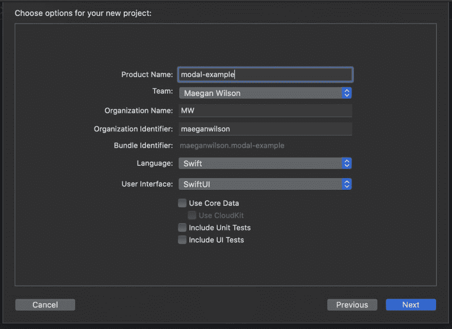
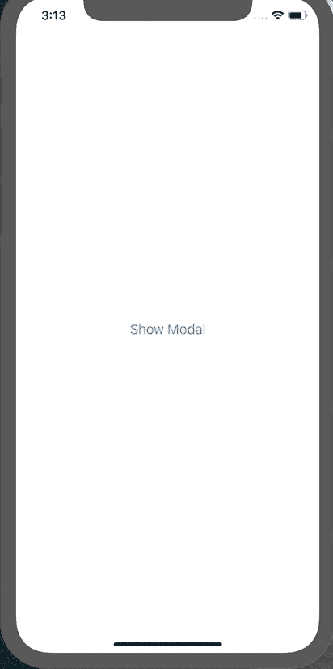
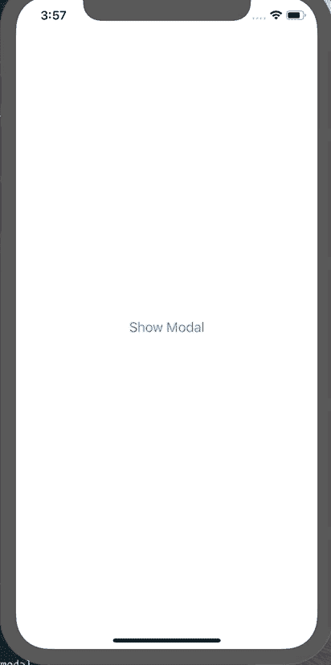

# 如何在 SwiftUI 中显示和关闭模态

> 原文：<https://dev.to/maeganwilson_/how-to-present-and-dismiss-a-modal-in-swiftui-155c>

# 如何在 SwiftUI 中呈现和取消模态

在本帖中，我们将介绍如何呈现和消除模态视图。

[](https://res.cloudinary.com/practicaldev/image/fetch/s---SPsFtVk--/c_limit%2Cf_auto%2Cfl_progressive%2Cq_66%2Cw_880/https://github.com/maeganjwilson/swiftui-show-modal-tutorial/blob/master/blimg/present-dismiss.gif%3Fraw%3Dtrue)

在这个 Github Repo 上找到源代码。

##  [梅根威尔逊](https://github.com/maeganwilson)/[swift ui-show-modal-tutorial](https://github.com/maeganwilson/swiftui-show-modal-tutorial)

### SwiftUI 关于如何呈现和消除模态的教程

<article class="markdown-body entry-content container-lg" itemprop="text">

# swift ui-show-modal-教程

SwiftUI 关于如何呈现和消除模态的教程

</article>

[View on GitHub](https://github.com/maeganwilson/swiftui-show-modal-tutorial)

**注**:本教程使用的是 **Xcode 11** ，已经使用 **iOS 13.1.2** 测试。

让我们从使用 SwiftUI 创建一个新项目开始。创建新项目时，确保语言设置为 Swift，用户界面配置为 SwiftUI，如下图所示。

[](https://res.cloudinary.com/practicaldev/image/fetch/s--xq09u-Go--/c_limit%2Cf_auto%2Cfl_progressive%2Cq_auto%2Cw_880/https://github.com/maeganjwilson/swiftui-show-modal-tutorial/blob/master/blimg/new-project.png%3Fraw%3Dtrue)

## `show_modal`变

既然项目已经完成，我们需要打开`ContentView.swift`文件来声明一个变量，该变量决定是否呈现模态。

```
struct ContentView: View {
    // Declare this state variable below
    @State private var show_modal: Bool = false

    var body: some View {
        Text("Hello World")
    }
} 
```

<svg width="20px" height="20px" viewBox="0 0 24 24" class="highlight-action crayons-icon highlight-action--fullscreen-on"><title>Enter fullscreen mode</title></svg> <svg width="20px" height="20px" viewBox="0 0 24 24" class="highlight-action crayons-icon highlight-action--fullscreen-off"><title>Exit fullscreen mode</title></svg>

该变量必须是一个绑定变量，并且在改变时可以更新视图，这就是为什么我们将它声明为状态变量。

## 按钮改变状态！

让我们将`Text()`改为`Button()`，将`show_modal`设置为`true`。

```
Button(action: {
        print("Button Pushed")
        self.show_modal = true
    }) {
        Text("Show Modal")
} 
```

<svg width="20px" height="20px" viewBox="0 0 24 24" class="highlight-action crayons-icon highlight-action--fullscreen-on"><title>Enter fullscreen mode</title></svg> <svg width="20px" height="20px" viewBox="0 0 24 24" class="highlight-action crayons-icon highlight-action--fullscreen-off"><title>Exit fullscreen mode</title></svg>

我添加了一个`print()`语句来确保按钮工作。
继续运行应用程序(Command + R)并点击按钮。点击按钮，控制台上将显示“按钮已按下”。

## 创建模态视图

现在，让我们创建模态视图。创建一个新文件，并将文本更改为“这是一个模态”它应该类似于下面的代码片段。

```
import SwiftUI

struct ModalView: View {
    var body: some View {
        Text("This is a modal")
    }
} 
```

<svg width="20px" height="20px" viewBox="0 0 24 24" class="highlight-action crayons-icon highlight-action--fullscreen-on"><title>Enter fullscreen mode</title></svg> <svg width="20px" height="20px" viewBox="0 0 24 24" class="highlight-action crayons-icon highlight-action--fullscreen-off"><title>Exit fullscreen mode</title></svg>

## 使情态出现

是时候让模态出现在第一个视图的按钮上了。打开`ContentView.swift`并将以下内容添加到按钮。

```
Button(action: {
        print("Button Pushed")
        self.show_modal = true
    }) {
        Text("Show Modal")
    }.sheet(isPresented: self.$show_modal) {
         ModalView()
        } 
```

<svg width="20px" height="20px" viewBox="0 0 24 24" class="highlight-action crayons-icon highlight-action--fullscreen-on"><title>Enter fullscreen mode</title></svg> <svg width="20px" height="20px" viewBox="0 0 24 24" class="highlight-action crayons-icon highlight-action--fullscreen-off"><title>Exit fullscreen mode</title></svg>

`.sheet() // more code`是做什么的？它决定当`show_modal`改变时`ModalView`是否应该出现。

`.sheet(isPresented: Binding<Bool>){ /* View to present */}`是一个修饰语，当`isPresented`为`true`时可以呈现视图。在我们的例子中，`show_modal`是一个`Binding<Bool>`，因为它是用`@State`声明的。我们还将视图设置为`ModalView()`。

现在应该是完整的，看起来像这样。

```
import SwiftUI

struct ContentView: View {
    @State private var show_modal: Bool = false

    var body: some View {
        Button(action: {
            print("Button Pushed")
            self.show_modal = true
        }) {
            Text("Show Modal")
        }.sheet(isPresented: self.$show_modal) {
            ModalView()
        }
    }
} 
```

<svg width="20px" height="20px" viewBox="0 0 24 24" class="highlight-action crayons-icon highlight-action--fullscreen-on"><title>Enter fullscreen mode</title></svg> <svg width="20px" height="20px" viewBox="0 0 24 24" class="highlight-action crayons-icon highlight-action--fullscreen-off"><title>Exit fullscreen mode</title></svg>

现在运行应用程序，我们可以通过从模型顶部向下拖动来关闭模型。
[T3】](https://res.cloudinary.com/practicaldev/image/fetch/s--IaH4lzaw--/c_limit%2Cf_auto%2Cfl_progressive%2Cq_66%2Cw_880/https://github.com/maeganjwilson/swiftui-show-modal-tutorial/blob/master/blimg/drag-to-dismiss.gif%3Fraw%3Dtrue)

## 添加一个辞退按钮

拖动可以解除操作，但有时用户会点击一个按钮，或者您可能希望用户点击按钮进行确认，而拖动会取消操作。要添加一个按钮来解除模态，我们需要为`presentationMode`添加一个环境变量，然后调用`presentationMode.wrappedValue.dismiss()`。这是它在`ModalView.swift`的样子。

```
struct ModalView: View {
    // 1\. Add the environment variable
    @Environment(\.presentationMode) var presentationMode

    var body: some View {
        // 2\. Embed Text in a VStack
        VStack {
            // 3\. Add a button with the following action
            Button(action: {
                print("dismisses form")
                self.presentationMode.wrappedValue.dismiss()
            }) {
                Text("Dismiss")
            }.padding(.bottom, 50)
            Text("This is a modal")
        }
    }
} 
```

<svg width="20px" height="20px" viewBox="0 0 24 24" class="highlight-action crayons-icon highlight-action--fullscreen-on"><title>Enter fullscreen mode</title></svg> <svg width="20px" height="20px" viewBox="0 0 24 24" class="highlight-action crayons-icon highlight-action--fullscreen-off"><title>Exit fullscreen mode</title></svg>

我要把我们做的事情分解一下。

1.  **添加环境变量。**这个环境变量决定了何时取消模态。
2.  将文本嵌入 VStack 中。我们这样做是为了能够在文本顶部有一个按钮视图。
3.  **添加一个按钮，动作如下。**按钮中的动作是点击按钮时要执行的动作。`self.presentaionMode.wrappedValue.dismiss()`是解除模态的方法。

现在，运行应用程序，我们可以通过拖动或点击按钮来关闭视图。

[](https://res.cloudinary.com/practicaldev/image/fetch/s--68WMq4q5--/c_limit%2Cf_auto%2Cfl_progressive%2Cq_66%2Cw_880/https://github.com/maeganjwilson/swiftui-show-modal-tutorial/blob/master/blimg/button-drag.gif%3Fraw%3Dtrue)

* * *

如果你喜欢我的帖子，请考虑分享或者请我喝杯咖啡！

[](https://www.buymeacoffee.com/appsbymw)

* * *

# 编辑#1:

被[@ chooten](https://twitter.com/cwhooten)问如何做一个呈现动态模态的列表。[点击这个句子](https://github.com/maeganjwilson/swiftui-show-modal-tutorial/tree/list-example)，你可以找到那个答案，作为原始例子的一个分支。

# 编辑#2:

更新了顶部的注释。

# 编辑#3:

更新了顶部的注释，因为它已经过 Xcode 版本和 iOS 13 版本的测试。