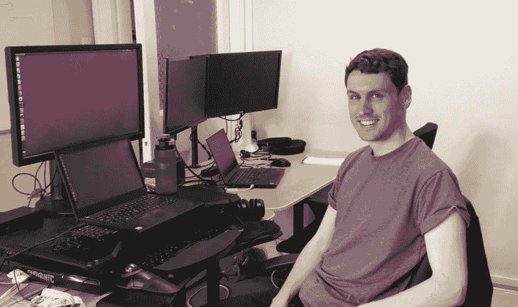
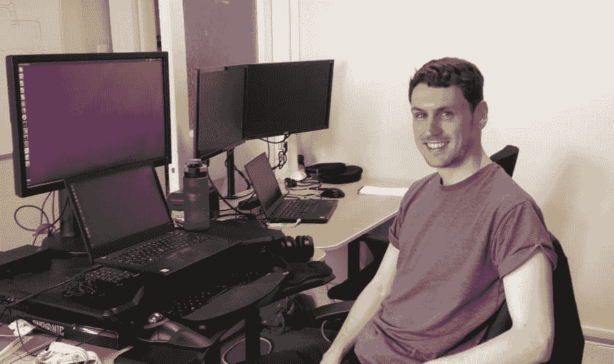
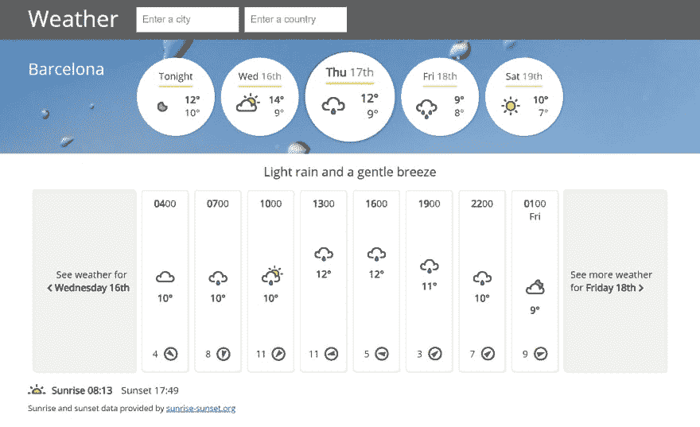

# 9 个月从编码新手到前端开发者

> 原文：<https://dev.to/petecodes/from-coding-newbie-to-front-end-developer-in-9-months-48lb>

几个月前，我在我居住的苏格兰爱丁堡参加了一个编码聚会，遇到了 Josh Carvel，他当时说他正在抽出时间从头开始学习编码。几个月后我见到他时，他已经找到了一份前端开发的工作，并成功地完成了他的使命！我和他谈到了如何自学编码，他正在做什么，以及如何给新手编码。

## 我看到你经过几个月的自学，得到了自己的第一份软件开发员工作。你能告诉我一些关于这个角色的事情吗？

我是 Annotate Software 的一名前端开发人员，主要负责提供一个数字化的工作场所来管理和协作文档。我正在开发一个全新的代码库，它将取代旧的产品。前端用的是 React，我用了很久了，还有 TypeScript，我是边干边学的。通过学习 Java、Spring Boot 和 MongoDB，我还扩展到了后端，这是我以前没有做过的。

## 你会给新手什么建议？

我有很多话要说，包括我在 Twitter 上发布的所有关于自学的内容。但如果我必须说几件事，那就是慢慢来，不要牺牲你的精神或身体健康，永远试着对自己和你的潜力保持积极的态度——这个过程非常混乱，坚持下去，直到你成功。

## **想要一份开发人员的工作却没有学位？通过 [Triple Byte 的测验](https://triplebyte.com/a/Ww4mbM6/d)，直接进入顶级科技公司的最终现场面试**

## 从开始编码到被录用用了多长时间？你能解释一下你是如何这么快就开始学习的吗？

总的来说，学习时间超过了一年，但是从我开始认真学习的时候，学习时间是 9 个月(6 个月是全日制)。2018 年初左右开始很随便的学习编码基础。大部分时间，我都在努力理解我需要学习什么，以及我能找到什么样的工作。这是相当压倒性的，一开始进展缓慢。我要学的东西太多了，但是我知道我需要 HTML、CSS 和 JS，所以我从代码学院开始。

我会在早上上班前学习一下。我只是在学习绝对的基础知识，在这一点上我甚至不知道什么是 IDE，我实际上也没有做过任何东西。我也读了很多关于学习编码的文章，听了播客上人们的故事，比如跟我学编码和 CodeNewbies。我认为重要的是要记住，你不能跳过这一步——这需要时间来了解一个开发者实际上是做什么的，你想走什么路线，这个行业是什么样的，使用什么工具。

我的雇主允许我暂停职业生涯，我有足够的积蓄可以应付 6 个月不工作的情况。它始于 2018 年 9 月 1 日。受到网上“我如何在 3 个月内学会编码并获得一份开发人员的工作”风格文章的启发，我自信地认为我将在 3 个月内学会足够的知识来获得一份工作，花一个月申请并在 2019 年被雇用。乐观没有坏处，但当我投身其中时，我并没有真正理解这项事业的艰巨性。也有一些时候，我感到压力和沮丧，其他生活中的事情也妨碍了我。2019 年 2 月，我开始申请工作，这是我职业生涯中断的最后一个月，尽管我当时实际上并没有准备好。

我在三月份回到了我的工作岗位，并试图继续学习，尽管适应一份全职工作和申请工作是很困难的。我设法把我的工作模式改为一周 4 天，给我更多的时间，动用我最后的积蓄来支付这笔费用。四月底我拒绝了一份工作，五月底我接受了这份工作。

就我如何相对快速地找到工作而言，有很多事情我可以提及。选择一个工作角色(我对全栈开发感兴趣，但把它缩小到获得一份前端开发人员的工作)并从那里向后工作会有所帮助。你想学习最受欢迎的技能(学习 React 对我来说效果很好)。你想学习你需要知道的最少的东西，因为学习需要的时间比你想象的要长。

人们认为他们需要学习更多的东西来获得一份开发人员的工作——你真正需要的是擅长你所知道的，并推销这种能力和你学习更多的能力。自学是一种极好的资产，你需要抓住每一个机会向雇主推销。基本上，我得到了一份了解 HTML、CSS、JavaScript 和 React 的工作。你还可以学到其他东西，但这是它的核心。

此外，我把大部分时间花在了自己独特的项目上。这不一定是一个独特的想法——我建立了一个天气应用程序——你可以从教程中获取东西，但最终结果必须是你的。你永远不会 100%高效地学习，但我的大部分效率都来自于不得不解决自己的问题，日复一日，一小时又一小时，一分钟又一分钟。

从某种意义上说，你真的只需要一件事来学习编码:访问谷歌。在我学习编码的所有时间里，没有一个问题是我不能用这种方式解决的(除了一个涉及 CSS 和滚动的奇怪的边缘案例，我有时仍然对此感到疑惑……)。那么这一切都归结于坚持，一致性和信心。

## 你是如何以及为什么进入编码行业的？你以前在做什么？

我考虑了很多职业路线，但从来没有找到一个我想承诺的。我获得了法律学位，但从未真正打算成为一名律师，这个想法也没有激励我。我一生中最大的爱好一直是音乐。音乐职业对我来说似乎不太实际(我没有接受过正式训练)，其他任何职业似乎都没有吸引力。这看起来像是要进入的东西，但我从来没有对技术感兴趣，尽管我总是擅长弄清楚如何使用它。我也一直认为我需要一个计算机科学学位才能进入这个领域，但这在经济上似乎不可行，因为我已经获得了学位，所以我从未追求过。

我在苏格兰议会工作了几年，做过管理员、询问官，最后是网络和社交媒体团队的助理。网站编辑是通过 CMS 完成的，但第一次学习 HTML 让我对 web 开发充满了好奇。以技术制造东西为生的想法真的让我很兴奋。可能性似乎无穷无尽。我不仅能运用逻辑规则，还能真正发挥创造力。这似乎非常适合我的技能。然后是更随意的工作环境，远程工作和自由职业的可能性。我决心成为一名开发人员——当时唯一的问题是如何做。

## [没有 CS OK——没有学位的开发者的工作板](https://nocsok.com)

## 我好像记得你在学习 React，它以复杂著称。你觉得自学怎么样？

我过早地跳入 React(为了你的理智，先打好 web 开发的基础，并正确理解 JavaScript，尤其是 ES6 的特性)，所以这是一个有点怪异的经历。老实说，学习如何使用它并不困难——实际上理解真正发生了什么是困难的。如果我重新来过，我会用一门 Udemy 的课程，比如安德烈·尼戈伊的《零到精通》，它涵盖了这个问题。我只是从各种 YouTube 教程和 React 文档中学到的(尽管我当时并没有完全理解这些文档)。

一旦你能使用它，理解它，挑战更多的是你的应用程序的架构和保持事物的逻辑和整洁。很多都归结于你长期积累的编程最佳实践——在你学会如何写好代码之前，你必须写垃圾代码。

当然，事情变得更加复杂，因为现在 React hooks 是一个选项，我还没有学会，但显然使事情变得更容易。不学习对我来说很好，因为我目前不需要在工作中使用它——我学习了 Redux(最近)。如果您现在才开始使用 React，那么随着它的应用越来越广泛，您可能会希望深入了解它。

## 你在网上找到什么对学习有帮助的课程或书籍了吗？

我没有使用任何书籍——我喜欢视频教程，其余的我从谷歌搜索和寻找文章和堆栈溢出帖子中获得。如果你在做 JavaScript，一定要读《JavaScript:理解 Udemy 上奇怪的部分》(假设它降价了，通常都是这样)。如果你想看看它是什么样的，在 YouTube 上看一个授权的 3 小时预览[这里](https://t.co/6pexdd1Ap8?amp=1)。

它不是用来构建东西的——它是用来理解语言的，但是它会比你花的时间更有价值。我把它作为凯尔·辛普森的《你不知道的 JS》系列丛书的一种捷径，我总有一天会抽出时间去读它。

在 Udemy 上，我也是零到精通(如上所述),用 Bonnie Schulkin 的 Jest 和 Enzyme 进行反应测试。获得一门测试课程是非常宝贵的，因为否则将很难学习。

你想用什么材料都可以，只要是高认可度的。有很多不同的网站和课程，其中大多数可能都很棒。这只是达到目的的一种手段，实际上是有能力建立你自己的东西，运用你自己的判断，解决你自己的问题。