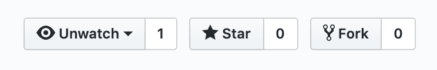

# 你的副业是有用的，即使没人用

> 原文：<https://dev.to/joeattardi/your-side-project-is-useful-even-if-no-one-uses-it-3ife>

这是我的大多数 GitHub 存储库的样子:

我的几个项目有十几个明星，但我的作品大多不为人知。我最受欢迎的项目， [json-colorizer](https://www.npmjs.com/package/json-colorizer) ，已经(在我写这篇文章的时候)每周有大约 4000 次下载。我使用术语“流行”是非常不严谨的，因为对于一个 npm 包来说，这不是很流行。只有 35 个包将其列为依赖项(其中一个是我的另一个项目)。

这很好。我[在创作它](https://dev.to/create-a-basic-lexer)的过程中学到了很多。如果少数人觉得有用，那很好，但这不是我的首要目标。

对我来说，兼职项目的主要目标是学习一些东西，或者实践一些我已经知道的东西。我创建`json-colorizer`的原因是因为我已经创建了另一个项目，简单地命名为 [http-tool](https://www.npmjs.com/package/http-tool) ，用于处理节点的 API 以发出 http 请求。我想对请求的 JSON 响应体进行着色，所以我决定将着色程序创建为一个单独的库。当时，我还不知道[的 jsome](https://www.npmjs.com/package/jsome) 项目，它做的事情和`json-colorizer`一样，但是更受欢迎(大约每周 70，000 次下载)。

另一个项目， [GitHub PR Dashboard](https://github.com/joeattardi/github-pr-dashboard) ，是出于查看跨多个存储库的 GitHub pull 请求的需要而创建的，这是我们经常接触的东西。当时，我刚刚开始学习 React，所以我决定使用 React 构建一个拉请求仪表板。我最终也在那个项目中使用了 Redux 可能有些过头了——但是我学到了很多，而且很有趣。后来，我开始制作一个有棱角的[版本](https://github.com/joeattardi/github-pr-dashboard-angular)，但一直没有完成。这就引出了我的下一个观点...

# 你不需要完成它来从中获得什么

我在 GitHub 上的大部分项目都是半成品或者更少。以下是一些例子:

*   前面提到的 GitHub PR Dashboard 的角度版本
*   [GeekChat](https://github.com/joeattardi/geek-chat) ，一个做多房间聊天 app 的尝试。这主要是一个学习 Vue.js 的项目(唉，我现在几乎都忘了)。
*   [喊](https://github.com/joeattardi/shout)，聊天 app 的又一次尝试，内置 Angular。
*   [API 客户端](https://github.com/joeattardi/api-client)，一个穷人的[邮递员](https://www.getpostman.com/)克隆，一个与电子和反应一起工作的实验。

你明白了。我有许多未完成的项目。有时候，我就是没有时间；其他时候，我会分心，开始一些新的事情。我认为这很好，因为我在这些项目中的每一个工作中都学到了很多。

当然，如果你真的完成了，那总是更好的。完成它并把它放在那里感觉很好。但我的观点是，即使你没有，你仍然可以从中获得很多。

现在，去做点什么吧！