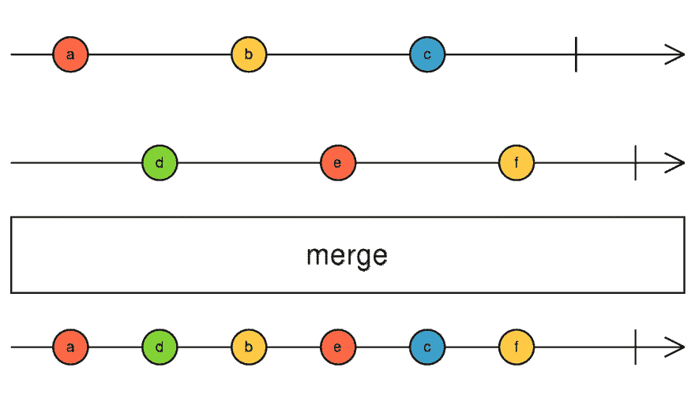

# 在 5 分钟内阐明 RxJS 观察值

> 原文：<https://dev.to/vuesomedev/clarifying-rxjs-observables-under-5-minutes-2dh3>

大多数人，包括我自己，第一次见到 [RxJS](https://rxjs-dev.firebaseapp.com) observables 是在开始开发 [Angular](https://angular.io/) 应用的时候。[可观测量](https://rxjs-dev.firebaseapp.com/guide/observable)是框架的基本要素；你不能做太多事情而不用它们。例如， [HTTP 请求](https://angular.io/guide/http)以可观察的形式返回它们的结果。这样，你可以认为这只是[承诺](https://developer.mozilla.org/en-US/docs/Web/JavaScript/Reference/Global_Objects/Promise)的另一种花哨变体，不要把它们用在其他任何事情上。如果这样做，有时会发生奇怪的事情:HTTP 请求运行了多次，或者根本没有运行，或者事情以随机的顺序发生。在本教程中，我将向你展示我是如何设法理解 Observables 是如何工作的，并使 Angular 开发更加高效和轻松。

### 承诺

开始从 Angular 的角度来看待 HTTP 请求，将其作为一个可选的 Promise 实现可能是一个很好的起点，但也可能是一个误导。它们的 API 有些相似，因为两者都提供了成功和失败回调来监听结果和错误。

```
const observable = api.callWithObservable();
const promise = api.callWithPromise();

observable.subscribe(
  result => { /* on success */ },
  error => { /* on error */ }
);

promise.then(
  result => { /* on success */ },
  error => { /* on error */ }
); 
```

<svg width="20px" height="20px" viewBox="0 0 24 24" class="highlight-action crayons-icon highlight-action--fullscreen-on"><title>Enter fullscreen mode</title></svg> <svg width="20px" height="20px" viewBox="0 0 24 24" class="highlight-action crayons-icon highlight-action--fullscreen-off"><title>Exit fullscreen mode</title></svg>

我们从函数调用开始操作，返回的可观察值/承诺在稍后发出结果/错误。相似之处始于此，止于此。其他一切——执行、结果数量和行为——都不同。

### 多个结果

虽然一个承诺只能产生一次结果，但可观察的结果可以随着时间的推移产生多个值。

```
const observable = Rx.Observable.interval(1000).take(5);

observable.subscribe(
  result => console.log(result),
  error => { /* on error */ },
  () => { /* on complete */ }
); 
```

<svg width="20px" height="20px" viewBox="0 0 24 24" class="highlight-action crayons-icon highlight-action--fullscreen-on"><title>Enter fullscreen mode</title></svg> <svg width="20px" height="20px" viewBox="0 0 24 24" class="highlight-action crayons-icon highlight-action--fullscreen-off"><title>Exit fullscreen mode</title></svg>

在上面的例子中，可观察对象发出延迟一秒的值 0，1，2，3，4，然后完成。subscribe 方法被调用五次，除了它的值之外，我们还可以检测流的结尾。完成后，在 subscribe 函数中调用第三个回调。在那之后，可观察的就不会发出值了。

随着时间的推移发出值使得 Observables 非常类似于 streams(例如在 Node.js 中)。你可能会发现它们也有类似的方法，比如合并两个独立的流或者缓冲(merge，buffer)。

### 同步执行

当一个承诺被解析时，then 回调被异步调用。在 Javascript 事件循环中，then 回调将在下一个循环中执行。相反，在传入一个值后，可观察对象的订阅将被同步执行。

```
let promiseResult;
Promise.resolve(15).then(val => { 
  promiseResult = val;
  console.log('resolved promise', val);
});
console.log('result promise', promiseResult); // result promise undefined

let observableResult;
Rx.Observable.of(15).subscribe(val => {
  observableResult = val;
  console.log('resolved observable', val);
});
console.log('result observable', observableResult); // result observable 15 
```

<svg width="20px" height="20px" viewBox="0 0 24 24" class="highlight-action crayons-icon highlight-action--fullscreen-on"><title>Enter fullscreen mode</title></svg> <svg width="20px" height="20px" viewBox="0 0 24 24" class="highlight-action crayons-icon highlight-action--fullscreen-off"><title>Exit fullscreen mode</title></svg>

如果你运行这个例子，当我们用 console.log 打印它的时候，你会看到在 then 回调中赋值的值仍然是未定义的。

当调用下一个方法时，这种同步执行也适用于主题。

```
const subject = new Rx.Subject();

let observableResult;
subject.subscribe(val => {
  observableResult = val;
  console.log('resolved observable', val);
});

subject.next(15);
console.log('result observable', observableResult); // result observable 15 
```

<svg width="20px" height="20px" viewBox="0 0 24 24" class="highlight-action crayons-icon highlight-action--fullscreen-on"><title>Enter fullscreen mode</title></svg> <svg width="20px" height="20px" viewBox="0 0 24 24" class="highlight-action crayons-icon highlight-action--fullscreen-off"><title>Exit fullscreen mode</title></svg>

已解析的日志将出现在控制台中的结果之前，因为它会同步遍历所有订阅。

### 多次执行

你有没有经历过多次订阅一个可观察的东西会变得很奇怪？比如被多次执行，比如一个 HTTP 请求？

这是因为，当调用 subscribe 方法时，会为可观察对象创建一个单独的执行。如果该执行包含一个 HTTP 请求，端点将被再次调用。

```
const observable = Rx.Observable.interval(1000).take(5);

observable
  .subscribe(x => console.log('A next ' + x)); // create an execution

setTimeout(() => {
  observable
    .subscribe(x => console.log('B next ' + x)); // create an execution
}, 2000);

// A next 0
// A next 1
// B next 0
// A next 2
// B next 1
// A next 3 
```

<svg width="20px" height="20px" viewBox="0 0 24 24" class="highlight-action crayons-icon highlight-action--fullscreen-on"><title>Enter fullscreen mode</title></svg> <svg width="20px" height="20px" viewBox="0 0 24 24" class="highlight-action crayons-icon highlight-action--fullscreen-off"><title>Exit fullscreen mode</title></svg>

我们期望 2 秒钟后到达的第二个订阅(B)接收与第一个订阅相同的值。但实际上，B 从一开始就得到这些值，只是延迟了 2 秒。这背后的原因是，每个 subscribe 方法都创建一个新的执行，与前一个方法分开重新启动可观察对象。

当你对同一个承诺写多个 then 方法时，承诺不会重新开始；它们异步执行并获得相同的值。为了用 Observables 创建相同的行为，我们必须应用 share 操作符，它为每个订阅提供相同的执行。在后台，操作员创建一个主题并将值传递给它。

### 阵列方法

虽然 Promises 只有 then 方法来改变返回值，但 Observables 有多种方法。这些方法的命名与数组方法非常相似。

```
promise
  .then(value => value + 5)
  .then(value => Promise.resolve(9));

observable.pipe(
  map(value => value + 5),
  flatMap(value => Rx.Observable.of(9)),
  filter(value => value > 5)
); 
```

<svg width="20px" height="20px" viewBox="0 0 24 24" class="highlight-action crayons-icon highlight-action--fullscreen-on"><title>Enter fullscreen mode</title></svg> <svg width="20px" height="20px" viewBox="0 0 24 24" class="highlight-action crayons-icon highlight-action--fullscreen-off"><title>Exit fullscreen mode</title></svg>

在 then 方法中，您可以返回一个新值或一个新承诺。它的行为是一样的；下一个 then 方法获取先前返回的值。对于可观测量，我们必须区分同步(map)和异步(flatMap)转换。Observables 也有很多数组方法(filter，reduce，join，includes 等。)和来自实用程序库的数组方法(Lodash:puck，groupBy 等。)

### 还不清楚？

当我在学习观察的时候，[rx marbles 网站](https://rxmarbles.com/)是让它们变得清晰的网站。RxMarbles 是描述可观察组合行为的时间线上的图形表示。不同的颜色意味着来自不同来源的不同事件以及它们的行为方式，例如，当我们合并它们时。

[](https://res.cloudinary.com/practicaldev/image/fetch/s--_gCXiCMF--/c_limit%2Cf_auto%2Cfl_progressive%2Cq_auto%2Cw_880/https://thepracticaldev.s3.amazonaws.com/i/clyed2rfu51t23bd6mrm.png)

### 总结

通过承诺，有可能理解可观察到的事物，但你必须知道它们的区别:

*   一段时间内的多个值
*   同步回调
*   多次执行
*   类似数组的方法

希望上面的比较已经澄清了误解和不明显的地方。要进一步学习，我会推荐阅读 andréStaltz(RxJS 的核心撰稿人)的[博客，听听他在 Egghead](https://staltz.com/blog.html) 上的[教程。](https://egghead.io/instructors/andre-staltz)