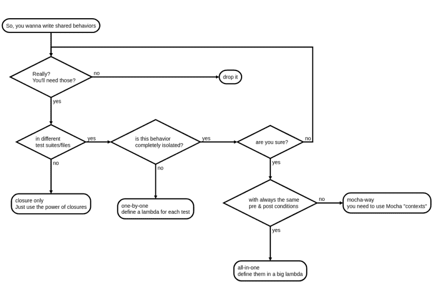

# 与摩卡分享最佳行为实践

> 原文：<https://dev.to/open-wc/shared-behaviors-best-practices-with-mocha-519d>

像你们许多人一样，我喜欢单元测试！因为良好的代码覆盖率让我充满信心。测试帮助我理解代码是关于什么的。最重要的是，它们让我在调试时不那么沮丧😉

但是当开发人员编写或阅读测试时，有些事情会让他们感到沮丧:**共享行为**。

我认为这有两个原因:

1.  共享行为通常会导致过度工程化的测试
2.  做这件事有太多(不好的)方法

所以，喝一杯好茶，放松一下，让我们看看一些正确的方法...

## TL；博士

在 Github 上查看相关项目中的示例和决策流程图:

## /[摩卡共享行为](https://github.com/noelmace/mocha-shared-behaviors)

### 与摩卡分享行为

<article class="markdown-body entry-content container-lg" itemprop="text">

# 与摩卡分享行为

[](https://github.com/noelmace/mocha-shared-behaviors./decision.flowchart.svg)

## 参考

*   [摩卡维基上的分享行为](https://github.com/mochajs/mocha/wiki/Shared-Behaviours)
*   关于@open-wc 中[共享行为最佳实践](https://github.com/open-wc/open-wc/issues/715)的讨论
*   [摩卡吉特](https://gitter.im/mochajs/mocha)

### 问题

*   <g-emoji class="g-emoji" alias="coffee" fallback-src="https://github.githubassets.cimg/icons/emoji/unicode/2615.png">☕</g-emoji> 摩卡- [增强:支持箭头功能的新界面](https://github.com/mochajs/mocha/issues/2657)
*   <g-emoji class="g-emoji" alias="coffee" fallback-src="https://github.githubassets.cimg/icons/emoji/unicode/2615.png">☕</g-emoji> 摩卡- [上下文变量和函数](https://github.com/mochajs/mocha/issues/2743)
*   <g-emoji class="g-emoji" alias="coffee" fallback-src="https://github.githubassets.cimg/icons/emoji/unicode/2615.png">☕</g-emoji> 摩卡- [想法:范围全局](https://github.com/mochajs/mocha/issues/2656)
*   <g-emoji class="g-emoji" alias="x" fallback-src="https://github.githubassets.cimg/icons/emoji/unicode/274c.png">❌</g-emoji> <g-emoji class="g-emoji" alias="coffee" fallback-src="https://github.githubassets.cimg/icons/emoji/unicode/2615.png">☕</g-emoji> 摩卡- [摩卡鼓励`this`分享行为吗？](https://github.com/mochajs/mocha/issues/3844)
*   <g-emoji class="g-emoji" alias="x" fallback-src="https://github.githubassets.cimg/icons/emoji/unicode/274c.png">❌</g-emoji>T2】☕摩卡- [增强测试上下文控制](https://github.com/mochajs/mocha/issues/3485)
*   <g-emoji class="g-emoji" alias="x" fallback-src="https://github.githubassets.cimg/icons/emoji/unicode/274c.png">❌</g-emoji>T2】☕摩卡- [将 ES5 箭头函数绑定到上下文](https://github.com/mochajs/mocha/issues/1856)

### 一对

*   <g-emoji class="g-emoji" alias="coffee" fallback-src="https://github.githubassets.cimg/icons/emoji/unicode/2615.png">☕</g-emoji> 摩卡- [“功能性”界面初步实现](https://github.com/mochajs/mocha/pull/3399)(2018-12-12 后无更新)

### 项目

*   [摩卡-语境](https://github.com/eight04/mocha-context)
*   [arrow-mocha](https://github.com/skozin/arrow-mocha)(2015-04-07 后无更新)

### 此外...

*   茉莉医生
    *   [分享行为教程](https://github.com/jasmine/jasmine.github.io/blob/f66bb73533bc027d4f0be99d44f84ecbf614edf4/_tutorials/sharing_behaviors.md)
    *   [`this`关键词](https://jasmine.github.io/tutorials/your_first_suite.html#section-The_%3Ccode%3Ethis%3C/code%3E_keyword)
*   人们做什么
    *   [https://github . com/GNOME/gjs/commit/f7c 4757 D6 DFD 35 da 49 f 898 a 128521d 353 bb 05061](https://github.com/GNOME/gjs/commit/f7c4757d6dfd35da49f898a128521d353bb05061)
    *   [流星/指南#318](https://github.com/meteor/guide/issues/318)

</article>

[View on GitHub](https://github.com/noelmace/mocha-shared-behaviors)

## 我这里要讲的是

*   [摩卡推荐](#mocha-way)
*   [接吻原理](#kiss)
*   [在 Mocha 中使用箭头功能时出现的问题](#mocha-arrow)
*   替代方法
    1.  [一体机](#all-in-one)
    2.  [一个接一个](#one-by-one)
    3.  [仅关闭](#closures-only)
*   摘要
    *   [要求，优点&缺点](#pro-cons)
    *   [【指引】](#guidelines)

## (老)摩卡道

> Github ➡️ [测试/mocha-way](https://github.com/noelmace/mocha-shared-behaviors/tree/master/test/mocha-way) 上的完整示例

重要的事情先来！让我们看看摩卡[文档](https://github.com/mochajs/mocha/wiki/Shared-Behaviours)
本身是怎么说的。

Mocha 将其上下文(Mocha“上下文”，也称为“this”关键字)绑定到您给它的每个回调。也就是说，在你赋予`describe`、`before`、`beforeEach`、`it`、`after`、&、`afterEach`的函数中，你可以将任何你想要的数据或函数赋给`this`，使其可供所有回调在同一个`describe`中调用。

为了说明如何使用它来编写共享行为，Mocha 给出了下面的例子。

> 仅供参考，我冒昧地将这段代码更新为“Open WC”，使用 ES 模块和`expect`而不是 CommonJS 和
> T1。

这是我们想要测试的代码。

```
/// user.js
export function User(first, last) {
  this.name = {
    first: first,
    last: last
  };
}

User.prototype.fullname = function() {
  return this.name.first + '  ' + this.name.last;
};

/// admin.js
import { User } from './user.js';

export function Admin(first, last) {
  User.call(this, first, last);
  this.admin = true;
}

Admin.prototype.__proto__ = User.prototype; 
```

Enter fullscreen mode Exit fullscreen mode

`Admin`明显与`User`有一些行为相同。因此，我们可以使用“上下文”在函数中编写这些共享行为:

```
/// helpers.js
import { expect } from '@open-wc/testing';

export function shouldBehaveLikeAUser() {
  it('should have .name.first', function() {
    expect(this.user.name.first).to.equal('tobi');
  });

  it('should have .name.last', function() {
    expect(this.user.name.last).to.equal('holowaychuk');
  });

  describe('.fullname()', function() {
    it('should return the full name', function() {
      expect(this.user.fullname()).to.equal('tobi holowaychuk');
    });
  });
} 
```

Enter fullscreen mode Exit fullscreen mode

最后，下面是测试:

```
/// user.test.js
import { User } from '../user.js';
import { shouldBehaveLikeAUser } from './helpers.js';
import { expect } from '@open-wc/testing';

describe('User', function() {
  beforeEach(function() {
    this.user = new User('tobi', 'holowaychuk');
  });

  shouldBehaveLikeAUser();
});

/// admin.test.js
import { User } from '../user.js';
import { shouldBehaveLikeAUser } from './helpers.js';
import { expect } from '@open-wc/testing';

describe('Admin', function() {
  beforeEach(function() {
    this.user = new Admin('tobi', 'holowaychuk');
  });

  shouldBehaveLikeAUser();

  it('should be an .admin', function() {
    expect(this.user.admin).to.be.true;
  });
}); 
```

Enter fullscreen mode Exit fullscreen mode

### 这种做法有什么不好

这个维基页面[自 2012 年 1 月以来就没有(显著地)编辑过](https://github.com/mochajs/mocha/wiki/Shared-Behaviours/_history)！远在 ES2015 之前！

这就是为什么摩卡在 2015 年决定[不鼓励使用箭头功能](https://github.com/mochajs/mocha/commit/2a91194f74ba09a4cf345b6accce2abac91b473a)...并且此后没有对文档的这一部分进行更新。

它很旧了。也没有关于字段所有权的文档，所以任何时候使用 Mocha“上下文”都会暴露在未来的冲突中。

然而，这些都不是这种方法的主要问题。使用它，没有办法清楚地识别你的共享行为的需求。换句话说，在它的声明上下文(即闭包)或函数签名(即参数)中看不到所需的数据类型和签名。对于可读性和可维护性来说，这不是最好的选择。

关于这种方法有一些正在进行的讨论。特别值得注意的是:2014 年 7 月以来 Mocha 的维护者 Christopher Hiller(又名 Boneskull)在 2018 年 5 月发表了一个[“功能性”界面](https://github.com/mochajs/mocha/pull/3399)的首次尝试(关于这方面的更多信息，本文末尾有参考文献)。然而，这个公关仍然是开放的，我认为，我们不能期待在这方面很快有任何进展。

## 保持简单，笨蛋！(吻)

简而言之:**过度工程化是在测试中定义共享行为的主要危险之一**！

我相信 [KISS 原则](https://en.wikipedia.org/wiki/KISS_principle#In_software_development)是你写测试时要记住的关键原则。想想 [YAGNI](https://martinfowler.com/bliki/Yagni.html) (“你不会需要它”的缩写)。不要在**必要之前添加功能**！大多数情况下， [*越差越好*](http://dreamsongs.com/WorseIsBetter.html) ！

接吻是所有优秀工程的核心。但说到测试，那是它的聚变反应堆核心💣！如果你忘记了这一点，这是你的项目的启示！保证！

如果你还有疑问，这里有一个权威的论证😉：

Jasmine 允许像 Mocha 一样处理共享行为(即使用“this”关键字)。出于对同一问题的关注，贡献者在相关文档页面中添加了以下“注意事项”一章。

> 在测试中分享行为可能是一个强大的工具，但是要小心使用。
> 
> *   过度使用复杂的助手函数会导致测试中的逻辑混乱，这反过来可能会有它自己的 bug——bug
>     可能会让你认为你在测试你没有测试的东西。特别要注意助手函数中的条件逻辑(if
>     语句)。
>     
>     
> *   由测试循环和辅助函数定义大量测试会让开发人员的日子更难过。例如，如果您的测试名称是在运行时拼凑起来的，那么搜索一个失败的规范的名称可能会更加困难。如果
>     需求发生变化，一个功能可能不再像其他功能那样“符合模型”,这迫使开发人员做更多的
>     重构，而不是仅仅单独列出测试。

因此，使用“`this`关键字”编写共享行为是可行的。它有时会非常有用。但是它也会给你的测试带来很多不必要的复杂性。

尽可能避免使用摩卡语境！
*同样适用于一般的共享行为！*

让我们解构前面的例子，一步一步地最小化它的复杂性。

## 用箭头函数搭配摩卡

> Github ➡️ [测试/mocha-way-arrow](https://github.com/noelmace/mocha-shared-behaviors/tree/master/test/mocha-way-arrow) 的完整示例

回到[【功能】界面](https://github.com/mochajs/mocha/pull/3399) PR。为什么我们首先需要 Mocha 中的“功能性”界面？

让我们试着用一个箭头函数重写前面的例子。当然，lambda 没有“this”，所以这里我用它的闭包。

```
/// helpers.js
export function shouldBehaveLikeAUser(user) {
  it('should have .name.first', () => {
    expect(user.name.first).to.equal('tobi');
  });
  // other tests
}

/// user.test.js
describe('User', () => {
  let user;

  beforeEach(() => {
    user = new User('tobi', 'holowaychuk');
  });

  shouldBehaveLikeAUser(user);
}); 
```

Enter fullscreen mode Exit fullscreen mode

让我们运行这个...💥它失败了！

```
TypeError: Cannot read property 'name' of undefined
  at Context.name (test/helpers.js:5:17) 
```

Enter fullscreen mode Exit fullscreen mode

这是因为 Mocha 首先识别并“记录”您的测试套件，然后*运行您的回调。所以在这里，它运行`beforeEach`和`shouldBehaveLikeAUser` ( `user`在这一点上没有定义)，并且只有*，然后是* `beforeEach.fn`和`it.fn`。*

## 【一体机】

> Github ➡️ [测试/一体机](https://github.com/noelmace/mocha-shared-behaviors/tree/master/test/all-in-one)上的完整示例

一种解决方案是移动`shouldBehaveLikeAUser`中的`beforeEach`。

```
/// helpers.js
export function shouldBehaveLikeAUser(buildUserFn, { firstName, lastName, fullname }) {
  let userLike;

  beforeEach(() => {
    userLike = buildUserFn();
  });

  it('should have .name.first', () => {
    expect(userLike.name.first).to.equal(firstName);
  });
  // other tests
};

/// user.test.js
describe('User', () => {
  shouldBehaveLikeAUser(() => new User("tobi", "holowaychuk"), {
    firstName: "tobi",
    lastName: "holowaychuk",
    fullname: 'tobi holowaychuk'
  });
});

/// admin.test.js
describe('Admin', () => {
  shouldBehaveLikeAUser(() => new Admin("tobi", "holowaychuk"), {
    firstName: "tobi",
    lastName: "holowaychuk",
    fullname: 'tobi holowaychuk'
  });
}); 
```

Enter fullscreen mode Exit fullscreen mode

在这里，没有什么是“隐藏的”通过查看签名，我们知道`shouldBehaveLikeAUser`将测试您给出的构造函数是否符合“用户”行为定义。这可以通过添加 JSDoc [@param](https://dev.to/param) 或一些类型脚本来增强。

而且是自给自足。这里没有副作用或关闭要求。

更重要的是，它是完全孤立的！不能重用`userLike`！你必须重复你自己，像这样:

```
it('should be an .admin', () => {
  expect(new Admin().admin).to.be.true;
}); 
```

Enter fullscreen mode Exit fullscreen mode

这最后一点可以被视为一个问题。然而，我相信这实际上是一种优势！很明显，如果您在使用它之前或之后需要相同的设置，这个助手并不真正有用。当且仅当您实际测试一个复杂的、自给自足的行为时，您才应该使用它。

## 【一一】

> Github ➡️ [测试/逐个测试](https://github.com/noelmace/mocha-shared-behaviors/tree/master/test/one-by-one)的完整示例

如果你需要分享设置，这可能意味着你的行为没有被很好地定义或识别。或者也许你不应该从事这种复杂程度的工作( *YAGNI* )，记得吗？).

像下面的例子一样，逐个规范地定义行为通常更简单。

```
/// helpers.js
export const expectUserLike = user => ({
  toHaveNameFirstAs: expectation => {
    expect(user.name.first).to.equal(expectation);
  },
  toHaveNameLastAs: expectation => {
    expect(user.name.last).to.equal(expectation);
  },
  toHaveFullnameThatReturnAs: expectation => {
    expect(user.fullname()).to.equal(expectation);
  }
});

/// user.test.js
let user = 'foo';
const constructorArgs = ['tobi', 'holowaychuk'];

describe('User', () => {
  beforeEach(() => {
    user = new User(...constructorArgs);
  });

  it('should have .name.first', () => {
    expectUserLike(user).toHaveNameFirstAs(constructorArgs[0]);
  });

  // other tests
}); 
```

Enter fullscreen mode Exit fullscreen mode

现在，这种共享行为不再是孤立的了。这很简单💋！

不能测试行为的每一个方面，或者定义一个顺序、规格描述、安装和拆卸，对于一些用例来说可能是一个重要的缺点。然而，在我看来，这并不像你想的那样经常需要。

这种方法通常是我的首选。简单、明确的**和**允许在单独的文件中定义共享行为。

然而，我只在绝对需要单独的文件时才使用它。

## 关闭的力量

> Github ➡️ [测试/关闭](https://github.com/noelmace/mocha-shared-behaviors/tree/master/test/closure)的完整示例

如果不是，只需使用 lambda 闭包在共享行为之间共享数据。

举第一个例子，来自 Mocha Wiki。`user.test.js`和`admin.test.js`其实在一个文件里，`test.js`。`User`和`Admin`来自同一个“特性范围”，所以把这两个作为一个整体来测试是正确的，也是合乎逻辑的。

有了这个想法，我们再稍微重构一下。

```
let userLike;

const shouldBehaveLikeAUser = (firstName, lastName) => {
  it('should have .name.first', () => {
    expect(userLike.name.first).to.equal(firstName);
  });
  // other tests
};

describe('User', () => {
  const firstName = 'tobi';
  const lastName = 'holowachuk';

  beforeEach(() => {
    userLike = new User(firstName, lastName);
  });

  shouldBehaveLikeAUser(firstName, lastName);
});

describe('Admin', () => {
  const firstName = 'foo';
  const lastName = 'bar';

  beforeEach(() => {
    userLike = new Admin(firstName, lastName);
  });

  shouldBehaveLikeAUser(firstName, lastName);

  it('should be an .admin', () => {
    expect(userLike.admin).to.be.true;
  });
}); 
```

Enter fullscreen mode Exit fullscreen mode

这是你能得到的最低级的共享行为。这是一个“给予或接受”:要么你以这种方式分享一些行为，要么你需要重复自己(有时很多)。你猜怎么着:两者都没问题。

所以，这里是你应该用 Mocha 编写共享行为的所有最佳方式。现在你知道如果你需要他们中的任何一个该怎么做了。🙂

但是记住:在问你应该如何**编写**测试之前，问问你自己你应该如何**设计**你的测试。

> 例如，当遵循 [Given-When-Then](https://martinfowler.com/bliki/GivenWhenThen.html) 方法(我经常这么做)时，像我上面所做的那样使用闭包非常方便。但是您也可以编写自己的 Chai 扩展...或者全新的测试库。但这些是另一个时间的话题。也许我应该尽快写一些博客。敬请期待😉！

## 总结

### 要求，利弊&利弊

|  | [摩卡`this`T2】](#mocha-way) | [一体机](#all-in-one) | [一个接一个](#one-by-one) | [仅关闭](#closure) |
| --- | --- | --- | --- | --- |
| 👍吻💋 | -好的 | -好的 | ✔️ | 981 号房 |
| 👍没有副作用或关闭 | -好的 | ✔️ | ✔️ | -好的 |
| 👍没有隐藏也没有添加逻辑 | -好的 | -好的 | 981 号房 | 981 号房 |
| 同时进行几项测试 | ✔️ | ✔️ | -好的 | ✔️ |
| 可以导出 | ✔️ | ✔️ | ✔️ | -好的 |

> ✅ =大部分时间

### 准则

✔️ **默认使用箭头功能。这清楚地表明，Mocha 上下文不应该在您的项目中使用(可能大多数时候！)**

✔️ **每次做**检查之前都要检查 YAGNI 有没有事！

❌ **不要**不仔细考虑就写分享的行为。你可能不需要像你想的那样经常写一个共享行为！

❌ **不要**使用摩卡“上下文”,如果满足以下❔ **如果**

#### 在一个文件中共享行为

❔ ***如果不需要在另一个文件中使用共享行为就直接删除***

✔️赞成使用闭包

✔️ **做**保持一个变量声明靠近它的初始化(&使用)

#### 【一一】

❔ ***如果你不需要用相同的描述以相同的顺序定义一整套测试。*T3】**

✔️ **在另一个文件中为每个测试定义一个 lambda 吗**

如果同一个“范围”的测试少于 2 或 3 个，❌ **不要**使用高阶函数来连接这些 lambdas

#### 【一体机】

❔ ***如果你的前置条件和后置条件对于这个行为总是相同的***

✔️**用一个大的 lambda 函数中的“before”、“beforeEach”、“after”和“afterEach”来定义你的共享行为。**

 **### 如何选择

最后但同样重要的是，这里有一个流程图可以帮助你每次都做出正确的决定:

[](https://res.cloudinary.com/practicaldev/image/fetch/s--oj6pZZOV--/c_limit%2Cf_auto%2Cfl_progressive%2Cq_auto%2Cw_880/https://raw.githubusercontent.com/noelmace/mocha-shared-behaviors/master/decision.flowchart.png)

> 对于如何定义良好的共享行为，你有其他想法吗？对我在这里展示的这个有任何反馈或问题吗？
> 
> **在下面发表评论，在 [me @noel_mace](https://twitter.com/noel_mace) 发推文，或者在 Github** 上为关联的[项目](https://dev.tonoelmace/mocha-shared-behaviors)打开一个问题**