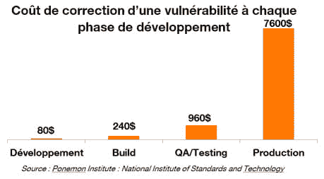

# 如何保证代码的安全

> 原文：<https://dev.to/shostarsson/how-to-keep-your-code-secure-2pag>

*照片来自[沙哈达特·谢穆尔](https://unsplash.com/@shemul)上[Unsplash](https://unsplash.com)T5】*

首先，我想强调一下来自网络安全风险投资机构的研究，该研究称:

> 2019 年，网络安全损害成本将升至 115 亿美元，届时每 14 秒就会有一家企业成为勒索软件攻击的受害者。

网络安全风险将在未来几年不断增加，并且已经广泛分布，这就是为什么你应该将安全视为你的组织的一个事实，并考虑在你要开发的任何功能的基础中包含安全的 T2。

保持代码和架构的安全，与直接查看代码相比，在组织的每个部分注入安全性有更多的工作要做。你必须教导你的团队，授权他们编写安全的代码，然后相信他们真的在这么做。

然而，在你实现那种在安全上自给自足的组织之前，还有很长的路要走。

因此，让我们从全局开始，然后重点改进组织，然后是技术堆栈。

* * *

## 📷大局

在实际尝试保持代码安全之前，我认为您应该考虑为什么您必须保持代码安全。

事实上，理解保持代码安全不仅对品牌很重要，对金钱也很重要，这一点非常重要。
正如你在下图中看到的，一个安全事件如果处理得太晚，会耗费大量的金钱。

所以你应该试着回答这些问题:

| 问题 | 回答 |
| --- | --- |
| 我为什么要提高安全性？ | 因为有人告诉我我必须这么做？我深深地认为我必须 |
| 我应该先推哪里？ | *组织？技术栈？* |
| 什么是最容易的 | *组织？技术栈？* |

### 🤔如何实现这一点？

让我们制定一个计划，从组织和技术方面为贵公司的各个部门注入更多的安全性。

1.  将安全团队加入技术设计委员会。

2.  教导您的开发团队安全开发，并让他们意识到攻击性安全，以便他们理解在编写新功能时如何作为攻击者进行思考。

3.  编写关于如何安全编码、处理秘密、管理源代码等的文档...以便新来的人可以参考。

4.  添加 SAST(如 Checkmarx、Coverity 等...)来检查代码在安全性方面的质量。

5.  添加一个工具来检查安全漏洞警报(CVE)。

6.  添加一个工具来检查依赖性，以及是否已发现需要更新的公共漏洞。

7.  测试您的自动化测试以添加安全用例

8.  对您的应用程序执行渗透测试

所有这些就是我们所说的**设计安全**和**开发安全**。

如果我把所有这些分成两类。

| 类型 | Desc |
| --- | --- |
| **安全源于设计** | 技术设计委员会的 sec 团队成员 |
| **安全源于设计** | 向团队教授安全开发 |
| **安全源于设计** | 编写…的代码... |
| **DevSecOps** | 将 SAST 添加到 CI/CD |
| **DevSecOps** | 自动检查 CVE |
| **DevSecOps** | 检查易受攻击的依赖项 |
| **DevSecOps** | 安全测试 |
| **安全源于设计** | 对您的应用进行渗透测试 |

因此，现在实现这一目标的步骤已经明确，我们可以更深入地研究如何具体做到这一点。

* * *

#### 1。技术设计委员会的 Sec 团队成员👨‍⚖️

许多组织都有一个技术设计委员会或相关的机构，他们的工作是决定路线图上应该有什么，应该做什么，应该使用什么技术堆栈等等...这取决于不同的组织。
尽管如此，目的是该委员会是做出决策和采取行动的地方。

因此，这是从该委员会开始在组织内增加一些安全性的最佳时机。

你有技术设计委员会(或类似的机构)吗？

如果你没有，也许是因为你的结构使得你做出不同的决定。因此，在你的组织中找到你的决策过程，以便从中注入安全感。

如果你有一个技术设计委员会，让我们开始讨论如何在里面注入安全性。

在我工作过的许多公司中，技术设计委员会是架构师、首席软件工程师和运营人员应该讨论解决方案的委员会，以便决定如何在更高的层次上实现该解决方案。那是给名单增加安全性的最佳地点**。**

 **越早给项目增加安全性，就越容易，也越便宜。这对于安全性是有效的，但是对于软件设计的其他部分也是有效的。只要找出你的组织缺少的是什么。

总而言之，一旦我们考虑一个新的特性，安全工程师必须在过程的开始就嵌入进来...如果某个特定的实现在未来会带来一些缺陷，安全部门应该有权对其说不。

#### 2。向团队教授安全开发👨‍🏫

我做了不到十年的开发者。在这几年里，我开发了很多应用程序，主要是在 iOS 上(也有一些在。Net 框架😉).
回过头来看，我可以说在安全方面我运了一些傻逼软件。应用程序本身是完美的。它运行得很好，很快，不占用太多内存，设计完美，等等...
但就安全性而言，如果我现在进行测试，我肯定会自嘲。

是因为我是个糟糕的开发者吗？**肯定不是**。
是因为我没有接受过软件安全方面的培训吗？**肯定**。

> 每个开发人员都成为安全开发人员比以往任何时候都更加重要

安全的软件开发绝对不是天生的。如果您对软件安全性没有广泛的兴趣，那么您在您所从事的软件部分(是 iOS、Android、NodeJS、数据库等)有足够多的东西需要学习...).既然你的管理层不需要安全性，为什么还要花时间在安全性上呢(我们可以回顾一下这篇文章的前几部分)。

这就是为什么安全工程师必须对软件开发团队进行软件安全培训。因此开发安全的软件将成为第二天性。

在安全方面有一些每个软件工程师都应该知道的基本知识。然后，培训将取决于你的团队的技术水平。如果是安卓，你要对他们进行安卓安全方面的培训。

网上有很多好的培训。
也可以买到很多[好书](https://nostarch.com/catalog/security)。

然而，你的团队一定要理解其中的价值，才能真正深入其中。如果他们不这样做，那么这将是一个彻底的失败。

#### 3。编写编写安全软件的行为准则👨‍🎨

既然您的团队已经接受了培训，并确信可以从头开始编写安全的软件，那么他们必须依赖于在组织级别上定义的最佳实践。这样新来的人不用问就知道如何做事。对于编写代码规则，必须在文档中明确定义安全方式。
例如，“如何在你的数据库中存储数据”。每一个数据都是不同的，不是每一个数据都必须加密，你必须清楚地知道什么，什么时候以及如何存储数据。
或者如何在 Android 应用上使用证书锁定。

此外，密码管理对你的组织非常重要(提示:你一定要让每个人都使用密码管理器)。这与安全软件开发没有直接关系，但是非常需要您以安全的方式存储您组织的密码。

我认为，除了数字媒体上的信息，信息还应该显示在物理媒体上。
例如，你可以有一个信息图，以简单的方式解释什么是不对称和对称加密，以及一个二维码，重定向到一个更详细的文档。这是向办公室里的每个人解释一些复杂概念的好方法。

#### 4。将 SAST 添加到 CI/CD👷

我假设您有一个持续集成/持续交付(CI/CD)管道。如果你有，有一个非常简单的方法来增加你的 CI/CD 管道的安全性。您可以将静态应用程序安全测试软件添加到 CI/CD 管道中。

这种类型的软件会分析你的代码，试图找出其中的安全漏洞。

您可以将其添加到 CI/CD 管道各个部分。它可以是在你的詹金斯将要构建你的应用程序之前的最后时刻。或者每次有人推代码到代码库。

这取决于你想达到什么目的。尽管如此，我不建议太频繁地这样做(每次有人推代码对我来说都太多了)。

#### 5。自动检查 CVE🤖

许多安全研究人员正在花时间寻找软件上的漏洞，并负责任地披露漏洞。这些漏洞被称为“常见漏洞和暴露”，集中在特定的网站上，例如 [cvedetails](https://www.cvedetails.com/) 。

一些工具，比如 XRay，可以自动检查你的软件是否有一些公开的漏洞。

您可以在 CI/CD 管道中设置它。

#### 6。检查易受攻击的依赖项🤝

在这个世界上，我们都是相互联系的，我们在他人的工作基础上构建软件。这意味着使用其他开发人员制作的库和框架来简化他们的工作，然后与世界共享。它帮助开发人员比以往任何时候都更快地构建软件，但同时，由于这些相互关联的依赖性，它也给我们所有人带来了风险。

XRay 可以自动检查您的软件在您使用的依赖关系中是否有一些公开的漏洞。Github 的
[依赖机器人](https://dependabot.com/blog/hello-github/)也可以自动完成。但是我真的很喜欢用 Snyk 来检查你的依赖关系中所有已知的缺陷。

如果您在代码库中使用一些开源库，这尤其有用。

有一些常见的缺陷，包括一些盗版者获得一个非常广泛使用的库的管理权限，并轻微修改它，以使任何使用该库的软件容易受到攻击。这在 npm 技术中很常见。

这就是为什么检查你将要添加到你的软件中的代码在开始时以及在它的整个生命周期中都没有缺陷是非常重要的。

#### 7。安全测试🤖

在管道的末端，您有一个可以测试的工作应用程序。
如何针对安全性进行测试？

首先，你可以试着专注于你的技术堆栈(移动、网络等)的前 10 名...).
OWASP 提倡将应用程序安全视为人员、流程和技术问题，因为应用程序安全的最有效方法包括所有这些方面的改进。

假设你要测试一个 iOS 应用，你可以按照 Owasp 基金会写的[移动安全测试指南](https://github.com/OWASP/owasp-mstg)来做。

它将帮助你建立你的测试工厂(越狱的 iPhone，根植的 Android 等)...)然后关注这些设备上最常见的漏洞。如果你能确保自己不容易受到这些缺点的影响，你就真的比竞争对手高出一个档次。😉

但是事情是自动化它，不管它是基于脚本，人类测试者还是其他任何东西。如果它没有被精确地处理和定义，你就做错了。你必须确保在一个版本上进行的测试在下一个版本上会有完全相同的结果。

#### 8。测试您的应用程序🕵️

最终，你可以对你的申请进行一次测试。这是有代价的，但它让你置身于真实的攻击场景中。

如果您的公司中有一个红色团队(这可能意味着您的组织已经相当成熟)，他们的工作就是对您的应用程序执行渗透测试。更常见的方法是，你可以从公司购买渗透测试软件。他们的测试人员会试图找到你的应用程序的漏洞。

这是一个完美的方法。但是你必须在你的公司里有一些资源来处理 pentesters 发现的所有漏洞。如果你没有，你知道你有风险，你花了很多钱但是你没有提高你的安全性。

因此，这又回到了在组织层面上带来安全性。你必须有一些专门的资源(应用程序安全工程师)来正确处理这一点，以一种可理解的方式向开发团队解释漏洞，遵循漏洞被正确纠正和测试。它还可以为这些漏洞添加一些新的测试场景(第 7 步)。

* * *

## 速赢动作🤜 🤛

#### 1。培训或雇佣某人

如果你没有专门负责安全的人，要么**培训某人**来承担这个角色，要么**雇佣某人**。

#### 2。为您的管理线增加安全性

为您的技术设计委员会增加安全性，并**倾听他们的心声**。越早考虑他们的言论，越便宜。

#### 3。从开发者到安全开发者

教你的开发人员成为一个安全开发团队。它可以通过内部培训或培训机构。

如果你按照这些建议改变你的组织，你就走上了一条好的道路，因为每一个新的特征或决定都要经过一个安全过程。

* * *

## 长期动作⏳

既然您已经将安全性添加到您的流程和组织中，我们可以尝试基于开发团队的新专业知识在每个功能中添加安全性。

#### 1。面向安全的代码评审

他们现在应该挑战他们正在做的任何事情，特别是在团队内部，在安全方面。就开发安全的新特性而言，良好的代码审查过程可以大大提高您的安全性和速度。

#### 2。将安全知识扩展到非技术功能

然而，这需要时间，也需要团队的参与。午餐会议是一个很好的方式，不要忘记安全是一个持续的过程，而不是一张单程票。

> 一旦你开始生活，真正的工作就开始了。因为攻击者现在能够测试您的应用程序。

所以你不能停下来说“这是直播，对我来说结束了。请下一个功能！！!"

#### 3。装备您的 CI 渠道

就良好实践而言，在接下来的步骤中为您的 CI/CD 管道提供工具。添加依赖项 chek，根据您的业务逻辑和应用程序知识进行自动测试。

#### 4。计划渗透测试

我建议对您发布的任何应用程序的每个新的主要版本进行渗透测试。这是很好的练习，所以你可以有一个新的开始。

* * *

我希望这能帮助您重新考虑为什么安全性在任何组织中都如此重要。你必须有一个人，他的工作是确保它被适当地考虑在内，这样你的活动就不会因为安全事件而遭遇可怕的命运。**