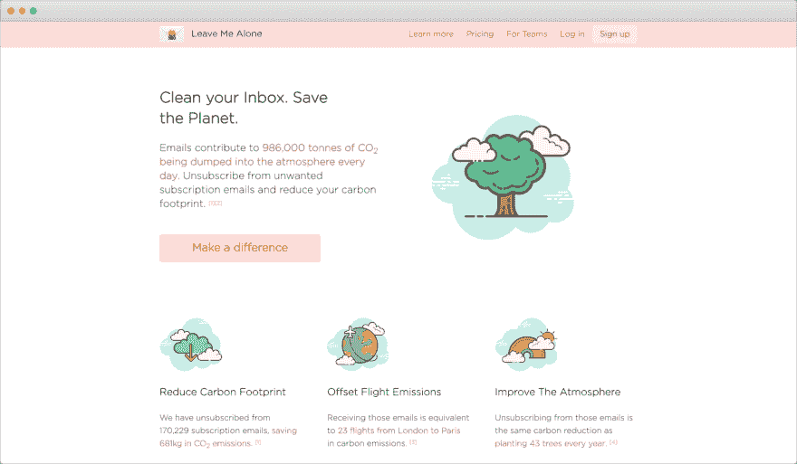
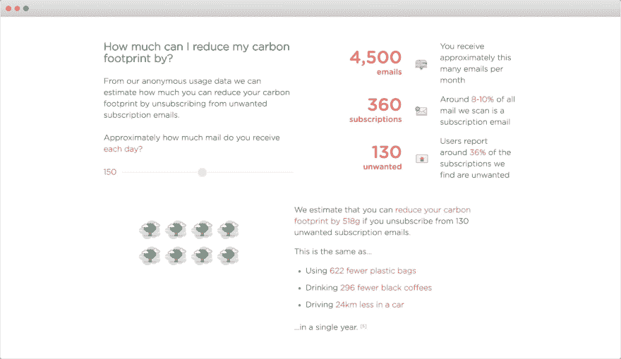
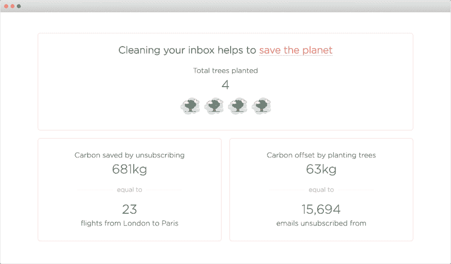

# 每天都有 28，397 吨 CO₂被垃圾邮件排放到大气中

> 原文：<https://dev.to/dinkydani21/unwanted-emails-dump-28-397-tonnes-of-co-into-the-atmosphere-every-day-k38>

我们在[让我一个人呆着](https://leavemealone.app)的任务是通过清除不想要的垃圾邮件来帮助你重新控制你的收件箱。我们将平静和控制带回您的数字生活，让您有更多时间做自己喜欢的事情。

当我们听说[世界上第一个帮助修复气候的黑客马拉松](https://fixathon.io)时，我们立即开始研究我们能做些什么来帮助。我们试图制造一种帮助人类的产品，但是我们想看看我们是否也能帮助我们的星球！

我们立即发现电子邮件有很大的碳足迹。事实上，每天有 2460 亿封电子邮件向大气中排放 986，000 吨碳。[1]

“别烦我”用户已经通过退订不想要的邮件减少了他们的碳足迹。因此，我们决定建立一个新的功能来突出这一点对地球的影响，并帮助人们了解他们可以通过退订减少多少碳足迹。

 

<figcaption>清理你收件箱中不想要的订阅邮件，同时拯救地球！</figcaption>

继续阅读，了解更多关于电子邮件如何导致碳排放的信息，或者直接进入[查看如何通过退订](https://leavemealone.app/save-the-planet)来拯救地球！

## 电子邮件是如何促成碳排放的？

一封普通的电子邮件平均产生 4 克 co₂[2]。长消息和带附件的电子邮件产生的垃圾多达 12 倍。听起来很多吗？让我们探索一下这是如何计算的。

所有数字化事物的碳影响通常归因于存储互联网上几乎所有东西的巨大数据中心的日常运作。这些数据中心消耗大量的电力来存储、传输、处理和分析所有这些数据。此外，保持一切凉爽和有效运行需要大量的水。

即使是发送一封电子邮件，从发件人的收件箱到你的收件箱的每一步，世界各地都有数千个数据中心。

不要忘记制造数据中心设备时产生的温室气体和碳排放！

## 退订有什么帮助？

退订不仅对灵魂有好处，对地球也有好处！75%的电子邮件甚至从未被打开过，收发电子邮件会增加碳排放。

通过退出你不想要的邮件列表，你可以阻止不必要的邮件发送。这有助于减少你的碳足迹，以及发送电子邮件的人或公司的碳足迹。

从我们近 10，000，000 封分析过的电子邮件的匿名使用数据[4]中，我们知道大约 8%的用户收件箱是订阅的，其中 36%是不需要的。这意味着每天有多达 28，397 **吨**的碳因人们不想要或不想阅读的电子邮件而排放到大气中。这相当于生产了将近 30 亿个塑料袋，或者将近 100 万人从伦敦飞往巴黎！[6]

以下是基于全球使用情况的原始数据:

*   每天发送 2465 亿封电子邮件
*   197.2 亿是订阅量(占 2465 亿的 8%)
*   71 亿是不需要的(占 197.2 亿的 36%)
*   每天产生 28，397 吨碳(一封电子邮件产生 7.1 磅 x 4 克碳)
*   2，839，680，000 个塑料袋(每个塑料袋 28，397 吨/10 克)
*   946，560 人从伦敦飞往巴黎(28，397 吨/1 人飞行 0.03 吨)

退订也有助于发件人通过不再向不感兴趣的人发送电子邮件来提高他们的邮件列表声誉，这反过来又有助于其他“别管我”的用户！

## 估算你收件箱的碳足迹

你可以使用我们的[碳足迹估算器](https://leavemealone.app/save-the-planet)来看看你可以减少多少碳足迹。每封电子邮件 4 克碳听起来并不多，所以我们包括了其他活动对环境的影响，如使用塑料袋、喝咖啡和开车，以作比较。

 

<figcaption>用我们的估算工具看看你能减少多少碳足迹</figcaption>

## 在收银台捐款种树

退订是清理收件箱和减少碳足迹的好方法，但我们想做得更多。当购买信用来取消订阅时，您现在可以添加 1 美元捐款来种植一棵树！🌳

树木在我们对抗碳排放和气候变化的斗争中非常重要。树木有助于清洁我们呼吸的空气，过滤我们饮用的水，并吸收大气中的有害碳。仅在一年之内，一棵树就可以从大气中过滤掉 16 公斤的碳。

我们与[One Tree plant](https://onetreeplanted.org)合作，后者在全世界植树。我们选择种植一棵树，因为他们有一个超级简单的定价模型；一美元种一棵树。我们希望客户的捐赠易于衡量——不管你的收件箱有多大，你知道你的捐赠相当于在世界上种下了一棵树。

我们从种植一棵树开始我们的气候变化运动，我们将为每 10 个顾客多种一棵树！我们已经收到了几笔捐款，这让我们非常高兴。你可以在[我们的开放页面](https://leavemealone.app/open)上看到我们种植了多少棵树，以及通过退订节省了多少碳。

每一点帮助，我们真的很高兴看到我们可以通过帮助我们的客户取消订阅节省多少碳！

感谢您的阅读。如果你想了解更多或者只是想聊天，你可以在 Twitter 上找到我们或者发邮件给我们 [hello@leavemealone.app](mailto:hello@leavemealone.app) 。

* * *

[1][2015-2019 年邮件统计报告:每天全球收发邮件总数 246.5 封(B)](https://www.radicati.com/wp/wp-content/uploads/2015/02/Email-Statistics-Report-2015-2019-Executive-Summary.pdf)

[2] [关于快递公司垃圾邮件碳足迹的报告:一封合法邮件平均释放 4gco₂](https://img.en25.com/Web/McAfee/CarbonFootprint_12pagesfr_s_fnl2.pdf)

[3] [2019 年邮件营销统计汇总:2018 年各行业平均邮件打开率 24.8%](https://www.smartinsights.com/email-marketing/email-communications-strategy/statistics-sources-for-email-marketing/)

[https://leavemealone.app/open](https://leavemealone.app/open)

[5] [一些常见活动的环境影响](https://phys.org/news/2015-11-carbon-footprint-email.html)

[6] [飞行碳足迹计算器:从伦敦直飞 CO₂的经济舱单程每人为 0.03 吨(30 公斤)](https://www.carbonfootprint.com/)

[7] [未来碳计算器的树木:森林花园中的一棵树每棵树吸收 34.6 磅(15.694 千克)的碳](https://trees.org/carboncalculator)

由 [Unsplash](https://unsplash.com/@bob_blob?utm_source=unsplash&utm_medium=referral&utm_content=creditCopyText) 生成的标题图像。