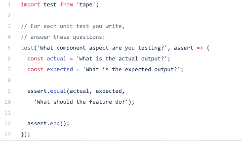
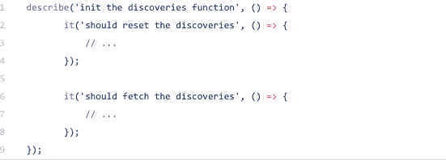

# 单元测试简介

> 原文：<https://dev.to/sofiajonsson/intro-to-unit-testing-1aa2>

当我从熨斗学校毕业时，我意识到我已经得到了大量的编写代码的练习，但是我还没有为这些代码编写测试的任何练习..

我们最近在校园里和 CodePen 的工程师卡西迪·威廉姆斯进行了一次炉边谈话，她提到了为你的代码编写测试的重要性。她给了我们一个编码挑战场景的例子，你和其他人得到了同样的带回家的编码挑战。让我们假设你很快通过了测试，但是忽略了写测试，而其他人写了，你不经意地退出了比赛，不知道有什么更好的。从我在网上收集的信息来看，你认为什么时候为你的代码写测试是必要的，值得花时间等等，这取决于你的判断力。但是基本要点仍然是:理解如何测试你的代码，这样你就可以证明你的理解和证明你的代码是有效的。测试有助于您满怀信心地编写代码。

在我们开始之前，我想指出三种类型的测试:

*   *单元测试*:测试一小部分代码，以确定代码是最优的

*   集成测试:测试单元的组合以及它们如何一起运行

*   *验收测试*:在浏览器/设备上测试应用程序，以整体分析整体性能

这篇博客文章将专门关注使用测试驱动开发(TDD)的**单元测试**。TDD 和 BDD(行为驱动开发)的主要区别在于，TDD 是根据一组期望进行测试的，结果是通过/失败，而 BDD 描述了应用功能的行为，结果也是通过/失败。这两种方法都要求在代码实现之前写出测试。

单元测试将在检查输入和输出的同时，在你正在处理的程序段上运行一些代码。单元测试帮助开发人员控制和审计他们代码的不同区域，并看到*哪里*和*为什么*存在错误。当你不知道去哪里找的时候，检查错误和 bug 是非常困难的，这就是单元测试的用武之地。

前面我提到了在实现任何代码之前编写测试的重要性。TDD 的科学可以被分解和支持(通过在线社区和他们的许多博客),因为 TDD 可以帮助你减少代码中的 bug 密度。它可以鼓励更多的模块化设计——增强软件灵活性和团队速度。最后，它可以降低代码的复杂性。

TDD 使您能够做的是计划出您想要实现的是什么，您想要如何实现它，以及您期望实现什么，以便当失败时，您可以更好地了解到哪里去寻找 bug。因此...

### 什么是好的单元测试？

首先，我们需要了解如何使用测试:

*   **设计辅助**:在实施前的设计阶段编写。
*   特性文档&开发人员理解测试:测试应该提供被测试特性的清晰描述。
*   QA/连续交付:测试应该在失败时停止交付管道，并在失败时产生一个好的错误报告。

接下来，我们需要查看失败的测试，并尝试查明错误来自哪里。

### 自问:

1.  你在测试什么？
2.  它应该做什么？
3.  实际产量是多少？
4.  预期输出是什么？
5.  该测试如何重现？

让我们一路向下。最重要的是，你的测试名应该是清晰的、描述性的和简洁的。如果您遇到错误，这应该是您检查的第一件事。

“describe”参数应该对工作单元有一个清晰的描述。“it”参数应该有一个*‘should[expected behavior]when[scenario/context]。”*

### 结论

单元测试从破损的代码中提供了很好的初始反馈。他们一次只关注一件事，并帮助你，即程序员了解你的错误和缺陷发生在哪里。在您的项目和挑战中实现 TDD 将帮助您和您的团队更好地规划您的任务，并减少 bug 的可能性。这都是关于预防和在微观层面上理解你的代码。