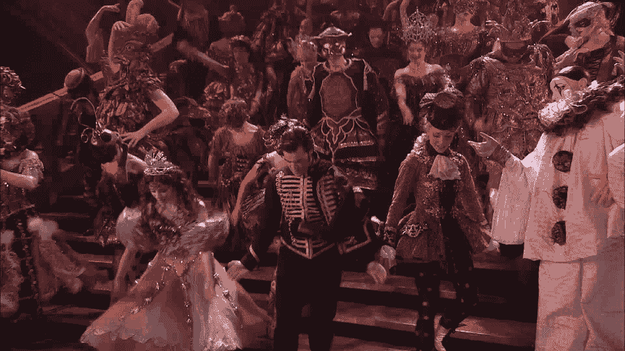
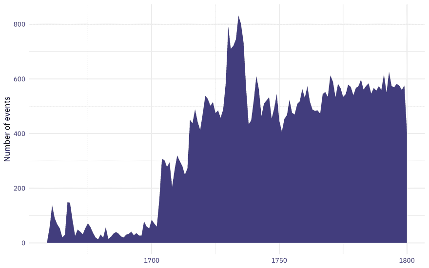
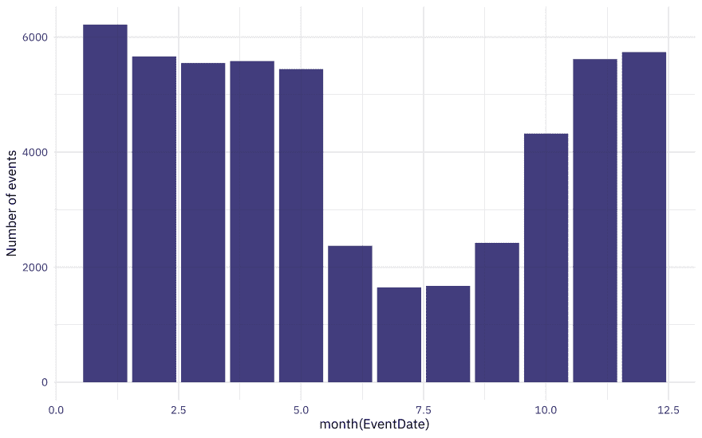
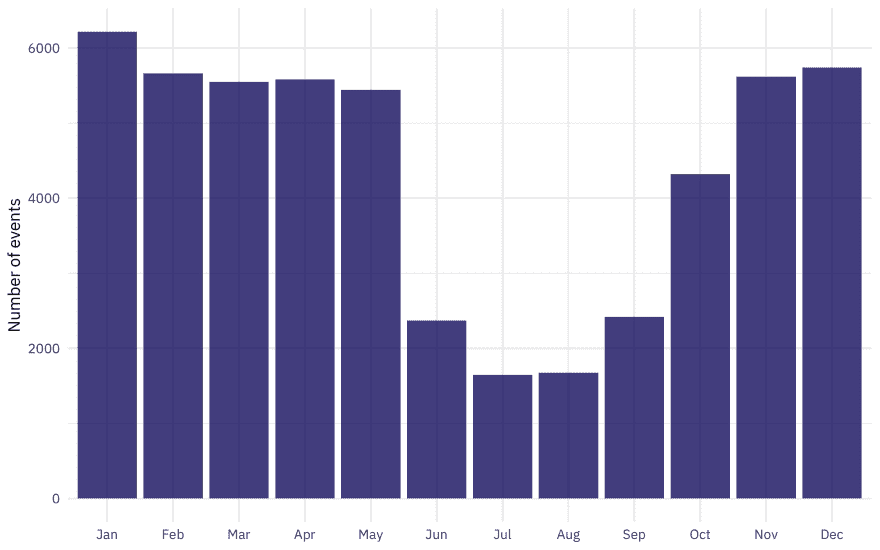
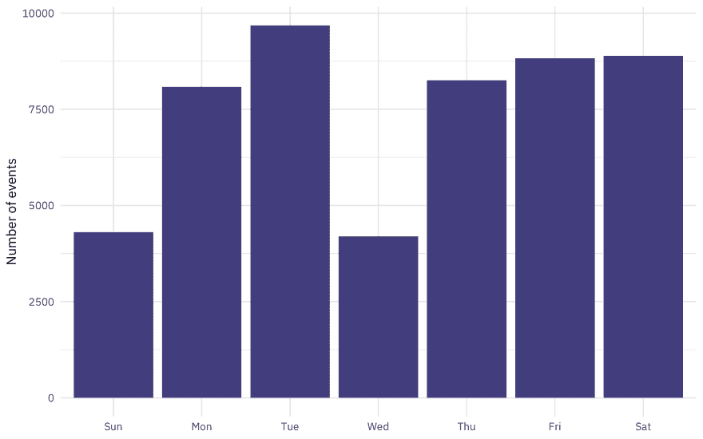
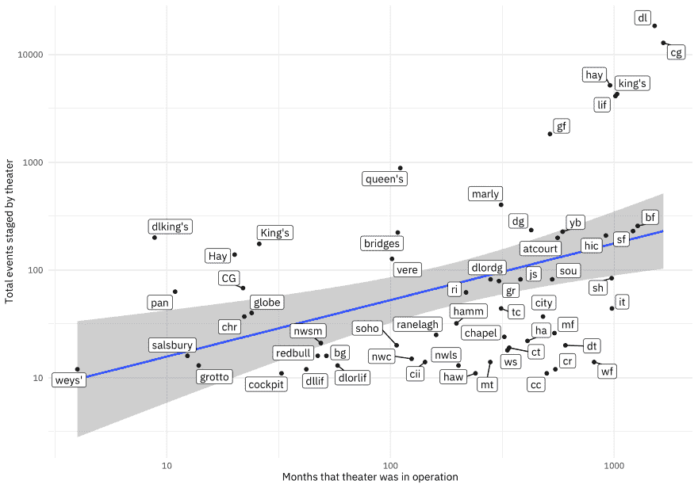

# 用 lubridate 练习处理 R 中的日期...戏剧化地

> 原文：<https://dev.to/juliasilge/practice-handling-dates-in-r-with-lubridate-theatrically-167g>

我很高兴现在成为一名获得 RStudio 认证的马术教练！🎉几十年来，我一直在教授技术内容，无论是在大学课堂，开发在线课程，还是领导研讨会，但我仍然发现这个项目对我自己的专业发展很有价值。我学到了很多东西，这将使我的教学更好，我很高兴成为参与者。如果你想找人在你的组织中主持培训或研讨会，你可以查看[这份培训师名单](http://rstd.io/trainers)，看看谁对你来说最合适！

认证过程的一部分是提供演示课程。我非常喜欢我创建的演示课程的内容，并且我可能不会很快在实际的研讨会中使用它，所以我决定扩展它，并在这里以博客的形式分享它。我的演示集中在使用 lubridate 处理日期；日期和时间在数据分析中很重要，但它们通常具有挑战性。在本帖中，我们将探索一些来自伦敦舞台数据库的**野生捕获的**日期数据🎭并探索如何使用 [lubridate](https://lubridate.tidyverse.org/) 包处理这些日期。

## 在伦敦舞台数据库中读取

了解更多关于[伦敦舞台数据库](https://londonstagedatabase.usu.edu/)的信息，包括关于[数据来源](https://londonstagedatabase.usu.edu/about.php)和用于建立数据库的[代码。简而言之，它探索了从英国内战后的 1660 年剧院重新开放到 18 世纪末伦敦的戏剧场景。](https://github.com/LondonStageDB/data)

[](https://i.giphy.com/media/3o7TKzBxHeX1DHVhJe/source.gif)

*(H/T for this dataset to[Data 是复数作者杰瑞米·辛格·文](https://tinyletter.com/data-is-plural)，我订阅的最有趣的时事通讯之一。)*

首先，我们将下载、解压缩并打开完整的伦敦 Stage 数据库。

**备注:**

*   下面的块将数据集下载到工作目录。
*   这是一个相当大的数据集，所以如果您自己运行它，请耐心等待它打开！

```
library(tidyverse)

json_path <- "https://londonstagedatabase.usu.edu/downloads/LondonStageJSON.zip"
download.file(json_path, "LondonStageJSON.zip")
unzip("LondonStageJSON.zip")
london_stage_raw <- jsonlite::fromJSON("LondonStageFull.json") %>%
    as_tibble() 
```

## 寻找日期

这个数据有十三列。让我们花点时间来看看前几行的列名和内容。这些列中的哪一列包含日期信息？

```
london_stage_raw

## # A tibble: 52,617 x 13
## EventId EventDate TheatreCode Season Volume Hathi CommentC TheatreId
## <chr> <chr> <chr> <chr> <chr> <chr> <chr> <chr>    
## 1 0 16591029 city 1659-… 1 "" The <i>… 63       
## 2 1 16591100 mt 1659-… 1 "" On 23 N… 206      
## 3 2 16591218 none 1659-… 1 "" Represe… 1        
## 4 3 16600200 mt 1659-… 1 "" 6 Feb. … 206      
## 5 4 16600204 cockpit 1659-… 1 "" $Thomas… 73       
## 6 5 16600328 dh 1659-… 1 "" At <i>D… 90       
## 7 6 16600406 none 1659-… 1 "" "" 1        
## 8 7 16600412 vh 1659-… 1 "" Edition… 319      
## 9 8 16600413 fh 1659-… 1 "" <i>The … 116      
## 10 9 16600416 none 1659-… 1 "" "" 1        
## # … with 52,607 more rows, and 5 more variables: Phase2 <chr>,
## # Phase1 <chr>, CommentCClean <chr>, BookPDF <chr>, Performances <list> 
```

`EventDate`列包含日期信息，但是请注意 R 并不认为这是一个日期！

```
class(london_stage_raw$EventDate)

## [1] "character" 
```

r 认为这是一个字符(像`"16591029"`一样编码的日期)，因为数据的细节和读入该数据的过程所使用的类型猜测。这对我们没有帮助，因为我们需要将这些信息存储为日期类型📆为了探索伦敦舞台数据的年代。我们将使用 lubridate 包中的函数`ymd()`来转换它。(在 lubridate 中还有其他类似的功能，像`ymd_hms()`如果你有时间信息，`mdy()`如果你的信息排列不同，等等。)

```
library(lubridate)

london_stage <- london_stage_raw %>%
    mutate(EventDate = ymd(EventDate)) %>%
    filter(!is.na(EventDate))

## Warning: 378 failed to parse. 
```

请注意，我们在这里有一些失败；有几百个日期为`00`的日期无法解析。在这里的`filter()`行中，我已经把它们过滤掉了。

如果我检查`EventDate`列的类，现在会发生什么？

```
class(london_stage$EventDate)

## [1] "Date" 
```

我们现在有了一个类型为`Date`的列🙌这正是我们所需要的。在这节课中，我们将探索我们能从这种日期数据中学到什么。

## 获取年月

伦敦舞台上的这个数据集跨越了一个多世纪。怎么看历年舞台事件分布？lubridate 包包含类似于`year()`的函数，让我们获得日期的年份部分。

```
year(today())

## [1] 2019 
```

让我们在这个数据集中按年份统计舞台事件。

```
london_stage %>%
    mutate(EventYear = year(EventDate)) %>%
    count(EventYear)

## # A tibble: 142 x 2
## EventYear n
## <dbl> <int>
## 1 1659 2
## 2 1660 58
## 3 1661 138
## 4 1662 91
## 5 1663 68
## 6 1664 53
## 7 1665 20
## 8 1666 30
## 9 1667 149
## 10 1668 147
## # … with 132 more rows 
```

在我看来，每年都有很大的不同。如果我们做一个可视化，会更容易看到这一点。

```
london_stage %>%
    count(EventYear = year(EventDate)) %>%
    ggplot(aes(EventYear, n)) +
    geom_area(fill = "midnightblue", alpha = 0.8) +
    labs(y = "Number of events",
         x = NULL) 
```

[](https://res.cloudinary.com/practicaldev/image/fetch/s--EqZ5vy6I--/c_limit%2Cf_auto%2Cfl_progressive%2Cq_auto%2Cw_880/https://juliasilge.com/blog/2019/2019-08-26-lubridate-london-stage_files/figure-html/unnamed-chunk-6-1.png)

大约在 1710 年至 1730 年间，戏剧活动急剧增加。1750 年后，每年的统计看起来相当稳定。

我们看到逐月的变化了吗？lubridate 包有一个非常类似于`year()`的功能，但是它是用来查找日期的月份的。

```
london_stage %>%
    ggplot(aes(month(EventDate))) +
    geom_bar(fill = "midnightblue", alpha = 0.8) +
    labs(y = "Number of events") 
```

[](https://res.cloudinary.com/practicaldev/image/fetch/s--tIFOKTHf--/c_limit%2Cf_auto%2Cfl_progressive%2Cq_auto%2Cw_880/https://juliasilge.com/blog/2019/2019-08-26-lubridate-london-stage_files/figure-html/unnamed-chunk-7-1.png)

哇，太戏剧化了！与一年中的其他时间相比，夏季的活动要少得多。我们可以通过用`label = TRUE`改变调用`month()`函数的方式来使这个图更容易阅读。

```
london_stage %>%
    ggplot(aes(month(EventDate, label = TRUE))) +
    geom_bar(fill = "midnightblue", alpha = 0.8) +
    labs(x = NULL,
         y = "Number of events") 
```

[](https://res.cloudinary.com/practicaldev/image/fetch/s--VSZ0deKi--/c_limit%2Cf_auto%2Cfl_progressive%2Cq_auto%2Cw_880/https://juliasilge.com/blog/2019/2019-08-26-lubridate-london-stage_files/figure-html/unnamed-chunk-8-1.png)

当您在这里使用`label = TRUE`时，信息被存储为有序因子。

在这个数据集中，伦敦剧院在一月份上演了**最多**的事件。

好，再来一个！一周中的哪一天有更多的戏剧活动？lubridate 包有一个函数`wday()`包，可以获取任意日期的星期几。这个函数也有一个`label = TRUE`参数，就像`month()`。

```
london_stage %>%
    ggplot(aes(wday(EventDate, label = TRUE))) +
    geom_bar(fill = "midnightblue", alpha = 0.8) +
    labs(x = NULL,
         y = "Number of events") 
```

[](https://res.cloudinary.com/practicaldev/image/fetch/s--AS12J_j3--/c_limit%2Cf_auto%2Cfl_progressive%2Cq_auto%2Cw_880/https://juliasilge.com/blog/2019/2019-08-26-lubridate-london-stage_files/figure-html/unnamed-chunk-9-1.png)

伦敦剧院不会在周日或周三上演节目。谁知道呢？！？

## 时差

处理日期最具挑战性的部分之一是寻找时间间隔，lubridate 可以在这方面提供帮助！

让我们来看看单个的剧院(在`TheatreId`中列表)，看看单个剧院倾向于运营多长时间。

```
london_by_theater <- london_stage %>%
    filter(TheatreCode != "none") %>% 
    group_by(TheatreCode) %>%
    summarise(TotalEvents = n(),
              MinDate = min(EventDate),
              MaxDate = max(EventDate),
              TimeSpan = as.duration(MaxDate - MinDate)) %>%
    arrange(-TotalEvents)

london_by_theater

## # A tibble: 233 x 5
## TheatreCode TotalEvents MinDate MaxDate   
## <chr> <int> <date> <date>    
## 1 dl 18451 1674-03-26 1800-06-18
## 2 cg 12826 1662-05-09 1800-06-16
## 3 hay 5178 1720-12-29 1800-09-16
## 4 king's 4299 1714-10-23 1800-08-02
## 5 lif 4117 1661-06-28 1745-10-07
## 6 gf 1832 1729-10-31 1772-10-23
## 7 queen's 884 1705-04-09 1714-06-23
## 8 marly 403 1750-08-16 1776-08-10
## 9 bf 257 1661-08-22 1767-09-07
## 10 dg 235 1671-06-26 1706-11-28
## # … with 223 more rows, and 1 more variable: TimeSpan <Duration> 
```

我们在这里创建了一个新的数据框架，每个剧院占一行。这些柱子告诉我们

*   那家剧院有多少戏剧活动
*   剧院首次举办活动的日期
*   剧院最后一次举办活动的日期
*   这两者之差的持续时间

持续时间是时差中的一个特殊概念，但是不要在这个问题上陷得太深。我们如何计算这个持续时间？*我们只需减去两个日期，*，然后将其包装在 lubridate 函数`as.duration()`中。

查看列顶部为`TimeSpan`打印出的数据类型；它不是数字，也不是整数，也不是 r 中的任何普通数据类型。它表示`<Duration>`。

如果我们试着为`TimeSpan`做一个直方图，你认为会发生什么？

```
london_by_theater %>% 
    filter(TotalEvents > 100) %>%
    ggplot(aes(TimeSpan)) +
    geom_histogram(bins = 20)

## Error: Incompatible duration classes (Duration, numeric). Please coerce with `as.duration`. 
```

我们出错了！🙀这个“duration”类适用于添加和减去日期，但当我们想要绘制图表或对其他类型的数据(比如，总事件数)进行数学运算时就不那么适用了。我们需要**强迫**做一些更有用的事情，现在我们已经完成了日期的减法。

被存储为持续时间的数据可以用`as.numeric()`强制，并且您可以发送另一个参数来说明您想要返回哪种时间增量。例如，如果我们想知道这些剧院在这个数据集中运营的年数呢？

```
london_by_theater %>%
    mutate(TimeSpan = as.numeric(TimeSpan, "year"))

## # A tibble: 233 x 5
## TheatreCode TotalEvents MinDate MaxDate TimeSpan
## <chr> <int> <date> <date> <dbl>
## 1 dl 18451 1674-03-26 1800-06-18 126\.  
## 2 cg 12826 1662-05-09 1800-06-16 138\.  
## 3 hay 5178 1720-12-29 1800-09-16 79.7 
## 4 king's 4299 1714-10-23 1800-08-02 85.8 
## 5 lif 4117 1661-06-28 1745-10-07 84.3 
## 6 gf 1832 1729-10-31 1772-10-23 43.0 
## 7 queen's 884 1705-04-09 1714-06-23 9.20
## 8 marly 403 1750-08-16 1776-08-10 26.0 
## 9 bf 257 1661-08-22 1767-09-07 106\.  
## 10 dg 235 1671-06-26 1706-11-28 35.4 
## # … with 223 more rows 
```

许多这样的剧院有超过一个世纪的活动！

如果我们想知道每个剧院有活动的月份数，我们可以改变论点。

```
london_by_theater %>%
    mutate(TimeSpan = as.numeric(TimeSpan, "month"))

## # A tibble: 233 x 5
## TheatreCode TotalEvents MinDate MaxDate TimeSpan
## <chr> <int> <date> <date> <dbl>
## 1 dl 18451 1674-03-26 1800-06-18 1515.
## 2 cg 12826 1662-05-09 1800-06-16 1657.
## 3 hay 5178 1720-12-29 1800-09-16 957.
## 4 king's 4299 1714-10-23 1800-08-02 1029.
## 5 lif 4117 1661-06-28 1745-10-07 1011.
## 6 gf 1832 1729-10-31 1772-10-23 516.
## 7 queen's 884 1705-04-09 1714-06-23 110.
## 8 marly 403 1750-08-16 1776-08-10 312.
## 9 bf 257 1661-08-22 1767-09-07 1272.
## 10 dg 235 1671-06-26 1706-11-28 425.
## # … with 223 more rows 
```

我们可以用这种变换来看操作中事件的数量和时间长短之间的关系。将`Duration`对象转换为以月为单位的数值，以便进行绘图。

```
library(ggrepel)

london_by_theater %>%
    mutate(TimeSpan = as.numeric(TimeSpan, "month")) %>%
    filter(TotalEvents > 10) %>%
    ggplot(aes(TimeSpan, TotalEvents, label = TheatreCode)) +
    geom_smooth(method = "lm") +
    geom_label_repel(family = "IBMPlexSans") +
    geom_point() +
    scale_x_log10() +
    scale_y_log10() +
    labs(x = "Months that theater was in operation",
         y = "Total events staged by theater") 
```

[](https://res.cloudinary.com/practicaldev/image/fetch/s--6oTR1In1--/c_limit%2Cf_auto%2Cfl_progressive%2Cq_auto%2Cw_880/https://juliasilge.com/blog/2019/2019-08-26-lubridate-london-stage_files/figure-html/theater_scatter-1.png)

有道理的是，剧院开放的时间长得多，活动也多得多，但我们也可以注意到哪些剧院在这张图表中特别高或特别低。图表中较高的剧院在营业期间举办了许多活动，图表中较低的剧院在营业期间举办了一些活动。

这一情节为探索开辟了更多的可能性，例如剧院是持续运营还是休息。进一步的数据处理提供了解决这些问题的能力！如果你有任何问题让我知道。📆