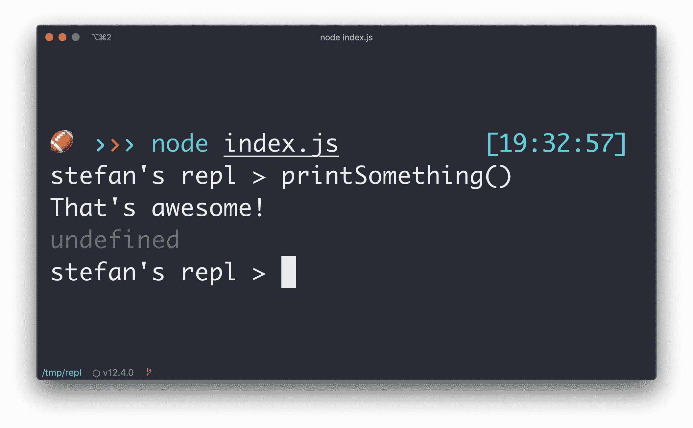

# 蒂尔:如何创建你的自定义节点。js REPL

> 原文：<https://dev.to/stefanjudis/til-how-to-create-your-custom-node-js-repl-4l89>

今天我看到了一个简短的视频，它解释了 Node.js 的功能和它的 REPL ( [读取-评估-打印循环](https://en.wikipedia.org/wiki/Read%E2%80%93eval%E2%80%93print_loop))。

虽然我时不时会使用内置的 REPL(在你的终端中键入`node`来启动它)，但我以前从未使用过 [REPL 模块](https://nodejs.org/api/repl.html)。事实证明，只需几行 JavaScript 代码就可以创建自己的定制 REPL:

```
// index.js
const repl = require('repl');

const state = {
  printSomething() {
    console.log("That's awesome!");
  }
};

const myRepl = repl.start("stefan's repl > ");

Object.assign(myRepl.context, state); 
```

Enter fullscreen mode Exit fullscreen mode

如果你像我一样，喜欢在一个控制台原型，这可以变得非常方便。您可以为您的应用程序创建一个入口脚本，提供所有初始化的对象和功能。

[](//images.ctfassets.net/f20lfrunubsq/3ThVsUOwFhhzxQCaRV8lm8/28ac1d8fc83a4010be01ae28f0529a8e/repl.jpg)

通过提供您自己的包括所有需要的状态的 REPL，您可以“REPL 离开”而无需启动调试器和附加断点。🎉