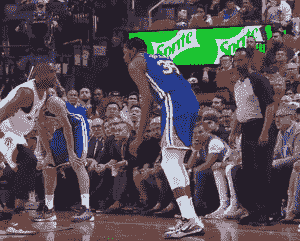

# 用节点编码 gif

> 原文：<https://dev.to/benjaminadk/encode-gifs-with-node-4c75>

当你想传达信息，但是一张图片太简单，一个视频太复杂，一个 GIF 可以是一个完美的中间地带。作为一名 *JavaScript* 开发者，我最近想知道:

1.  我可以写一个程序来创建一个 GIF 文件吗？
2.  JavaScript 能做到这一点吗？

经过一点研究和大量的反复试验，我发现这两个问题的答案都是`yes`。这篇文章总结了我的发现。

[](https://res.cloudinary.com/practicaldev/image/fetch/s--gP9RnWlL--/c_limit%2Cf_auto%2Cfl_progressive%2Cq_66%2Cw_880/https://thepracticaldev.s3.amazonaws.com/i/2z6xvvibh6wla3ge76ik.gif)

* * *

## GIF 格式

一个好的起点是研究一个 GIF 文件的历史和结构。原来*图形交换格式*最初是由 *CompuServe* 在 20 世纪 80 年代创建的，是网络上最早使用的图像格式之一。虽然 *PNG* 格式几乎已经取代了单个图像的 *GIF* 格式，但是 *GIF 的*功能使得这种格式在今天仍然适用并受到支持。在我们今天所知的 gif 中，每张图片最多允许 256 种颜色。这就是为什么 gif 更适合插图而不是摄影，尽管它们两者都用。 *GIF* 图像也使用 *LZW* 算法进行压缩，该算法提供无损数据压缩。对于更一般的信息，[维基百科](https://en.wikipedia.org/wiki/GIF)是一个很好的来源，对于整个规范的深入分析，请查看 GIF 中的内容。

## 我的用例

我最近一直在玩[电子](https://electronjs.org/)，我决定尝试一个桌面应用程序，它可以记录用户的屏幕，然后将捕获的图像转换成 *GIF* 。*电子*环境结合了浏览器的特性、[节点](https://nodejs.org/en/)的特性和*电子*自己的 API。 *Electron 的* `desktopCapturer` API 使得一次捕捉用户的屏幕一帧，然后将这些图像保存到磁盘成为可能。拥有这些连续的图像对于这种 GIF 编码方法是必不可少的。我的项目文章 [GifIt](https://benjaminbrooke.me/projects/gifit/) 更详细地介绍了这个主题，如果你想了解我是如何记录桌面的，可以使用 [GifIt 源代码](https://github.com/benjaminadk/gifit/tree/master/src/renderer/components/Recorder)。此时，我的目标变成了编写自己的 GIF 编码库。

## 现有库

我采取的下一步是查看在 [NPM](https://www.npmjs.com/) 和 [Github](https://github.com/) 上现有的库。有几个选项，您使用哪一个取决于您的用例以及可用的文档。看起来在 *JavaScript* 中最初的实现是 [gif.js](https://github.com/jnordberg/gif.js) 。我翻了翻文件，很高兴地发现`LZWEncoder`和`NeuQuant`算法已经被移植了。我用这些作为我图书馆的基础。

## 我的图书馆

关于现有的库，我注意到的一件事是*gif*需要很长时间来处理，并且输出文件看起来非常大。 [GIF Encoder 2](https://github.com/benjaminadk/gif-encoder-2) 增加了新的功能来帮助减轻这些缺点。我做的第一件事是添加一个可选的优化器。我发现将一幅图像还原成 256 色调色板花费了很多时间。这个过程包括查看图像中每个像素的颜色，由*神经量子*算法完成。如果当前图像和之前的图像相似，我添加了重用之前图像的调色板的功能。选中此项会增加开销，但不会像计算新的调色板那样增加开销。我还添加了第二个算法，叫做*八叉树*，它使用完全不同的方法来计算调色板。这最终导致文件越来越小。

## 使用 Gif 编码器 2

```
npm install gif-encoder-2 
```

<svg width="20px" height="20px" viewBox="0 0 24 24" class="highlight-action crayons-icon highlight-action--fullscreen-on"><title>Enter fullscreen mode</title></svg> <svg width="20px" height="20px" viewBox="0 0 24 24" class="highlight-action crayons-icon highlight-action--fullscreen-off"><title>Exit fullscreen mode</title></svg>

### 构造函数

`GIFEncoder(width, height, algorithm, useOptimizer, totalFrames)`

| 参数 | 类型 | 描述 | 需要 | 默认 |
| --- | --- | --- | --- | --- |
| `width` | 数字 | 以像素为单位的图像宽度 | 是 | 不适用的 |
| `height` | 数字 | 图像的高度，以像素为单位 | 是 | 不适用的 |
| `algorithm` | 线 | `neuquant`或`octree` | 不 | `neuquant` |
| `useOptimizer` | 布尔型 | 启用/禁用优化器 | 不 | 错误的 |
| `totalFrames` | 数字 | 图像总数 | 不 | Zero |

```
const encoder = new GIFEncoder(500, 500)
const encoder = new GIFEncoder(1200, 800, 'octree', false)
const encoder = new GIFEncoder(720, 480, 'neuquant', true, 20) 
```

<svg width="20px" height="20px" viewBox="0 0 24 24" class="highlight-action crayons-icon highlight-action--fullscreen-on"><title>Enter fullscreen mode</title></svg> <svg width="20px" height="20px" viewBox="0 0 24 24" class="highlight-action crayons-icon highlight-action--fullscreen-off"><title>Exit fullscreen mode</title></svg>

### 方法

| 方法 | 参数 | 描述 |
| --- | --- | --- |
| `start` | 不适用的 | 启动编码器 |
| `addFrame` | `Canvas Context` | 向 GIF 添加一个框架 |
| `setDelay` | `number` | 显示帧的毫秒数 |
| `setFramesPerSecond` | `number` | 每秒显示的帧数 |
| `setQuality` | `number 1-30` | 神经量子质量 |
| `setThreshold` | `number 0-100` | 优化程序阈值百分比 |
| `setRepeat` | `number >= 0` | GIF 循环次数 |
| `finish` | 不适用的 | 停止编码器 |

### 基本示例

这个例子创建了一个简单的 GIF 文件并展示了 T2 GIF 编码器 2 的基本工作方式。

1.  创建一个`GIFEncoder`的实例
2.  调用任何需要的`set`方法
3.  启动编码器
4.  添加帧为*画布* `context`
5.  获取输出数据并对其进行处理

```
const GIFEncoder = require('gif-encoder-2')
const { createCanvas } = require('canvas')
const { writeFile } = require('fs')
const path = require('path')

const size = 200
const half = size / 2

const canvas = createCanvas(size, size)
const ctx = canvas.getContext('2d')

function drawBackground() {
  ctx.fillStyle = '#ffffff'
  ctx.fillRect(0, 0, size, size)
}

const encoder = new GIFEncoder(size, size)
encoder.setDelay(500)
encoder.start()

drawBackground()
ctx.fillStyle = '#ff0000'
ctx.fillRect(0, 0, half, half)
encoder.addFrame(ctx)

drawBackground()
ctx.fillStyle = '#00ff00'
ctx.fillRect(half, 0, half, half)
encoder.addFrame(ctx)

drawBackground()
ctx.fillStyle = '#0000ff'
ctx.fillRect(half, half, half, half)
encoder.addFrame(ctx)

drawBackground()
ctx.fillStyle = '#ffff00'
ctx.fillRect(0, half, half, half)
encoder.addFrame(ctx)

encoder.finish()

const buffer = encoder.out.getData()

writeFile(path.join(__dirname, 'output', 'beginner.gif'), buffer, error => {
  // gif drawn or error
}) 
```

<svg width="20px" height="20px" viewBox="0 0 24 24" class="highlight-action crayons-icon highlight-action--fullscreen-on"><title>Enter fullscreen mode</title></svg> <svg width="20px" height="20px" viewBox="0 0 24 24" class="highlight-action crayons-icon highlight-action--fullscreen-off"><title>Exit fullscreen mode</title></svg>

* * *

*   初学者. gif

[](https://res.cloudinary.com/practicaldev/image/fetch/s--D6ZK5O02--/c_limit%2Cf_auto%2Cfl_progressive%2Cq_66%2Cw_880/https://thepracticaldev.s3.amazonaws.com/i/c33ulrjk5h7sasvhzmsj.gif)

* * *

### 高级例子

这个例子创建了一个可重用的函数，它读取图像文件的目录并将它们转换成一个 *GIF* 。编码器本身没有周围的代码复杂。

注意`setDelay`可以被调用一次(设置所有帧的值)或每帧一次(设置该帧的延迟值)。

显然，如果重新创建下面的示例，您可以使用任何目录和文件名。

1.  读取图像目录(获取每个图像的路径)
2.  创建一个`Image`来查找尺寸
3.  向输出`gif`文件创建一个写`stream`
4.  创建一个`GIFEncoder`的实例
5.  将编码器的读取`stream`传送到写入`stream`
6.  调用任何需要的`set`方法
7.  启动编码器
8.  将每个图像绘制到*画布*
9.  用`addFrame`将每个`context`添加到编码器
10.  当 *GIF* 完成时，处理`resolve1()`被调用，函数完成
11.  使用此函数比较*神经量化*和*八叉树*算法的输出

```
const GIFEncoder = require('gif-encoder-2')
const { createCanvas, Image } = require('canvas')
const { createWriteStream, readdir } = require('fs')
const { promisify } = require('util')
const path = require('path')

const readdirAsync = promisify(readdir)
const imagesFolder = path.join(__dirname, 'input')

async function createGif(algorithm) {
  return new Promise(async resolve1 => {
    const files = await readdirAsync(imagesFolder)

    const [width, height] = await new Promise(resolve2 => {
      const image = new Image()
      image.onload = () => resolve2([image.width, image.height])
      image.src = path.join(imagesFolder, files[0])
    })

    const dstPath = path.join(__dirname, 'output', `${algorithm}.gif`)

    const writeStream = createWriteStream(dstPath)

    writeStream.on('close', () => {
      resolve1()
    })

    const encoder = new GIFEncoder(width, height, algorithm)

    encoder.createReadStream().pipe(writeStream)
    encoder.start()
    encoder.setDelay(200)

    const canvas = createCanvas(width, height)
    const ctx = canvas.getContext('2d')

    for (const file of files) {
      await new Promise(resolve3 => {
        const image = new Image()
        image.onload = () => {
          ctx.drawImage(image, 0, 0)
          encoder.addFrame(ctx)
          resolve3()
        }
        image.src = path.join(imagesFolder, file)
      })
    }
  })
} 
```

<svg width="20px" height="20px" viewBox="0 0 24 24" class="highlight-action crayons-icon highlight-action--fullscreen-on"><title>Enter fullscreen mode</title></svg> <svg width="20px" height="20px" viewBox="0 0 24 24" class="highlight-action crayons-icon highlight-action--fullscreen-off"><title>Exit fullscreen mode</title></svg>

```
createGif('neuquant')
createGif('octree') 
```

<svg width="20px" height="20px" viewBox="0 0 24 24" class="highlight-action crayons-icon highlight-action--fullscreen-on"><title>Enter fullscreen mode</title></svg> <svg width="20px" height="20px" viewBox="0 0 24 24" class="highlight-action crayons-icon highlight-action--fullscreen-off"><title>Exit fullscreen mode</title></svg>

*   新手

[](https://res.cloudinary.com/practicaldev/image/fetch/s--NYioVjtK--/c_limit%2Cf_auto%2Cfl_progressive%2Cq_66%2Cw_880/https://thepracticaldev.s3.amazonaws.com/i/f44cfma591cb4xh7rn32.gif)

*   *八叉树*

## T2】

## 替代编码方法

虽然 *Gif Encoder 2* 是可靠的，并且可以比其他现有库更快地编码*Gif*，但我确实找到了一个更好的替代方案，但需要在主机上安装 [FFmpeg](https://ffmpeg.org/) 流处理库。 *FFmpeg* 是一个命令行工具，但是可以由*节点*使用`child_process` API 来执行。当我创建 gift*时，我增加了调整 GIF*中每一帧持续时间的能力。假设用户希望在浏览其余帧之前显示标题页 5 秒钟，或者希望将某些帧的持续时间减半。为了适应这些可变的持续时间*，FFmpeg* 需要一个描述每个图像的路径和持续时间的文本文件。持续时间以秒为单位，路径是相对的。**

*   来自 [FFmpeg 文档](https://trac.ffmpeg.org/wiki/Slideshow)的示例

```
file '/path/to/dog.png'
duration 5
file '/path/to/cat.png'
duration 1
file '/path/to/rat.png'
duration 3
file '/path/to/tapeworm.png'
duration 2
file '/path/to/tapeworm.png' 
```

<svg width="20px" height="20px" viewBox="0 0 24 24" class="highlight-action crayons-icon highlight-action--fullscreen-on"><title>Enter fullscreen mode</title></svg> <svg width="20px" height="20px" viewBox="0 0 24 24" class="highlight-action crayons-icon highlight-action--fullscreen-off"><title>Exit fullscreen mode</title></svg>

这是我在 *GifIt* 中使用的函数的简化版本。

*   `images`是一个包含帧的绝对路径和持续时间的对象
*   `dstPath`是保存输出的 *GIF* 文件的目的地
*   `cwd`是当前工作目录的绝对路径(图像文件也必须在这里)
*   `ffmpegPath`是主机上可执行文件 *FFmpeg* 的绝对路径
*   最后一张图片的路径被添加了两次，以确保 *GIF* 能够正确循环

```
import { execFile } from 'child_process'
import fs from 'fs'
import path from 'path'
import { promisify } from 'util'

const writeFile = promisify(fs.writeFile)

export const createGif = async (images, dstPath, cwd, ffmpegPath) => {
  return new Promise(resolve => {
    let str = ''
    images.forEach((image, i) => {
      str += `file ${path.basename(image.path)}\n`
      str += `duration ${image.duration}\n`
    })
    str += `file ${path.basename(images[images.length - 1].path)}`
    const txtPath = path.join(cwd, 'template.txt')
    writeFile(txtPath, str).then(() => {
      execFile(
        ffmpegPath,
        [
          '-f',
          'concat',
          '-i',
          'template.txt',
          '-lavfi',
          'palettegen=stats_mode=diff[pal],[0:v][pal]paletteuse=new=1:diff_mode=rectangle',
          dstPath
        ],
        { cwd },
        (error, stdout, stderr) => {
          if (error) {
            throw error
          } else {
            resolve()
          }
        }
      )
    })
  })
} 
```

<svg width="20px" height="20px" viewBox="0 0 24 24" class="highlight-action crayons-icon highlight-action--fullscreen-on"><title>Enter fullscreen mode</title></svg> <svg width="20px" height="20px" viewBox="0 0 24 24" class="highlight-action crayons-icon highlight-action--fullscreen-off"><title>Exit fullscreen mode</title></svg>

祝你创建自己的*gif*好运！！！如果你有任何问题，打电话给我。