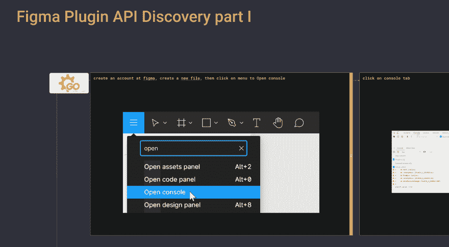

# Figma 插件 API 发现-第 1 部分

> 原文：<https://dev.to/lepinekong/figma-plugin-api-discovery-part-1-45o2>

Figma 宣布了一个新的插件 API 的可用性。

以下是我对 figma 插件 API 发现第一部分的笔记(即使没有 Figma 帐号你也可以试试) :

Figma 插件 API Discovery@Go/Grafcet。在线

Figma 插件 API 发现-第 2 部分-开发社区👩‍💻👨‍💻