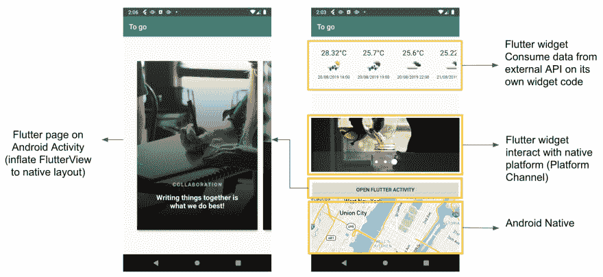
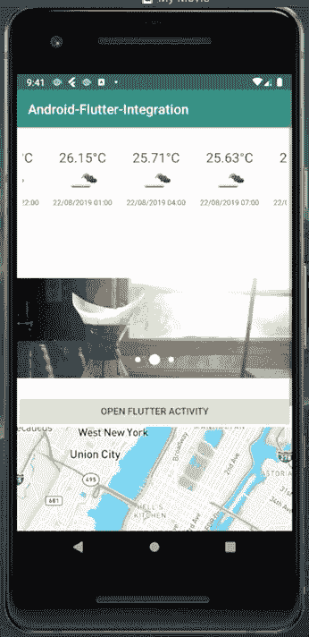
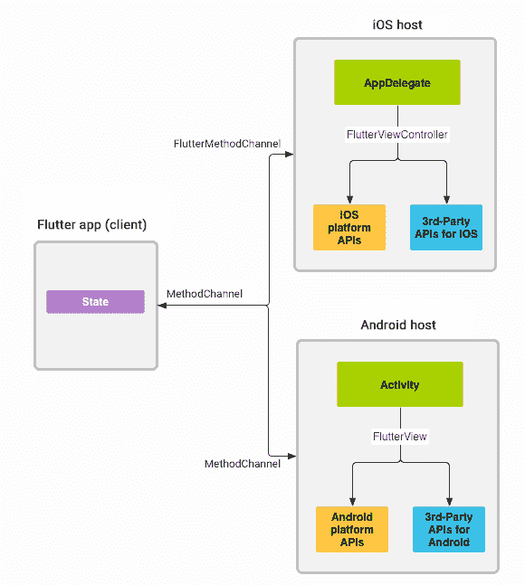
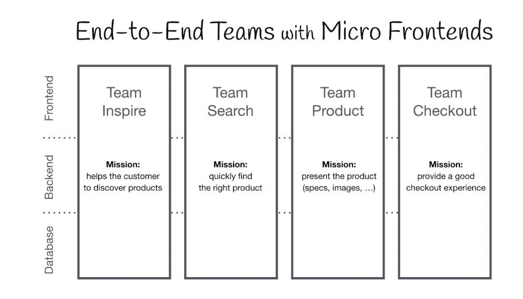
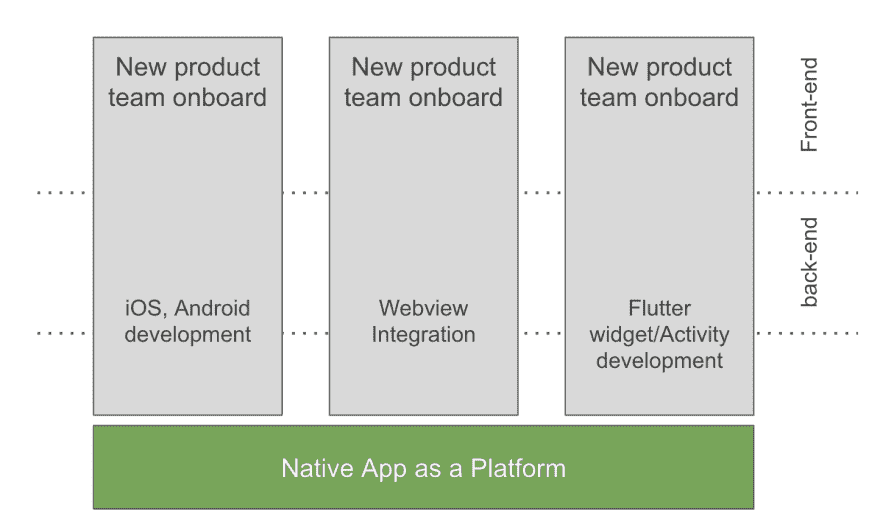

# 微前端中的颤振方法

> 原文：<https://dev.to/netfirms/flutter-approach-in-micro-frontend-term-17f3>

我几个月前才开始开发 Flutter。作为一名技术主管，我必须为业务解决方案寻找新技术的可能性和可行性。我必须从零开始开发 discovery Flutter 应用程序，一切都很好，我可以用基本的 Flutter 知识在 1 周内开发出同样的应用程序，这需要 2-3 周，顺便说一下，它有优点和缺点。但是这篇文章不是关于那个的。我们将讨论“Flutter 能成为移动应用的微前端吗？”因为对我来说关于 Flutter 的简单知识是用 Dart 渲染引擎…所以我试着去发现我们是否能把 Flutter 小部件集成到本机？搜索并找到“添加到应用程序”主题，它仍然在预览中。好吧，所以我发现了它，并尝试它。第一次如此痛苦…几个晚上之后。我可以塑形。我可以在同一个本机屏幕上显示小部件，在本机应用程序中打开一个全新的页面。所以让我们从建筑和技术的角度来看。下面是一个 Android native-flutter 应用程序的例子。

例如应用程序，我开发了一个本地应用程序，其中嵌入了 2 个 Flutter 小部件，1 个 Flutter 活动和 1 个本地地图视图。让我们进入每个窗口小部件
天气预报窗口小部件的细节，这个 Flutter 窗口小部件是我从 albertopeam/flutter-weather 项目借来的，它可以显示预报天气并从开放的天气 API 中消耗预报数据。所有打包到自身中的代码除了 UI 注入代码之外，本机包中不包含任何小部件代码。
颤动图像转盘。这是一个简单的，只显示 3 张图片，如果我们点击图片，它会发送消息到本地移动本地地图的位置。
原生地图视图，它只是原生地图视图。
抖动滑块图像活动。这是一个单独的本机屏幕，只呈现 Flutter 页面小部件。

**我们正在使用的知识**

*   简单的 Android 应用程序开发(视图、布局、活动)。
*   颤振平台-通道。
*   Flutter 小部件开发。

**微前端术语**

作为应用实例的本机-颤振混合前端方法。

从我的例子中，你可以看到我们可以以微前端术语的形式，为具有 Native-Flutter 功能的本机应用程序添加越来越多的可能性。

**结论**
我认为，如果你有一个成长中的团队，拥有大量前端开发技术人员，那么 flutter 可以成为解决方案之一。颤振是颤振它的设计思维，飞镖只是为它提供了结构，使颤振活起来。不应该有本土与颤振或本土与本土颤振之间的战争。从积极的角度来看，使用微前端方法和 Native-Flutter 可以让您在本机级别进行控制(安全性、性能和本机服务使用)，很容易在两个团队中加入另一个前端技术，缩短不确定功能开发的时间等等。希望这篇文章能给你一些思路。欢迎任何想法和评论。
和平