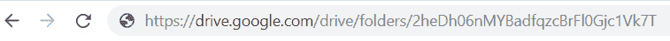

# 创建一个服务帐户以向 Google 进行身份验证

> 原文：<https://dev.to/mornir/create-a-service-account-to-authenticate-with-google-5b1k>

# 简介

当你想在你的网站上使用 Google APIs 的时候，你首先需要通过 Google 的认证。对于像 Google Map 这样的服务，您可以简单地生成一个 API 密钥，并将其与您的请求一起传递。然而，对于像 Google Drive 这样的服务，API key 选项是不可用的。相反，您可以创建一个**服务帐户**(类似于机器人帐户)。

服务帐户与用户帐户(普通帐户)的不同之处在于，它们**没有密码**(但是有电子邮件！)和**无法通过浏览器登录**。例如，在 Google Drive 的情况下，这意味着您无法使用网站(google.drive.com)管理服务帐户的文件，而只能通过 Drive API 进行管理。对于对 Google 的认证，他们使用私有/公共 RSA 密钥对。

# 如何创建服务账户

您可以在您的 Google Cloud 控制台中创建这样一个帐户。
如果还没有完成，创建一个新项目并前往*API 和服务*。在凭证下，可以点击*创建凭证*按钮，在下拉列表中选择*服务账户*。完成后，系统会提示您下载一个包含凭证的 JSON 文件。保存好这个文件，不要把它提交到你的 GitHub repo 中。

JSON 文件应该是这样的:

```
{  "type":  "service_account",  "project_id":  "xxxx",  "private_key_id":  "xxx",  "private_key":  "xxxx",  "client_email":  "xxxx@xxxx.iam.gserviceaccount.com",  "client_id":  "xxxx",  "auth_uri":  "https://accounts.google.com/o/oauth2/auth",  "token_uri":  "https://oauth2.googleapis.com/token",  "auth_provider_x509_cert_url":  "xxxx",  "client_x509_cert_url":  "xxxx"  } 
```

Enter fullscreen mode Exit fullscreen mode

# 示例:使用服务帐户访问 Google Drive

在云控制台的*API 和服务*下，找到*驱动 API* 并启用。现在，您可以以编程方式管理链接到您创建的服务帐户的驱动器中的文件。
然而，如前所述，你将无法在浏览器中看到它们。不过，您可以使用“真实”用户帐户登录 google.drive.com，然后创建一个文件夹(使用 UI)，最后通过提供 JSON 文件中“client_email”属性的值，与服务帐户共享该文件夹。
现在，如果您使用服务帐户将文件上传到该特定文件夹，您将在 google.drive.com 的用户帐户中看到这些文件😃
这些文件的所有者仍然是服务帐户，这意味着如果您从用户帐户中删除它们，它们将仍然存在于服务帐户中。

# 给我看看一些代码

对于这个例子，我们将在官方 npm 包`googleapis`的帮助下在 Node.js 中编写代码，该包包含所有 Google APIs 的助手。

我们首先需要通过提供我们的凭证和我们需要的访问权限(这里称为“作用域”)来初始化一个新的客户机。为了获得许可，我们将赋予作用域`https://www.googleapis.com/auth/drive.file`(更多关于作用域的信息，请点击)。

对于凭证，我们需要传递来自 JSON 文件的数据。您可以直接从 JSON 文件中读取它，或者将它作为字符串添加到 env 文件中，然后解析它。
下面的`getCredentials`函数使用第一种方法，回到第二种方法。

## 认证

```
function getCredentials() {
  const filePath = path.join(__dirname, 'credentials.json')
  if (fs.existsSync(filePath)) {
    return require(filePath)
  }
  if (process.env.CREDENTIALS) {
    return JSON.parse(process.env.CREDENTIALS)
  }
  throw new Error('Unable to load credentials')
}

async function getDrive() {
  const credentials = getCredentials()
  const client = await google.auth.getClient({
    credentials,
    scopes: 'https://www.googleapis.com/auth/drive.file',
  })

  return google.drive({
    version: 'v3',
    auth: client,
  })
} 
```

Enter fullscreen mode Exit fullscreen mode

## 上传文件

不要忘记将共享文件夹 ID 指定为上传位置，否则您将无法在您的用户帐户中看到上传的文件。
你可以在地址栏轻松找到这个 ID:
[](https://res.cloudinary.com/practicaldev/image/fetch/s--9asVHU9E--/c_limit%2Cf_auto%2Cfl_progressive%2Cq_auto%2Cw_880/https://thepracticaldev.s3.amazonaws.com/i/lp0h2cc8moykiemtdj9m.PNG)

下面的代码片段上载了一个文本文件，其内容由字符串“Hello World”组成。

```
getDrive().files.create({
    requestBody: {
      name: 'Test',
      mimeType: 'text/plain',
      parents: [SHARED_FOLDER_ID],
    },
    media: {
      mimeType: 'text/plain',
      body: 'Hello World',
    },
}).catch(e => console.error(e)) 
```

Enter fullscreen mode Exit fullscreen mode

如果一切顺利，您应该可以在共享文件夹中看到该文件。

在以后的博文中，我会分享一个使用 Netlify Cloud 函数将数据备份到 Google Drive 的真实案例。

敬请期待！

资源:
[https://medium . com/@ bret Cameron/how-to-use-the-Google-drive-API-with-JavaScript-57 a6 cc 9 e 5262](https://medium.com/@bretcameron/how-to-use-the-google-drive-api-with-javascript-57a6cc9e5262)
[https://cloud.google.com/iam/docs/service-accounts](https://cloud.google.com/iam/docs/service-accounts)