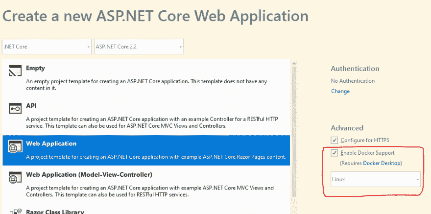
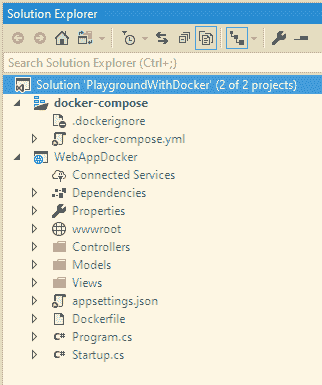
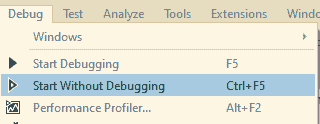
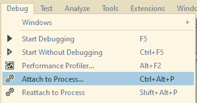
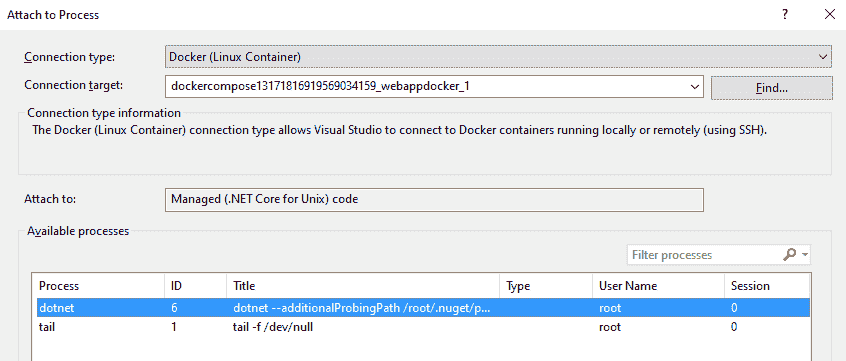
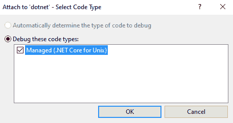
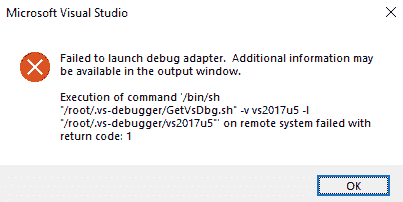
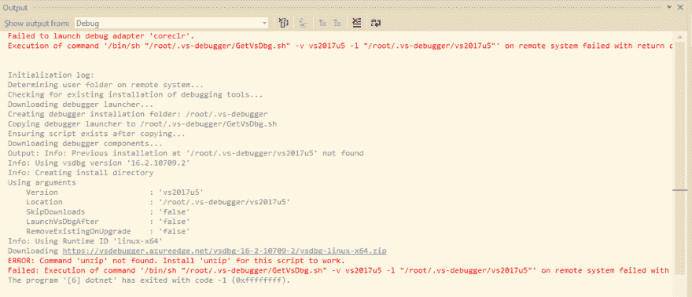
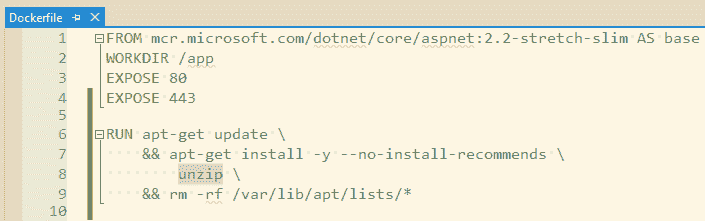

# 在 Visual Studio 中调试 Docker 项目的问题

> 原文：<https://dev.to/davidsonsousa/the-problem-of-debugging-a-docker-project-in-visual-studio-23ff>

我已经阅读了几周关于 Docker 的文章，几天前，我决定创建一个小型的概念验证。你知道，只是为了确保我明白了一切。但是我最终遇到了问题，这导致了 Twitter 上的[小帖子](https://twitter.com/DavidsonSousa/status/1162087779523801088)，我在这里扩展了它。

一切都是从我决定用 Visual Studio 2019 替我搞定 Docker 开始的。万一你不知道，你可以“dockerize”现有的项目…

[](https://res.cloudinary.com/practicaldev/image/fetch/s--wBO2MXCR--/c_limit%2Cf_auto%2Cfl_progressive%2Cq_auto%2Cw_880/http://davidsonsousa.net/image/post/add-docker-support.png)

…或者从头开始创建一个“dockerized”项目。

[](https://res.cloudinary.com/practicaldev/image/fetch/s--h7_81ibF--/c_limit%2Cf_auto%2Cfl_progressive%2Cq_auto%2Cw_880/http://davidsonsousa.net/image/post/enable-docker-support.png)

我决定两者都做，因为我只是在玩。结果是我后来删除了几个重复的文件。也许最好的选择是在项目创建后将其“归档”。不管怎样，目前的结果是这样的:

[](https://res.cloudinary.com/practicaldev/image/fetch/s--_Yq43IIz--/c_limit%2Cf_auto%2Cfl_progressive%2Cq_auto%2Cw_880/http://davidsonsousa.net/image/post/solution-explorer.png)

从那时起，我只想看看当我运行项目时会发生什么。于是，我做了我的惯常做法:不调试就启动项目(Ctrl+F5)。我更喜欢这样做，因为它给我的感觉是我正在接近一个真正的应用程序。更不用说我不会点击我已经添加并忘记禁用的随机断点。

[](https://res.cloudinary.com/practicaldev/image/fetch/s--oP0zwe5r--/c_limit%2Cf_auto%2Cfl_progressive%2Cq_auto%2Cw_880/http://davidsonsousa.net/image/post/debug-menu.png)

每当我想调试的时候，我就简单的把 Visual Studio 附加到项目的进程上(Ctrl+Alt+P)。

[](https://res.cloudinary.com/practicaldev/image/fetch/s--Mm9R2PAH--/c_limit%2Cf_auto%2Cfl_progressive%2Cq_auto%2Cw_880/http://davidsonsousa.net/image/post/debug-menu-attach.png)

这将打开一个对话框，我可以在其中选择流程。但是由于我使用的是 Docker，所以我必须选择连接目标和进程，前者是容器的名称，后者是“dotnet”。

[](https://res.cloudinary.com/practicaldev/image/fetch/s--RTEVEAKi--/c_limit%2Cf_auto%2Cfl_progressive%2Cq_auto%2Cw_880/http://davidsonsousa.net/image/post/connection-target.png)

这里有一个额外的步骤，即代码的类型。由于我使用的是 **Linux 容器*** ，我将选择唯一可用的选项。

[](https://res.cloudinary.com/practicaldev/image/fetch/s--BlRskcPa--/c_limit%2Cf_auto%2Cfl_progressive%2Cq_auto%2Cw_880/http://davidsonsousa.net/image/post/code-type.png)

应该就是这样了。代码将被附加，我将能够调试。不幸的是，几秒钟后我得到了一个异常，说启动调试适配器失败了。

[](https://res.cloudinary.com/practicaldev/image/fetch/s--N31djUOp--/c_limit%2Cf_auto%2Cfl_progressive%2Cq_auto%2Cw_880/http://davidsonsousa.net/image/post/exception.png)

因为异常也指向输出窗口，所以检查那里也是一个好主意。那一刻，我后悔自己不了解 Linux:

[](https://res.cloudinary.com/practicaldev/image/fetch/s--qvMGcZaP--/c_limit%2Cf_auto%2Cfl_progressive%2Cq_auto%2Cw_880/http://davidsonsousa.net/image/post/output-window.png)

输出窗口中整个文本最重要的部分用红色书写，在底部:

```
ERROR: Command 'unzip' not found. Install 'unzip' for this script to work. 
```

结果是我的容器中没有安装那个“解压程序”。如何安装？不知道。但是经过一番调查[后，我发现一个*docker file*](https://github.com/dotnet/dotnet-docker/blob/master/2.2/aspnet/stretch-slim/amd64/Dockerfile)**可以**帮我，因为它似乎与我的匹配。或者至少有相同的原则。在那个文件中，对我来说最重要的是安装“curl”的内容。所以，我复制了那部分并粘贴到我自己的 *dockerfile* 中，只是小心地用 *curl* 替换 *unzip* 。

[](https://res.cloudinary.com/practicaldev/image/fetch/s--ytXczr0a--/c_limit%2Cf_auto%2Cfl_progressive%2Cq_auto%2Cw_880/http://davidsonsousa.net/image/post/dockerfile.png)

一旦我完成了，我就重复我的调试步骤:不带调试运行并附加。此时，它的工作没有任何问题。对于不习惯使用 Docker 的人来说，我注意到与正常运行相比，它需要几秒钟才能连接。但是当我分离和重新连接时，它就像我习惯的那样快。并且命中了所有断点。

也许这是 Visual Studio 生成的 *dockerfile* 中的一个小 bug，这意味着我应该学习如何手动创建自己的 *dockerfile* 直到它被修复。或者我错过了什么。我注意到的另一件事是:attach 不能与 Windows 容器一起工作，我必须使用 F5 来调试它。

我还在学习，有很多东西需要理解。

****注意:**我用的是 Linux 容器，因为 Windows 容器甚至不允许我正常调试。我的最佳猜测是 VS 和 Docker 仍然需要在他们的关系上努力。*