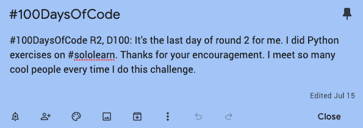

# 我应对#100DaysOfCode 挑战的方法:记住编码中人性的一面

> 原文：<https://dev.to/nicolepdotme/my-approach-to-the-100daysofcode-challenge-remembering-the-human-side-of-coding-456o>

代码 100 天是一项挑战，是由[亚历山大·卡拉威](https://twitter.com/ka11away)创立的“X 的 100 天”自我提升项目的一部分。这些挑战背后的想法是通过重复和鼓励建立一个积极的习惯。

“100 天”挑战是一种培养习惯的有趣方式，因为你公开承诺它们，并且每天通过标签在社区签到。社区为你加油，让你在这 100 天里保持动力。

到目前为止，我已经完成了两轮 100 天代码挑战。一次是在我完成[前端技术学位](https://teamtreehouse.com/techdegree/front-end-web-development)的时候，另一次是在那之后。这是一个让我的课程优先的好方法，也是我每天做的事情*，而不是我每天需要做的事情*。**

 **挑战的正式规则是:

在接下来的 100 天里，每天至少编码一小时。用#100DaysOfCode 标签发布你每天的进步。

然而，我认为这是一个灵活的挑战。“每天写一个小时的代码”可以包含任何你想要的东西，你可以选择分享你的进步或者只是写个人日志。如果你不严格遵守规则，没有人会出现在你家门口对你大喊大叫。

这些规则只是让你开始的指南，重要的是专注于建立一个积极的编码习惯。不管这对你意味着什么。

我认为作为开发人员，我们与逻辑打交道太多，我们倾向于从字面上理解规则。记住编码中人性的一面对我们也有好处。

休息很重要，这样做并不意味着你失败了。没有多少人能在整整 100 天里把所有事情都放在一边，每天不间断地编码。

我做了 100 天的代码挑战，因为它让我不会找借口，比如“我太累了”或者“我的网飞账户上现在有太多没看的内容。”

当我觉得有人在期待我“报到”时，我更有可能腾出时间来学习，而不是让拖延占据我。

当我的冒名顶替综合症肆虐时，我也喜欢有一种方式来回顾我的进步。有时候你会很沮丧，没有得到什么东西，这会让你情绪低落。

有一种方法可以回头看看你开始时走了多远，这是一种战胜我们偶尔都会面临的不可避免的挫折的好方法。

对我来说管用的是在谷歌日历中创建一个每日提醒，在每天结束时戳我，在推特上发布我的进展。我在 Google Keep 中保存了一个小模板，提醒我今天是哪一天。

这个挑战也帮助我开始克服我的能见度问题。作为一名在美国中西部长大的女性，我被教导不要太大声或吹嘘太多。

作为一个成年人，这一直伴随着我，作为一个天生害羞的人，我真的需要努力让别人看到我和我的作品。我更愿意躲在我的电脑屏幕后面，在推特上发布我每天在做什么有助于我以一种安全和支持的方式被人看到。

因为 100 天代码社区是如此受欢迎和有帮助，我建议公开地承诺挑战，并在其他人可以看到的地方跟踪你的进展。

但是如果你像我一样害羞，你还没有准备好成为焦点，那也很酷。你可以在笔记本、私人 [Trello](http://www.trello.com) 板上、电子表格或你最喜欢的笔记应用程序中追踪你的进展。

也许你自己做了一轮，如果你发现有帮助，你做第二轮，再加一点，下次开始在推特上发布你的进展。

代码挑战 100 天只是我们推动自己变得更好的众多方式之一。这对我们每个人来说都有不同的意义，这很好。因此，如果你错过了一天，只要在第二天继续做你正在做的事情。**