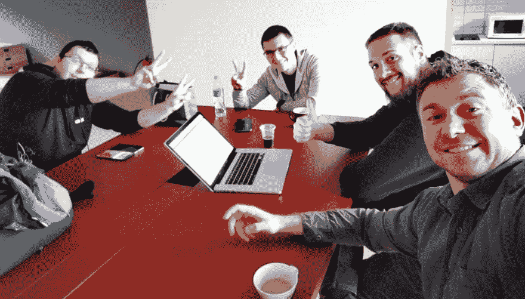

# 加速 DevOps 报告 2019 的状态:实践社区是如此之多！

> 原文：<https://dev.to/ikrnic/accelerate-state-of-devops-report-2019-communities-of-practices-are-so-dope-4bp7>

新的[加速 DevOps 状态报告 2019](https://cloud.google.com/devops/state-of-devops/) 已经发布！

如果你想知道这有什么大惊小怪的，这是同类研究中规模最大、持续时间最长的研究，揭示了真正成功的软件交付公司与不太成功的同行有什么不同。哇，谁不想看看呢？！这项研究由**的 Nicole Forsgren 博士领导，下面是她对报告的看法。**

[https://www.youtube.com/embed/8M3WibXvC84](https://www.youtube.com/embed/8M3WibXvC84)

有一种根深蒂固的观点认为，软件交付过程的速度是以牺牲稳定性为代价的，反之亦然。如果你交付的东西很快，你一定会在生产中破坏东西。因此，如果你想要一个可靠的系统，你不能走得太快。如果你需要跑得更快，请放心，你的系统不会可靠。

## 什么数据说的？

年复一年，这份报告以数据和科学方法为依据，证明速度和稳定并不矛盾。相反，速度和稳定性是相辅相成的。

精英表现远远优于低水平表现者。数字是惊人的:从提交到部署的代码部署频率增加了 208 倍，交付时间加快了 106 倍。

这可能吗？当使用适当的组织和技术实践时，确实如此。

## 如何移动指针？

公认的组织实践之一是建立**实践社区(CoP)** 而不是培训中心或卓越中心(CoE)。正如报告所证实的，特遣队所属装备是本组织相关专门知识的瓶颈。CoE 在整个组织中的伸缩性也很差。此外，报告承认 CoE *“在组织中建立了一个排他性的“专家”小组，而不是一个包容性的同行小组，他们可以继续学习并共同成长。”*

实践社区恰恰是后者，是一个非正式的同行团体，围绕着每个人都感兴趣的共同话题聚集在一起。团队成员分享知识、经验和技能，并为共同的目标共同努力。你觉得你的组织可以从更好的测试过程中获益吗？找到志同道合的同行，将他们招募到实践社区进行测试。共同努力改进测试过程。定义你的工作协议。一切都是可以接受的:你们可以每天早上一起喝咖啡，或者一天中的晚些时候，或者下班后一起喝啤酒。唯一重要的是，参与是自愿的，成员是真正感兴趣和有动力的。

## 我们对实践社区的体验

一次又一次，这种方法证明了它在 CROZ 的价值。我们致力于建立一种健康、包容的组织文化，绝不容忍象牙塔式的工作，因为在象牙塔中，经验和知识对组织的其他成员是不可见的。我们一些最活跃的社区是**敏捷社区、开发运维社区和产品管理社区。**

每个社区**都是完全开放的**和**每个人都可以参与和贡献**。成员定期会面，分享他们的经验以及有用的书籍、博客、工具、见解和想法。**同样重要的是:所有社区都有充分的自主权来确定自己的目标。**成员们一起定义步骤和实验，这将使每个社区更接近其目标。这里不涉及管理。社区成员围绕任务自主协作，并朝着既定目标前进。

警察的社会面很壮观！人们正在聚在一起。我看到了新的友谊。我见过无数的旧斧头被埋葬。我自己和一些人走得很近。今天我会为他们做任何事，我相信他们也会为我做同样的事。警察就是这样对待你的组织的。试试看。

