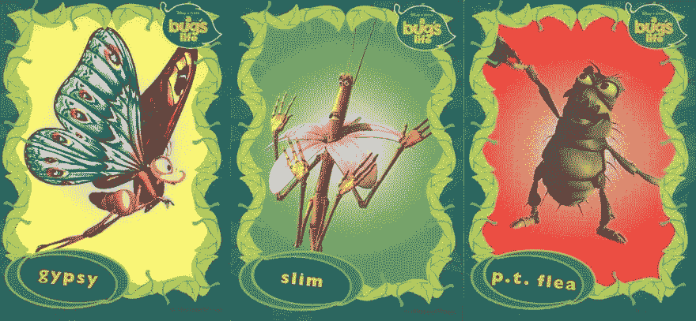

# 为什么要使用 React 钩子(第一部分:复杂的生命周期)

> 原文：<https://dev.to/dinhhuyams/why-react-hooks-part-i-1jo>

**先决条件:**关于[的基本知识反应](https://reactjs.org/)

在这篇文章中，我们将讨论为什么我们都应该开始学习和使用鱼钩，尽管钓鱼不是我们的爱好🐟 🎣。

> 嘿 Siri，把计时器设置为 5 分钟😋

如果你以前从未尝试过钩子或者听说过它，和我呆在一起 **5 分钟**，你会立刻意识到钩子的第一个重要好处🥇。

我已经开始使用 React hooks 大约一个月了，它是一个真正的游戏改变者。钩子的一个明显的好处是它帮助我们去除多余的复杂的反应生命周期。

> 你没看见禁止钓鱼的标志吗，孩子？
> 
> 我:我不是在钓鱼，先生。....

😎让我们看看它是如何工作的

我们今天的任务只是为用户订阅一个无线电频道📻。

## 1。类别组件

对于这个简单的任务，我们将使用**组件安装**生命周期

```
class Radio extends React.Component {
    state = {channelId: 1}

    componentDidMount() {
        subscribeToRadio(this.state.channelId)
    }

    ...
} 
```

<svg width="20px" height="20px" viewBox="0 0 24 24" class="highlight-action crayons-icon highlight-action--fullscreen-on"><title>Enter fullscreen mode</title></svg> <svg width="20px" height="20px" viewBox="0 0 24 24" class="highlight-action crayons-icon highlight-action--fullscreen-off"><title>Exit fullscreen mode</title></svg>

一个频道有点无聊🙃

让我们允许用户通过点击按钮跳转到他们喜欢的频道。为此，我们需要在订阅新频道之前取消订阅以前的频道， **componentDidUpdate** 应该是做这件事的合适地点

```
class Radio extends React.Component {

    ...

    componentDidUpdate(prevProps, prevState) {
        if (prevState.channelId !== this.state.channelId) {

            unsubscribeRadio(prevState.channelId)

            subscribeToRadio(this.state.channelId)
        }
    }

    changeChannel = () => {
        const id = randomId()
        this.state({channelId: id})
    }

    render() {

        return (
                <div>
                    <p>Current channel: ${channelId}</p>
                    <button onClick={this.changeChannel}>Change channel</button>
                </div>
            )
    }
} 
```

<svg width="20px" height="20px" viewBox="0 0 24 24" class="highlight-action crayons-icon highlight-action--fullscreen-on"><title>Enter fullscreen mode</title></svg> <svg width="20px" height="20px" viewBox="0 0 24 24" class="highlight-action crayons-icon highlight-action--fullscreen-off"><title>Exit fullscreen mode</title></svg>

最后但同样重要的是，当用户停止收听时，我们必须取消订阅该频道。我们将在**组件卸载**
中这样做

```
class Radio extends React.Component {

    ...

    componentWillUnmount() {
        unsubscribeRadio(this.state.channelId)
    }
} 
```

<svg width="20px" height="20px" viewBox="0 0 24 24" class="highlight-action crayons-icon highlight-action--fullscreen-on"><title>Enter fullscreen mode</title></svg> <svg width="20px" height="20px" viewBox="0 0 24 24" class="highlight-action crayons-icon highlight-action--fullscreen-off"><title>Exit fullscreen mode</title></svg>

因此，对于这个简单的无线电订阅任务，我们仍然总共需要 **3 个生命周期**:

*   组件安装
*   componentDidUpdate
*   组件将更新

如果你添加越来越多的功能，我假设它会有一些副作用，对你的应用程序来说，这些功能会按照生命周期方法而不是副作用来分组。你将最终在这些生命周期方法中堆积所有的逻辑。

🤨 🧐 😕

想象你有一只虫子🐛，需要经过 **3 个不同的地方**才能找到并修复。你必须玩[三虫蒙特](https://en.wikipedia.org/wiki/Three-card_Monte)游戏才能
找到那个虫子，我打赌你们都知道赢得那种游戏有多难🤦‍

[](https://res.cloudinary.com/practicaldev/image/fetch/s--5Y_Nr2ge--/c_limit%2Cf_auto%2Cfl_progressive%2Cq_auto%2Cw_880/https://user-images.githubusercontent.com/26871154/63650946-ec7a5380-c758-11e9-854b-41f8ac27526a.jpg)

## 2。带挂钩的功能组件

🔥钩子来救援了

> 钩子是 React 16.8 中的新增功能。它们允许您使用状态和其他 React 特性，而无需编写类。

让我们看看 Hook 如何实现同样的结果。要使用钩子，我们需要将上面的类组件转换成功能组件。我们可以用下面的方法创建一个超级简单的组件:

```
const Radio = () => {
    const [channelId, setChannelId] = React.useState(1)

    React.useEffect(() => {
        subscribeToRadio(channelId)

        return () => unsubscribeRadio(channelId) 
    }, [channelId])

    const changeChannel = () => {
           const id = randomId()
           setChannelId(id)
    }

    return (
        <div>
            <p>Current channel: ${channelId}</p>
            <button onClick={changeChannel}>Change channel</button>
        </div>
    )

} 
```

<svg width="20px" height="20px" viewBox="0 0 24 24" class="highlight-action crayons-icon highlight-action--fullscreen-on"><title>Enter fullscreen mode</title></svg> <svg width="20px" height="20px" viewBox="0 0 24 24" class="highlight-action crayons-icon highlight-action--fullscreen-off"><title>Exit fullscreen mode</title></svg>

> 😲哇，太神奇了。你是怎么做到的？

**React.useState** 和 **React.useEffect** 是 React 挂钩，可以帮助你实现与生命周期相同的结果。即使您可能不完全清楚上面的挂钩，我打赌函数名可能会给你一些提示，您仍然可以立即感觉到挂钩使代码更加干净和简单。

你可以看到，所有的逻辑都集中在 **1 勾**而不是像以前一样的 **3 处**。更容易调试。如果你想删除这个特性，你需要做的就是删除相关的效果。

💪让我们一起来打破它。

### ·使用状态

> **useState** 是一个钩子，帮助我们管理函数组件中的局部状态。

```
const Radio = () => {
    const [channelId, setChannelId] = React.useState(1)

    const changeChannel = () => {
        const id = randomId()
        setChannelId(id)
    }

    ...
} 
```

<svg width="20px" height="20px" viewBox="0 0 24 24" class="highlight-action crayons-icon highlight-action--fullscreen-on"><title>Enter fullscreen mode</title></svg> <svg width="20px" height="20px" viewBox="0 0 24 24" class="highlight-action crayons-icon highlight-action--fullscreen-off"><title>Exit fullscreen mode</title></svg>

**使用状态**钩子接受**初始状态**作为它的参数。在上面的代码中，`1`是 **channelId** 的初始值。

这个钩子返回一个包含 2 个变量的数组，其中第一个变量是当前状态的**，第二个变量是允许我们更新状态**的函数**。我们使用数组析构`[channelId, setChannelId]`,你可以随意命名它们**

### ·使用效果

**React.useEffect** 让我们在函数组件
中执行副作用

```
const Radio = () => {

    const [channelId, setChannelId] = React.useState(1)

    React.useEffect(() => {
        subscribeToRadio(channelId)
    }) 

    ...   
} 
```

<svg width="20px" height="20px" viewBox="0 0 24 24" class="highlight-action crayons-icon highlight-action--fullscreen-on"><title>Enter fullscreen mode</title></svg> <svg width="20px" height="20px" viewBox="0 0 24 24" class="highlight-action crayons-icon highlight-action--fullscreen-off"><title>Exit fullscreen mode</title></svg>

在这种情况下，我们执行无线电频道订阅。默认情况下，我们的效果将在每个组件渲染和更新后运行。

然而，这实际上并不是我们想要的，如果我们只需要在第一次渲染(**componentidmount**)后只执行一次这个效果，我们需要传递一个空数组作为 useEffect Hook 的第二个可选参数。一个空数组意味着这个效果不依赖于任何东西，所以它只会在挂载时运行(如果你返回一个清理函数就卸载)

```
const Radio = () => {

    const [channelId, setChannelId] = React.useState(1)

    React.useEffect(() => {
        subscribeToRadio(channelId)
    }, []) 

    ...   
} 
```

<svg width="20px" height="20px" viewBox="0 0 24 24" class="highlight-action crayons-icon highlight-action--fullscreen-on"><title>Enter fullscreen mode</title></svg> <svg width="20px" height="20px" viewBox="0 0 24 24" class="highlight-action crayons-icon highlight-action--fullscreen-off"><title>Exit fullscreen mode</title></svg>

此外，我们还需要在每次 **channelId** 状态改变后执行效果(当用户点击按钮时)。我们将通过将 **channelId** 传递给数组来告诉效果这样做。记住你放在数组里的是效果所依赖的。好消息是，你可以把多个变量放入这个数组！！

```
const Radio = () => {

    const [channelId, setChannelId] = React.useState(1)

    React.useEffect(() => {
        subscribeToRadio(channelId)
    }, [channelId]) 

    ...   
} 
```

<svg width="20px" height="20px" viewBox="0 0 24 24" class="highlight-action crayons-icon highlight-action--fullscreen-on"><title>Enter fullscreen mode</title></svg> <svg width="20px" height="20px" viewBox="0 0 24 24" class="highlight-action crayons-icon highlight-action--fullscreen-off"><title>Exit fullscreen mode</title></svg>

该效果将通过比较**当前 channelId** 值和**先前 channelId** 值**(使用浅层比较===)** 来确定 **channelId** 何时改变。

如果这些值不变，React 将跳过该效果😙。当我们用 **componentDidUpdate** 生命周期来比较
**this.state.channelId** 和 **prev.state.channelId** 时也是一样

> 注意:它使用浅相等而不是深比较

最后，我们将取消订阅📻当用户改变频道时

```
const Radio = () => {

    const [channelId, setChannelId] = React.useState(1)

    React.useEffect(() => {
        subscribeToRadio(channelId)

        return () => unsubscribeRadio(channelId) 

    }, [channelId]) 

    ...   
} 
```

<svg width="20px" height="20px" viewBox="0 0 24 24" class="highlight-action crayons-icon highlight-action--fullscreen-on"><title>Enter fullscreen mode</title></svg> <svg width="20px" height="20px" viewBox="0 0 24 24" class="highlight-action crayons-icon highlight-action--fullscreen-off"><title>Exit fullscreen mode</title></svg>

该效果返回一个称为清理函数的函数。

当使用类组件时，我们必须将这个逻辑分成两个组件**组件更新**和**组件卸载**

我们的效果不仅会在第一次渲染时运行，还会在每次更新时运行(当 channelId 改变时)，因此，每次在下一次渲染之前都会调用清理函数

## 3。结论:

钩子的一个好处是，它通过去除复杂的生命周期，让你的[反应 app 90%干净](https://www.youtube.com/watch?v=dpw9EHDh2bM)。

它帮助我们将东西放在一起，根据副作用将我们的应用程序功能分组，而不是将它们分散到不同的生命周期方法中

现在觉得需要学习钩子了，这里有一些好的资源给你:

*   [挂钩简介](https://reactjs.org/docs/hooks-intro.html)
*   肯特·c·多兹的现代反应工作室(第一部分)
*   肯特·c·多兹的现代反应工作室(第二部分)

## 🙏 💪感谢阅读！振作起来，第二部分就要来了

请在下面留下你的评论，让我知道你对 React Hooks 的看法

### ✍️所写

**【huy trinh】**🔥 🎩♥️ ♠️ ♦️ ♣️🤓

软件开发者|魔法爱好者

打招呼👋在

✅ [Github](https://github.com/HuyAms)

✅ [领英](https://www.linkedin.com/in/huy-trinh-dinh-253534131/)

✅ [Medium](https://medium.com/@trnhnhhuy)