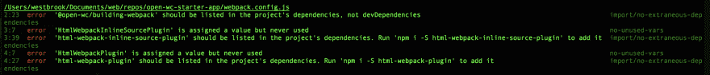

# 不是另一个待办事项应用程序:第 4 部分

> 原文：<https://dev.to/westbrook/not-another-to-do-app-part-4-58cd>

#### 用 Open Web 组件推荐弄脏你的手和脚...算是吧。

> *这是 2019 年 2 月 26 日来自 [Medium](https://medium.com/@westbrook/not-another-to-do-app-169c14bb7ef9) 的一篇文章的交叉帖子，利用了我最近决定在我的写作中使用语法的优势(因此，在这里和那里做了一些小编辑)，如果你在那里看到它，感谢再次查看🙇🏽‍♂️:如果这是你第一次阅读，欢迎！*

*欢迎来到“不要再做一个应用程序”，这是一篇冗长的综述，讲述了每个开发人员在某个时候都会编写的最小的应用程序之一。如果你是来学习编写应用程序的特定技术的，或者是从以前的安装中走出来的，那么你可能来对地方了，应该继续读下去！如果没有，你可能想[从头开始](https://dev.to/westbrook/not-another-to-do-app-2kj9)，这样你也可以知道[我们所有角色的背景故事...](https://github.com/Westbrook/to-do-app)*

如果你已经做到了这一步，为什么现在就放弃呢？

* * *

# 量两次，皮棉一次

<figure>

[](https://res.cloudinary.com/practicaldev/image/fetch/s--08-DAb5n--/c_limit%2Cf_auto%2Cfl_progressive%2Cq_auto%2Cw_880/https://thepracticaldev.s3.amazonaws.com/i/2i1f74tq26nescs51siu.jpeg)

<figcaption>Photo by [Fleur Treurniet](https://unsplash.com/@yer_a_wizard) on [Unsplash](https://unsplash.com/)</figcaption>

</figure>

读者对前一节中共享的一段有问题的代码做出了如此激烈的回应，要阻止他们的一两条评论可能已经太晚了。在准确地向我们的应用程序交付内容以通过“它为您列表中的每个待办事项将待办元素呈现到 DOM 中”的测试时，下面的代码示例引发了 open-wc 团队为我们的应用程序提供的另一个特性的愤怒:

```
render() {
    return html` ${this.todos.map(todo => html`
            <to-do>${todo}</to-do>
        `)} `;
} 
```

<svg width="20px" height="20px" viewBox="0 0 24 24" class="highlight-action crayons-icon highlight-action--fullscreen-on"><title>Enter fullscreen mode</title></svg> <svg width="20px" height="20px" viewBox="0 0 24 24" class="highlight-action crayons-icon highlight-action--fullscreen-off"><title>Exit fullscreen mode</title></svg>

## *林挺！*

<figure>

[](https://res.cloudinary.com/practicaldev/image/fetch/s--whzYhFKH--/c_limit%2Cf_auto%2Cfl_progressive%2Cq_auto%2Cw_880/https://thepracticaldev.s3.amazonaws.com/i/jtffdb04o4mpvmwxjku1.png)

<figcaption>`.map` is disallowed in templates...</figcaption>

</figure>

正如你在上面的终端读数中看到的，open-wc 的生成器包含的 [`eslint-plugin-lit`](https://www.npmjs.com/package/eslint-plugin-lit) 有助于你编写更干净、更高性能的代码，并为基于`lit-html`的模板建立了许多规则。除了不依赖模板中的`.map`之外，当您将同一个属性多次绑定到一个元素时(即`<x-foo bar=${x} bar=${y} baz></x-foo>`)，当您冗余地使用模板文字时(即`foo ${‘bar'}`)，当您的绑定位于无效位置时(即`<x-foo></${expr}>`)，等等，您都会被告知。幸运的是，在我的`.map`中，纠正错误的步骤很少，它们使我们的模板可读性更好，并且它们为代码的可重用性做好了准备，我们将在后面讨论。

```
import { renderTodos } from './to-do-ui';

// ...

render() {
    return html` ${renderTodos(this.todos)} `;
} 
```

<svg width="20px" height="20px" viewBox="0 0 24 24" class="highlight-action crayons-icon highlight-action--fullscreen-on"><title>Enter fullscreen mode</title></svg> <svg width="20px" height="20px" viewBox="0 0 24 24" class="highlight-action crayons-icon highlight-action--fullscreen-off"><title>Exit fullscreen mode</title></svg>

然而，这并不是 lint 报告中唯一让我感到惊讶的部分。以下也抓住了我:

<figure>

[](https://res.cloudinary.com/practicaldev/image/fetch/s--TW0Lb_QB--/c_limit%2Cf_auto%2Cfl_progressive%2Cq_auto%2Cw_880/https://thepracticaldev.s3.amazonaws.com/i/yl641c8at9cbo3vrswb1.png)

<figcaption>No `for(let y in x)`?</figcaption>

</figure>

我实际上在两个相关的地方触发了这个警报(一个在应用程序端，一个在同一特性的测试端),所以纠正其中一个的逻辑主要适用于另一个。在一个实例中，代码如下:

```
for (const todoCount in workLevelByTodoCount) {
    if (todos.length <= todoCount) {
        return workLevelByTodoCount[todoCount];
    }
}
return Object.keys(workLevelByTodoCount).length; 
```

<svg width="20px" height="20px" viewBox="0 0 24 24" class="highlight-action crayons-icon highlight-action--fullscreen-on"><title>Enter fullscreen mode</title></svg> <svg width="20px" height="20px" viewBox="0 0 24 24" class="highlight-action crayons-icon highlight-action--fullscreen-off"><title>Exit fullscreen mode</title></svg>

当通过对象/数组方法交付时，您可以更加清晰地获得相同的功能:

```
const workLevelCounts = Object.keys(workLevelByTodoCount);
const count = workLevelCounts
    .find(todoCount => todos.length <= todoCount);
return typeof count !== 'undefined'
    ? workLevelByTodoCount[count]
    : workLevelCounts.length; 
```

<svg width="20px" height="20px" viewBox="0 0 24 24" class="highlight-action crayons-icon highlight-action--fullscreen-on"><title>Enter fullscreen mode</title></svg> <svg width="20px" height="20px" viewBox="0 0 24 24" class="highlight-action crayons-icon highlight-action--fullscreen-off"><title>Exit fullscreen mode</title></svg>

除了上述结果之外，我还遇到了许多其他较小的林挺错误和警告，我很高兴在第一次调用`git commit -am 'Code with some linting errors'`时就从我的代码库中清除了这些错误和警告。随着时间的推移，当涉及到这些可能对您的代码产生复合负面影响的小问题时，知道有人支持您是很好的。

## 更何况

当一个项目添加的帮助用户变得更好的工具(比如提交时的林挺)做了帮助项目本身变得更好的扩展工作时，这也很好。一旦我完成了我的林挺问题清单，我发现还有一个我无法解释的问题。

<figure>

[](https://res.cloudinary.com/practicaldev/image/fetch/s--s4nj2lOl--/c_limit%2Cf_auto%2Cfl_progressive%2Cq_auto%2Cw_880/https://thepracticaldev.s3.amazonaws.com/i/dcl0x26124cqcnpwt55t.png)

<figcaption>Even the generator needs to be linted, sometimes.</figcaption>

</figure>

事实证明，在发电机的开发过程中，有些东西被漏掉了。在发现这个问题并在 open-wc 项目中提交[一个问题](https://github.com/open-wc/open-wc/issues/246)后不久，它就被整理好了。

* * *

# 短游戏

正如许多对此类话题有意见的人所投票的那样，一篇 9000 多字的文章是不行的。

> WestbrookJ@ WestbrookJ所以，我在写博文...我注意到，当我不看的时候，它变得相当长，一次完成可能有 7000 个单词。我想说我会很幸运地把它编辑下来，但是一些技巧我还在提高...我该怎么办？2019 年 2 月 20 日 12 点 22 分[](https://twitter.com/intent/tweet?in_reply_to=1098196160613896192)[](https://twitter.com/intent/retweet?tweet_id=1098196160613896192)[](https://twitter.com/intent/like?tweet_id=1098196160613896192)

所以，怀着对你最深的敬意，我亲爱的读者，我把即将到来的对话分成了微不足道的十个部分。恭喜你，你已经接近第一场比赛的尾声了！如果你到目前为止还很享受，或者是那种会给一部新的情景喜剧加几集就能让它大放异彩的人，这里有一份其他人的名单，你可以把它们放在你的网飞名单上:

*   [不是另一个待办应用](https://dev.to/westbrook/not-another-to-do-app-2kj9)
*   [入门](https://dev.to/westbrook/not-another-to-do-app-3jem)
*   [尽早测试，经常测试](https://dev.to/westbrook/not-another-to-do-app-2m9a)(我可以对这些文章使用一些单元测试...)
*   测量两次，皮棉一次(你在这里)
*   [使其成为组件](https://dev.to/westbrook/not-another-to-do-app-part-5-5d7o)
*   [使其成为可重复使用的零件](https://dev.to/westbrook/not-another-to-do-app-part-6-an)
*   你的组件真的需要知道这些吗？
*   [尽早、经常、只在需要的时候把东西分开](https://dev.to/westbrook/not-another-to-do-app-part-8-3lic)
*   [有些抽象并不(仅仅)适用于你的应用](https://dev.to/westbrook/not-another-to-do-app-part-9-10j3)
*   [可重用和可扩展的数据管理/最终...](https://dev.to/westbrook/not-another-to-do-app-part-10-mp6)
*   [查看运行中的应用](https://gifted-lamport-70b774.netlify.com/)

* * *

特别感谢 [Open Web Components](https://open-wc.org/) 的团队，他们提供了大量的工具和建议，以支持不断增长的工程师和公司社区，将高质量的 Web 组件带入行业。[在 GitHub](https://github.com/open-wc/open-wc) 上访问他们，并创建一个问题，提交一份 PR，或签署一份回购协议来参与行动！