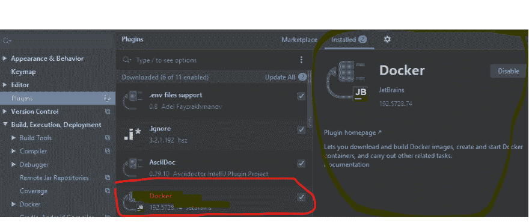
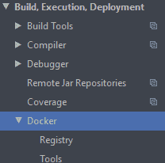
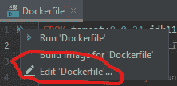
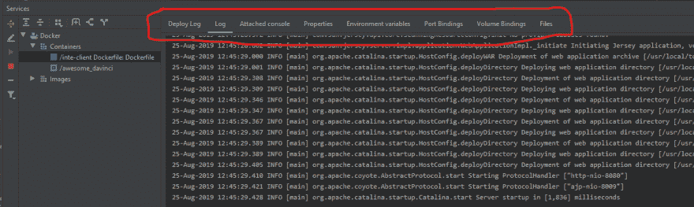
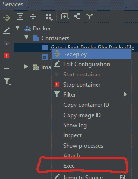

# intellij docker 外挂程式

> 原文:# t0]https://dev . to/darusx/intellij 坞站插件 b2k

that IntelliJ 有一个 Docker 插件，它在 IDE 中提供了一个 UI 工具来与 Docker(运行在本地机器上)集成。与 WebSphere、Tomcat 等其他服务器的集成没有太大区别。

**第一步:安装插件**

基本设置很容易。只要指向 Docker。
[T3】](https://res.cloudinary.com/practicaldev/image/fetch/s--uYyp5t_f--/c_limit%2Cf_auto%2Cfl_progressive%2Cq_auto%2Cw_880/https://thepracticaldev.s3.amazonaws.com/i/qhjnnb0cdidjr3z11eqr.png)

第二步:映射端口等。
点击同样的两个箭头，然后选择“编辑 Dockerfile”选项  允许您映射端口并指定其他可能需要在 Docker 命令行提供的选项。

第三步:运行你的 done 文件
一旦完成，当你打开你的*docker 文件*时，你会在 IntelliJ(或者你的主题中显示的任何东西)中看到典型的绿色“运行”箭头。
[T8】](https://res.cloudinary.com/practicaldev/image/fetch/s--Yth54tMP--/c_limit%2Cf_auto%2Cfl_progressive%2Cq_auto%2Cw_880/https://thepracticaldev.s3.amazonaws.com/i/m4ijg9venq5iei26a64w.png)

**步骤 4:监视和控制**
“服务”工具选项卡允许您监视容器的日志，并控制其他各个方面...查看各种选项卡。  。例如，您可以查看环境变量。
它还有一个运行 *docker exec* 的选项，因此，很容易跳到容器中的 shell 中检查它。