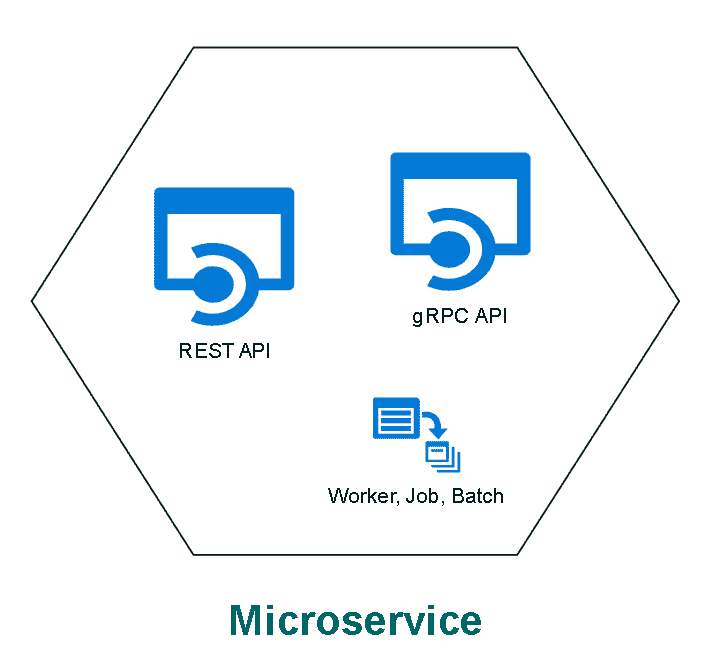
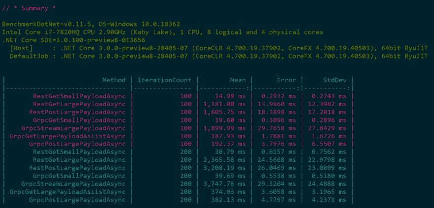
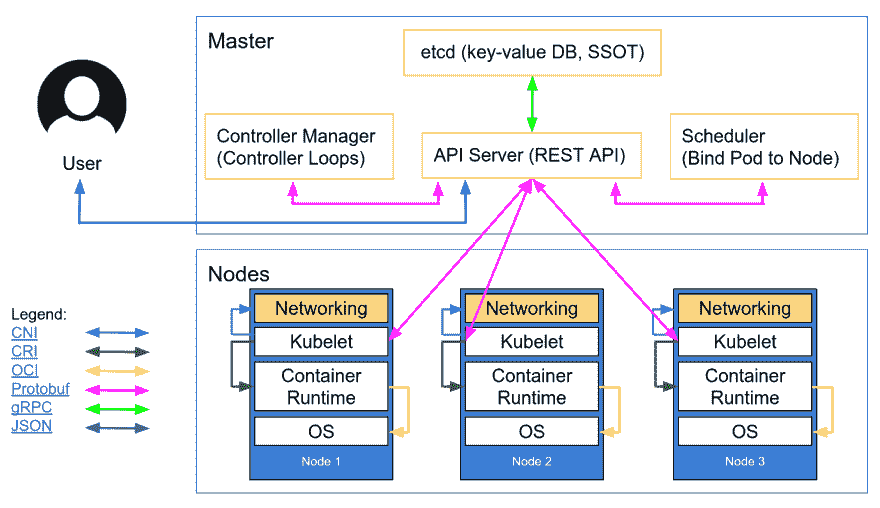

# 性能基准:gRPC 与 REST in。网络核心 3 预览版 8

> 原文：<https://dev.to/thangchung/performance-benchmark-grpc-vs-rest-in-net-core-3-preview-8-45ak>

最近，我在我的项目中使用了 gRPC 和 REST。我总是在想，当我在 Kubernetes 集群中进行服务间的交互时，我是否能够至少知道 gRPC 和 REST 之间的区别。

[](https://res.cloudinary.com/practicaldev/image/fetch/s--nv8LXTCW--/c_limit%2Cf_auto%2Cfl_progressive%2Cq_auto%2Cw_880/https://thepracticaldev.s3.amazonaws.com/i/jo61y4optpiddvoae0ie.png)

我找到了由[婉如·费尔南多](https://medium.com/@EmperorRXF)写的关于性能基准的博客。这太棒了，在花了一些时间看一下基于代码的代码之后，这一点就很清楚了。我决定把它分叉，为。NET Core Preview 8 来看看 gRPC 和 REST 协议在这个由微软发布的新 SDK 中有什么不同，我也在我的项目中使用它。

让我们按如下方式运行基准测试

*   REST API:

```
$ cd RESTvsGRPC\RestAPI
$ dotnet run -p RestAPI.csproj -c Release 
```

Enter fullscreen mode Exit fullscreen mode

*   gRPC API:

```
$ cd RESTvsGRPC\GrpcAPI
$ dotnet run -p GrpcAPI.csproj -c Release 
```

Enter fullscreen mode Exit fullscreen mode

*   基准项目:

```
$ cd RESTvsGRPC\RESTvsGRPC
$ dotnet run -p RESTvsGRPC.csproj -c Release 
```

Enter fullscreen mode Exit fullscreen mode

现在，我们能做的就是等到它结束。我们将得到如下结果

[](https://res.cloudinary.com/practicaldev/image/fetch/s--pWDt0r2E--/c_limit%2Cf_auto%2Cfl_progressive%2Cq_auto%2Cw_880/https://thepracticaldev.s3.amazonaws.com/i/q5cf4r1z8txv2r1qb27v.png)

当你用 REST 得到小数据时，那么它比 gRPC
要快得多

```
$ RestGetSmallPayloadAsync |            100 |    14.99 ms |  0.2932 ms |  0.2743 ms | 
```

Enter fullscreen mode Exit fullscreen mode

```
$ GrpcGetSmallPayloadAsync |            100 |    19.60 ms |  0.3096 ms |  0.2896 ms | 
```

Enter fullscreen mode Exit fullscreen mode

我认为这是因为。NET 核心团队已经在核心中优化了 JSON 处理的性能。但是，如果我们用 REST 来运行大数据，这是无效的。见下文

```
$ RestGetLargePayloadAsync |            100 | 1,181.00 ms | 13.9860 ms | 12.3982 ms | 
```

Enter fullscreen mode Exit fullscreen mode

```
$ GrpcGetLargePayloadAsListAsync |            100 |   187.93 ms |  1.7881 ms |  1.6726 ms | 
```

Enter fullscreen mode Exit fullscreen mode

当我们处理大块数据时，您可以看到 gRPC 与 REST 的不同之处。

### 总结

。NET 团队在处理消息有效负载中的小数据时产生了巨大的差异，但实际上随着数据有效负载的增加，这种差异消失了。gRPC 仍然是这一领域的赢家。我不是说哪一个比另一个好。我要说的是，我们需要适当的策略，在您的业务案例中使用哪种协议。

我通常在与外界的外部通信中使用 REST 通信，如外部服务集成、与前端的通信...由于 HTTP/2 的强大功能，Kubernetes 内部的整个通信都是关于 gRPC 的。我知道我们也可以在 Kestrel 上用 REST 配置 HTTP/2，但是这是有成本的，而且效率不高，因为我们需要在 Kestrel 中维护证书。否则，我们通常在 Kubernetes 集群内部卸载，以使通信性能变得简单快速。

我喜欢 Kubernetes 架构为传输协议使用的有效载荷格式，如下所示

[](https://res.cloudinary.com/practicaldev/image/fetch/s--Dq03ymFu--/c_limit%2Cf_auto%2Cfl_progressive%2Cq_auto%2Cw_880/https://thepracticaldev.s3.amazonaws.com/i/ippmfy7fyjsijshgxdv3.png)

源代码可以在[https://github.com/thangchung/RESTvsGRPC](https://github.com/thangchung/RESTvsGRPC)找到，原始代码可以在[https://github.com/EmperorRXF/RESTvsGRPC](https://github.com/EmperorRXF/RESTvsGRPC)找到

### 参考文献:

*   [https://medium . com/@ emperorxf/evaluating-performance-of-rest-vs-grpc-1b 8 BDF 0 b 22 da](https://medium.com/@EmperorRXF/evaluating-performance-of-rest-vs-grpc-1b8bdf0b22da)
*   [https://docs . Microsoft . com/en-us/aspnet/core/fundamentals/servers/kestrel](https://docs.microsoft.com/en-us/aspnet/core/fundamentals/servers/kestrel)
*   [https://gooroo . io/GoorooTHINK/Article/16623/One-verged-Trick-To-Improve-Web-Performance/21564 # . vx9o 5 udkldb](https://gooroo.io/GoorooTHINK/Article/16623/One-Weird-Trick-To-Improve-Web-Performance/21564#.Vx9o5UdkldB)
*   [https://dev blogs . Microsoft . com/aspnet/ASP-net-core-2-2-0-preview 1-http-2-in-kestrel/](https://devblogs.microsoft.com/aspnet/asp-net-core-2-2-0-preview1-http-2-in-kestrel/)
*   [https://kubernetes . io/blog/2018/07/18/11-ways-not-to-get-hacked/](https://kubernetes.io/blog/2018/07/18/11-ways-not-to-get-hacked/)