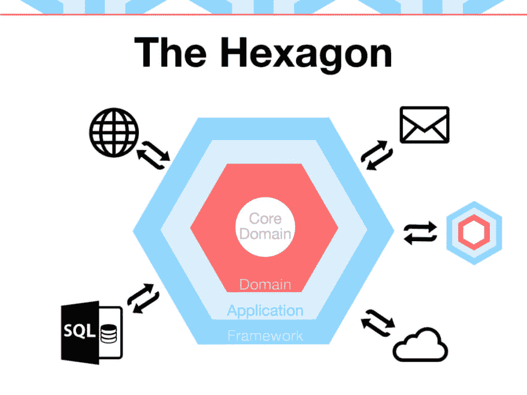
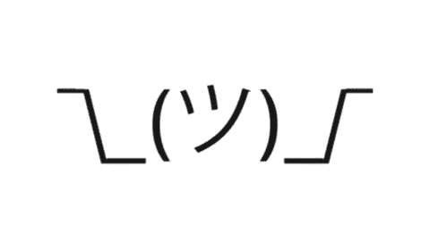

# BDD 与六边形架构一起工作

> 原文：<https://dev.to/ragezbla/bdd-working-together-with-hexagonal-architecture-2on9>

行为驱动开发是一种开发方法，旨在开发团队和业务之间建立良好的沟通。它还将测试的重点放在系统的实际行为上，而不是过多地关注底层细节。

可悲的是，这些年来 cucumber(和 behat)被用作用户验收测试工具，或者仅仅用来编写端到端工具。cucumber 的创建者实际上写了一篇博客[文章](https://aslakhellesoy.com/post/11055981222/the-training-wheels-came-off),标题是“训练轮子掉了”,试图解释为什么使用 cucumber 作为 web 测试自动化是一个坏主意。他指出，这样做你将不会获得 BDD 应该提供给你的任何好处。

现在让我们希望你不要再写这样的场景了:

```
Scenario: Successful login
  Given a user "Aslak" with password "xyz"
  And I am on the login page
  And I fill in "User name" with "Aslak"
  And I fill in "Password" with "xyz"
  When I press "Log in"
  Then I should see "Welcome, Aslak" 
```

转到六边形架构，也就是端口和适配器。这个建筑是由一位名叫阿利斯泰尔·考克伯恩的绅士在 2005 年 6 月创造的。它的目标是编写高度可测试的应用程序。它通过提供干净的层并将所有技术部分推给“适配器”来做到这一点。应用程序核心必须提供基础设施层应该实现的契约(接口)“端口”(适配器)。

[](https://res.cloudinary.com/practicaldev/image/fetch/s--x_015RUR--/c_limit%2Cf_auto%2Cfl_progressive%2Cq_auto%2Cw_880/https://speakerd.s3.amazonaws.com/presentations/de8629f0bf520131c2e20239d959ba18/slide_11.jpg%3F1400675141)

如果你想更深入地了解这个主题，我强烈推荐 Chris Fidao(fideloper)[post](https://fideloper.com/hexagonal-architecture)。

这两样东西能为我们做什么。

[](https://i.giphy.com/media/3o7TKHKjrDyqphX9Cg/giphy.gif)

基本上，通常如果使用 BDD 工具，但是你使用你的应用程序的 UI 进行测试(web 测试，端到端)，这意味着这些测试很有可能很慢并且不可靠。另一方面，如果你遵循六角形建筑的格言:

> 允许应用程序同样由用户、程序、自动化测试或批处理脚本驱动，并且独立于其最终运行时设备和数据库进行开发和测试。

这意味着你应该能够编写测试，绕过你的 web 界面，直接与应用层对话。这带来了两个主要好处。

1.  你不能写太专注于 UI 的场景(不再涉及 UI)
2.  会超级快！！！

为了证明我的观点，这里有一个真实应用程序的输出:

```
93 scenarios (93 passed)
384 steps (384 passed)
0m5.31s (58.20Mb) 
```

[](https://i.giphy.com/media/V0IdVIIW1y5d6/giphy.gif)

享受干净的可测试应用程序和用小黄瓜编写的最新文档。

额外收获:这些场景可以由业务分析或领域专家来维护。