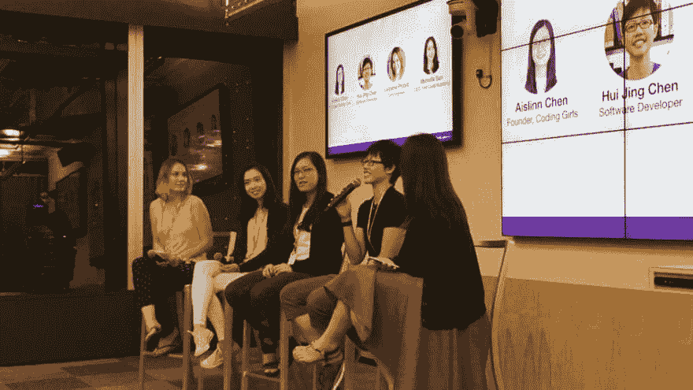
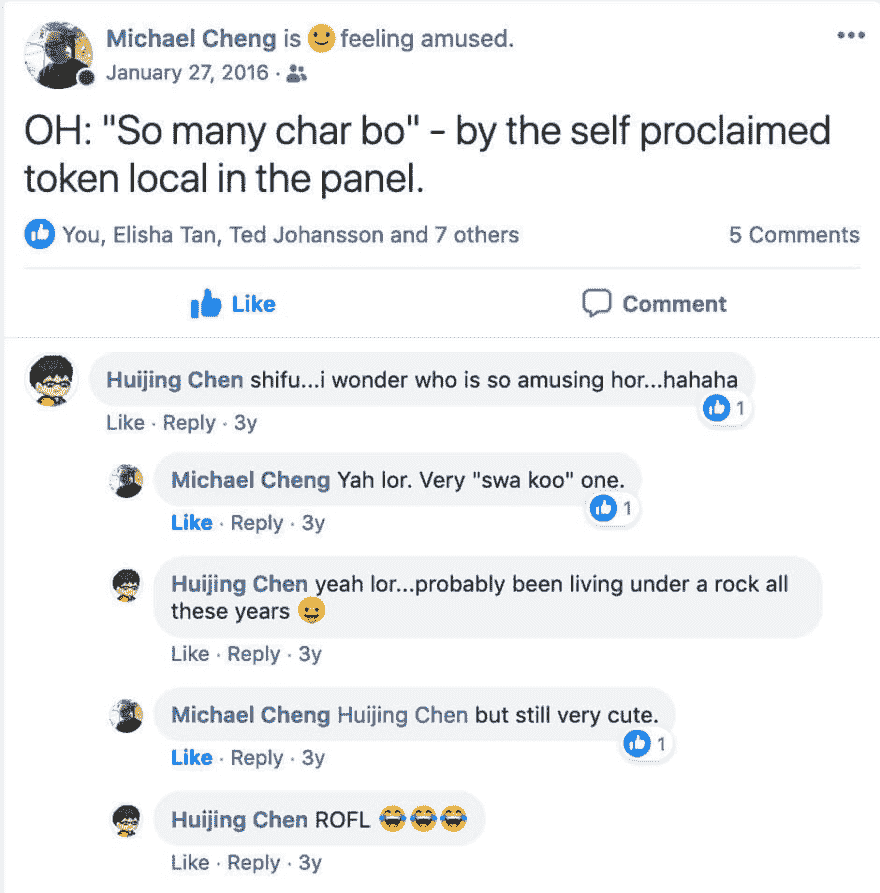
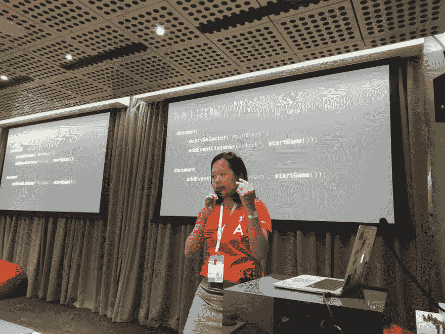

# 来说说我生活中的一些了不起的女人吧

> 原文：<https://dev.to/huijing/let-s-talk-about-some-amazing-women-in-my-life-3fmm>

本周早些时候，我有机会在 iD8 女性午餐会上发言，这是脸书 ID8 活动的一部分。小组讨论围绕“增强女性在工作场所的影响力”这一主题展开。

午餐会是由我的老朋友伊丽莎·谭组织的。她是科技界的一名杰出女性，做了无数令人敬畏的事情，包括 [TechLadies](http://www.techladies.co/) ，这是一个由社区领导的项目，旨在帮助亚洲女性作为程序员进行交流、学习和发展。

我们第一次见面大约是在她启动首届 [TechLadies 训练营](https://www.facebook.com/elishatan/posts/10153786579902597?%20__xts__%20%5B0%5D=68.ARAIGuHneVqdsBBKeSGX9x2nGrXuPtkfUkYKFIxIRRjIFF6NWRz2GdQquxViAAnB8BQ38k0C8jpd3CfvImJnWik1trM3gjDGaJgIab9Srw4Q2rooK1MPt55z4ClyfLrijpqIyyn7Y35bbuty-dgMpes-VY_v0nIg8bsKLQLS4EpNOLUMhf9qfJhAMG9TFFjuN4CPQNgpBve8kmUrQw&%20__tn__%20=-R)的时候，她问我是否想在她的小组上发言。你感觉到这里的趋势了吗？那时，我没有做过多少公开演讲，大概总共有 3 次以我的名字命名的聚会演讲。但她还是让我上了。

我以前参加过很多科技会议，从来没有想到大多数观众是男性，直到我坐在满是女性的房间前。

这促使我脱口而出(用我典型的新加坡口音)“哇，这么多有趣的人！”，这给我的许多朋友带来了无穷的乐趣。

三年多过去了，我们走到了今天。我，仍然是我典型的荒谬的自我(问那些从第一天起就见过我的人)，尽管稍微多了一些公开演讲。

而 Elisha 继续推进她在技术领域提升女性地位的各种计划，现在是脸书 APAC 的开发项目经理。

这让我想起了故事开头提到的那场午餐会。从那以后，我有机会在许多科技活动上发表国际演讲，并结识了业内许多了不起的人。

## 人们给我打了一针

但是如果没有像 Jen Simmons 这样有影响力的女性，她们在没人知道我是谁的时候把我的名字推了出来，如果没有像 T2 Thomas Gori ssen T3、T4 Charis Rooda T5 和 T6 Vadim make ev T7 这样的会议组织者，她们在我之前没有任何记录的时候给了我一个机会，这一切都是不可能的。

我无法直接回报他们，因为他们的信任和支持是无价的。但我可以这样做(你可以引用我的话):

> 尽可能公开地承认并强调我周围来自该地区的女性所取得的成就。

科技行业有许多女性选择不公开身份，这完全没问题。但也有许多人只是需要一个机会，一个呼喊，一个让聚光灯照耀他们一次的人。

我一直强调我来自东南亚地区的事实。随着年龄的增长，所有学生都知道东盟(东盟)，从经济增长和政治到体育(即东南亚运动会)。我刚刚把我所在地区的所有 11 个国家都视为“我们”。

所以我不想被视为局外人。我想让全世界知道，如果你认为我很棒，你应该看看我们在地球这一边的所有人才。我们在一起很久了，但你从来不知道我们。

## 我的姑娘们随随便便就牛逼了

所以我想提一下科技界的几位了不起的女性，我有幸称她们为我的朋友。

曾组织过东南亚持续时间最长的 web 开发会议的 [PWDO](https://www.pwdo.org/) 团队，形式，功能&类， [Kit Valmadrid](https://twitter.com/sinongkit) ， [Sophia Lucero](https://twitter.com/sofimi) 和 [Sarah Cada](https://twitter.com/sarahcada) 。

> HJ 陈@ HJ _ Chen我爱这里的乡亲们 [@PWDO](https://twitter.com/PWDO) 千言万语也无法表达
> 与此同时，重温去年的精彩，献给各地的会议组织者👇
> 《墨菲定律集大成:形式函数&类大结局】
> [link.medium.com/QdC62nJmnZ](https://t.co/VgHtcP53bo)2019 年 8 月 23 日上午 02:37

Aysha Anggraini ，我亲爱的孪生兄弟，是 sass 的典型代表(你应该听听她的演讲，真的)，也是我所知道的最好的前端开发人员之一。哦，她碰巧也是马来西亚人。

[https://www.youtube.com/embed/duXP9J_jaNo](https://www.youtube.com/embed/duXP9J_jaNo)

说到马来西亚人，还有 Chong Sher Minn，他在今年早些时候的 JSConf EU 上做了一次精彩的演讲。还有 CSS 女王 [Olivia Ng](https://twitter.com/meowlivia_) ，她是最擅长用 CSS 网格设计创意布局的人。

[https://www.youtube.com/embed/nC5q5JxLjnY](https://www.youtube.com/embed/nC5q5JxLjnY)

哦，Jecelyn Yeen 怎么样，她承担了组织首届 [NG-MY](https://2019.ng-my.org/) 的艰巨任务，这是东南亚第一次 Angular 会议。

> Su Myat Htun@ devsumyat[@ JecelynYeen](https://twitter.com/JecelynYeen)我最喜欢的 Google 开发者专家之一💛❤💜💙2019 年 08 月 03 日上午 09:33

还有 [See Yishu](https://twitter.com/yishusee) ，我称她为新加坡的骄傲，因为她的演讲风格完全是新加坡式的。非常幽默，同时还能表达重点。

[https://www.youtube.com/embed/pEVGAn2qNtU](https://www.youtube.com/embed/pEVGAn2qNtU)

还有高伟，我在这个世界上最喜欢的人，他做了很多令人惊讶的事情，不是为了荣誉或认可，而是出于纯粹的热情和好奇心。她也碰巧是一个很棒的演讲者(虽然她自己似乎不这么认为)，也是一个糟糕的登山者。

> 马克埃里克森@阿塞马克。 [@wgao19](https://twitter.com/wgao19) 为我们新的 React-Redux 文档写了很大一部分，并且做得非常出色(我认为这是她最初参与 Docusaurus 的原因)。她值得关注，这个关于文档 Docusaurus v2 的总括问题看起来值得一读！[twitter.com/wgao19/status/…](https://t.co/oltj6XEgh2)2019 年 7 月 30 日上午 01:22ᴡᴇɪ👩🏻‍🌾 [@wgao19](https://dev.to/wgao19)我的兄弟们正在做一些出色的工作来创建@docusaurus 2，这需要分享，我需要了解它是如何构建的。好奇的猫可以和我一起抓住这个机会，从头开始为 D2 写文档。#learnInPublic 的官方文档是最好的💩https://t.co/LDbgiXzm0b

[https://www.youtube.com/embed/lfsNtDEcw5E](https://www.youtube.com/embed/lfsNtDEcw5E)

世界上有 70 多亿人口。我们中的任何一个出现在彼此生命中的几率都是一个奇迹。然而，我设法与这些了不起的人相遇。

碰巧是女性，碰巧是亚洲人，碰巧是软件开发人员。

我希望你也能和他们相遇。